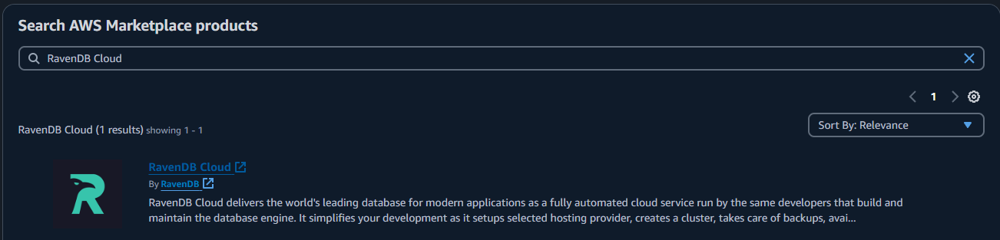
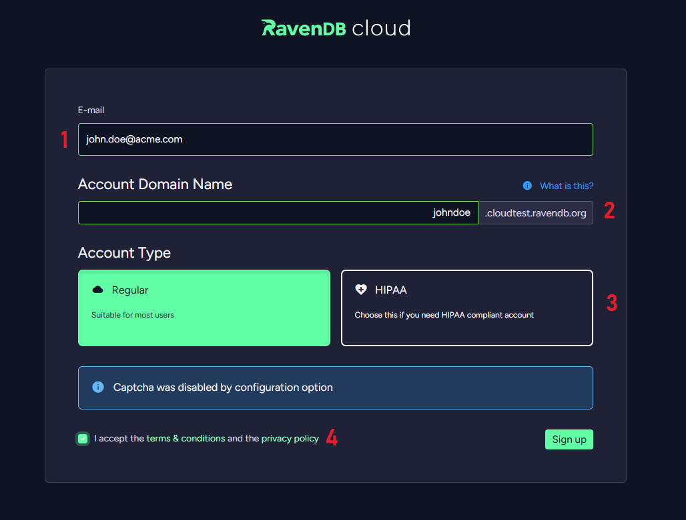
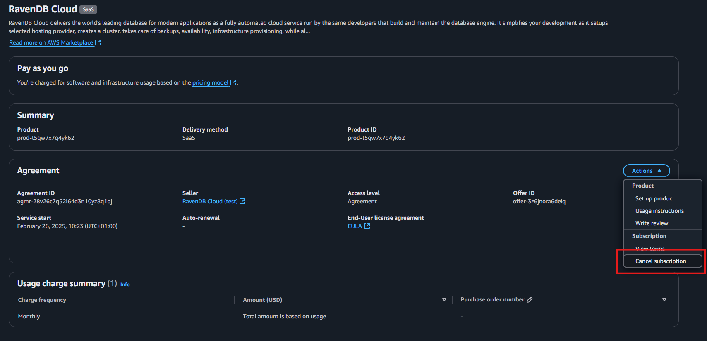

import Admonition from '@theme/Admonition';
import Tabs from '@theme/Tabs';
import TabItem from '@theme/TabItem';
import CodeBlock from '@theme/CodeBlock';
import LanguageSwitcher from "@site/src/components/LanguageSwitcher";
import LanguageContent from "@site/src/components/LanguageContent";

# Cloud: AWS Marketplace
<Admonition type="note" title="">

Access to *RavenDB Cloud* services is available through the *AWS Marketplace*.

* In this page:
    * [Overview](../cloud/cloud-aws-marketplace.mdx#overview)
    * [Registration process](../cloud/cloud-aws-marketplace.mdx#registration-process)
    * [Subscription cancellation process](../cloud/cloud-aws-marketplace.mdx#subscription-cancellation-process)

</Admonition>
## Overview

If you want to pay for *RavenDB Cloud* services using a credit card associated with your *AWS* account, without re-entering the card in *RavenDB Cloud*, you can subscribe to [RavenDB Cloud offer](https://aws.amazon.com/marketplace/pp/prodview-uxgjhwlrvpfpm) on the *AWS Marketplace*.

*AWS Cloud Account* created this way has a few differences in comparison to the regular *Cloud Account*:

- Monthly invoices are issued by *AWS*, not by *RavenDB Cloud*.
- *AWS Cloud Account* offering is limited to *AWS* products.
- Billing and contact information are fully managed by *AWS*. Changing the parameters is not possible via Cloud Portal.

## Registration process

To subscribe your *AWS* account to the *RavenDB Cloud*, search for the **RavenDB Cloud** offer in *AWS Marketplace* and click on it.

In the main page of the offer, click **View purchase options**.

Then, please click **Subscribe** down below.

At the top you will see:

Please click **Set up your account**.

You'll be redirected to RavenDB Cloud, once you have subscribed, the next step is to configure the account in the *RavenDB Cloud*.
Provide the necessary information required to end the registration process:

1. **Email Address**  
   Provide an email address that you will use in RavenDB Cloud.

2. **Domain Name**  
   Provide a Domain Name for the account.    

3. **Account Type**  
    Provide an Account Type for the account.

4. **T&C and privacy policy**  
    Accept Terms & Conditions and the privacy policy.

After providing the information, please click **Sign up**.
Your account is now ready to use. To sign in to the account, click **Continue to sign in**.

<Admonition type="info" title="">
Successful registration process is also confirmed by an email from *AWS Marketplace*.
</Admonition>

## Subscription cancellation process

To cancel your subscription, go to *AWS Marketplace* service in AWS account which you used to subscribe to RavenDB Cloud.

Click **Manage** on the **RavenDB Cloud** product.

Navigate to  **Cancel subscription**.

Confirm and finalize the process.

<Admonition type="danger" title="">
Subscription cancellation is **irreversible**. Your account and data and will be permanently lost.  
</Admonition>

<Admonition type="info" title="">
Successful cancellation process is also confirmed by an email from *AWS Marketplace*.
</Admonition>

