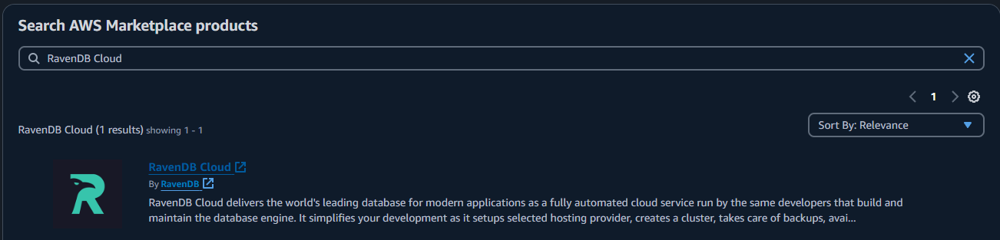
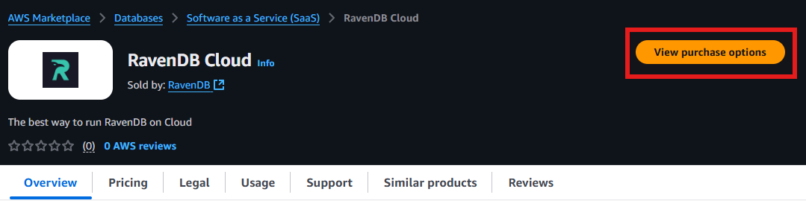
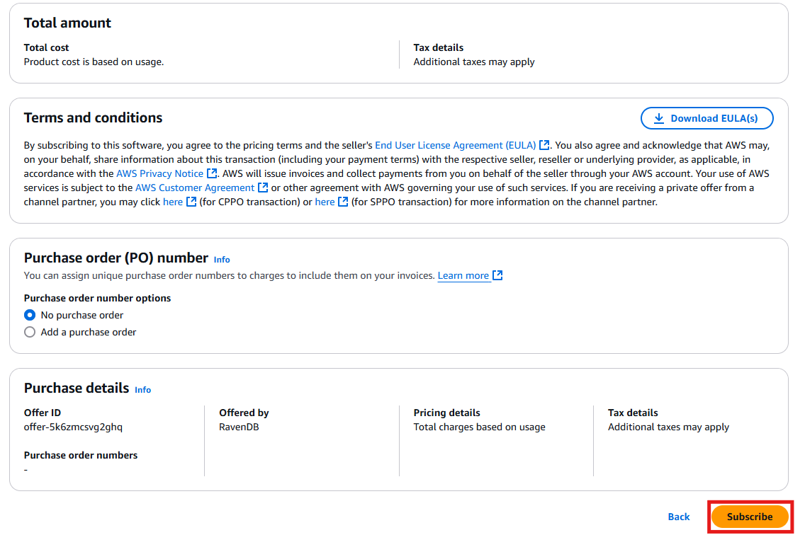
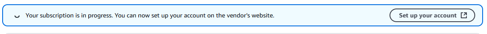
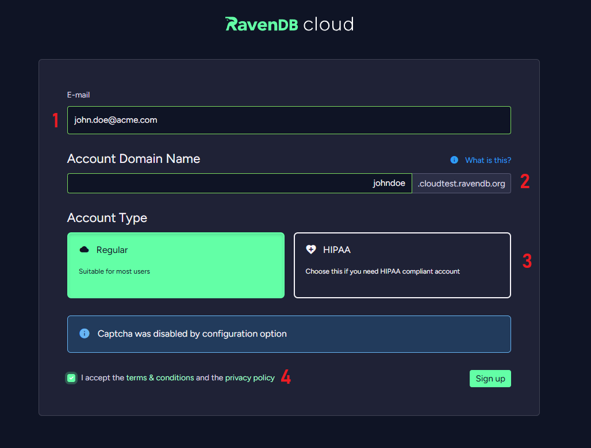
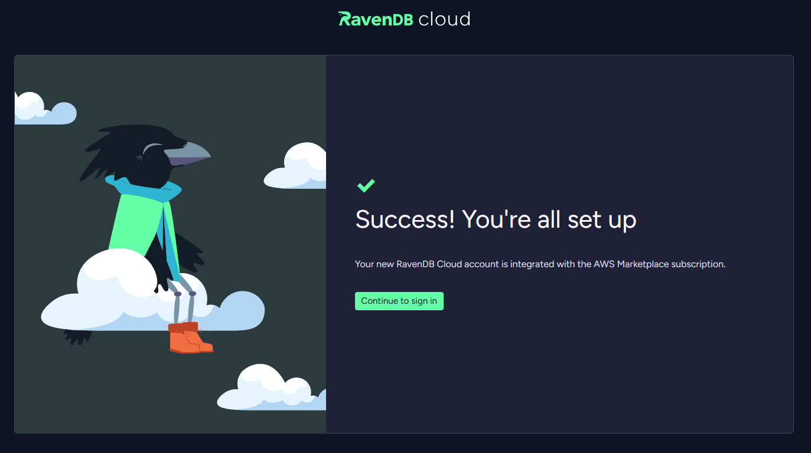
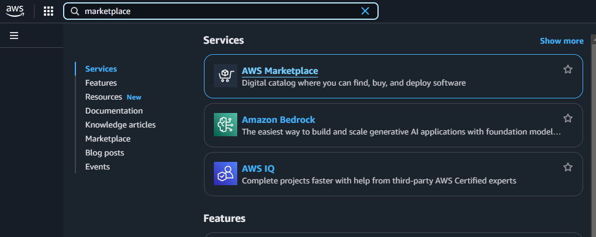
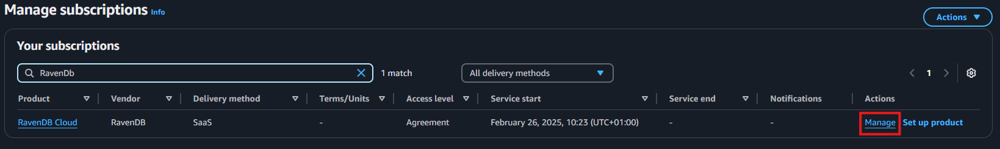
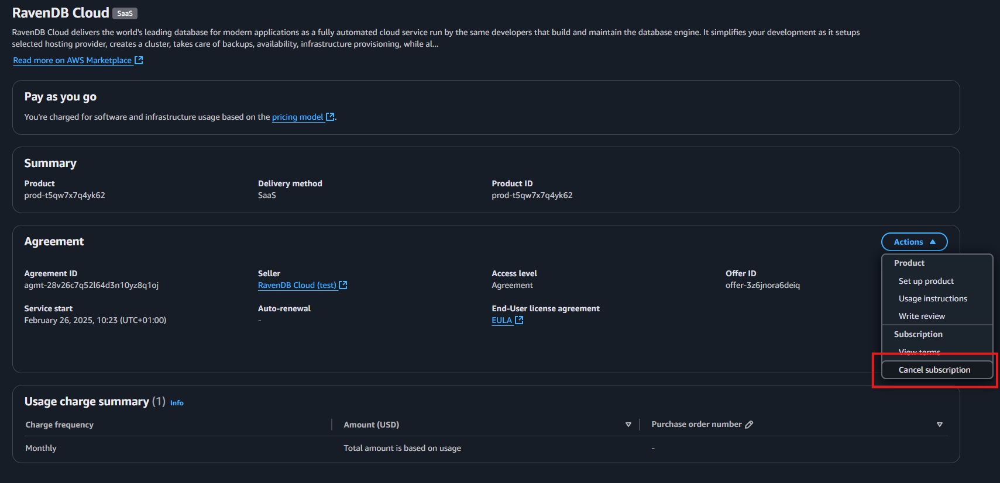
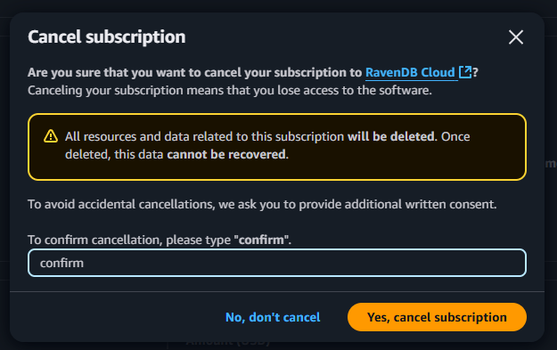

import Admonition from '@theme/Admonition';
import Tabs from '@theme/Tabs';
import TabItem from '@theme/TabItem';
import CodeBlock from '@theme/CodeBlock';
import LanguageSwitcher from "@site/src/components/LanguageSwitcher";
import LanguageContent from "@site/src/components/LanguageContent";

# Cloud: AWS Marketplace
<Admonition type="note" title="">

Access to *RavenDB Cloud* services is available through the *AWS Marketplace*.

* In this page:
    * [Overview](../cloud/cloud-aws-marketplace.mdx#overview)
    * [Supported countries](../cloud/cloud-aws-marketplace.mdx#supported-countries)
    * [Registration process](../cloud/cloud-aws-marketplace.mdx#registration-process)
    * [Subscription cancellation process](../cloud/cloud-aws-marketplace.mdx#subscription-cancellation-process)

</Admonition>
## Overview

If you want to pay for *RavenDB Cloud* services using a credit card associated with your *AWS* account, without re-entering the card in *RavenDB Cloud*, you can subscribe to [RavenDB Cloud offer](https://aws.amazon.com/marketplace/pp/prodview-uxgjhwlrvpfpm) on the *AWS Marketplace*.

*AWS Cloud Account* created this way has a few differences in comparison to the regular *Cloud Account*:

- Monthly invoices are issued by *AWS*, not by *RavenDB Cloud*.
- *AWS Cloud Account* offering is limited to *AWS* products.
- Billing and contact information are fully managed by *AWS*. Changing the parameters is not possible via Cloud Portal.

## Supported countries {#supported-countries}

*RavenDB Cloud* is available through the *AWS Marketplace* in countries and regions where AWS provides automated tax collection and remittance services. In these locations, AWS acts as a marketplace facilitator, handling tax calculation, collection, and remittance on behalf of the seller. This ensures a seamless billing experience for both the customer and the provider.

Countries and regions outside this list do not currently have automated tax handling through the *AWS Marketplace*, which means marketplace subscriptions cannot be offered there at this time.

<Admonition type="note" title="">
If your country is not listed below, you can still use *RavenDB Cloud* by signing up directly at [cloud.ravendb.net](https://cloud.ravendb.net) and paying via credit card or wire transfer.
See [Pricing, Payment and Billing](../cloud/cloud-pricing-payment-billing.mdx) for more details.
</Admonition>

The following countries and regions are currently supported:

Australia, Austria, Bangladesh, Belgium, Bulgaria, Cameroon, Canada, Chile, Croatia, Cyprus, Czech Republic, Denmark, Estonia, Finland, France, Germany, Greece, Hungary, India, Indonesia, Ireland, Israel, Italy, Kenya, Korea (Republic of), Latvia, Lithuania, Luxembourg, Malaysia, Malta, Netherlands, New Zealand, Norway, Poland, Portugal, Romania, Russian Federation, Saudi Arabia, Singapore, Slovakia, Slovenia, South Africa, Spain, Sweden, Taiwan, Thailand, Turkey, United Kingdom, United States.

<Admonition type="info" title="">
This list is determined by AWS's tax remittance support and is subject to change.
For the most up-to-date information, see [AWS Marketplace Sellers Tax Help](https://aws.amazon.com/tax-help/marketplace-sellers/).
</Admonition>

## Registration process

To subscribe your *AWS* account to the *RavenDB Cloud*, search for the **RavenDB Cloud** offer in *AWS Marketplace* and click on it.

In the main page of the offer, click **View purchase options**.

Then, please click **Subscribe** down below.

At the top you will see:

Please click **Set up your account**.

You'll be redirected to RavenDB Cloud, once you have subscribed, the next step is to configure the account in the *RavenDB Cloud*.
Provide the necessary information required to end the registration process:

1. **Email Address**  
   Provide an email address that you will use in RavenDB Cloud.

2. **Domain Name**  
   Provide a Domain Name for the account.    

3. **Account Type**  
    Provide an Account Type for the account.

4. **T&C and privacy policy**  
    Accept Terms & Conditions and the privacy policy.

After providing the information, please click **Sign up**.
Your account is now ready to use. To sign in to the account, click **Continue to sign in**.

<Admonition type="info" title="">
Successful registration process is also confirmed by an email from *AWS Marketplace*.
</Admonition>

## Subscription cancellation process

To cancel your subscription, go to *AWS Marketplace* service in AWS account which you used to subscribe to RavenDB Cloud.

Click **Manage** on the **RavenDB Cloud** product.

Navigate to  **Cancel subscription**.

Confirm and finalize the process.

<Admonition type="danger" title="">
Subscription cancellation is **irreversible**. Your account and data and will be permanently lost.  
</Admonition>

<Admonition type="info" title="">
Successful cancellation process is also confirmed by an email from *AWS Marketplace*.
</Admonition>

## Conversion from a regular Cloud Account to an AWS Marketplace Account

If you would like to convert your existing *Cloud Account* to an *AWS Marketplace Account* to pay for your services using a credit card associated with your *AWS* account, please submit a support request from Cloud Account owner via the *RavenDB Cloud Portal*.

