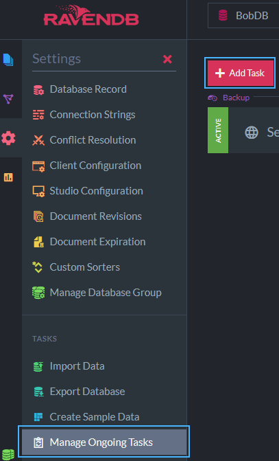
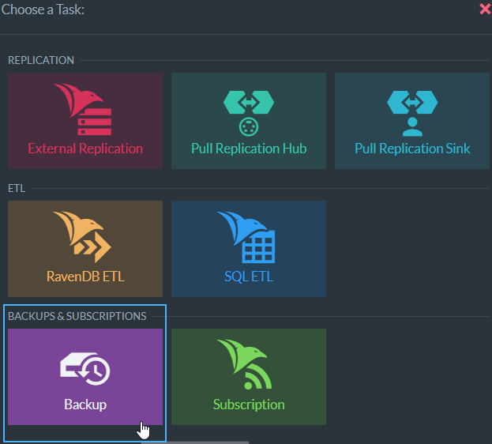
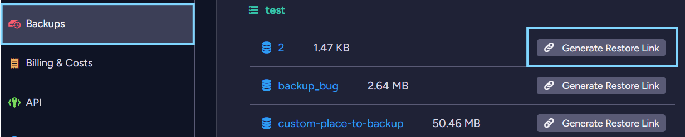
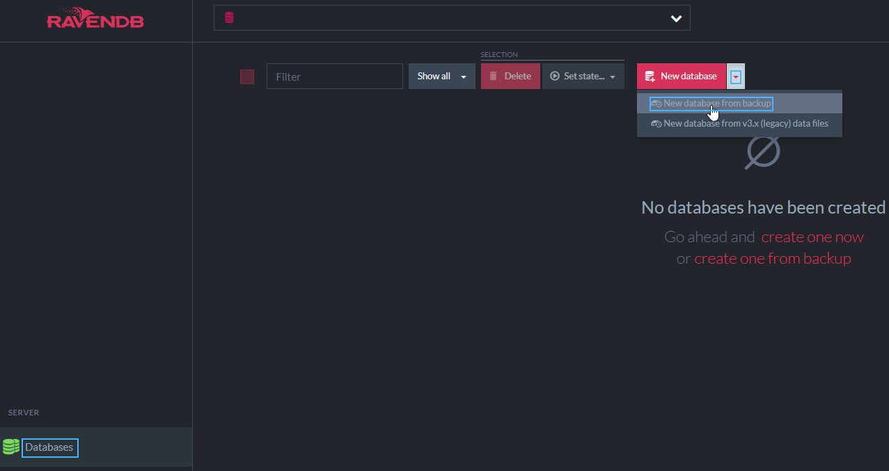
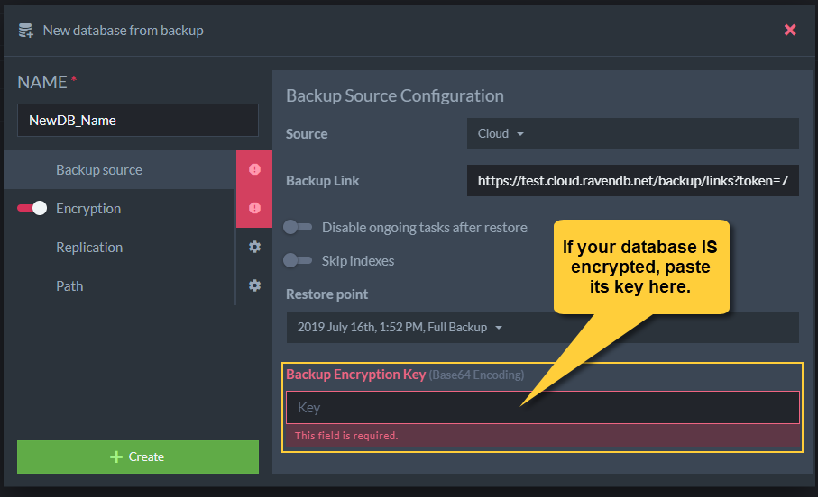

import Admonition from '@theme/Admonition';
import Tabs from '@theme/Tabs';
import TabItem from '@theme/TabItem';
import CodeBlock from '@theme/CodeBlock';
import LanguageSwitcher from "@site/src/components/LanguageSwitcher";
import LanguageContent from "@site/src/components/LanguageContent";

# Cloud: Backup And Restore
<Admonition type="note" title="Note">

* RavenDB cloud instances of the [Free](../cloud/cloud-instances#a-free-cloud-node) and 
  [Production](../cloud/cloud-instances#a-production-cloud-cluster) tiers are regularly and automatically backed up.  

* You can also define custom backup tasks, as you would with an on-premises RavenDB server.  

* [Development](../cloud/cloud-instances#a-development-cloud-server) products do **not** offer mandatory backup by RavenDB Cloud.  
  You **can** define custom backup tasks for them.  

* In this page:  
  * [The Mandatory-Backup Routine](../cloud/cloud-backup-and-restore#the-mandatory-backup-routine)  
  * [Backup storage](../cloud/cloud-backup-and-restore#backup-storage)  
  * [Charging For Backup storage](../cloud/cloud-backup-and-restore#charging-for-backup-storage)  
  * [Backup Encryption](../cloud/cloud-backup-and-restore#backup-encryption)  
  * [Creating a Custom Backup](../cloud/cloud-backup-and-restore#creating-a-custom-backup)  
  * [Restore Mandatory-Backup Files](../cloud/cloud-backup-and-restore#restore-mandatory-backup-files)  
</Admonition>
## The Mandatory-Backup Routine

Each database you create using a RavenDB cloud product, is assigned a mandatory-backup task that 
stores a [full backup](../server/ongoing-tasks/backup-overview#backup-scope-full-or-incremental) 
**every 24 hours** and an **incremental backup every 1 hour** with all the changes that took 
place since the last backup.  

<Admonition type="info" title="Info">
The mandatory backup process cannot be disabled.  
</Admonition>

<Admonition type="info" title="Info">
We keep your backup files for no less than 14 days.  
You can [contact support](../cloud/portal/cloud-portal-support-tab) to prolong this period, but not reduce it.  
</Admonition>
#### The Backup Task

To view or activate the mandatory backup task, open your product's management studio and -  

* Choose the database whose backup task you want to view  
* Click **Manage Ongoing Tasks**  
* Click the "Server Wide Backup" task.  

  

## Backup storage

#### Mandatory-Backup Storage
Backups created by the [mandatory backup routine](../cloud/cloud-backup-and-restore#the-mandatory-backup-routine) are stored in a RavenDB 
cloud you have no direct access to.  
You can [view and restore](../cloud/cloud-backup-and-restore#restore-mandatory-backup-files) them using your portal's Backups tab and the 
management Studio.  

<Admonition type="note" title="Note">
A backup created for data hosted by a server in Europe or the US 
will be kept within the same [geographical region](https://cloud.ravendb.net/pricing), 
i.e. backups made for a database hosted in Europe are kept in Europe 
and backups made for a database hosted in the US are kept in the US.  
</Admonition>

<Admonition type="note" title="Backup location - GDPR/DPA consideration" id="backup-location-gdpr-dpa-consideration" href="#backup-location-gdpr-dpa-consideration">
Upon backup geographically closest AWS S3 bucket is used for backup storage e.g. :

- if your RavenDB Cloud cluster has been created in Europe, it backs up to AWS S3 buckets in Europe.

- if your RavenDB Cloud cluster has been created in the US, it backs up to AWS S3 buckets in the US.
</Admonition>
#### Custom-Backup Storage
[Custom-backup](../cloud/cloud-backup-and-restore#creating-a-custom-backup) files can be kept using an Amazon service 
(S3 or S3 Glacier) or a Microsoft service (Azure).  
We recommend that you use a backup method **local to your host cloud**. If your product is hosted by Amazon AWS for example, 
you can store your backup files on an Amazon S3 bucket.  
<Admonition type="info" title="Info">
All mandatory-backup files are **compressed** and **encrypted**. This is the case whether the backed-up database is encrypted or not.  

If you define custom-backup tasks, you are responsible for their security. RavenDB offers backup encryption for custom backup as well, 
and we recommend that you use this option.  

</Admonition>

## Charging For Backup storage

#### Mandatory-Backup charge
Mandatory-backup files are kept in RavenDB's own cloud.  

We give backup storage of up to 1 GB per product per month **for free**. 

Your backup storage usage is measured once a day, and you'll be charged each month based on your average daily usage.  

Free-tier users that overuse backup storage may trim their database to fit the limitation, pay for the extra storage, 
or stop the product.  
#### Custom-Backup charge
Your custom backups are kept in a storage location of your choosing, and charges for it are unrelated to RavenDB Cloud.  

**Make sure**, however, that you're aware of **all possible expenses** related to your backups, including -  

* Any external storage service you may be charged for (e.g. an S3 bucket)  
* File transfer costs you may be charged for (especially if you are backing up outside the region / cloud you are using).  

## Backup Encryption

Your mandatory backup files are encrypted.

* If your database **is encrypted**:  
  **Your own database encryption key** will be used to encrypt the backup as well.  
  
    <Admonition type="warning" title="Warning">
    Be aware that RavenDB Cloud does NOT keep or manage *your own* database encryption keys.  
    If you lose a database encryption key we will NOT be able to help you decrypt the database itself nor its backup files.  
    **KEEP YOUR ENCRYPTION KEYS SAFE!**  
    </Admonition>

* If your database is **not encrypted**:  
  We will encrypt its backup files using an encryption key that **we** manage and is unique to your account.  

## Creating a Custom Backup

You can create your own [ongoing backup tasks](https://ravendb.net/docs/article-page/4.2/Csharp/studio/database/tasks/ongoing-tasks/backup-task) 
on your RavenDB cloud instance, as you would off-cloud.  
Use your cloud instance's management Studio to create a new task.  
  
Add a Backup task  
  
You can store custom-backup files on an unrelated cloud service like an S3 bucket, a Glacier vault, or an Azure platform.  

Activate and configure your unrelated cloud storage service, e.g. the bucket in which your backup files would be kept.  
  

## Restore Mandatory-Backup Files

#### View The mandatory Backups List  
Backup files that have already been created, are listed in the backups tab.  

* Open your portal's Backups tab, and choose the product whose database you want to restore.  
  Its backups will be shown, listed by the databases they've been created for.  
* Click "Generate Restore Link" for the database you want to restore.  
  The backup link window will open.
    
#### Restore the Database  
Clicking the **Generate Restore Link** button will show you a simple procedure. Follow it to restore your database.  

  

* **A.** Create a **New Database From Backup**  
    
* **B.** Choose **Cloud** as your Source  
    
* **C.** Copy the Backup Link you've been given in the Backups Tab, to the **Backup Link** box here.  
    
* **D.** Choose a **Restore Point**  
    
* **E.** Encryption Key for an **Encrypted** Database  
  If your original database **is** encrypted, its backup has been encrypted with the same key. Find it and paste it here.  
    
* **F.**  Encryption Key for an **Unencrypted** Database  
  If your original database is **not** encrypted, we used your account-wide encryption key to encrypt your backup file.  
  Copy it from the right Backups Tab box.  
    

