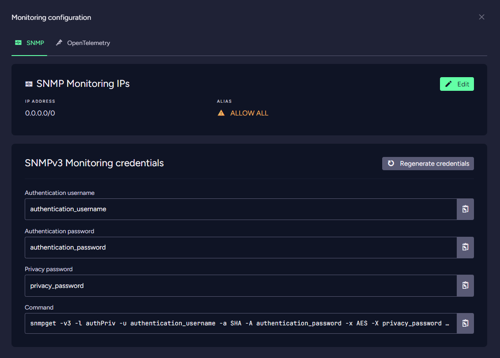
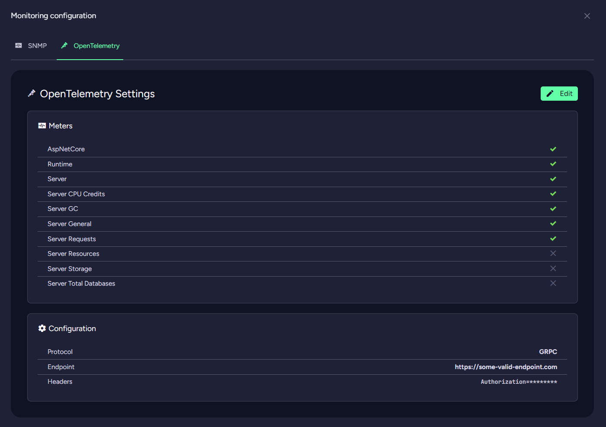
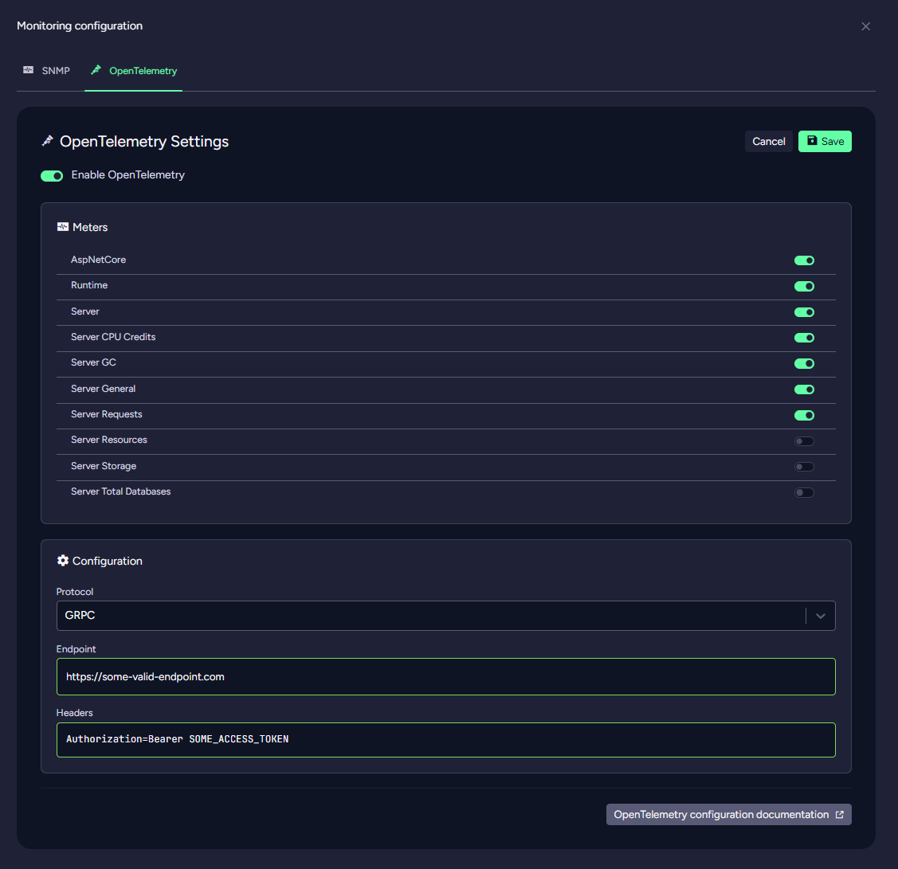

import Admonition from '@theme/Admonition';
import Tabs from '@theme/Tabs';
import TabItem from '@theme/TabItem';
import CodeBlock from '@theme/CodeBlock';
import LanguageSwitcher from "@site/src/components/language-switcher";
import LanguageContent from "@site/src/components/language-content";

# Cloud: Product Features
## OLAP ETL 

*RavenDB Cloud* provides *OLAP ETL* capabilities, allowing you to integrate your operational data with analytical data
warehouses.

Usage of this feature is
described [here](https://ravendb.net/docs/article-page/latest/csharp/studio/database/tasks/ongoing-tasks/olap-etl-task).

## PowerBi 

*RavenDB Cloud* supports direct integration with *Power BI*, a leading business analytics tool. This feature allows you
to seamlessly connect your RavenDB data with *Power BI* for advanced visualization and reporting, enabling real-time
insights and data-driven decision-making.

Usage of this feature is
described [here](https://ravendb.net/docs/article-page/latest/csharp/integrations/postgresql-protocol/power-bi).

## Configuration

<Admonition type="warning" title="Required " id="required" href="#required">
*Power Bi* IPs must be configured after enabling *PowerBi* feature.
</Admonition>

<Admonition type="warning" title="Product Restart " id="product-restart" href="#product-restart">
Your product will be restarted automatically node by node to apply settings needed for feature to work properly.
</Admonition>

To access *Power Bi* Configuration View click **Configure** Button in *Power Bi* feature row. Here you can edit your IP
addresses that will have access to *RavenDB Power Bi* port.

<Admonition type="info" title="Info">
*Power Bi* IPs entries are [CIDR ranges](https://en.wikipedia.org/wiki/Classless_Inter-Domain_Routing#CIDR_notation)
that define networks from which the connection is allowed.
</Admonition>

## Queue ETL 

The *Queue ETL* feature enables you to export data from *RavenDB* to various queue systems, such as *RabbitMQ* or
*Kafka*.
This is particularly useful for scenarios where you need to process data asynchronously or distribute it
to other microservices and applications.

Usage of this feature is
described [here](https://ravendb.net/docs/article-page/latest/csharp/server/ongoing-tasks/etl/queue-etl/overview).

## Queue Sink 

*Queue Sink* allows *RavenDB Cloud* to directly receive data from queues, making it easier to ingest data into your
database from external systems or services. This feature is ideal for integrating with event-driven architectures
where data is processed and ingested in real time.

Usage of this feature is
described [here](https://ravendb.net/docs/article-page/latest/csharp/server/ongoing-tasks/queue-sink/overview).

<Admonition type="info" title="Availability " id="availability" href="#availability">
This feature is available only for *RavenDB* **6.0 and newer**.
</Admonition>

## Data Archival 

*RavenDB Cloud* offers the ability to archive selected documents.
Archived documents are compressed and can be handled differently by *RavenDB* functions (e.g. Indexing can exclude
archived documents from indexes and Data Subscriptions can avoid sending archived docs to workers), helping to keep the
database smaller and quicker and its contents more relevant.

Usage of this feature is
described [here](https://ravendb.net/docs/article-page/latest/csharp/server/extensions/archival).

<Admonition type="info" title="Availability " id="availability" href="#availability">
This feature is available only for *RavenDB* **6.0 and newer**.
</Admonition>

## Monitoring 

*RavenDB Cloud* allows you to monitor your *RavenDB Cloud* instances via *SNMP* and *OpenTelemetry* protocols.

*SNMP* is a widely used
network management protocol that allows for the collection and organization of information about managed devices on IP
networks.
*RavenDB Cloud* leverages the *OpenTelemetry SDK* to send metrics data via the *OpenTelemetry* Protocol, allowing
seamless
data collection and analysis by an OpenTelemetry retriever.

## Configuration

Click the **Configure** button in the *Monitoring* feature row to configure this feature.
You will be taken to the *Monitoring Configuration View*, which is divided into two tabs:

1. SNMP Configuration Tab:

   - In the first section, you can edit SNMP Monitoring IPs.

   - In the second section, you can view and update SNMPv3 Monitoring credentials.

2. OpenTelemetry Configuration Tab:

   - Select which Meters should be collected.

   - Specify where these Meters should be sent.

<Admonition type="info" title="Availability " id="availability" href="#availability">
OpenTelemetry feature is available only for *RavenDB* **6.2 and newer**.
</Admonition>

### SNMP Monitoring IPs

<Admonition type="warning" title="Required " id="required" href="#required">
*SNMP Monitoring* IPs must be configured **after** enabling *Monitoring* feature.
</Admonition>

<Admonition type="warning" title="Product Restart " id="product-restart" href="#product-restart">
Your product will be restarted automatically (node by node) to apply settings needed for feature to work properly.
</Admonition>

This section allows you to specify IPs that will have access to your product using the *SNMP* protocol.

### SNMPv3 Monitoring credentials

SNMPv3 is the most secure version of SNMP, providing enhanced security features over its predecessors. When setting up
SNMPv3 monitoring for your *RavenDB Cloud* instances, you need to configure specific credentials that ensure secure
communication between the SNMP agent on your end and the RavenDB.

Credentials required to connect to *RavenDB Monitoring* Endpoints are provided in this section. We also provide sample
command you can use to test connection.

<Admonition type="info" title="Info">
SNMP Monitoring IPs entries
are [CIDR ranges](https://en.wikipedia.org/wiki/Classless_Inter-Domain_Routing#CIDR_notation)
that define networks from which the connection is allowed.
</Admonition>

### OpenTelemetry Configuration

<Admonition type="warning" title="Product Restart " id="product-restart" href="#product-restart">
Your product will be restarted automatically (node by node) to apply settings needed for feature to work properly.
</Admonition>

This section allows you to select meters and specify where these should be sent using the *OpenTelemetry* protocol.

You can read step by step OpenTelemetry & Grafana configuration [here](https://ravendb.net/articles/grafana-cloud-configuration-with-opentelemetry).

## Autoscaling 

*RavenDB Cloud* allows you to autoscale your *RavenDB Cloud* instances based on the CPU usage.

## Configuration

Click **Configure** Button in *Autoscaling* feature row in order to configure this feature.
You will see Autoscaling Configuration View. It's separated into downscaling parameters and upscaling parameters.

| Parameter                   | Description                                                                                                                                          |
|-----------------------------|------------------------------------------------------------------------------------------------------------------------------------------------------|
| Highest Type                | The maximum virtual machine size (inclusive) available for upscaling.                                                                                |
| Upscaling Grace Period      | The time delay before upscaling begins after a high resource threshold is exceeded, allowing the system to avoid immediate scaling.                  |
| High Cpu Threshold          | The average CPU usage percentage from last *High CPU Threshold Duration* that triggers the upscaling process.                                        |
| High Cpu Threshold Duration | The duration for which the average CPU usage must exceed the threshold before triggering upscaling.                                                  |
| Upscaling Step              | Determines by how many instances upscaling should take place in one go. For example with step set to 2 it will scale up from *Dev10* to *Dev30*.     |
| Lowest Type                 | The minimum virtual machine size (inclusive) available for downscaling.                                                                              |
| Downscaling Grace Period    | The time delay before downscaling begins after a low resource threshold is exceeded, allowing the system to avoid immediate scaling.                 |
| Low Cpu Threshold           | The average CPU usage percentage from last *Low CPU Threshold Duration* that triggers the downscaling process.                                       |
| Low Cpu Threshold Duration  | The duration for which the average CPU usage must exceed the threshold before triggering downscaling.                                                |
| Downscaling Step            | Determines by how many instances downscaling should take place in one go. For example with step set to 2 it will scale down from *Dev30* to *Dev10*. |

You can edit Autoscaling parameters by clicking on **Edit** button.

## AI Embeddings & GenAI 

*RavenDB Cloud* provides an integrated solution that combines high-performance NoSQL capabilities with advanced vector
indexing and querying features, enabling efficient storage and management of high-dimensional vector data. 

*RavenDB* can now be combined with generative AI using LLM of your choice.

Usage of this feature is
described [here](https://ravendb.net/docs/article-page/latest/csharp/ai-integration).

<Admonition type="info" title="Availability " id="availability" href="#availability">
AI Embeddings is available only for *RavenDB* **7.0 and newer**.

Gen AI is available only for *RavenDB* **7.1 and newer**.
</Admonition>

## Snowflake ETL 

Seamlessly integrate *RavenDB Cloud* with Snowflake using an ongoing ETL task. 
Automatically export data from RavenDB collections to your Snowflake data warehouse in near real-time.
Define transformation scripts to shape the data before export, ensuring compatibility and efficiency for your analytics workflows.
Ideal for building robust pipelines for business intelligence, reporting, and data science.

Usage of this feature is
described [here](https://ravendb.net/docs/article-page/latest/csharp/studio/database/tasks/ongoing-tasks/snowflake-etl-task).

<Admonition type="info" title="Availability " id="availability" href="#availability">
This feature is available only for *RavenDB* **7.0 and newer**.
</Admonition>

