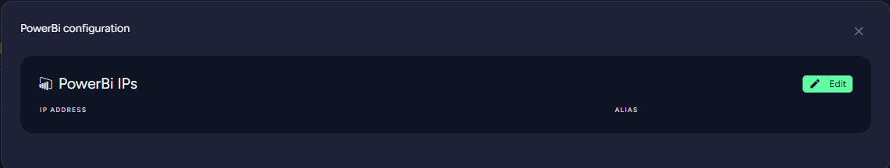
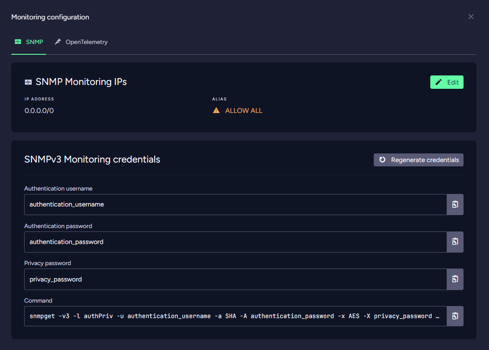
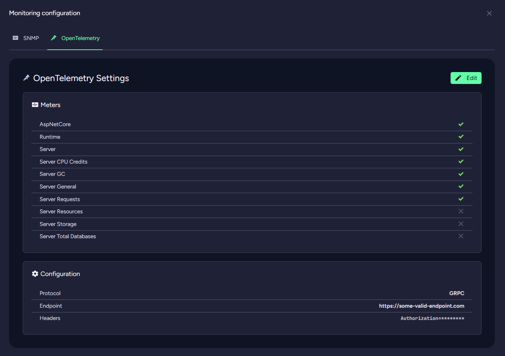
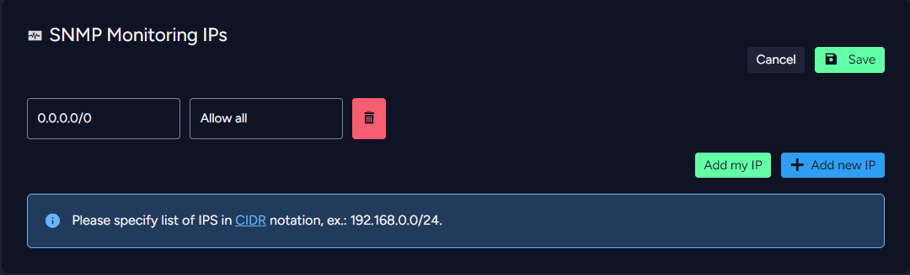
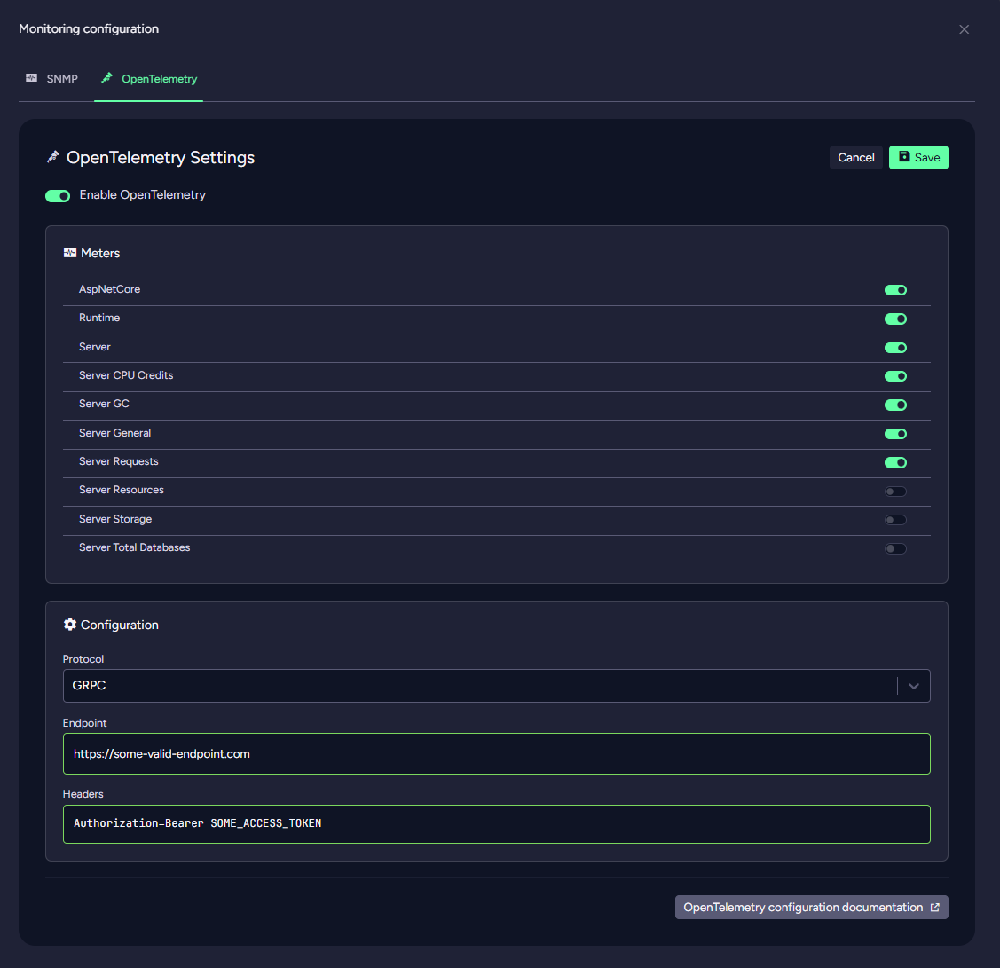
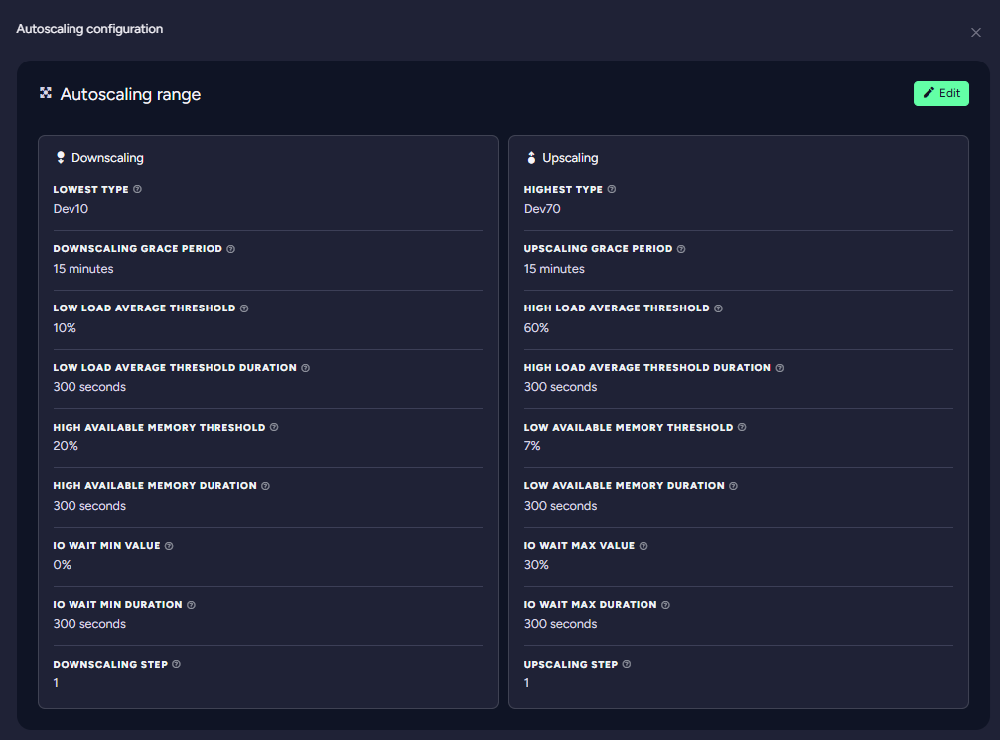
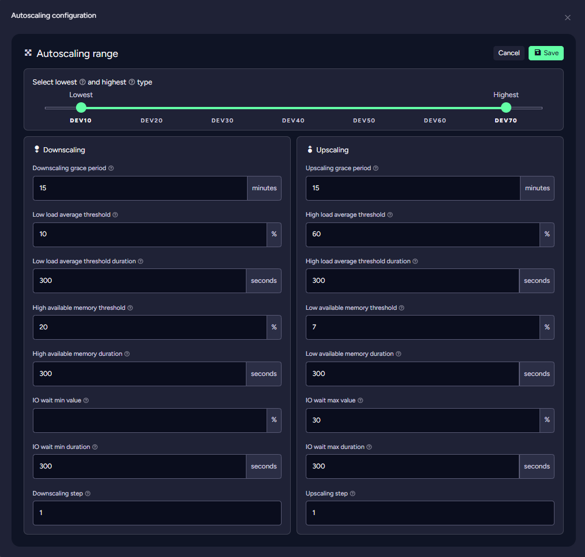
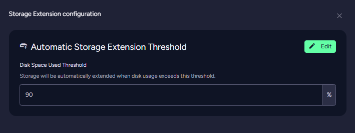
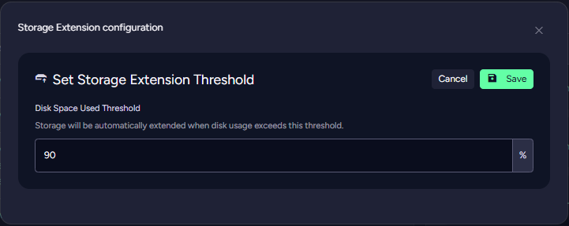

import Admonition from '@theme/Admonition';
import Tabs from '@theme/Tabs';
import TabItem from '@theme/TabItem';
import CodeBlock from '@theme/CodeBlock';
import LanguageSwitcher from "@site/src/components/LanguageSwitcher";
import LanguageContent from "@site/src/components/LanguageContent";

# Cloud: Product Features
## OLAP ETL 

*RavenDB Cloud* provides *OLAP ETL* capabilities, allowing you to integrate your operational data with analytical data
warehouses.

Usage of this feature is
described [here](https://ravendb.net/docs/article-page/latest/csharp/studio/database/tasks/ongoing-tasks/olap-etl-task).

## PowerBi 

*RavenDB Cloud* supports direct integration with *Power BI*, a leading business analytics tool. This feature allows you
to seamlessly connect your RavenDB data with *Power BI* for advanced visualization and reporting, enabling real-time
insights and data-driven decision-making.

Usage of this feature is
described [here](https://ravendb.net/docs/article-page/latest/csharp/integrations/postgresql-protocol/power-bi).

<Admonition type="note" title="Permissions">
*Power BI* is a security-related feature: **enabling or disabling** it requires the [**Manager** (or **Admin**) preset together with the **Security admin** add-on](./cloud-account.mdx#permission-presets), while the **Security admin** add-on alone is enough to *configure* it once enabled.
</Admonition>

### Configuration

<Admonition type="warning" title="Required " id="required" href="#required">
*Power Bi* IPs must be configured after enabling *PowerBi* feature.
</Admonition>

<Admonition type="warning" title="Product Restart " id="product-restart" href="#product-restart">
Your product will be restarted automatically node by node to apply settings needed for feature to work properly.
</Admonition>

To access *Power Bi* Configuration View click **Configure** Button in *Power Bi* feature row. Here you can edit your IP
addresses that will have access to *RavenDB Power Bi* port.

<Admonition type="info" title="">
*Power Bi* IPs entries are [CIDR ranges](https://en.wikipedia.org/wiki/Classless_Inter-Domain_Routing#CIDR_notation)
that define networks from which the connection is allowed.
</Admonition>

## Queue ETL 

The *Queue ETL* feature enables you to export data from *RavenDB* to various queue systems, such as *RabbitMQ* or
*Kafka*.
This is particularly useful for scenarios where you need to process data asynchronously or distribute it
to other microservices and applications.

Usage of this feature is
described [here](https://ravendb.net/docs/article-page/latest/csharp/server/ongoing-tasks/etl/queue-etl/overview).

## Queue Sink 

*Queue Sink* allows *RavenDB Cloud* to directly receive data from queues, making it easier to ingest data into your
database from external systems or services. This feature is ideal for integrating with event-driven architectures
where data is processed and ingested in real time.

Usage of this feature is
described [here](https://ravendb.net/docs/article-page/latest/csharp/server/ongoing-tasks/queue-sink/overview).

<Admonition type="info" title="Availability " id="availability" href="#availability">
This feature is available only for *RavenDB* **6.0 and newer**.
</Admonition>

## Data Governance: Data Archival, Remote Attachments & Schema Validation

The **Data Governance** feature in *RavenDB Cloud* bundles several capabilities to help manage your data lifecycle and integrity.

Its primary function is **Data Archival**, which offers the ability to archive selected documents.
Archived documents are compressed and can be handled differently by *RavenDB* functions (e.g. Indexing can exclude
archived documents from indexes and Data Subscriptions can avoid sending archived docs to workers), helping to keep the
database smaller and quicker and its contents more relevant.

Usage of Data Archival is described [here](https://docs.ravendb.net/data-archival/overview).

Additionally, for newer server versions, enabling Data Governance grants access to [Remote Attachments](https://docs.ravendb.net/7.2/document-extensions/attachments/store-attachments/store-attachments-remote/) and [Schema Validation](https://docs.ravendb.net/7.2/documents/schema-validation/schema-validation_overview/).

<Admonition type="info" title="Availability & Versions" id="availability" href="#availability">
    * **Data Archival**: Available for *RavenDB* **6.0 and newer**.
    * **Remote Attachments & Schema Validation**: Automatically included if running *RavenDB* **7.2 or higher**.
</Admonition>

## Monitoring 

*RavenDB Cloud* allows you to monitor your *RavenDB Cloud* instances via *SNMP* and *OpenTelemetry* protocols.

*SNMP* is a widely used
network management protocol that allows for the collection and organization of information about managed devices on IP
networks.
*RavenDB Cloud* leverages the *OpenTelemetry SDK* to send metrics data via the *OpenTelemetry* Protocol, allowing
seamless
data collection and analysis by an OpenTelemetry retriever.

<Admonition type="note" title="Permissions">
*Monitoring* (SNMP / *OpenTelemetry*) is a security-related feature: **enabling or disabling** it requires the [**Manager** (or **Admin**) preset together with the **Security admin** add-on](./cloud-account.mdx#permission-presets), while the **Security admin** add-on alone is enough to *configure* it once enabled.
</Admonition>

<Admonition type="info" title="Alerts">
Enabling *Monitoring* also unlocks the product's **Alerts** tab, where you can have
[Cluster Health](./cloud-maintenance-troubleshooting.mdx#cluster-health) events emailed to you as a daily summary or as
per-event custom alerts. See [Alerts](./cloud-maintenance-troubleshooting.mdx#alerts).

Disabling *Monitoring* **discards** the product's alert rules.
</Admonition>

### Configuration

Click the **Configure** button in the *Monitoring* feature row to configure this feature.
You will be taken to the *Monitoring Configuration View*, which is divided into two tabs:

1. SNMP Configuration Tab:

   - In the first section, you can edit SNMP Monitoring IPs.

   - In the second section, you can view and update SNMPv3 Monitoring credentials.

2. OpenTelemetry Configuration Tab:

   - Select which Meters should be collected.

   - Specify where these Meters should be sent.

<Admonition type="info" title="Availability " id="availability" href="#availability">
OpenTelemetry feature is available only for *RavenDB* **6.2 and newer**.
</Admonition>

### SNMP Monitoring IPs

<Admonition type="warning" title="Required " id="required" href="#required">
*SNMP Monitoring* IPs must be configured **after** enabling *Monitoring* feature.
</Admonition>

<Admonition type="warning" title="Product Restart " id="product-restart" href="#product-restart">
Your product will be restarted automatically (node by node) to apply settings needed for feature to work properly.
</Admonition>

This section allows you to specify IPs that will have access to your product using the *SNMP* protocol.

### SNMPv3 Monitoring credentials

SNMPv3 is the most secure version of SNMP, providing enhanced security features over its predecessors. When setting up
SNMPv3 monitoring for your *RavenDB Cloud* instances, you need to configure specific credentials that ensure secure
communication between the SNMP agent on your end and the RavenDB.

Credentials required to connect to *RavenDB Monitoring* Endpoints are provided in this section. We also provide sample
command you can use to test connection.

<Admonition type="info" title="">
SNMP Monitoring IPs entries
are [CIDR ranges](https://en.wikipedia.org/wiki/Classless_Inter-Domain_Routing#CIDR_notation)
that define networks from which the connection is allowed.
</Admonition>

### OpenTelemetry Configuration

<Admonition type="warning" title="Product Restart " id="product-restart" href="#product-restart">
Your product will be restarted automatically (node by node) to apply settings needed for feature to work properly.
</Admonition>

This section allows you to select meters and specify where these should be sent using the *OpenTelemetry* protocol.

You can read step by step OpenTelemetry & Grafana configuration [here](https://ravendb.net/articles/grafana-cloud-configuration-with-opentelemetry).

## Autoscaling 

*RavenDB Cloud* can resize your instance automatically, within a range you choose, so it follows your actual workload
instead of being fixed to the size you provisioned.

Scaling is driven by three sustained signals, each watched independently:

* **Load average** — how busy the node's CPUs are.
* **Available memory** — how much memory is left for processing.
* **IO wait** — how much time the node spends waiting on disk.

Each signal has a low and a high limit, and each limit has its own duration. A limit must be breached for the whole of
its duration before it counts, and a **grace period** then applies before the resize itself, so a brief spike never
moves your instance.

### Autoscaling range

**Lowest type** and **Highest type** bound the resizing. Autoscaling never moves your instance below the lowest or above
the highest type, and both bounds are inclusive.

### Configuration

Click the **Configure** button in the *Autoscaling* feature row to open the Autoscaling Configuration view, which is
split into upscaling and downscaling parameters.

#### Upscaling parameters

| Parameter                            | Range       | Description                                                                                          |
|--------------------------------------|-------------|------------------------------------------------------------------------------------------------------|
| Upscaling grace period               | 3–60 min    | The delay before upscaling begins after a high resource threshold is exceeded, so short spikes do not trigger a resize. |
| High load average threshold          | 50–90%      | The average load percentage, over the *high load average threshold duration*, that triggers upscaling. |
| High load average threshold duration | 180–600 sec | How long the average load must stay above the threshold before upscaling is triggered.               |
| Low available memory threshold       | 1–15%       | The available memory percentage below which upscaling is triggered.                                  |
| Low available memory duration        | 180–600 sec | How long available memory must stay below the threshold before upscaling is triggered.               |
| IO wait max value                    | 25–95%      | The IO wait percentage above which upscaling is triggered.                                           |
| IO wait max duration                 | 180–600 sec | How long IO wait must stay above the maximum before upscaling is triggered.                          |
| Upscaling step                       | 1–3         | How many instance sizes to move in one go. With a step of 2, a *Dev10* scales up to *Dev30*.          |

#### Downscaling parameters

| Parameter                           | Range       | Description                                                                                           |
|-------------------------------------|-------------|-------------------------------------------------------------------------------------------------------|
| Downscaling grace period            | 3–60 min    | The delay before downscaling begins after a low resource threshold is reached.                        |
| Low load average threshold          | 1–35%       | The average load percentage, over the *low load average threshold duration*, that triggers downscaling. |
| Low load average threshold duration | 180–600 sec | How long the average load must stay below the threshold before downscaling is triggered.              |
| High available memory threshold     | 20–90%      | The available memory percentage above which downscaling is allowed.                                   |
| High available memory duration      | 180–600 sec | How long available memory must stay above the threshold before downscaling is triggered.              |
| IO wait min value                   | 0–15%       | The IO wait percentage below which the node is considered idle enough to allow downscaling.           |
| IO wait min duration                | 180–600 sec | How long IO wait must stay below the minimum before downscaling is triggered.                         |
| Downscaling step                    | 1–3         | How many instance sizes to move in one go. With a step of 2, a *Dev30* scales down to *Dev10*.         |

<Admonition type="note" title="Which limit drives which direction">
Load average and IO wait follow utilisation, so their **low** limits belong to downscaling and their **high** limits to
upscaling. **Available memory runs the other way** — it is what's left, not what's used — so it is the **low** available
memory limit that triggers upscaling and the **high** one that permits downscaling.
</Admonition>

You can edit the Autoscaling parameters by clicking the **Edit** button.

### Serverless Autoscaling

[Serverless products](../cloud/cloud-instances.mdx#a-serverless-cloud-product) autoscale on the same three signals,
using the same defaults, but the feature is presented separately as **Serverless Autoscaling** and behaves differently
in two ways:

* It is **always enabled**. You cannot turn it off yourself — a Serverless product that did not resize itself would not
  be serverless. Contact support if you need it disabled.
* Its configuration exposes **only the instance range** — the lowest and highest type, set with a slider. The thresholds
  and grace periods above are managed for you and are not editable.

To leave Serverless autoscaling behind entirely, switch the product to a regular deployment — see
[Switching to Regular Deployment](../cloud/cloud-instances.mdx#switching-to-regular-deployment).

## AI Embeddings, GenAI & AI Agent 

*RavenDB Cloud* provides an integrated solution that combines high-performance NoSQL capabilities with advanced vector
indexing and querying features, enabling efficient storage and management of high-dimensional vector data. 

*RavenDB* can now be combined with generative AI using LLM of your choice.

Usage of this feature is
described [here](https://docs.ravendb.net/7.1/ai-integration/start/).

<Admonition type="info" title="Availability " id="availability" href="#availability">
AI Embeddings is available only for *RavenDB* **7.0 and newer**.

Gen AI & AI Agent are available only for *RavenDB* **7.1 and newer**.
</Admonition>

## Snowflake ETL 

Seamlessly integrate *RavenDB Cloud* with Snowflake using an ongoing ETL task. 
Automatically export data from RavenDB collections to your Snowflake data warehouse in near real-time.
Define transformation scripts to shape the data before export, ensuring compatibility and efficiency for your analytics workflows.
Ideal for building robust pipelines for business intelligence, reporting, and data science.

Usage of this feature is
described [here](https://ravendb.net/docs/article-page/latest/csharp/studio/database/tasks/ongoing-tasks/snowflake-etl-task).

<Admonition type="info" title="Availability " id="availability" href="#availability">
This feature is available only for *RavenDB* **7.0 and newer**.
</Admonition>

## Automatic Storage Extension

*RavenDB Cloud* can extend your instance's disk automatically once disk usage passes a threshold you set,
so a growing dataset does not run the product out of space while you are not watching.

The feature is **enabled by default** with a threshold of **90%**, and the feature itself is **free of charge** —
you are billed only for the larger disk it provisions, at the normal
[storage rate](./cloud-pricing-payment-billing.mdx).

<Admonition type="info" title="Availability">
Automatic Storage Extension is offered on
[Development](./cloud-instances.mdx#a-development-cloud-server) and
[Production](./cloud-instances.mdx#a-production-cloud-cluster) tier products, except for **Dev10** and
**PN**-type instances. It is not offered on the [Free tier](./cloud-instances.mdx#a-free-cloud-node).

Products that are not eligible have no *Automatic Storage Extension* row in the *Additional Features* table.
</Admonition>

### How it works

Each node reports its disk usage to *RavenDB Cloud*. Once usage exceeds the configured threshold, the disk is
extended to the **next larger size available for the current instance type** — not to the size that would merely
clear the threshold — and the product briefly enters *Deploying changes* while the volume is resized.

You are notified by email when this happens. The message states the previous size, the new size, and the
**maximum size your instance type allows**, which is the point at which extension stops and an instance type
upgrade becomes necessary.

<Admonition type="note" title="Azure Premium disks">
On *Azure* **Premium** disks, disk performance follows disk size. When the new size belongs to a higher
[performance tier](./cloud-scaling.mdx#azure-premium---azure-performance-tier-customization), the extension
raises **IOPS** and **throughput** to that tier as well. *Standard* disks keep their fixed performance.
</Admonition>

### Configuration {#storage-extension-configuration}

Click the **Configure** button in the *Automatic Storage Extension* feature row to open the
**Storage Extension configuration** dialog, then click **Edit** to change the single setting it holds:

**Disk Space Used Threshold** — the percentage of disk usage above which the storage is extended. It accepts a value
between **70** and **95**, and **defaults to 90**.

<Admonition type="note" title="When the threshold cannot be changed">
* The product must be **Active**.
* The threshold **cannot be changed on yearly contracts** — only on *On-Demand* products.
* The feature itself must be enabled, which requires the
  [**Manager** (or **Admin**) preset](./cloud-account.mdx#permission-presets).

Where a condition is not met the **Edit** button is disabled and the reason is shown in its tooltip.
</Admonition>

You can edit the threshold by clicking the **Edit** button.

### Enabling and disabling

The *Automatic Storage Extension* row carries a **Disable** button while the feature is active, and an **Enable**
button once it is off. Both require the product to be **Active** and the
[**Manager** (or **Admin**) preset](./cloud-account.mdx#permission-presets); otherwise the button is disabled and
its tooltip gives the reason.

While the feature is off, the disk is never extended automatically — no matter how full it gets — and the
**Configure** button disappears with it.

### When storage is not extended

Some products cannot be extended even with the feature on. In those cases nothing is resized and you receive an
email instead, so the condition does not pass unnoticed:

| Condition | What happens |
|---|---|
| **The instance type's maximum disk size is reached** | No larger size is available. The email names your instance type and its limit; extension resumes only after you [upgrade the instance type](./cloud-scaling.mdx#scaling---change-instance-type). |
| **The cloud provider's root-disk limit is reached** | Products whose data lives on the OS disk cannot grow past **1,000 GB** on *AWS* and *GCP*, or **1,024 GB** on *Azure*. Migrate the storage to a [Data Disk](./cloud-scaling.mdx#data-disks) to grow beyond that. |
| **The product is on a yearly contract** | Storage cannot be changed under a yearly contract. Contact [support](./cloud-support.mdx) for a tailored solution. |
| **The product is on the Free tier** | Free tier storage is fixed. Reduce the stored data or move to a paid tier. |

<Admonition type="note" title="One warning per day">
At most **one** such email is sent per product per **24 hours**, so a product sitting above its threshold does not
produce a stream of identical messages.
</Admonition>

<Admonition type="warning" title="Storage modification rate">
Storage changes — automatic and manual alike — are rate limited per product: at least **6 hours** must pass between
two changes on *AWS*, and **12 hours** on *Azure* **Premium** disks. An automatic extension that falls inside that
window is skipped and retried later, so a disk filling up quickly may cross its threshold well before it grows.
</Admonition>
