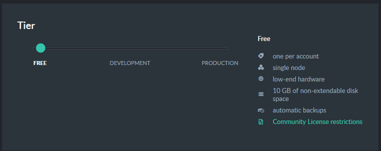
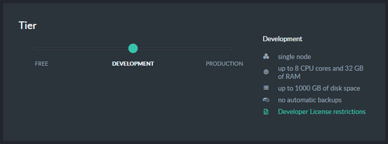
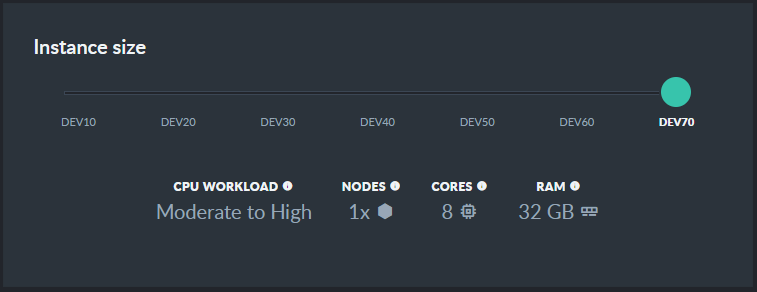
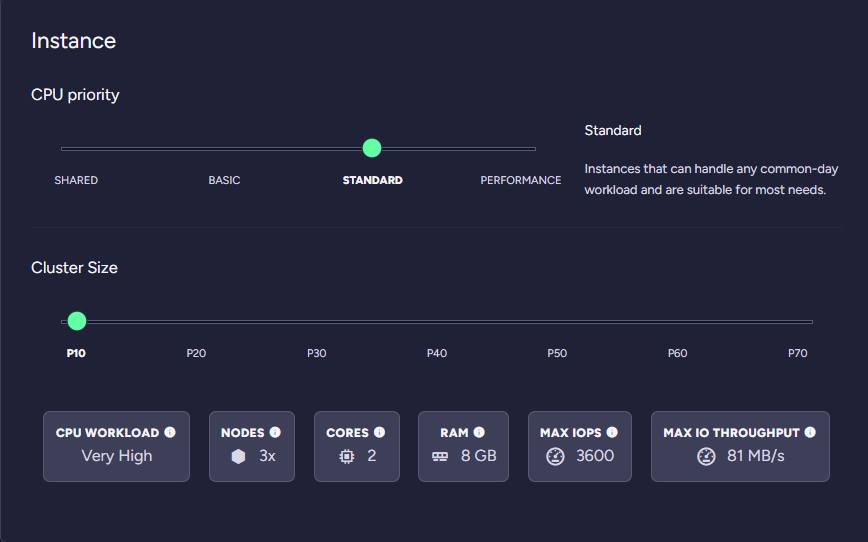
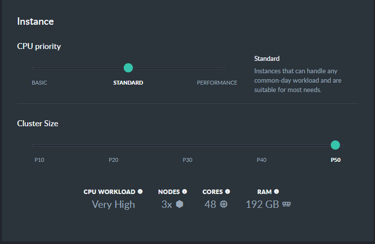
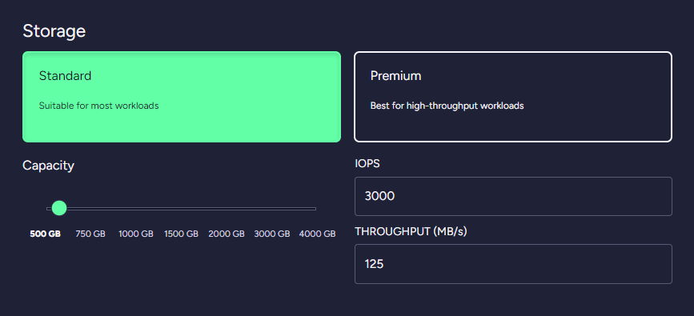

import Admonition from '@theme/Admonition';
import Tabs from '@theme/Tabs';
import TabItem from '@theme/TabItem';
import CodeBlock from '@theme/CodeBlock';
import LanguageSwitcher from "@site/src/components/language-switcher";
import LanguageContent from "@site/src/components/language-content";

# Cloud: Tiers and Instances

<Admonition type="note" title="Note">

- Use your portal's [Products tab](../cloud/portal/cloud-portal-products-tab) to raise or modify 
a Free node, a Development node, or a Production cluster.  
- Free and Development nodes, as well as Production "basic" grade clusters, are operated by 
[burstable instances](../cloud/cloud-overview#burstable-vs.-reserved-clusters).  
- The Production cluster grades [Standard](../cloud/cloud-instances#standard-grade-production-cluster) 
and [Performance](../cloud/cloud-instances#performance-grade-production-cluster) are 
[Reserved clusters](../cloud/cloud-overview#burstable-vs.-reserved-clusters).  

In this page:  

* [A Free Cloud Node](../cloud/cloud-instances#a-free-cloud-node)  
* [A Development Cloud Server](../cloud/cloud-instances#a-development-cloud-server)  
* [A Production Cloud Cluster](../cloud/cloud-instances#a-production-cloud-cluster)  
   - [Basic-grade Production Cluster](../cloud/cloud-instances#basic-grade-production-cluster)  
   - [Standard-grade Production Cluster](../cloud/cloud-instances#standard-grade-production-cluster)  
   - [Performance-grade Production Cluster](../cloud/cloud-instances#performance-grade-production-cluster)  
</Admonition>
## A Free Cloud Node

Free RavenDB cloud nodes are great for experiments and evaluation. They are equipped with the 
most basic configuration and capabilities. They have a single node and no Service-Level Agreement (SLA).  
You can run only one free node per [account](../cloud/cloud-overview#your-account).  

To raise a free cloud node, use the [Products tab](../cloud/portal/cloud-portal-products-tab) 
to create a **free**-tier instance.  

* A free instance is identical to a development [Dev10](../cloud/cloud-instances#a-development-cloud-server) instance.  
  It comes with a monthly credit of **$10**, used to cover the cost of the instance and incidentals like backup storage 
  and traffic.  
  <Admonition type="note" title="Note">
  If your free instance uses more resources than the provided credit, you'll need to pay for these resources or stop your instance. 
  </Admonition>

* The free instance is limited to the [community](https://ravendb.net/buy) subset of features.  

* If you don't use your free instance for over 30 days, it will be terminated.  

## A Development Cloud Server

A development server is equipped with all of RavenDB's [features](https://ravendb.net/buy) 
but is **not** suitable for production for the following reasons:  

* A single-node configuration (no [replication](../server/clustering/replication/replication)).  
* [Burstable](../cloud/cloud-overview#burstable-instances) CPU usage, suitable for small to medium production loads.  
  Burstable instances can become throttled if usage exceeds allocated resources.  
* Lack of [backup](../cloud/cloud-backup-and-restore#cloud-backup) procedure.  
* No [Service Level Agreement](../cloud/portal/cloud-portal-support-tab#support-entitlement).  

To raise a cloud Development server, create a product using the Products tab and select the **Development** tier.  

#### Select your server's configuration  
  
Select a configuration from Dev10 to Dev70.  
The configurations are increasingly more and more powerful.  

#### Select your storage  

Select your storage type and size.  

In addition to the CPU / memory resources allocated to your instances, you can select the type of storage that will 
be assigned to your RavenDB instances. It is fairly obvious why the size of the storage matters, but it is important 
to also understand the impact of the storage type and allocated IOPS on the overall performance.  

RavenDB, as a database, is sensitive to I/O latencies resulting from slow storage. If your instances are running into 
high I/O latencies, RavenDB will alert you to the issue so you can upgrade the type of storage you are using and the 
number of IOPS reserved for your instances.  

## A Production Cloud Cluster

The default production configuration is a three-node cluster, provisioned in separate 
availability zones for maximum durability.

RavenDB Cloud also offers **multi-region clusters** to minimize local latency and clusters 
with a **higher number of nodes** to further distribute the cluster's workload.  
[Contact Support](https://ravendb.net/contact) to provision customized cloud-based clusters 
with configurations that suit your needs.  

*Production tier* clusters can be also extended by [additional product nodes](../cloud/portal/cloud-portal-products-tab#nodes-additional-product-nodes).  
<Admonition type="info" title="Info">
This option is not available for **PS** instance types.
</Admonition>

<Admonition type="note" title="Note">
Please be aware that cloud cluster nodes are provided with dynamic IP addresses and are 
**not guaranteed** to keep the same addresses if the instances they reside on are rebooted.  
</Admonition>

   
The production tier offers three instance levels:  

1. [Basic](../cloud/cloud-instances#basic-grade-production-cluster)  
2. [Standard](../cloud/cloud-instances#standard-grade-production-cluster)  
3. [Performance](../cloud/cloud-instances#performance-grade-production-cluster)  
#### 1. Basic-grade Production Cluster
Basic production clusters are [burstable](../cloud/cloud-overview#burstable-instances).  
While suitable for low to medium workloads, they trade-off peak efficiency for lower costs.  

<Admonition type="note" title="Throttling" id="throttling" href="#throttling">
 If burstable instances use more than their allocated budget, they can become [throttled](../cloud/cloud-overview#budget-credits-and-throttling).
 </Admonition>

#### 2. Standard-grade Production Cluster
The resources of standard production clusters are [reserved](../cloud/cloud-overview#reserved-clusters).  
The cluster can utilize them at all times, and is equipped to handle constant production load.  

Use the slide-bars to select your Standard Production cluster's configuration and storage.  

In addition to the CPU / memory resources allocated to your instances, you can select the type of storage that will 
be assigned to your RavenDB instances. It is fairly obvious why the size of the storage matters, but it is important 
to also understand the impact of the storage type and allocated IOPS on the overall performance.  

RavenDB, as a database, is sensitive to I/O latencies resulting from slow storage. If your instances are running into 
high I/O latencies, RavenDB will alert you to the issue so you can upgrade the type of storage you are using and the 
number of IOPS reserved for your instances.  
#### 3. Performance-grade Production Cluster

Performance tier cluster are special [reserved](../cloud/cloud-overview#reserved-clusters) production clusters featuring high-throughput and low latency with a directly mapped local NVMe storage. When multiple NVME disks are available, in order to achieve the best possible throughput and to get as many IOPS as possible, multiple NVME volumes are striped together with RAID0. 

<Admonition type="note" title="Note">
**Scaling up and ephemeral drives**  

Local NVMe disks on PN instance types are ephemeral, data will be lost on these disks if the VM is stopped (terminated). During normal operations, like OS or RavenDB updates and restarts, data is being preserved and there is no need to worry about the ephemeral nature of the disks. Higher-risk operations like scaling-up, where we do copy data to a temporary non-ephemeral drive, are dispatched manually by our team upon Support Request created in the RavenDB Cloud Portal.

All products in this category are offered only with high-availability cluster of a minimum 3 nodes to balance the ephemeral nature of the disks.
</Admonition>

<Admonition type="note" title="Note">
**Snapshot backups**

Since this type of RavenDB clusters is designed to hold data of terrabyte order of magnitude, by default PN instance types run backups of type Snapshot to ensure fast data restore.
</Admonition>

<Admonition type="note" title="Note">
Local NVMe drives on PN clusters are encrypted by default using hardware-based encryption.
</Admonition>

  

