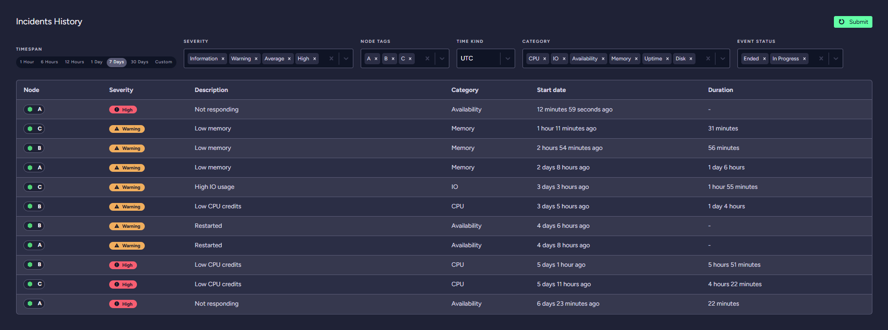

import Admonition from '@theme/Admonition';
import Tabs from '@theme/Tabs';
import TabItem from '@theme/TabItem';
import CodeBlock from '@theme/CodeBlock';
import LanguageSwitcher from "@site/src/components/language-switcher";
import LanguageContent from "@site/src/components/language-content";

# Cloud: Maintenance & Troubleshooting
## Overview

Our products come equipped with advanced monitoring system that track critical performance metrics to ensure optimal
operation. Each product may display one or more of the following labels, providing real-time insights into its current
status.

## Labels

| Label                         | Description                                                                                                                                                                                                                                                                                                                       |
|-------------------------------|-----------------------------------------------------------------------------------------------------------------------------------------------------------------------------------------------------------------------------------------------------------------------------------------------------------------------------------|
| Node not responding           | Product is currently not responding to input or commands. It suggests that the system may be experiencing a critical issue or is in an unresponsive state. This may be caused by high CPU or IO usage, thrashing, cloud provider hardware failure or application errors.                                                          |
| High CPU usage                | Product is experiencing a high level of CPU utilization. It suggests that the product's processor is under heavy load, which may affect performance.                                                                                                                                                                              |
| High IO usage                 | Product is experiencing high input/output operations, which may indicate heavy disk or network activity. High I/O usage can slow down data processing and affect overall system performance, necessitating optimizations or resource upgrades. Sometimes might be caused by thrashing (excessive swapping due to lack of memory). |
| Low memory                    | Product is running low on available memory. It warns that the system may be close to using all its RAM, which can impact its ability to handle additional tasks. Low memory conditions can cause applications to slow down or crash, indicating a need for memory optimization or an increase in RAM capacity.                    |
| CPU Credits are low           | Product is running low on CPU credits (only on [burstable instances](cloud-overview#burstable-instances)). Low CPU credits can lead to reduced processing power, affecting performance. It may require adjusting resource allocation or upgrading to a higher credit tier.                                                        |
| Free disk space - 10% left    | Product's available disk space is below 10%.                                                                                                                                                                                                                                                                                      |
| Free disk space is very low   | Product's available disk space is below 7%.                                                                                                                                                                                                                                                                                       |
| Low uptime - below 15 minutes | Product's uptime has been below 15 minutes for at least 30 minutes.                                                                                                                                                                                                                                                               |
| Low uptime - below 2 hours    | Product's uptime has been below 2 hours for at least 4 hours.                                                                                                                                                                                                                                                                     |
| Low uptime - below 12 hours   | Product's uptime has been below 12 hours for at least 24 hours.                                                                                                                                                                                                                                                                   |
| Low uptime - below 48 hours   | Product's uptime has been below 48 hours for at least 96 hours.                                                                                                                                                                                                                                                                   |

## Cluster Health

**Cluster Health** helps keep your cluster healthy by providing suggestions and incidents history.  
This dashboard has two separated sections:

- [Incidents History](cloud-maintenance-troubleshooting#incidents-history)
- [Suggestions](cloud-maintenance-troubleshooting#suggestions)
## Incidents History

The *RavenDB Cloud* monitoring system tracks incidents and cluster performance.  
This section lets you analyse your cluster incidents for a selected *time period*, *cluster node*, *severity*, *category* and *event status*.

#### Categories and their descriptions

Incidents are split into *six* categories. **Description** column contains additional information about the incidents.  

| Category name | Description                                                                            |
|---------------|----------------------------------------------------------------------------------------|
| Uptime        | Product's uptime has been below a specified time.                                      |
| Memory        | Product is running low on available memory.                                            |
| CPU           | Product is running low on CPU credits or experiencing a high level of CPU utilization. |
| Disk          | Product's available disk space is low.                                                 |
| IO            | Product is experiencing high input/output operations.                                  |
| Availability  | Product is currently not responding to input or commands or has been restarted.        |
## Suggestions

This section displays suggestions for a selected *cluster node* based on incident trends.

Suggestions are generated based on a 60-day period divided in half.  

**First period** (hereinafter referred to as **previous period**) lasts from `now - 60 days` to `now - 30 days`.  
**Second period** (hereinafter referred to as **current period**) lasts from `now - 30 days` to `now`.  

#### Suggestion types

**Cluster Health** is able to generate suggestions for *five* usage areas:

- High CPU usage                                                         
- High IO usage                        
- Low memory mode                      
- Low CPU credits                                                                      
- Server restarted due to Out of Memory

#### Analyses

Suggestions are generated using three types of analyses for specific suggestion types:

| Analyse type                                     | Applicable to                                                   | Description                                                                                                 |
|--------------------------------------------------|-----------------------------------------------------------------|-------------------------------------------------------------------------------------------------------------|
| Current period above previous period by percents | High CPU usage, High IO usage, Low memory mode, Low CPU credits | The duration of a specific event was longer in the current period than in the previous period.              |
| Current period above previous period by numbers  | Server restarted due to Out of Memory                           | The number of occurrences of a specific event was higher in the previous period than in the current period. |
| Current period above threshold by percents       | High CPU usage, High IO usage, Low memory mode, Low CPU credits | The duration of a specific event in the current period was longer than the threshold (5%).                  |

Below examples of the suggestions with the analyses: 

