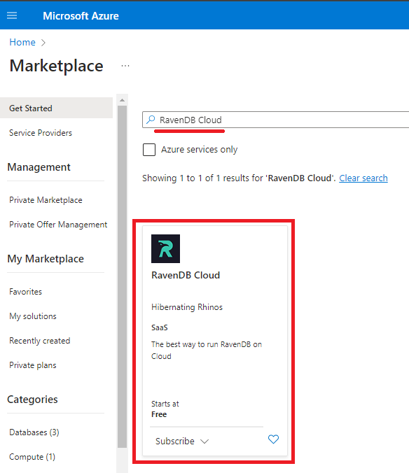
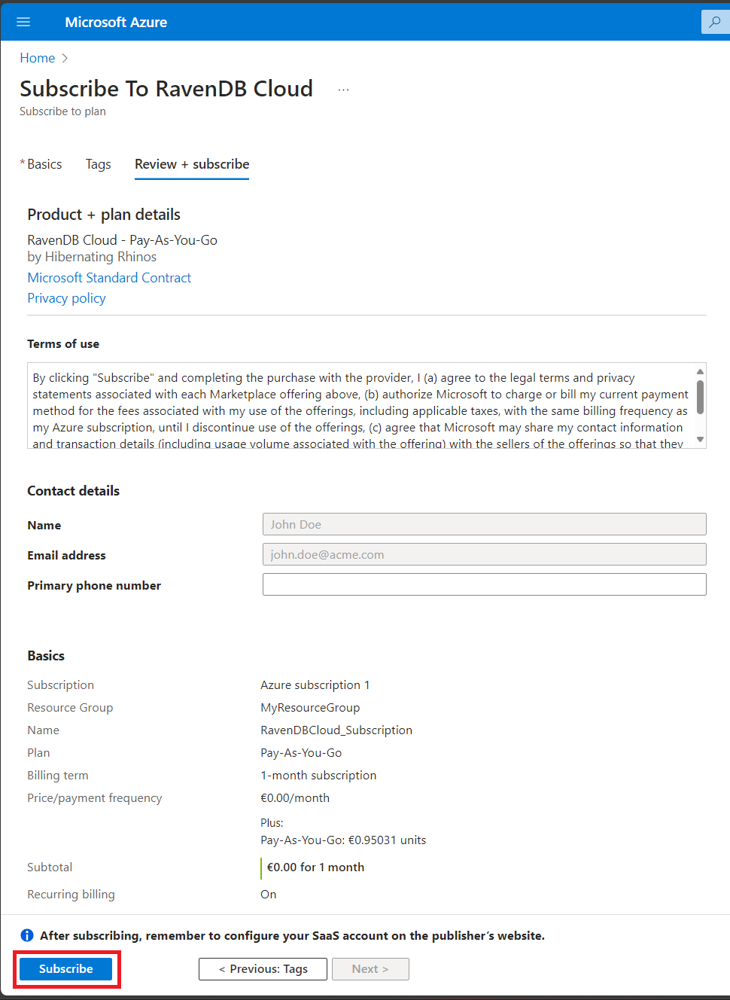
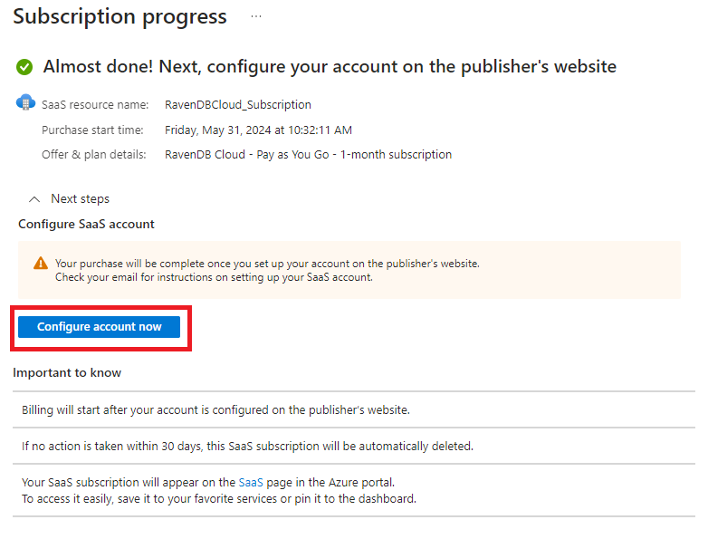
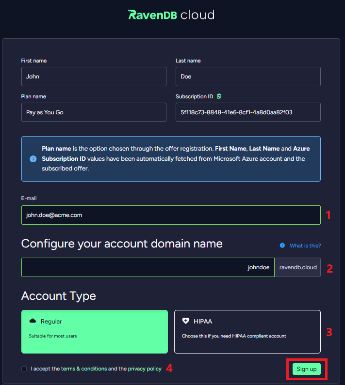

import Admonition from '@theme/Admonition';
import Tabs from '@theme/Tabs';
import TabItem from '@theme/TabItem';
import CodeBlock from '@theme/CodeBlock';
import LanguageSwitcher from "@site/src/components/LanguageSwitcher";
import LanguageContent from "@site/src/components/LanguageContent";

# Cloud: Microsoft Azure Marketplace
<Admonition type="note" title="">

Access to *RavenDB Cloud* services is available through the *Microsoft Azure Marketplace*.

* In this page:
    * [Overview](../cloud/cloud-microsoft-azure-marketplace.mdx#overview)
    * [Registration process](../cloud/cloud-microsoft-azure-marketplace.mdx#registration-process)
    * [Subscription cancellation process](../cloud/cloud-microsoft-azure-marketplace.mdx#subscription-cancellation-process)
    * [Conversion from a regular Cloud Account to an Azure Marketplace Account](../cloud/cloud-microsoft-azure-marketplace.mdx#conversion-from-a-regular-cloud-account-to-an-azure-marketplace-account)

</Admonition>
## Overview

If you want to pay for *RavenDB Cloud* services using a credit card associated with your *Microsoft Azure* account, without re-entering the card in *RavenDB Cloud*, you can subscribe to [RavenDB Cloud offer](https://azuremarketplace.microsoft.com/en-us/marketplace/apps/hibernatingrhinos.ravendb-cloud-payg?tab=Overview) on the *Microsoft Azure Marketplace*.

*Microsoft Azure Cloud Account* created this way has a few differences in comparison to the regular *Cloud Account*:

- Monthly invoices are issued by *Microsoft Azure*, not by *RavenDB Cloud*.
- *Microsoft Azure Cloud Account* offering is limited to *Azure* products.
- Billing and contact information are fully managed by *Microsoft Azure*. Changing the parameters is not possible via Cloud Portal.

## Registration process

To connect your *Microsoft Azure* account to the *RavenDB Cloud*, search for the **RavenDB Cloud** offer in *Microsoft Azure Marketplace* and click on it.

In the main page of the offer, click **Subscribe**.

Provide the necessary information required to subscribe to the offer:

1.  **Subscription**  
    Select the *Microsoft Azure subscription* from which your payment information will be used for this offer.

2.  **Resource group**  
    Select the *Microsoft Azure resource group* where the subscription will be located.

3.  **Name**  
    Provide a name for the subscription. 

4.  **Recurring billing**  *
    When recurring billing is on, your subscription will renew at the end of the billing term.

<Admonition type="danger" title="">
If **recurring billing** option is **off**, your subscription **won't be renewed at the end of the billing term**.
This means your subscription, account along with its Cloud products and data they held, **will be permanently lost** at the end of the billing term.
**We highly recommend not changing this option**.
</Admonition>

After providing the information, please click **Review + subscribe**.
The last page shows selected options and basic information about your *Microsoft Azure* account.

<Admonition type="info" title="">
Providing *Primary phone number* **is not required**.
</Admonition>

After reviewing the information, please click **Subscribe**.
Once you have subscribed, the next step is to configure the account in the *RavenDB Cloud*.

Provide the necessary information required to end the registration process:

1.  **Email Address**  
   Provide an email address that you will use in RavenDB Cloud.

2.  **Domain Name**  
    Provide a Domain Name for the account.

3.  **Account Type**  
    Provide an Account Type for the account.

4.  **T&C and privacy policy**  
    Accept Terms & Conditions and the privacy policy.

After providing the information, please click **Sign up**.
Your account is now ready to use. To sign in to the account, click **Continue to sign in**.

<Admonition type="info" title="">
Successful registration process is also confirmed by an email from *Microsoft Azure Marketplace*.
</Admonition>

## Subscription cancellation process

To cancel your subscription, go to your SaaS resource that is associated with the resource group you selected earlier. 
Then click the **Cancel Subscription** button.

Fill the standard cancellation form and click **Cancel subscription**.

<Admonition type="danger" title="">
Subscription cancellation is **irreversible**. Your account and data and will be permanently lost.  
</Admonition>

<Admonition type="info" title="">
Successful cancellation process is also confirmed by an email from *Microsoft Azure Marketplace*.
</Admonition>

## Conversion from a regular Cloud Account to an Azure Marketplace Account

If you would like to convert your existing *Cloud Account* to an *Azure Marketplace Account* to pay for your services using a credit card associated with your *Azure* account, please submit a support request via the *RavenDB Cloud Portal*.

