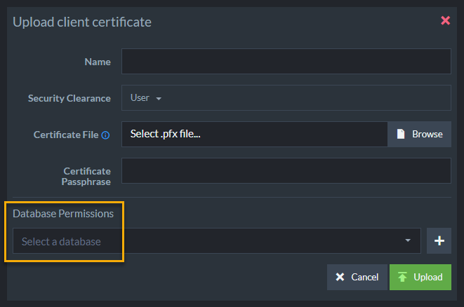
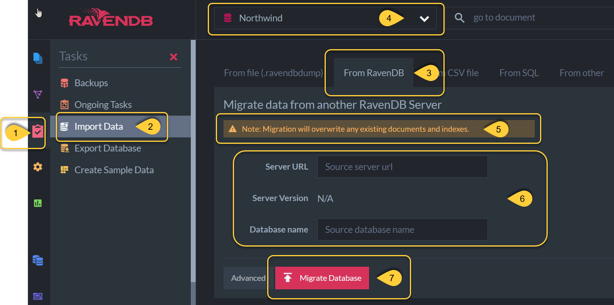
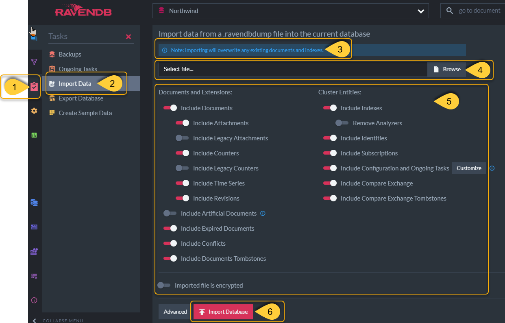

import Admonition from '@theme/Admonition';
import Tabs from '@theme/Tabs';
import TabItem from '@theme/TabItem';
import CodeBlock from '@theme/CodeBlock';
import LanguageSwitcher from "@site/src/components/LanguageSwitcher";
import LanguageContent from "@site/src/components/LanguageContent";

# Cloud: Migration
<Admonition type="note" title="Note">

Databases can be migrated between any two instances of RavenDB, including migration between on-premises and 
cloud servers and between [different RavenDB versions](../7.1/migration/client-api/introduction).  

* In this page  
  * [Import From Live RavenDB instance](cloud-migration#import-from-live-ravendb-instance)  
  * [Import From File](cloud-migration#import-from-file)  
  * [Documents Recently Deleted from Source Database](cloud-migration#documents-recently-deleted-from-source-database)  

</Admonition>
## Import From Live RavenDB Instance

You can easily migrate your database using the [import data from RavenDB](../7.1/studio/database/tasks/import-data/import-from-ravendb) operation.  
In order to do so, the **source server** needs to have the **destination server's cluster certificate**.  

Open the [Management Studio](../7.1/studio/overview) of each server.  
Each server's Studio is available in the [Portal](../cloud/portal/cloud-portal.mdx#cloud-portal)'s 
[Product tab](../cloud/portal/cloud-portal-products-tab.mdx#cloud-account-portal-products).  

Learn how to [install the certificate and access RavenDB Cloud Studio](../cloud/cloud-overview.mdx#ravendb-studio---graphic-user-interface) if this is your first time using Cloud Studio.

If you have already installed the certificate and accessed Studio, 
click the URLs in the Products tab to open a Studio GUI for each node.  

In each studio, select server dashboard and click **Manage certificates**.  

Export the **destination server**'s **Cluster certificate**.  

Import the certificate as a **Client Certificate** by the **source server**.  

Configure the Client Certificate's **Database Permissions** to include the database whose data you want to migrate.  

In the Destination Server, create or select an empty database and open its **Tasks --&gt; Import Data** option.  

1. Select the **Tasks** tab.  
2. Select **Import Data**.  
3. Select the **From RavenDB** tab.  
4. Select the destination server.  
5. **Make sure that you are not writing over data that you want to keep**. One option is [to start a new database with the studio](https://ravendb.net/docs/article-page/5.2/csharp/studio/database/create-new-database/general-flow).  If you create a new one, choose the new database server in step 4 (above).  
6. Enter the URL of the source server and choose which data to migrate.  
7. Click **Migrate Database**  

## Import From File
  
Another option is to [export a database](../7.1/studio/database/tasks/export-database) from the source server in the 
`.ravenDBDump` format, and upload it to another database using the 
[import data from file](../7.1/studio/database/tasks/import-data/import-data-file) operation.  
This option doesn't require passing certificates:  
#### First export the data from source server  

1. In the source server, select a database to export and go to **Tasks tab**.  
2. Select **Export Database**.  
3. Change the destination file name if you'd prefer (optional).  
4. Select desired options.  
 Note that **Encrypt Exported File** is off by default.  
5. After choosing which data to export, click **Export Database**.  
#### Next import the data to destination server from file

1. In the destination server, go to **Tasks** tab.  
2. Select **Import Data**.  
3. **Make sure that you are not writing over data that you want to keep**.  
 One option is [to start a new database with the studio](https://ravendb.net/docs/article-page/5.2/csharp/studio/database/create-new-database/general-flow).  
4. Select the `.ravendbdump` file that you previously exported from the source server.  
5. Select desired options.  
 **If you encrypted while exporting** make sure to select **imported file is encrypted**.  
6. Click **Import Database**.  

## Documents Recently Deleted from Source Database  

* If you've deleted documents from the source database in the last few minutes before live-importing, 
the deleted documents will still appear in the destination database. 
This is because after deleting a document, a [tombstone](../7.1/glossary/tombstone) is left behind as a signal for backups and 
various behind-the-scene processes.  
* Once all of these processes have been completed, 
the tombstones are cleaned. They are cleaned every 5 minutes by default. You can configure the [tombstone cleaner time intervals](../7.1/server/configuration/tombstone-configuration).   
* After they are cleaned, performing another live-import will show that the documents have been deleted.  
  

