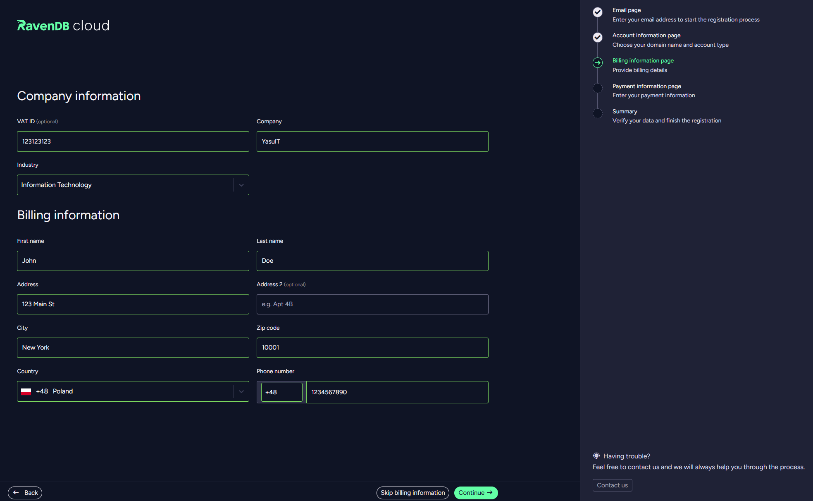
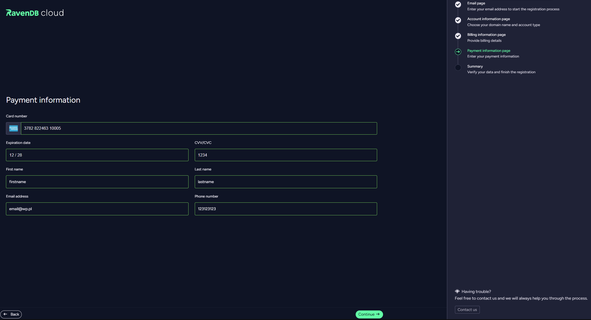
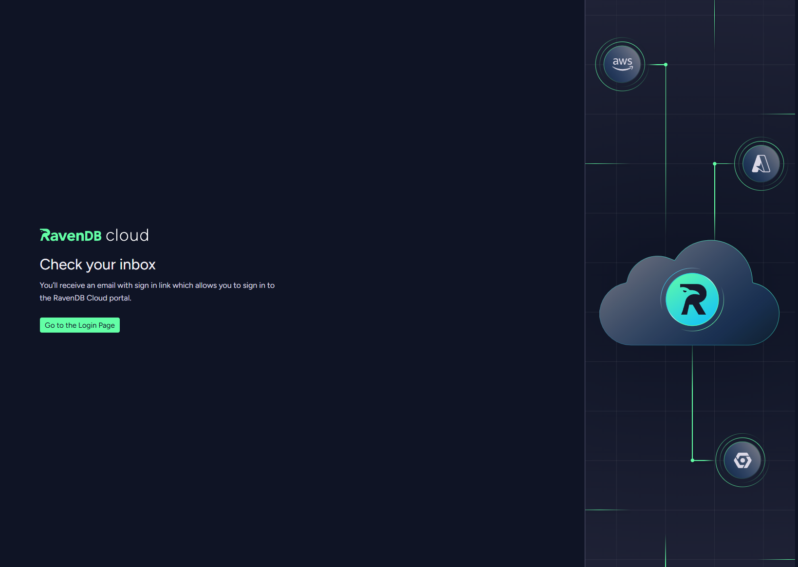
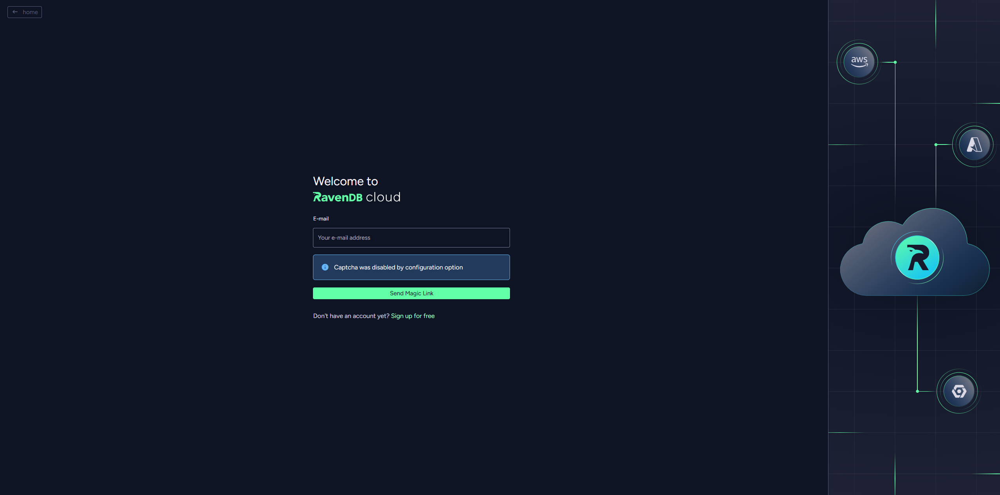
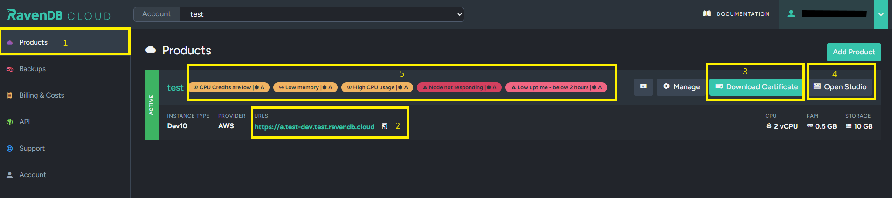

import Admonition from '@theme/Admonition';
import Tabs from '@theme/Tabs';
import TabItem from '@theme/TabItem';
import CodeBlock from '@theme/CodeBlock';
import LanguageSwitcher from "@site/src/components/LanguageSwitcher";
import LanguageContent from "@site/src/components/LanguageContent";

# NoSQL Cloud Service: Overview
<Admonition type="note" title="Note">

Running RavenDB as a cloud service frees you from operational overhead by passing much of the administration to the hands
of RavenDB's developers and allowing them to maintain and optimize your instances for you, take care of cluster operations
like adding or removing nodes, and run recurring tasks like backing up your data.

* **Our and your administration**  
  Ridding you of administrative chores that don't require your attention is complemented by providing you with
  comfortable control over your data and database management via your account's [Portal](../cloud/portal/cloud-portal.mdx)
  and the cloud version of our [Studio](../7.1/studio/overview) management GUI.

* **Resources**  
  Some of your products may share their resources with other applications and users, while other products may occupy machines
  reserved for their usage only. Read about [reserved clusters](../cloud/cloud-overview.mdx#reserved-clusters),
  [burstable instances](../cloud/cloud-overview.mdx#burstable-instances), and [credits](../cloud/cloud-overview.mdx#budget-credits-and-throttling)
  to understand more about your choices.

* In this page:
    * [Your Account](../cloud/cloud-overview.mdx#your-account)
        - [Register](../cloud/cloud-overview.mdx#register-your-account)
        - [Login](../cloud/cloud-overview.mdx#login-to-your-account)
    * [RavenDB on the Cloud](../cloud/cloud-overview.mdx#ravendb-on-the-cloud)
        * [Instances, Provisioning and RavenDB Products](../cloud/cloud-overview.mdx#instances-provisioning-and-ravendb-products)
        * [RavenDB Tiers: Free, Development and Production](../cloud/cloud-overview.mdx#ravendb-tiers)
        * [Burstable vs. Reserved clusters](../cloud/cloud-overview.mdx#burstable-vs-reserved-clusters)
        * [Budget, Credits and Throttling](../cloud/cloud-overview.mdx#budget-credits-and-throttling)
    * [RavenDB Studio - Graphic User Interface](../cloud/cloud-overview.mdx#ravendb-studio---graphic-user-interface)
        * [Accessing RavenDB Cloud Studio](../cloud/cloud-overview.mdx#accessing-ravendb-cloud-studio)
        * [What you can do with RavenDB Studio](../cloud/cloud-overview.mdx#what-you-can-do-with-ravendb-studio)
</Admonition>
## What do you get?

Some of the key reasons for running RavenDB on the cloud are -

* The high availability of a cloud service.
* The constant monitoring and healthcare of your products and their accommodating equipment.
* Your insulation from the cloud infrastructure's administration as we handle and continuously optimize it.
* The high [security](../cloud/cloud-security.mdx) level.
* Regular [backups](../cloud/cloud-backup-and-restore.mdx) to your database and settings.
* Our [support](../cloud/portal/cloud-portal-support-tab.mdx).

## Your Account

Your cloud-RavenDB account gathers your products' information, your details, and your contracts and
billing data. We create your account and send you a link to its [Portal](../cloud/portal/cloud-portal.mdx)
as soon as you finish registering, so you can immediately start creating and handling your
[cloud products](../cloud/portal/cloud-portal-products-tab.mdx).

<Admonition type="info" title="Info">

It is possible to become the owner of multiple Cloud Accounts using the same email address.
This can be useful if you need to separate environments, teams, or billing contexts. 
However, creating multiple Cloud Accounts under one email is not available through the self-service UI.
To set this up, please contact RavenDB Cloud Support and request a multi-account configuration.

</Admonition>

## Register Your Account

To create a new account, enter [https://cloud.ravendb.net/user/register](https://cloud.ravendb.net/user/register)
and allow the wizard to walk you through the 5 simple stages of the registration procedure:

1. **Email**
2. **Account information**
3. **Billing information**
4. **Payment information**
5. **Summary**
#### 1. Email

- Provide your email address.
- Read the **terms & conditions** and the **privacy policy**.
- Click the **Continue** button.
#### 2. Account information

- Enter an unoccupied domain name of your choice, that would be used for your cloud products.  
  The domain name is typically your organization or project name and will be used in all your products' URLs. The procedure will check this name's availability.
- Select your account type. For typical purposes, select the **Regular** button. If you need a *HIPAA-compliant* account, select the **HIPAA** button.
- Click the **Continue** button.
#### 3. Billing information

- Enter your billing information.
- Click the **Continue** button.

<Admonition type="info" title="Info">
Click the **Skip Billing Information** button if you prefer to evaluate the cloud service for now using the free product.
</Admonition>
#### 4. Payment information

- Enter your payment information.
- Click the **Continue** button.
#### 5. Summary

- Verify your choices, confirm you're not a robot, and click the **Create account** button to register your cloud account.
- You’ll receive an email with sign in link which allows you to sign in to the RavenDB Cloud portal.

#### Signing up will send you a message with a link to your email.

- The sign-up process will send a registration link to your email.
- Click the link to enter your account. No password required.
- The link will expire after a while, use the [login page](../cloud/cloud-overview.mdx#login-to-your-account) to re-visit your account.

## Login To Your Account

To access your account, click [https://cloud.ravendb.net/user/login](https://cloud.ravendb.net/user/login).
#### Login

- Enter the same email address you provided during registration, confirm you're not a robot, and
  click the **Send Magic Link** button

* The login procedure will send you a message with a link. Click the link to enter your account, no password required.

  <Admonition type="note" title="Note">
  The magic link is expirable to make sure each visit is logged and keep account activity trackable and more secure.  
  </Admonition>

  <Admonition type="note" title="Note">
  An account can currently be managed by a single operator, we will soon add multiple-operators management.  
  </Admonition>

  <Admonition type="note" title="Note">
  We advise you to enable 2FA. Setup is described [here](../cloud/cloud-security.mdx#enable-mfa).  
  </Admonition>

## RavenDB on the Cloud

## Instances, Provisioning and RavenDB Products
#### Cloud Instances

A cloud instance is a RavenDB server, allocated for you on a cloud provider like AWS or Azure.  
Your cloud instances are fully managed by RavenDB Cloud, including security, monitoring, backups, and patches.  
You get operator-level access to your RavenDB instances and can perform most admin operations on your own.
#### Provisioning

Each RavenDB product is provisioned as many instances as it requires. A production cluster for example is
allocated three instances at a minimum, while a development server's single node is allocated a single instance.
#### RavenDB Products

Your RavenDB **product** can be a single server or a multi-node cluster.  
Each server or cluster-node occupies a single cloud instance.

Different instances are equipped to your specifications to accommodate your different products and
may be considerably different from each other in features, capabilities, and cost. The instances of
a basic production cluster, for example, are [burstable](../cloud/cloud-overview.mdx#burstable-instances),
while those of a higher-grade production cluster are [reserved](../cloud/cloud-overview.mdx#reserved-clusters).

## RavenDB Tiers

There are three types of RavenDB cloud products. They are explained in detail in the
[Tiers and Instances ](../cloud/cloud-instances.mdx) section, in the meantime - here are
a few words about each.
#### The Free Tier  
This tier offers a single product: a single-node RavenDB cloud server designated for experiments and evaluation.  
It is operated by a low-end instance that is shared with other users and is equipped with the community subset of RavenDB features.  
You can have only one free instance in your account. If you don't use your free instance for 30 days, it will be terminated.
#### The Development Tier  
The development tier offers a set of server configurations that can handle increasingly
higher CPU load. All configurations are single-node servers, but a development server is equipped
with RavenDB's full features set.  
Though superior to a free instance, a development instance still runs a single node on shared
hardware and is designated for development, not production.
#### The Production Tier
A production configuration is a full RavenDB cluster of at least three nodes. You can choose its
components using the Portal from a set of pre-selected templates, or contact
us and we'll custom-tailor your product for your specific production requirements, i.e. with a specific
HW selection or a multi-region cluster.
| **Tier** | **Sub-tiers** | **CPU** | **Options** | **SLA** |
| -- | -- | -- | -- | -- |
| Free | - | Very low | None | No |
| Development | Dev10-Dev70 | Very low - High | All | [Yes](../cloud/portal/cloud-portal-support-tab.mdx#support-entitlement) |
| Production | **By CPU Priority** (Basic/Standard/Performance)   **By Cluster Size**| Up to extra performance, high network and reserved NVMe | All | [Yes](../cloud/portal/cloud-portal-support-tab.mdx#support-entitlement) |

## Burstable vs. Reserved clusters

#### Reserved Clusters  
Reserved clusters are production clusters of grade *Standard* or *Performance*. Their resources are
pre-allocated and can be used only by them. Designed to run production systems with demanding workloads,
these are the workhorses of the RavenDB Cloud.
#### Burstable Instances  
Free instances, Development instances, and low-end ("basic") Production clusters are operated by
"burstable" CPUs. Such clusters are suitable for small to medium production loads but are limited
in the total amount of resources that they can consume.  
RavenDB's burstable instance allows you to consume more resources for a short amount of time but will
throttle operations if the cluster uses more than its fair share of system resources.

Such clusters are useful because a RavenDB Cloud balances resource usage among the instances in the cluster.  
If you expect moderate usage (with some peaks), choosing a burstable option can allow you to save about 20% of your costs.

<Admonition type="note" title="Note">
Upgrading from Burstable to Reserved
The RavenDB Cloud allows you to upgrade from a **Basic** production instance to a **Standard** or
**Performance** cluster at will, with no impact on your system availability.
</Admonition>

## Budget, Credits and Throttling
Burstable instances are given a **budget** of CPU credits.  
Credits are **consumed** when the instance uses computing and I/O resources, and are **accumulated**, up to a certain limit, when resource usage is low.

* **Burstable INSTANCES and throttling**  
  When an instance's budget is consumed, its services are throttled.  
  For example, **Indexing may be delayed** and **Requests may be denied**.

  <Admonition type="info" title="Info">
  We throttle by denying resources, instead of charging you more.  
  RavenDB Cloud automatically attempts to balance the load between your cluster nodes.  
  </Admonition>

* **Burstable CLUSTERS and throttling**  
  [Basic-grade production clusters](../cloud/cloud-instances.mdx#basic-grade-production-cluster) are burstable: each node of such a cluster
  is accommodated by a burstable instance.  
  When the budget of a burstable cluster is drained or nearly so, the cluster automatically shifts the workload to cluster nodes that still have
  credits to work with.  
  If the amount of work you're performing is large enough to drain the entire cluster's budget, it may still be throttled.

<Admonition type="note" title="Note">
**Use a suitable configuration**.  
The stronger your burstable instances are, the less susceptible they are to budget drainage and throttling.  
If you are regularly warned or your product is actually throttled, consider [upscaling](../cloud/cloud-scaling.mdx) its configuration.  
</Admonition>
#### Throttling Warnings  
Your instances will warn you when their credits are about to finish, and inform you when throttling is performed.  
They will also perform preemptive actions to lower resource usage.  

#### How much is a CPU credit, and what's in my budget?  
A single credit represents using 100% of the CPU for a full minute out of an hour.

You can view what's currently in your instance's budget, by adding `/debug/cpu-credits` to its URL.  

Note that the figures relate to CPU seconds; for CPU minutes, divide them by 60.  
E.g., `"MaxCredits": 8640.0` means your instance can accumulate an entitlement for up to 144 minutes of full CPU usage.

## RavenDB Studio - Graphic User Interface

RavenDB provides a built-in [GUI to monitor and manage](../7.1/studio/overview) your cloud instances.

### Accessing RavenDB Cloud Studio

1. **Products**  
   Navigate to the cloud portal "Products" tab to see your cloud instances.
2. **URLS**  
   Click on each node's URL only if you have already downloaded and installed the required certificate
   that gives your browser permission to access your cloud instance.
3. **Download Certificate**  
   Click to download the certificate and follow the step-by-step guide to installing the certificate.
4. **Open Studio**  
   Click "Open Studio" here or in the step-by-step certificate installation guide.  
   You'll need to select the correct certificate.  
   Choose the certificate with the name of your cloud instance.  
   The example image above shows the certificate name after the node-tag "a." in the URL - "free.serez".  
   Choosing the wrong certificate will result in a recurring [error](../7.1/server/security/common-errors-and-faq#authentication-issues)
   when trying to access the Studio.
5. **Product Labels**
   Product labels describe current alerts for given product. Product alerts are described
   on [Maintenance & Troubleshooting](./cloud-maintenance-troubleshooting) page.
### What you can do with RavenDB Studio

* [Your RavenDB servers](../7.1/studio/server/server-dashboard)
    * Manage your cluster topology.
    * Manage certificates.
    * Manage your license and support plan options.
    * Customize search analyzers.
    * Access debug tools, logs, and metrics.
* [Your RavenDB clusters](../7.1/studio/cluster/cluster-dashboard/cluster-dashboard-overview)
    * You can see real-time statistics about your cluster with moveable widgets in the cluster dashboard.
* [Your RavenDB databases](../7.1/studio/database/databases-list-view)
    * Create or delete databases.
    * Create and edit indexes.
    * Run queries and patches.
    * Set backups, replication, ETL, and other ongoing tasks.
    * Manage documents and their extensions.
    * Adjust settings.
        * Occasionally, cloud instance settings are different than general RavenDB defaults.  
          See [cloud-specific settings](../cloud/cloud-settings.mdx).

