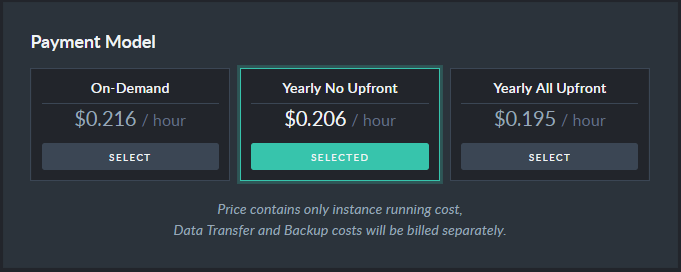

import Admonition from '@theme/Admonition';
import Tabs from '@theme/Tabs';
import TabItem from '@theme/TabItem';
import CodeBlock from '@theme/CodeBlock';
import LanguageSwitcher from "@site/src/components/LanguageSwitcher";
import LanguageContent from "@site/src/components/LanguageContent";

# Cloud: Pricing, Payment and Billing

<Admonition type="note" title="">

You can run a product and pay for it using a credit card or a wire transfer (we require that you provide valid credit card 
details in any case). You can pay per minute without any commitment, or use one of the yearly-payment models for a substantial discount.  

* In this page:  
  * [Pricing](../cloud/cloud-pricing-payment-billing.mdx#pricing)  
     - [On-Demand Payment](../cloud/cloud-pricing-payment-billing.mdx#on-demand-payment)  
     - [Yearly with NO Upfront payment](../cloud/cloud-pricing-payment-billing.mdx#yearly-with-no-upfront-payment)  
     - [Yearly WITH an Upfront payment](../cloud/cloud-pricing-payment-billing.mdx#yearly-with-an-upfront-payment)  
     - [Viewing your current configuration price](../cloud/cloud-pricing-payment-billing.mdx#viewing-current-configuration-price)  
     - [Additional Expenses](../cloud/cloud-pricing-payment-billing.mdx#additional-expenses)  
  * [Payment](../cloud/cloud-pricing-payment-billing.mdx#payment)  
  * [Billing](../cloud/cloud-pricing-payment-billing.mdx#billing)  
    - [Charging Failures](../cloud/cloud-pricing-payment-billing.mdx#charging-failures)  
    - [Pay Now](../cloud/cloud-pricing-payment-billing.mdx#pay-now)  

</Admonition>

<Admonition type="warning" title="">
Prices and fees in screenshots that appear in this documentation are **for illustration only**.  
Your actual pricing is determined by the cloud provider, selected region, and the contract that your account is using.  
</Admonition>
## Pricing

You can pay for your instances by one of three models:  

* **On-Demand Payment**  
* **Yearly with _no_ Upfront payment**  
* **Yearly _with_ an Upfront payment**  
#### On-Demand Payment  

The on-demand model lets you pay for your instance **by the minute**, and come and go as you please.  
We will measure your instance run-time **from rising to termination**, and charge you with **minute granularity**.  

You may find this model useful if you look for flexibility.  You are not tied to a particular configuration 
and are free to shift between configurations at will. 

<Admonition type="note" title="">
We charge on-demand **by the minute**, with a **minimum limit of one hour**.  
If you run an instance for 93 minutes, you will pay for exactly 93 minutes.  
If you run it for less than an hour, say 42 minutes, you will still be charged for a full hour worth to match the minimum limit.  
</Admonition>
#### Yearly Payment  

We offer two models of yearly payments: **Yearly with no upfront payment**, and **Yearly with an upfront payment**.  
Both grant you discounts in relation to the on-demand model.  

**Be aware** however that once a yearly contract has been activated, it is charged fully to the end of the contract 
and cannot be revoked, halted or changed.  

<Admonition type="note" title="">

* Terminating a product you've been paying for yearly, will **not** stop your monthly payments.  
  
* Upscaling or downscaling a product you're paying for yearly, will **not** revoke the yearly agreement.  
  Expenses for the new product will be calculated according to its on-demand fee and charged-for separately.  

* **Adding nodes to an existing cluster** with a yearly contract, however, does **not** incur additional expenses 
  beyond the cost of running the new nodes.  

</Admonition>
#### Yearly with NO upfront payment  
Committing for a year and **paying monthly**, grants you a **5% discount** off the running cost.  

#### Yearly WITH an upfront payment  
Committing for a year and **paying for it all in advance**, grants you a **10% discount** off the running cost.  

<Admonition type="note" title="">
Yearly contracts are relevant only for [production products](../cloud/cloud-instances.mdx#a-production-cloud-cluster).  
[Development products](../cloud/cloud-instances.mdx#a-development-cloud-server) can only use the on-demand model.  
</Admonition>
#### Viewing current configuration price  
While [provisioning or editing](../cloud/portal/cloud-portal-products-tab.mdx) your product, 
costs are shown in the **Your Order** slot.  

The overall price is an outcome of your hardware configuration and pricing model, 
with possible [additional expenses](../cloud/cloud-pricing-payment-billing.mdx#additional-expenses).  

See for example the price differences between the production basic-grade configurations PB10 and PB20:  

* Production Basic 10:  
    

* Production Basic 20:  
    
  
You will also be able to find your products' costs in the [Billing & Costs tab](../cloud/portal/cloud-portal-billing-tab.mdx).  
#### Additional Expenses

Your pricing model does **not** cover incidental expenses over -  

* **Data Transfer**  
  Charges over traffic to and from your instances will be added to your basic pricing plan.  

* **Expanding your Disk Storage**  
  When the disk space allocated for your product is 90% full, we will expand it to avoid running out of storage.  
  Your payment plan will be updated to reflect the new storage size.  
    <Admonition type="note" title="">
     Deleting files to reduce storage usage after the storage has been expanded will **not** revoke the expansion.  
    </Admonition>

* **Backup Storage**  
  Your RavenDB Cloud runs automatic backups on a regular schedule.  
  Depending on your retention settings, you may be charged for highly available storage of your backups.  
    <Admonition type="note" title="">
     Your plan includes a 1GB / month backup storage. 
    </Admonition>

## Payment

You can currently pay by credit card or wire transfer.  
#### Credit Card  
You can provide your credit card details while creating your account, or skip this stage and return to it later.  
To provide your credit card details at any time, enter your [Account tab](../cloud/portal/cloud-portal-account-tab.mdx) 
and click the Add Credit Card button.  
Select your main credit card using the **Active** button, so we know which card to try first.  
If charging your active card fails, we'll try to charge other cards you may have provided.  

#### Wire Transfer / Purchase Order
Approach our Support personnel to use wire transfer or purchase order.

## Billing

Your Portal's [Billing & Costs tab](../cloud/portal/cloud-portal-billing-tab.mdx) summarizes your 
outstanding charges and past invoices. Additional data you can see there includes Daily cost, Total 
cost, and the expected charge at the end of this month.  
#### Charging failures  
If we fail to charge your account using the payment method you provided, we'll notify
you and retry for 5 days. Failure to pay after that period may result in account closure.
Here's an example of the notification sent to the owner and all cloud account managers:

#### Pay Now 

The `Pay Now` button becomes visible on your Billing tab dashboard once there are any unpaid costs from previous billing cycle(s).

<Admonition type="info" title="">
After a failed charge attempt, another attempt can be made after **60** minutes.
</Admonition>

If you have resolved the issue associated with the charge failure (e.g., updated payment information), you can manually initiate the payment by clicking the `Pay Now` button.
Upon clicking the `Pay Now` button, the system will process the payment for all outstanding amounts up to the end of the previous billing cycle. If the payment process fails, you will be notified again by email.

#### Billing Cycle and Date Range 

The `Pay Now` feature covers all unpaid costs up to the end of the previous billing cycle.
It does not cover costs incurred in the current billing cycle.

<Admonition type="note" title="">
#### Example
If you have unpaid costs from 13/12/2023 and today is 01/03/2024, using the `Pay Now` feature will bill you for the period from **13/12/2023** up to **27/02/2024**.
</Admonition>

#### Notifications

  If the payment fails, you will receive an email notification with the details and possible reasons for the failure.

<Admonition type="info" title="">

Ensure that your payment information is up-to-date to avoid repeated charge failures.

Contact support if you encounter any issues while using the `Pay Now` feature.

</Admonition>

