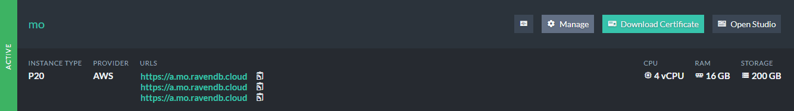
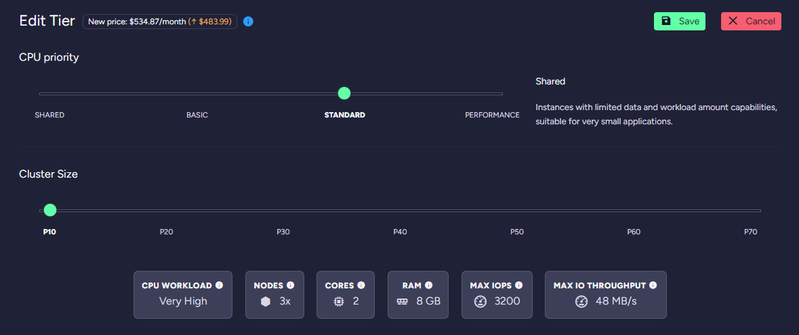
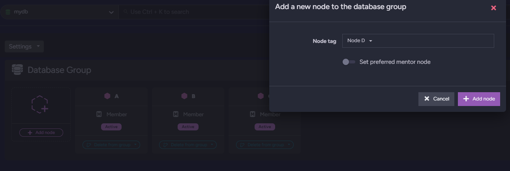

import Admonition from '@theme/Admonition';
import Tabs from '@theme/Tabs';
import TabItem from '@theme/TabItem';
import CodeBlock from '@theme/CodeBlock';
import LanguageSwitcher from "@site/src/components/LanguageSwitcher";
import LanguageContent from "@site/src/components/LanguageContent";

# Cloud: Scaling
<Admonition type="note" title="Note">

After a RavenDB [Cloud instance](../cloud/cloud-instances) has been set up, you can **scale it** up and down to modify the 
workload it can handle.   

Instances of the [Development Tier](../cloud/cloud-instances#a-development-cloud-server) and [Production Tier](../cloud/cloud-instances#a-production-cloud-cluster) can be scaled up or down **within their own Tier**.
Instance cannot be moved between Tiers, but data can be [migrated](cloud-migration) between any
two RavenDB instances using:   
- [Import/Export](cloud-migration#import-from-live-ravendb-instance)  
- Restoring from [Backup](cloud-backup-and-restore#restore-mandatory-backup-files)  
- [Replication](https://ravendb.net/docs/article-page/6.0/csharp/studio/database/tasks/ongoing-tasks/external-replication-task)

* In this page:  
  * [Scaling Up/Down - General](../cloud/cloud-scaling#scaling-up/down---general)  
     - [Change instance type](../cloud/cloud-scaling#scaling---change-instance-type)  
     - [Change storage](../cloud/cloud-scaling#scaling---change-storage)  
  * [Additional product nodes - General](#additional-product-nodes---general)
     - [Adding a node to a database group](#additional-product-nodes---adding-a-node-to-a-database-group)

</Admonition>
## Scaling Up/Down - General

To scale a RavenDB Cloud instance, open your [portal](../cloud/portal/cloud-portal)'s [Products tab](../cloud/portal/cloud-portal-products-tab) 
and click the **Manage** button for the product you want to change.

In the main section, you can find controls to **Change Instance Type** or **Change Storage**.  

<Admonition type="note" title="Note">
The scaling buttons are presented only for [Development](../cloud/cloud-instances#a-development-cloud-server) and 
[Production](../cloud/cloud-instances#a-production-cloud-cluster) products.  
The [Free](../cloud/cloud-instances#a-free-cloud-node) product doesn't show them because its Tier includes only one configuration.  
</Admonition>

**1.** Click [Change Instance Type](../cloud/cloud-scaling#scaling---change-instance-type) to reconfigure your product.  
**2.** Click [Change Storage](../cloud/cloud-scaling#scaling---change-storage) to modify your product's storage parameters.  

<Admonition type="info" title="Info">
Scaling a [Development](../cloud/cloud-instances#a-development-cloud-server) product **brings it down**
temporarily, while its single-node instance is being reconfigured.  
Scaling a [Production](../cloud/cloud-instances#a-production-cloud-cluster) product does **not** bring it down,
because it is a multi-node cluster and the nodes are updated in a **rolling update** - one node at a time.  
</Admonition>

<Admonition type="warning" title="Warning">
Instances have *IO limits* (**IOPS** and **Throughput**) and it may impact the Disk performance.

In the figure above, the **Disk Throughput** parameter is lower than the **Instance Throughput**.
To avoid IO throttling by the instance type, make sure to use an instance type able to fully utilize your disk capabilities.
</Admonition>

## Scaling - Change Instance Type

Use the **CPU Priority** and **Cluster Size** slide bars to compose a configuration 
that would allow your product to properly handle its expected workload.  

You can upscale or downscale only within the current Product Tier. The *Development* Tier **Dev30** configuration,
for example, can upscale to **Dev50**, but not to the Production Tier **PB10** configuration.  
Your databases and data will be automatically migrated into your new configuration.

## Scaling - Change Storage 

There are two types of storage: **Standard** and **Premium**. They differ significantly in capabilities and customization options 
depending on the cloud provider in question. Pick either to change your current storage capacity.  

### AWS Disks

#### AWS Standard & Premium - Default Performance

The performance of **Standard** Disks is always the same, regardless of Disk size.
The parameters are **3000 IOPS** and **125 MB/s** of **Throughput**.

For **Premium** Disks, the **IOPS** parameter is set to **500** by default. The **Throughput** parameter is based on the number of IOPS you have with the maximum of 4000MB/s.
#### AWS Premium - IOPS customization

The **Premium** Disk type on **AWS** lets you choose the number of **IOPS** (Input/Output Operations Per Second) that the instance can handle.

<Admonition type="info" title="Info">
The cost per IOPS is dependent on the selected region.
</Admonition>
### Azure Disks

#### Azure Standard & Premium - Default Performance

The performance of **Standard** Disks is always the same, regardless of Disk size.
The parameters are **500 IOPS** and **60 MB/s** of **Throughput**.

The performance of **Premium** Disks increases with their size.

For more details please visit the [Pricing page](https://cloud.ravendb.net/pricing).
#### Azure Premium - Azure Performance Tier customization

To handle events that temporarily require higher 
level of performance, the **Premium** Disk type on **Azure** lets you use a higher *Performance Tier* for as
long as you need it. This feature allows you to increase the disk performance without increasing the disk size. 
You can then return to the original Tier when you no longer need the additional performance. 

<Admonition type="info" title="Info">
The cost of running on a higher *Performance Tier* is the same as
running on a Disk of size for which a given *Performance Tier* is the
default one.
</Admonition>
### GCP Disks

<Admonition type="info" title="Info">
**GCP** offers only **Premium** Disk type.
</Admonition>

## Additional product nodes - General
The *Production Tier* products can be expanded by adding *additional nodes* to the cluster.

<Admonition type="info" title="Info">
This option **is not available** for **PS** instance types.  
The maximum number of additional nodes that can be added equals **3**.  
Nodes *A*, *B*, *C* **cannot be removed**.  
</Admonition>

<Admonition type="warning" title="Warning">
The process of adding a new node **does not guarantee** that the node will be distributed in separated *Availability Zone*.
</Admonition>

## Additional product nodes - Adding a node to a database group
The new product node **does not belong to any database group**. The User should do this *manually* by adding the new node to the database group.  
This operation is described [here](https://ravendb.net/docs/article-page/latest/csharp/studio/database/settings/manage-database-group#database-group-topology---add-new-node).

