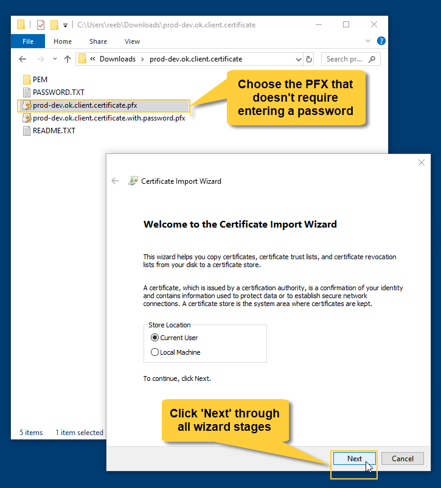
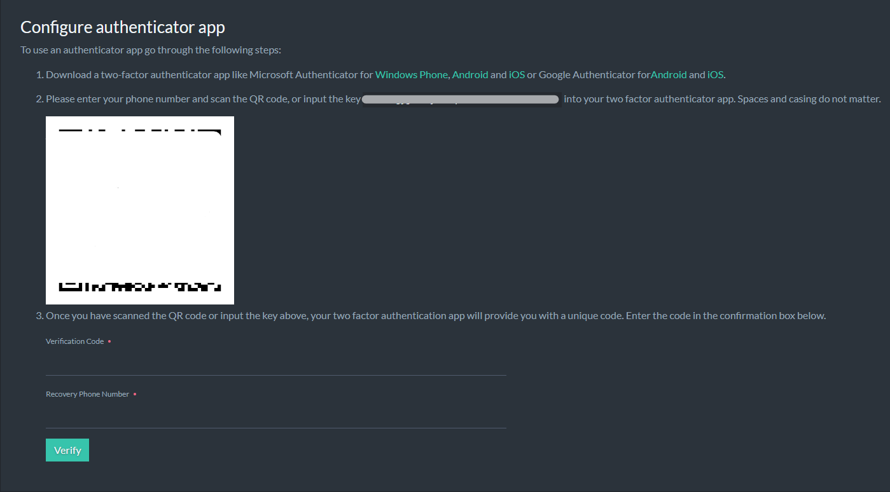

import Admonition from '@theme/Admonition';
import Tabs from '@theme/Tabs';
import TabItem from '@theme/TabItem';
import CodeBlock from '@theme/CodeBlock';
import LanguageSwitcher from "@site/src/components/LanguageSwitcher";
import LanguageContent from "@site/src/components/LanguageContent";

# Cloud: Security
<Admonition type="note" title="">

RavenDB cloud products use several layers of security.  

* All instances are encrypted using HTTPS and TLS protocol version 1.2 or 1.3.  

* Servers and client applications authenticate each other using X.509 certificates.  
  <Admonition type="info" title="">
  Note that a RavenDB cloud product **comes with an initial client certificate**.  
  You need this certificate in order to access your RavenDB instances.  
  </Admonition>

* You can choose [which IP addresses](../cloud/portal/cloud-portal-products-tab.mdx#manage-product-the-security-tab) your server can be contacted by.  

* Your [mandatory backup](../cloud/cloud-backup-and-restore.mdx#the-mandatory-backup-routine) routines produce encrypted backup files.  

* In this page:  
    * [Using The Initial Client Certificate](cloud-security#using-the-initial-client-certificate)  
    * [Using Additional Certificates](cloud-security#using-additional-certificates)  
    * [Enable MFA](../cloud/cloud-security.mdx#enable-mfa)

</Admonition>
## Using The Initial Client Certificate

A client certificate is automatically generated during the creation of your RavenDB cloud product.  
You will need to import this certificate to your browser in order to access your cloud instances.  
#### Download Certificate  

Go to the [Products tab](../cloud/portal/cloud-portal-products-tab.mdx) in the cloud [portal](../cloud/portal/cloud-portal.mdx) 
and click the **Download Certificate** button.  

  
#### Install the certificate  

Extract the certificate package, open the extracted files' folder, and double-click the **.pfx** file that requires no password.  
When the certificate import wizard is launched, click "Next" all the way through the wizard.  

  
#### Access your product  

To access your product your IP address must be added to the `Allowed IPs` list.
Allowed IPs entries are [CIDR ranges](https://en.wikipedia.org/wiki/Classless_Inter-Domain_Routing#CIDR_notation) 
that define networks from which the connection is allowed.

- You can set **Allowed IPs** to `0.0.0.0/0`, which would allow access from any location, or you can specify certain IPs
  or IP ranges.
- Be aware that you will not be able to access your instance from locations that are not specified in the allowed IPs
  list.
- You can **edit the list at any time** through the Portal.
- Regardless of the allowed IPs setting, your RavenDB Cloud **instances will always require authentication** using X.509
  certificates for access. The allowed IPs list serves as an additional layer of security, but isn't the only one.

<Admonition type="warning" title="">
Azure products **do not permit** overlapping of addresses in the Allowed IPs list.  
If addresses in your list overlap, an error is going to be displayed upon product creation. E.g. -

    - Listing both 13.64.151.161/32 and 13.74.249.156/32 is **not permitted**.
    - Listing 0.0.0.0/0 and any other address is **not permitted**.
    - Listing both 51.140.148.192/27 and 13.74.249.156/32 **is permitted**.  

</Admonition>

<Admonition type="note" title="">
Cross-instance communication **inside the cluster** is **not** subject to these restrictions.
</Admonition>

If you're using Chrome on Windows, you will now be able to access your RavenDB cloud instance. You may need to restart your browser.  
In other cases (e.g. if you're using Firefox) you will have to import the certificate to your browser manually.  

  
  
Once the certificate is imported, click your cloud instance's URL.  
Your browser will prompt you to select a certificate. When you select the client certificate, your product's 
[management studio](../7.1/studio/overview) will launch.  

## Using Additional Certificates

Your initial [operator-level](../7.1/server/security/authorization/security-clearance-and-permissions#operator) 
certificate allows you to perform operations like creating and deleting databases, managing access to the cluster, and inspecting the cluster's state.  
Operations like adding and removing cluster nodes are left for your [products administrators](../cloud/cloud-overview.mdx#ravendb-on-the-cloud-overview).  

<Admonition type="info" title="">
We recommend that you generate and use **different certificates** for your client applications, for maximum security.  
</Admonition>

<Admonition type="info" title="">
If your instance runs on a [burstable CPU](../cloud/cloud-overview.mdx#burstable-vs-reserved-clusters), especially if it is a low-end one, 
RavenDB may take a while to generate certificates and spend a lot of your [CPU credits](../cloud/cloud-overview.mdx#budget-credits-and-throttling) in the 
process.  
We therefore recommend that you generate your certificates off-cloud and import them to your cloud instance.  
</Admonition>

**To generate additional [operator](../7.1/server/security/authorization/security-clearance-and-permissions#operator) 
  or [user](../7.1/server/security/authorization/security-clearance-and-permissions#user) certificates**:  
 
* Go to the server management studio, and click the `Manage Certificates` button.  
    
* Click **Generate client certificate**  
    

## Enable MFA

Multi-Factor Authentication (MFA) enhances account security by requiring multiple forms of verification.
MFA significantly reduces the risk of unauthorized access, even if email account credentials are compromised.

Components of Multi-Factor Authentication:

* Authenticator Application: This involves using a mobile app to generate one-time codes for login verification. These
  codes are time-sensitive and provide an additional layer of security beyond passwords.
* Recovery Codes: Recovery codes are pre-generated, single-use codes that users can use to access their accounts if they
  lose access to their primary authentication methods. It's crucial to store these codes securely in case they are
  needed for account recovery.
* Recovery Phone Number: Adding a recovery phone number provides an additional method for account recovery. In case of
  access issues. Support request needs to be made in order to use this method.

By utilizing these components of MFA, users can significantly enhance the security of their accounts and mitigate the
risk of unauthorized access.

To enable Multi-Factor Authentication either visit
the [enable-authenticator](https://cloud.ravendb.net/portal/profile/enable-authenticator) page
or open your RavenDB Cloud [Profile](https://cloud.ravendb.net/portal/profile) page and click the **Add authenticator
app** button.

This will take you to the configuration page.

- Scan the provided QR code or enter the provided text code into an authentication app of your choice.
- Type in the 2FA code generated by your authentication app.
- Type in a recovery phone number.

After verifying, you will be provided with recovery codes. Save them in a secure place.

MFA is now enabled on your account.

