import Admonition from '@theme/Admonition';
import Tabs from '@theme/Tabs';
import TabItem from '@theme/TabItem';
import CodeBlock from '@theme/CodeBlock';
import LanguageSwitcher from "@site/src/components/LanguageSwitcher";
import LanguageContent from "@site/src/components/LanguageContent";

# Cloud: Security
<Admonition type="note" title="">

*RavenDB Cloud* products use several layers of security. All instances are encrypted using *HTTPS* and *TLS* protocol version *1.2* or *1.3*. Servers and client applications authenticate each other using *X.509* certificates.

* In this page:
    * [Using the initial client certificate](cloud-security#using-the-initial-client-certificate)  
    * [Managing allowed IPs](cloud-security#managing-allowed-ips)  
    * [Using additional certificates](cloud-security#using-additional-certificates)  
    * [MFA](../cloud/cloud-security.mdx#mfa)
       - [Enable MFA](../cloud/cloud-security#enable-mfa)  
       - [Recovery codes and phone number](../cloud/cloud-security#recovery-codes-and-phone-number)  
       - [Disable MFA](../cloud/cloud-security#disable-mfa)  
       - [MFA for SSO users](../cloud/cloud-security#mfa-for-sso-users)  

</Admonition>

## Using the initial client certificate

A client certificate is automatically generated during the creation of your RavenDB cloud product.  
You will need to import this certificate to your browser in order to access your cloud instances.  
  
<Admonition type="info" title="">
Expiration for client certificates is set to **5** years by default.  
The certificate will be automatically regenerated **30 days** before its expiration date.  
**RavenDB Cloud** will notify you by email **60 days** before regeneration.
</Admonition>

#### Download certificate  

Go to the [Products tab](../cloud/portal/cloud-portal-products-tab.mdx) in the cloud [portal](../cloud/portal/cloud-portal.mdx) 
and click the **Download Certificate** button.  

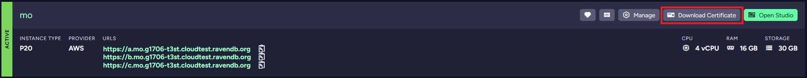  
#### Install the certificate  

Extract the certificate package, open the extracted files' folder, and double-click the **.pfx** file that requires no password.  
When the certificate import wizard is launched, click "Next" all the way through the wizard.  

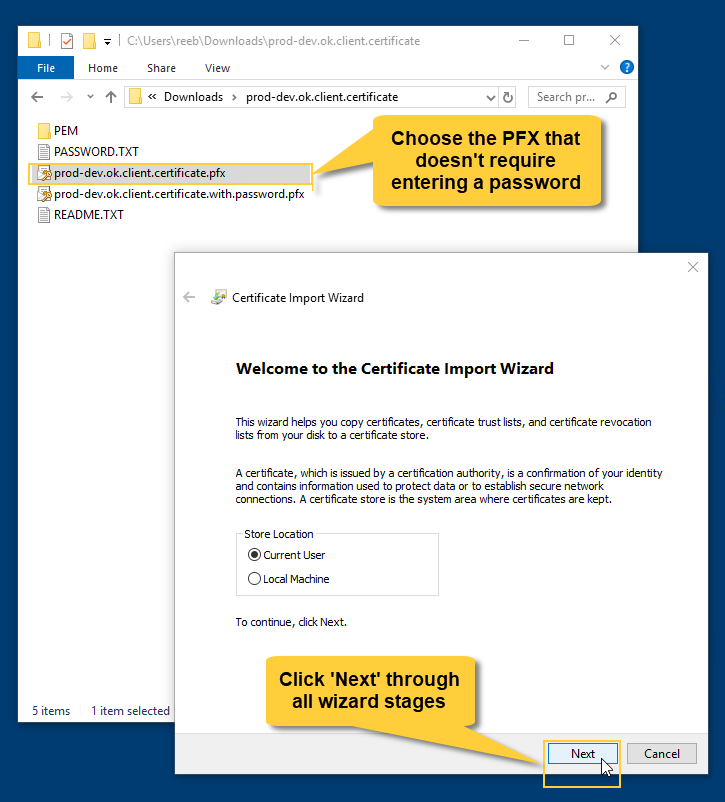  
#### Access your product  

If you're using Chrome on Windows, you will now be able to access your *RavenDB Cloud* instance. You may need to restart your browser.  
In other cases (e.g. if you're using Firefox) you will have to import the certificate to your browser manually.  

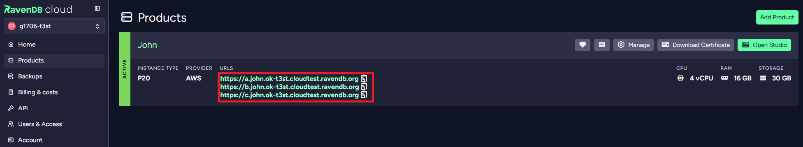  
  
Once the certificate is imported, please make sure your IP address is on the [allowed IPs list](#managing-allowed-ips) and then click your cloud instance's URL. 
Your browser will prompt you to select a certificate. When you select the client certificate, your product's
[management studio](../7.2/studio/overview) will launch.

## Managing allowed IPs

<Admonition type="note" title="Permissions">
Managing client certificates and the **Allowed IPs** list from the Cloud Portal requires [**Security admin** access](./cloud-account.mdx#permission-presets) to the product (the Account Owner always has full access).
</Admonition>

To access your product your IP address must be added to the `Allowed IPs` list.
Allowed IPs entries are [CIDR ranges](https://en.wikipedia.org/wiki/Classless_Inter-Domain_Routing#CIDR_notation) 
that define networks from which the connection is allowed.

- You can set **Allowed IPs** to `0.0.0.0/0`, which would allow access from any location, or you can specify certain IPs
  or IP ranges.
- Be aware that you will not be able to access your instance from locations that are not specified in the allowed IPs
  list.
- You can **edit the list at any time** through the Cloud Portal.
- Regardless of the allowed IPs setting, your RavenDB Cloud **instances will always require authentication** using X.509
  certificates for access. The allowed IPs list serves as an additional layer of security, but isn't the only one.

<Admonition type="warning" title="">
Azure products **do not permit** overlapping of addresses in the Allowed IPs list.  
If addresses in your list overlap, an error is going to be displayed upon product creation. E.g. -

    - Listing both 13.64.151.161/32 and 13.74.249.156/32 is **not permitted**.
    - Listing 0.0.0.0/0 and any other address is **not permitted**.
    - Listing both 51.140.148.192/27 and 13.74.249.156/32 **is permitted**.  

</Admonition>

<Admonition type="note" title="">
Cross-instance communication **inside the cluster** is **not** subject to these restrictions.
</Admonition>

## Using additional certificates

Your initial [operator-level](../7.2/server/security/authorization/security-clearance-and-permissions#operator)
certificate allows you to perform operations like creating and deleting databases, managing access to the cluster, and inspecting the cluster's state.
Operations like adding and removing cluster nodes are left for your [products administrators](../cloud/cloud-overview.mdx#ravendb-on-the-cloud).  

<Admonition type="info" title="">
We recommend that you generate and use **different certificates** for your client applications, for maximum security.  
</Admonition>

<Admonition type="info" title="">
If your instance runs on a [burstable CPU](../cloud/cloud-overview.mdx#burstable-vs-reserved-clusters), especially if it is a low-end one, 
RavenDB may take a while to generate certificates and spend a lot of your [CPU credits](../cloud/cloud-overview.mdx#budget-credits-and-throttling) in the 
process.  
We therefore recommend that you generate your certificates off-cloud and import them to your cloud instance.  
</Admonition>

**To generate additional [operator](../7.2/server/security/authorization/security-clearance-and-permissions#operator)
  or [user](../7.2/server/security/authorization/security-clearance-and-permissions#user) certificates**:
 
* Go to the server management studio, and click the `Manage Certificates` button.  
  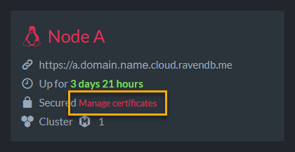  
* Click **Generate client certificate**  
  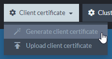  

## MFA

Multi-Factor Authentication (MFA) enhances account security by requiring multiple forms of verification.
MFA significantly reduces the risk of unauthorized access, even if email account credentials are compromised.

Components of Multi-Factor Authentication:

* Authenticator Application: This involves using a mobile app to generate one-time codes for login verification. These
  codes are time-sensitive and provide an additional layer of security beyond passwords.
* Recovery Codes: Recovery codes are pre-generated, single-use codes that users can use to access their accounts if they
  lose access to their primary authentication methods. It's crucial to store these codes securely in case they are
  needed for account recovery.
* Recovery Phone Number: Adding a recovery phone number provides an additional method for account recovery. In case of
  access issues. Support request needs to be made in order to use this method.

By utilizing these components of MFA, users can significantly enhance the security of their accounts and mitigate the
risk of unauthorized access.

MFA is managed on the **Security** page of your profile: open the profile menu at the bottom of the
[Portal sidebar](../cloud/portal/cloud-portal.mdx#profile) and select **Security**, or go to
[https://cloud.ravendb.net/portal/profile/security](https://cloud.ravendb.net/portal/profile/security).

### Enable MFA

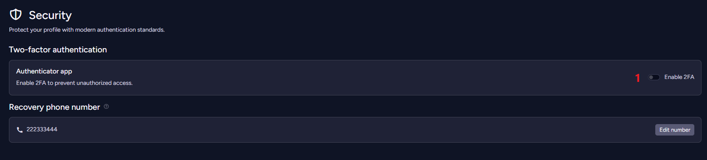

1. In the **Authenticator app** card, turn on the **Enable 2FA** switch.
2. *Only if you have no recovery phone number yet:* the *Set your recovery phone number* dialog opens
   first. Enter your number and click **Next**.

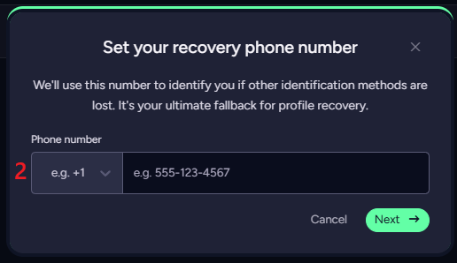

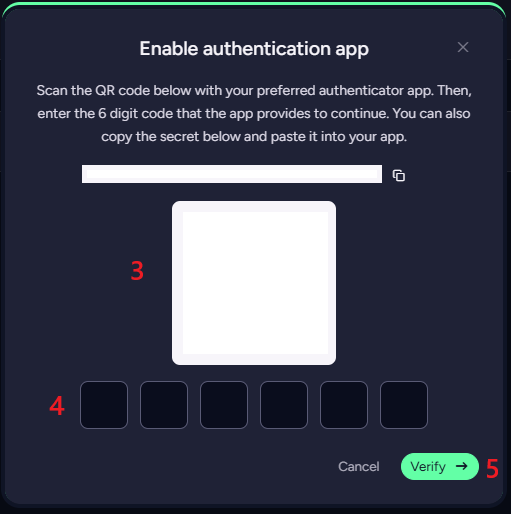

3. Scan the QR code with an authenticator app of your choice, or copy the secret and paste it into the app.
4. Enter the 6-digit code that the app generates.
5. Click **Verify**.

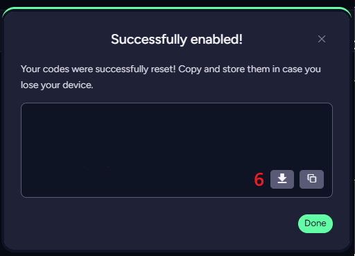

6. Save the 10 recovery codes in a secure place — download them as a file or copy them — and click **Done**.

MFA is now enabled on your account.

### Recovery codes and phone number

While MFA is on, the **Recovery codes** card on the Security page tracks your unused recovery codes.
Each code works once.

* When **3 or fewer** codes are left, the card shows a warning. With **none** left, you can no longer
  sign in with a recovery code.
* Click **Reset recovery codes** to create a new set. Your old codes stop working as soon as the new ones
  are created.

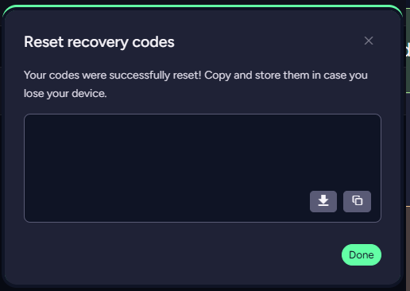

The **Recovery phone number** section shows your number, with **Add number** or **Edit number** to set it.
The phone number is the last-resort way to identify you if all other security methods are lost; using
it requires a [Support](../cloud/cloud-support.mdx) request.

If you selected **Remember me** when you last signed in with a 2FA code, a **Forget this browser** link
appears on the Security page. Click it to be asked for a code again at your next sign-in from this
browser.

### Disable MFA

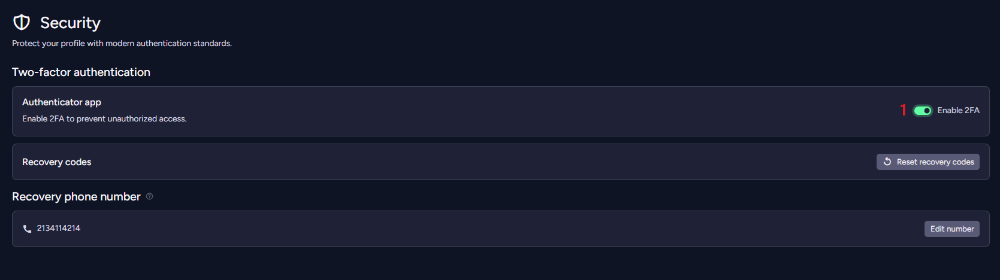

1. In the **Authenticator app** card, turn off the **Enable 2FA** switch.

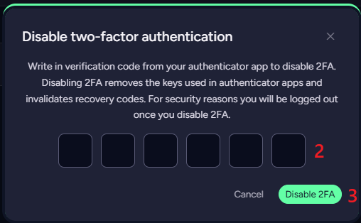

2. In the **Disable two-factor authentication** dialog, type the code generated by your authenticator app.
3. Click **Disable 2FA**.

Disabling MFA removes the keys used by your authenticator app and invalidates your recovery codes.

<Admonition type="info" title="">
For security reasons you will be logged out once you disable 2FA. The login page then shows
*Two-factor authentication is off. Sign in again to continue.*
</Admonition>

### MFA for SSO users

Users who sign in through [External SSO](../cloud/cloud-sso.mdx) cannot turn on RavenDB Cloud 2FA.
Their Security page shows a *Managed by your identity provider* badge instead of the **Enable 2FA**
switch: multi-factor authentication for them is configured and enforced at your organization's
identity provider.
