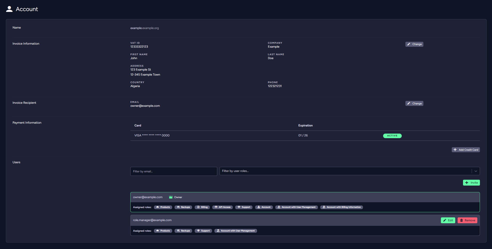
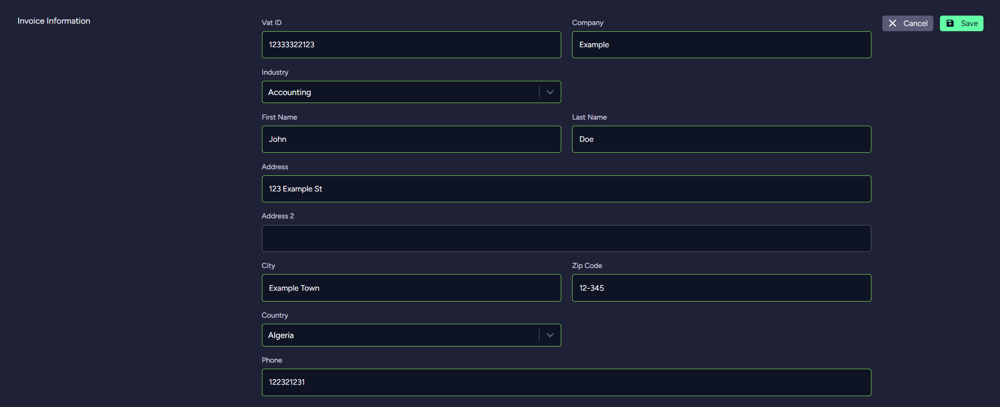
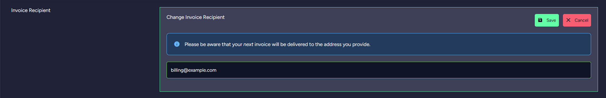
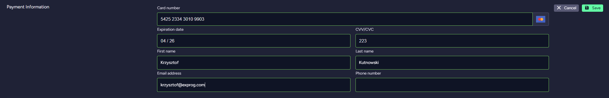

import Admonition from '@theme/Admonition';
import Tabs from '@theme/Tabs';
import TabItem from '@theme/TabItem';
import CodeBlock from '@theme/CodeBlock';
import LanguageSwitcher from "@site/src/components/LanguageSwitcher";
import LanguageContent from "@site/src/components/LanguageContent";

# Cloud Portal: The Account Tab

<Admonition type="note" title="">

This tab allows you to manage your account and payment information. 

* In this page:  
   * [The Account Tab](../../cloud/portal/cloud-portal-account-tab.mdx#the-account-tab)  
        * [Billing information management](../../cloud/portal/cloud-portal-account-tab.mdx#billing-information-management)  
</Admonition>
## The Account Tab

    

### Billing information management

In this section you can edit the data that will be used for the invoice.

In this section you can edit the email address to which invoices will be sent.  
If a custom recipient email is not provided, the invoice is sent to the *account owner*.

In this section you can manage payment cards that will be used to pay for RavenDB Cloud services.  
You can add, remove or change the default credit card.

### User management

Managing account users — inviting or removing members, assigning their [account roles](../../cloud/cloud-account.mdx#account-roles), and managing their [per-product permissions](../../cloud/cloud-account.mdx#product-permissions) — is now done from the dedicated [Users & Access](../../cloud/portal/cloud-portal-users-and-access-tab.mdx) page.
