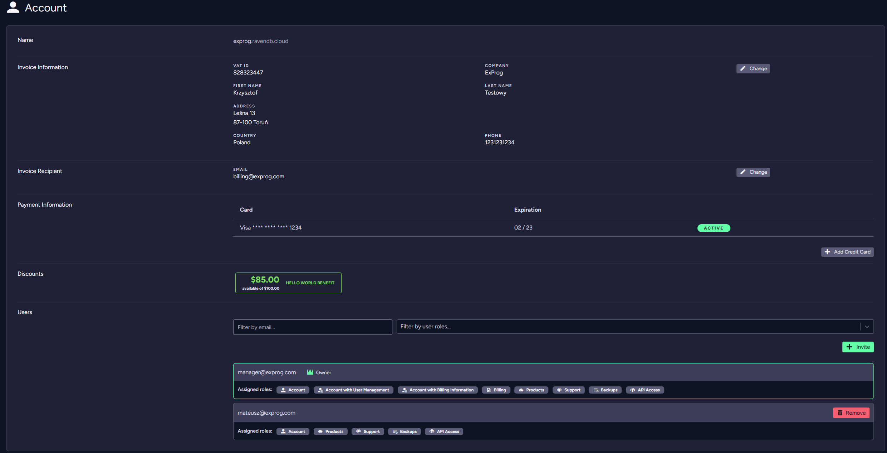
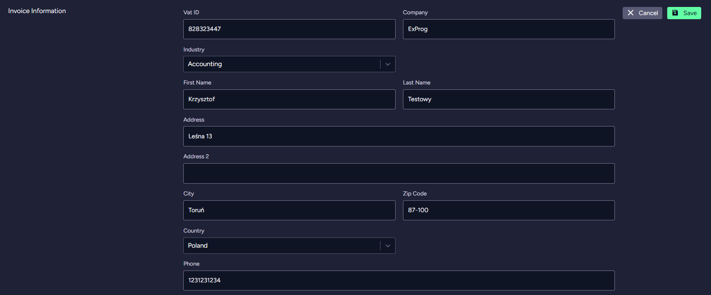
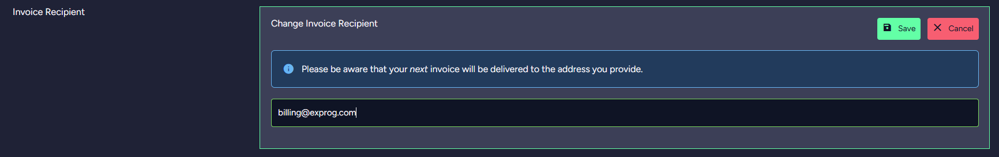
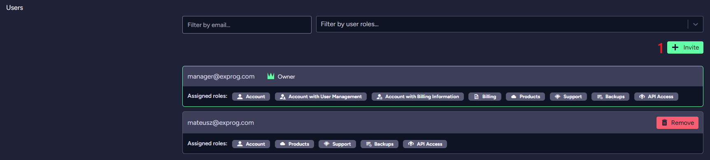
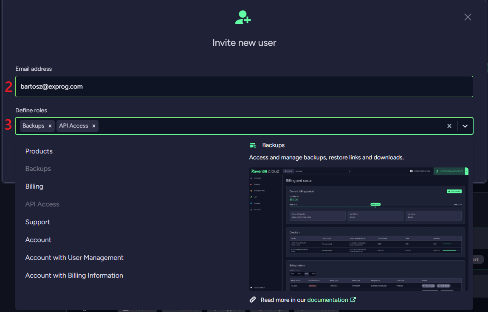
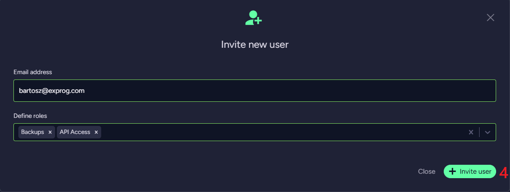
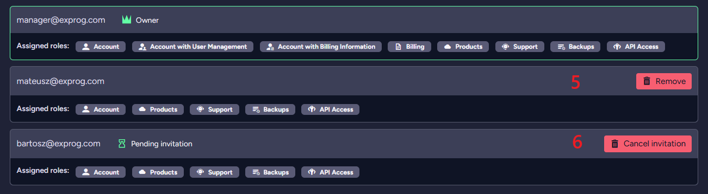

import Admonition from '@theme/Admonition';
import Tabs from '@theme/Tabs';
import TabItem from '@theme/TabItem';
import CodeBlock from '@theme/CodeBlock';
import LanguageSwitcher from "@site/src/components/LanguageSwitcher";
import LanguageContent from "@site/src/components/LanguageContent";

# Cloud Portal: The Account Tab

<Admonition type="note" title="">

This tab allows you to manage your account and payment information, user access, and user roles. 

* In this page:  
   * [The Account Tab](../../cloud/portal/cloud-portal-account-tab.mdx#the-account-tab)  
        * [Billing information management](../../cloud/portal/cloud-portal-account-tab.mdx#billing-information-management)  
		* [User management](../../cloud/portal/cloud-portal-account-tab.mdx#user-management)
</Admonition>
## The Account Tab

    

### Billing information management

In this section you can edit the data that will be used for the invoice.

In this section you can edit the email address to which invoices will be sent.  
If a custom recipient email is not provided, the invoice is sent to the *account owner*.

In this section you can manage payment cards that will be used to pay for RavenDB Cloud services.  
You can add, remove or change the default credit card.

### User management  

In this section, you can manage all users on your account.  
You can add or remove new users with selected roles.

You can read more about *account roles* in the [Account](../../cloud/cloud-account.mdx#account-roles) page. 

   **1**. To add a new user, click the **Invite** button.

   **2**. Provide an *email address*.  
   **3**. Select *account roles* for the new user.  

   **4**. Submit the invitation.  
   

   **5**. Click the **Remove** button to remove the user from the account.     
   **6**. Click the **Cancel invitation** button to remove the invitation. 

