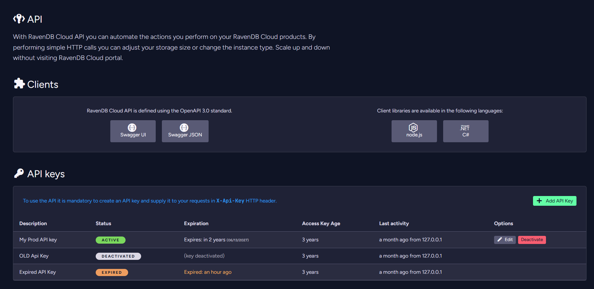
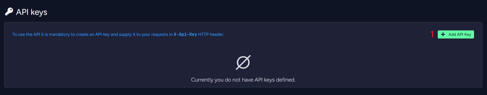
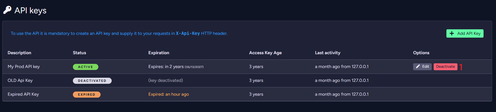

import Admonition from '@theme/Admonition';
import Tabs from '@theme/Tabs';
import TabItem from '@theme/TabItem';
import CodeBlock from '@theme/CodeBlock';
import LanguageSwitcher from "@site/src/components/LanguageSwitcher";
import LanguageContent from "@site/src/components/LanguageContent";

# Cloud Portal: The API Tab

<Admonition type="note" title="Note">

The RavenDB Cloud API allows you to automate actions on your RavenDB Cloud products. By making simple HTTP calls, you can adjust your storage size or change the instance type. Scale up or down without visiting the RavenDB Cloud portal.

* In this page:
  * [The API Tab](../../cloud/portal/cloud-portal-api-tab#the-api-tab)
      * [Create API Key](../../cloud/portal/cloud-portal-api-tab#create-api-key)
      * [Edit API Key](../../cloud/portal/cloud-portal-api-tab#edit-api-key)
      * [Deactivate API Key](../../cloud/portal/cloud-portal-api-tab#deactivate-api-key)
</Admonition>
## The API Tab

You can read more about the *RavenDB Cloud API* in the [API](../../cloud/cloud-api) page.
### Create API Key

**1**. Click the *Add API Key* button.  

**2**. Enter an API Key description.  
**3**. Select an API Key expiration date.  
**4**. Click the *Create* button.

**5**. Copy your API Key.  
**6**. Click the *Close* button.
### Edit API Key

**1**. Click the *Edit* button.

**2**. Enter an API Key description.  
**3**. Select an API Key expiration date.  
**4**. Click the *Save* button.
### Deactivate API Key

**1**. Click the *Deactivate* button.

**2**. Click the *Deactivate* button.

