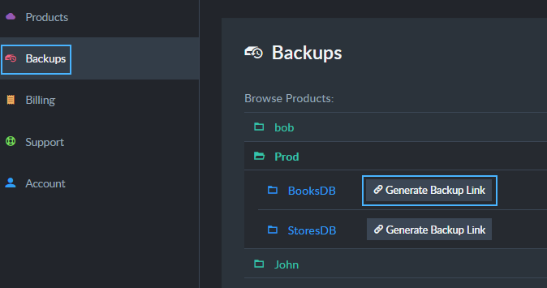

import Admonition from '@theme/Admonition';
import Tabs from '@theme/Tabs';
import TabItem from '@theme/TabItem';
import CodeBlock from '@theme/CodeBlock';
import LanguageSwitcher from "@site/src/components/LanguageSwitcher";
import LanguageContent from "@site/src/components/LanguageContent";

# Cloud Portal: The Backups Tab

<Admonition type="note" title="Note">

Your RavenDB cloud products run [a mandatory backup routine](../../cloud/cloud-backup-and-restore.mdx#the-mandatory-backup-routine).  
Backup files created by this routine are stored in a RavenDB cloud you have no direct access to, but you can see their list 
from the portal's Backups tab and [restore them](../../cloud/cloud-backup-and-restore.mdx#restore-mandatory-backup-files) using your 
management Studio.  

* In this page:  
   * [Backups List](../../cloud/portal/cloud-portal-backups-tab.mdx#backup-files)  
</Admonition>
## Backup List 

The Backups tab lists your products, their databases and their backup files.  
  

