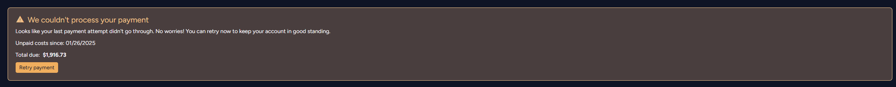
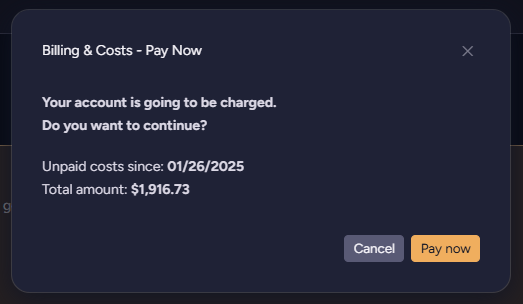
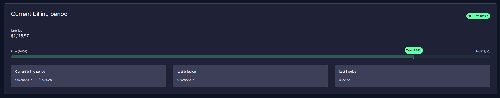
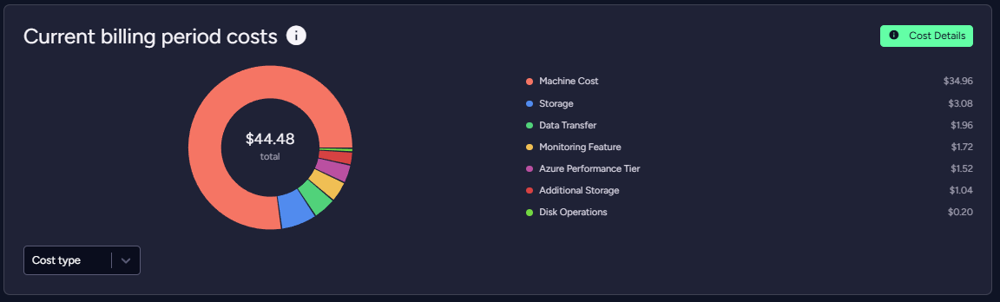
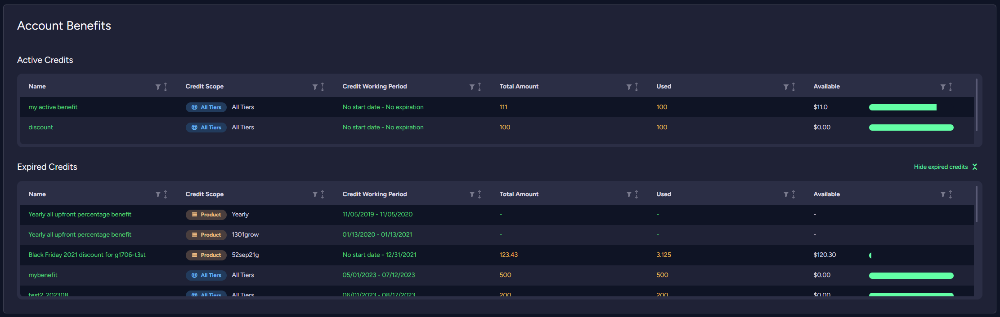
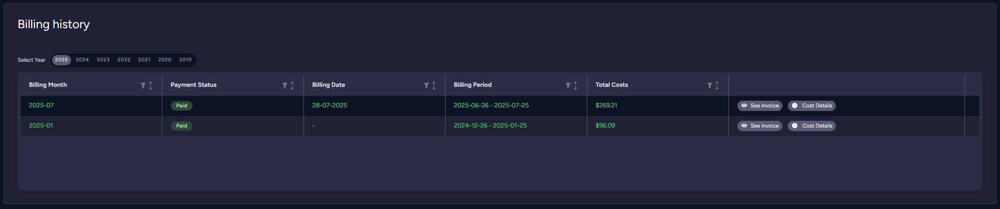
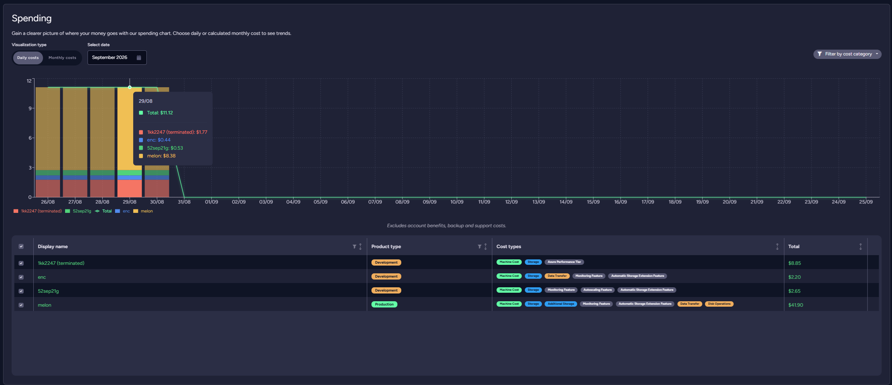

import Admonition from '@theme/Admonition';
import Tabs from '@theme/Tabs';
import TabItem from '@theme/TabItem';
import CodeBlock from '@theme/CodeBlock';
import LanguageSwitcher from "@site/src/components/LanguageSwitcher";
import LanguageContent from "@site/src/components/LanguageContent";

# Cloud Portal: The Billing & Costs Tab
## Overview

Use your account's Billing & Costs tab to view your present costs, past invoices and remaining credit.

* In this page:
    * [The Billing & Costs Tab](#the-billing-&-costs-tab)
        * [Pay Now](../../cloud/portal/cloud-portal-billing-tab.mdx#pay-now)
        * [Current billing period](../../cloud/portal/cloud-portal-billing-tab.mdx#current-billing-period)
        * [Current billing period costs](../../cloud/portal/cloud-portal-billing-tab.mdx#current-billing-period-costs)
        * [Account benefits](../../cloud/portal/cloud-portal-billing-tab.mdx#account-benefits)
        * [Billing history](../../cloud/portal/cloud-portal-billing-tab.mdx#billing-history)
        * [Spending](../../cloud/portal/cloud-portal-billing-tab.mdx#spending)
    * [Cost details](../../cloud/portal/cloud-portal-billing-tab.mdx#cost-details)

## The Billing & Costs Tab

The Billing & Costs tab will show your existing resources and their costs as well as past billing events.

### Pay Now

 The *Pay Now* button is designed to facilitate immediate payment of outstanding costs accrued from previous billing
 cycles. This feature is especially useful for ensuring timely payments and maintaining up-to-date account status.
 It can be used when automatic charge fails due to reasons like expired cards or insufficient funds.
 You can read more about the _Pay Now_ option on the [Pricing, Payment and Billing](../cloud-pricing-payment-billing.mdx#pay-now) page.

### Current billing period

The *Current billing period* widget shows information about accrued costs in the current billing period and basic information about the last invoice.

It also shows your **Unbilled** total — the costs accrued so far that have not yet been settled by an invoice — and a
progress bar marking today's position between the start and end of the period. Use the **Cost Details** button to open
the [Cost details](../../cloud/portal/cloud-portal-billing-tab.mdx#cost-details) view for the unbilled period.

### Current billing period costs

The *Current billing period costs* widget breaks the current period's costs down as a donut chart, so you can see at a
glance what is driving the bill.

Use the **Group costs by** selector to switch the breakdown between:

* **Cost type** — machine cost, storage, data transfer, enabled features, and so on.
* **Product** — one slice per product on the account.

The chart shows the largest **seven** slices individually and groups everything else into a single **Other** slice;
hover it to see what it contains.

<Admonition type="info" title="">
The amounts in this widget **exclude account benefits, backup and support costs**. For the complete picture of a period,
including support costs, open its [Cost details](../../cloud/portal/cloud-portal-billing-tab.mdx#cost-details) view.
</Admonition>

Depending on the state of the period, the widget may report instead that:

* no instances ran in this period,
* the costs for this period have not been calculated yet, or
* no costs were recorded in this period — in which case it also shows when costs were last calculated.

### Account benefits

The *Account benefits* widget shows information about current and expired benefits, their scope, validity dates and amounts.

### Billing history

The *Billing history* widget shows information about issued invoices, their status, billing period and their amount.

Use the year selector above the table to move between years. Only years for which you have billing history are offered,
and the selector always reflects the year the table is currently showing.

Selecting a row opens that period's [Cost details](../../cloud/portal/cloud-portal-billing-tab.mdx#cost-details) view.

### Spending

The *Spending* widget gives you a clearer picture of where your money is going with our spending chart. Select a daily or calculated monthly expense to see trends.

**Filter by cost category**

Use the **Filter by cost category** dropdown to restrict the chart and the table below it to the categories you care
about — for example, only storage, or only the cost of a single feature. Select individual categories, use *Select All*,
or clear the selection to go back to the full picture. The categories currently selected are shown as badges above the
chart.

The available categories are:

| Group | Categories |
|---|---|
| Instances and storage | Machine Cost, Storage, Additional Storage, Azure Performance Tier |
| Traffic and disk | Data Transfer, Disk Operations |
| Backups | Backup |
| [Product features](../cloud-features.mdx) | Monitoring, Power BI, OLAP ETL, Queue ETL, Data Archival, AI Embeddings etc. |

<Admonition type="note" title="">
Which categories appear for your account depends on what you actually use — a feature you have never enabled produces
no costs and so is not offered as a filter.
</Admonition>

**Visualization type and date range**

Switch between **daily** and **monthly** visualization. In the monthly view, the year picker only offers years for which
costs exist, so you cannot navigate to an empty year by accident.

When the costs for the selected range have not been calculated yet, the widget says so instead of drawing an empty chart.

<Admonition type="info" title="">
Daily spending **excludes account benefits, backup and support costs**. Monthly spending is taken from the calculated
account summary, which already includes backup costs, and so **excludes account benefits and support costs** only.
</Admonition>

## Cost details

The *Cost details* view breaks a single billing period down to the individual products that produced the costs.
Open it with the **Cost Details** button on the
[Current billing period](../../cloud/portal/cloud-portal-billing-tab.mdx#current-billing-period) or
[Current billing period costs](../../cloud/portal/cloud-portal-billing-tab.mdx#current-billing-period-costs) widget, or
by selecting a row in [Billing history](../../cloud/portal/cloud-portal-billing-tab.mdx#billing-history).

The view is headed with the period it describes and contains:

* **Invoice links** — the invoices that settle this period, when it has been billed.
* **Total** — the total cost for the period.
* **A card per product** — each showing the product's cost, and both the pre-discount and final amount where a discount
  or benefit applies.
* **Support costs** — shown separately from the per-product costs.
* **A daily spending chart** for the period's month, below the cost cards.

<Admonition type="note" title="Unbilled periods">
For the **unbilled** period — the one still in progress — the heading carries an information icon noting that the
presented cost is a **prediction**. It is based on the costs accrued so far and may still change before the period
closes. Billed periods show final amounts and no such note.
</Admonition>

<Admonition type="info" title="Marketplace accounts">
If your subscription is managed through the
[Microsoft Azure](../cloud-microsoft-azure-marketplace.mdx) or [AWS](../cloud-aws-marketplace.mdx) Marketplace, the view
states that your payment information is managed by that provider. Costs are still shown here in full.
</Admonition>

<Admonition type="note" title="Access required">
The Billing & Costs views, including *Cost details*, require the account-level **Billing** role.
See [Account roles](../cloud-account.mdx#account-roles).
</Admonition>

