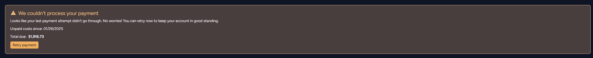
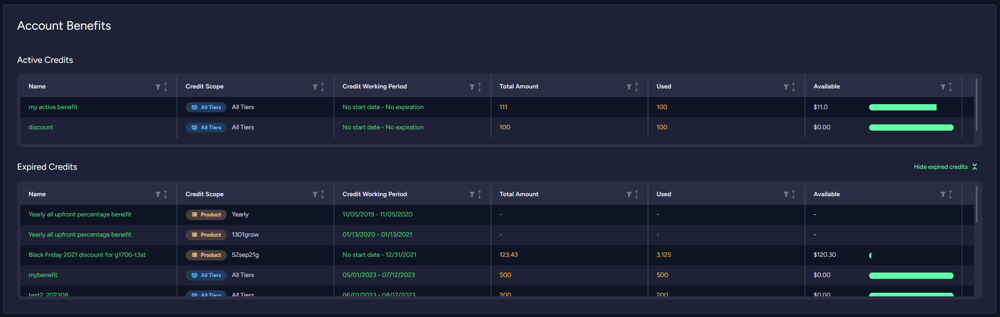
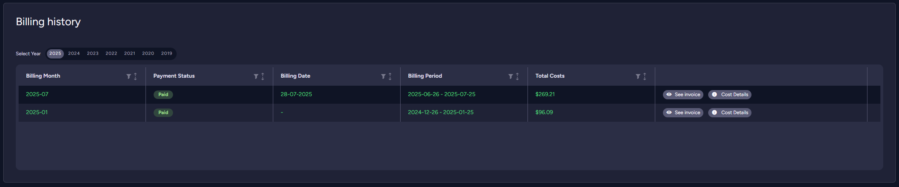

import Admonition from '@theme/Admonition';
import Tabs from '@theme/Tabs';
import TabItem from '@theme/TabItem';
import CodeBlock from '@theme/CodeBlock';
import LanguageSwitcher from "@site/src/components/LanguageSwitcher";
import LanguageContent from "@site/src/components/LanguageContent";

# Cloud Portal: The Billing & Costs Tab
## Overview

Use your account's Billing & Costs tab to view your present costs, past invoices and remaining credit.

* In this page:
    * [The Billing & Costs Tab](#the-billing-&-costs-tab)
        * [Pay Now](../../cloud/portal/cloud-portal-billing-tab.mdx#pay-now)
        * [Current billing period](../../cloud/portal/cloud-portal-billing-tab.mdx#current-billing-period)
        * [Account benefits](../../cloud/portal/cloud-portal-billing-tab.mdx#account-benefits)
        * [Billing history](../../cloud/portal/cloud-portal-billing-tab.mdx#billing-history)
        * [Spending](../../cloud/portal/cloud-portal-billing-tab.mdx#spending)

## The Billing & Costs Tab

The Billing & Costs tab will show your existing resources and their costs as well as past billing events.

### Pay Now

 The *Pay Now* button is designed to facilitate immediate payment of outstanding costs accrued from previous billing
 cycles. This feature is especially useful for ensuring timely payments and maintaining up-to-date account status.
 It can be used when automatic charge fails due to reasons like expired cards or insufficient funds.
 You can read more about the _Pay Now_ option on the [Pricing, Payment and Billing](../cloud-pricing-payment-billing.mdx#pay-now) page.

### Current billing period

The *Current billing period* widget shows information about accrued costs in the current billing period and basic information about the last invoice.

### Account benefits

The *Account benefits* widget shows information about current and expired benefits, their scope, validity dates and amounts.

### Billing history

The *Billing history* widget shows information about issued invoices, their status, billing period and their amount.

### Spending

The *Spending* widget gives you a clearer picture of where your money is going with our spending chart. Select a daily or calculated monthly expense to see trends.

