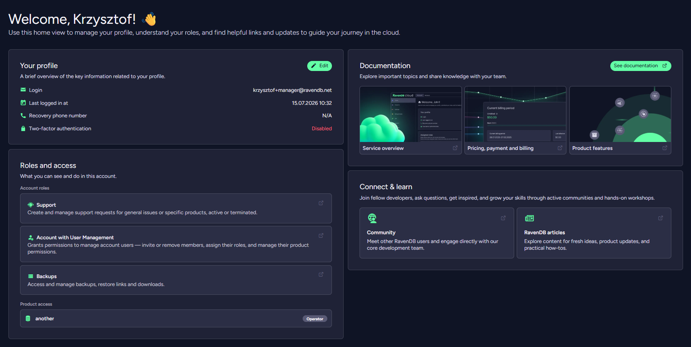
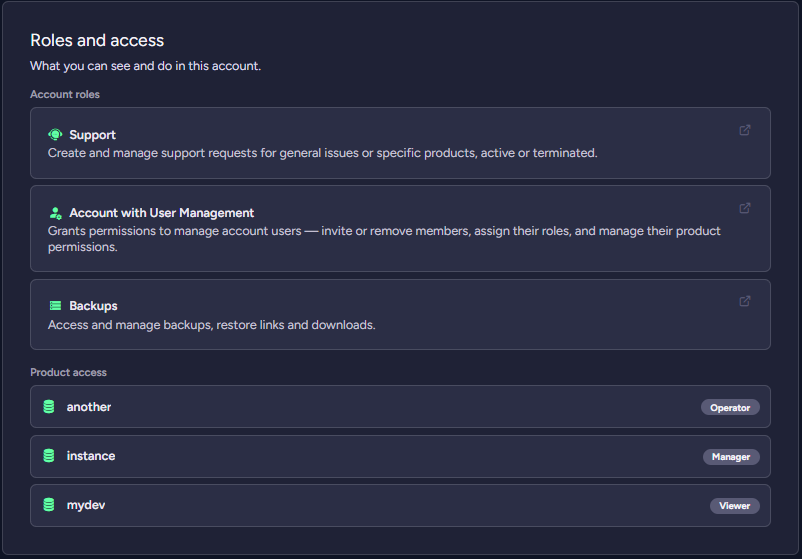

import Admonition from '@theme/Admonition';
import Tabs from '@theme/Tabs';
import TabItem from '@theme/TabItem';
import CodeBlock from '@theme/CodeBlock';
import LanguageSwitcher from "@site/src/components/LanguageSwitcher";
import LanguageContent from "@site/src/components/LanguageContent";

# Cloud Portal: The Home Tab

<Admonition type="note" title="">

Use this tab to manage your account and assigned roles. You can also use it to view useful resources, such as documentation, the community, and articles.

* In this page:
    * [The Home Tab](../../cloud/portal/cloud-portal-home-tab.mdx#the-home-tab)  
</Admonition>
## The Home Tab

In the **Your profile** section, you can check your 2FA settings and the date of your last login.

In the **Roles and access** section, you can review your access on this account at a glance:

* your assigned [account roles](../../cloud/cloud-account.mdx#account-roles), and
* your [product access](../../cloud/cloud-account.mdx#permission-presets) — the products you can access and your access level (preset) on each.

If you are the **Account Owner** (or otherwise have full account access), this section shows a short full-access summary instead of a per-product list.

In the **Documentation** section, you can explore important topics.

In the **Connect & learn** section, you can connect with developers and ask questions.

