import Admonition from '@theme/Admonition';
import Tabs from '@theme/Tabs';
import TabItem from '@theme/TabItem';
import CodeBlock from '@theme/CodeBlock';
import LanguageSwitcher from "@site/src/components/LanguageSwitcher";
import LanguageContent from "@site/src/components/LanguageContent";

# Cloud Portal: The Products Tab

<Admonition type="note" title="">

The Products tab lets you [provision](../../cloud/cloud-overview.mdx#provisioning) a new cloud product, or manage an existing one.  

You can provision products of three types:  [Free](../../cloud/cloud-overview.mdx#the-free-tier), 
[Development](../../cloud/cloud-overview.mdx#the-development-tier) 
and [Production](../../cloud/cloud-overview.mdx#the-production-tier).  

* In this page:  
  * [Provisioning a New Product](../../cloud/portal/cloud-portal-products-tab.mdx#provisioning-a-new-product)  
  * [View the Product Metrics](../../cloud/portal/cloud-portal-products-tab.mdx#view-the-product-metrics)  
  * [View the Cluster Health](../../cloud/portal/cloud-portal-products-tab.mdx#view-the-cluster-health)  
  * [View the Alerts](../../cloud/portal/cloud-portal-products-tab.mdx#view-the-alerts)  
  * [Managing an Existing Product](../../cloud/portal/cloud-portal-products-tab.mdx#managing-an-existing-product)  
     - [Instance Access: Open Studio](../../cloud/portal/cloud-portal-products-tab.mdx#instance-access)  
     - [Change Instance Type and Storage](../../cloud/portal/cloud-portal-products-tab.mdx#change-instance-type-and-storage)  
     - [Security: Certificate and Audit Logs](../../cloud/portal/cloud-portal-products-tab.mdx#security-your-certificate-audit-logs-and-allowed-ips)  
     - [Allowed IPs](../../cloud/portal/cloud-portal-products-tab.mdx#allowed-ips)  
     - [Manage features](#manage-features)
     - [Nodes: Additional product nodes](../../cloud/portal/cloud-portal-products-tab.mdx#nodes-additional-product-nodes)
     - [Subscription & support](../../cloud/portal/cloud-portal-products-tab.mdx#subscription-and-support)  
     - [Maintenance and Danger Zones: Terminate and Restart your Instance](../../cloud/portal/cloud-portal-products-tab.mdx#maintenance-and-danger-zones)  
     - [User Access](../../cloud/portal/cloud-portal-products-tab.mdx#user-access)  
</Admonition>

## Provisioning a New Product
To provision a new product, open your Portal's Products tab and click **Add Product**.

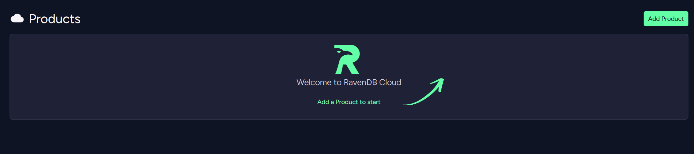

<Admonition type="note" title="Access required">
Creating a product requires the [**Products Creation**](../../cloud/cloud-account.mdx#account-roles) account role — the **Add Product** button is hidden otherwise. Users without any relevant access do not see the **Products** tab at all.
</Admonition>

The New Product wizard will open and walk you through the following simple stages:  
  
A. [Plan](../../cloud/portal/cloud-portal-products-tab.mdx#a-new-product-plan)  
B. [Account](../../cloud/portal/cloud-portal-products-tab.mdx#b-new-product-account)  
C. [Billing](../../cloud/portal/cloud-portal-products-tab.mdx#c-new-product-billing)  
D. [Customize](../../cloud/portal/cloud-portal-products-tab.mdx#d-new-product-customize)  
E. [Summary](../../cloud/portal/cloud-portal-products-tab.mdx#e-new-product-summary)  

<Admonition type="note" title="Stages you may not see">
**Account** and **Billing** are only asked for when the wizard still needs that information:

* **Account** appears only when your account has neither its details nor a payment method on file.
* **Billing** appears only when no payment method is on file, and never for
  [Microsoft Azure](../cloud-microsoft-azure-marketplace.mdx) or [AWS](../cloud-aws-marketplace.mdx) Marketplace
  accounts, whose payment is handled by the provider.

So the first product you provision usually walks through all five stages, while later ones typically go straight from
**Plan** to **Customize** and **Summary**.
</Admonition>

#### A. New Product: Plan
Use the Plan page to choose your product's cloud **Provider**, **Region**, **Tier**, **Instance**, **Storage** and **Payment model**.  

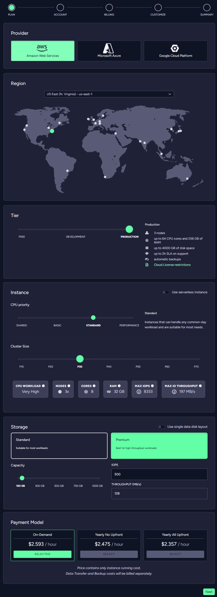

1.  **Cloud Provider**  
   Choose your cloud host. It can currently be one of three providers:  
   **Amazon Web Services**, **Microsoft Azure**, and **Google Cloud Platform**.  

2.  **Region**  
  Select where your equipment would be physically located.  

3.  **Tier**  
  You can raise a [Free node](../../cloud/cloud-instances.mdx#a-free-cloud-node), 
  a [Development node](../../cloud/cloud-instances.mdx#a-development-cloud-server) or a 
  [Production cluster](../../cloud/cloud-instances.mdx#a-production-cloud-cluster).  
  Learn more about them in the [Tiers and Instances](../../cloud/cloud-instances.mdx) page.  
  
4.  **Instance**  
  Choose the instance type that best suits your requirements.  
  Learn more about them in the [Tiers and Instance](../../cloud/cloud-instances.mdx) page.  
  
5.  **Storage**  
  Select disk type and size.  
  Learn more about them in the [Scaling](../../cloud/cloud-scaling#scaling---change-storage) page.  
  
6.  **Payment model**  
  Choose your payment model and commitment.  
  Learn more about them in the [Pricing, Payment and Billing](../../cloud/cloud-pricing-payment-billing) page.  

#### B. New Product: Account
Enter your account information and click **Next**.  

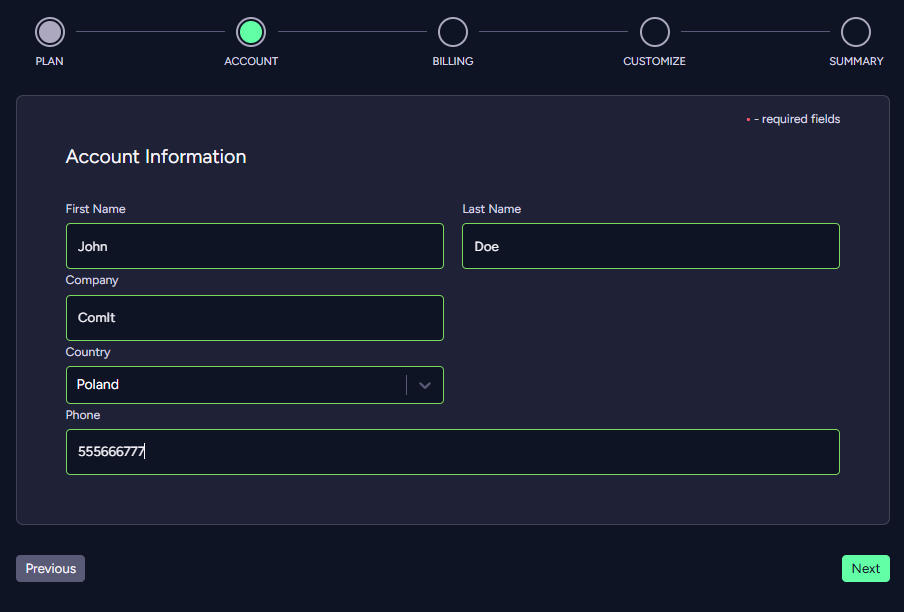

#### C. New Product: Billing
Enter your billing details and click **Next**.  

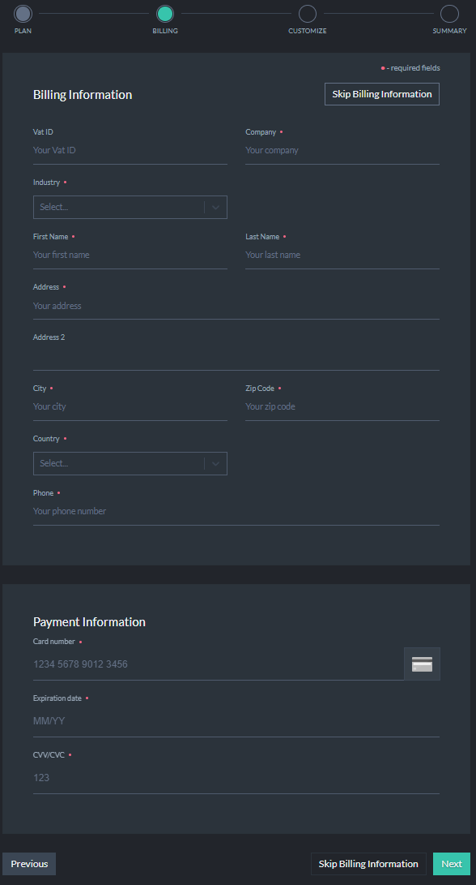

#### D. New Product: Customize
Choose your product's display name, release channel and allowed IP addresses.

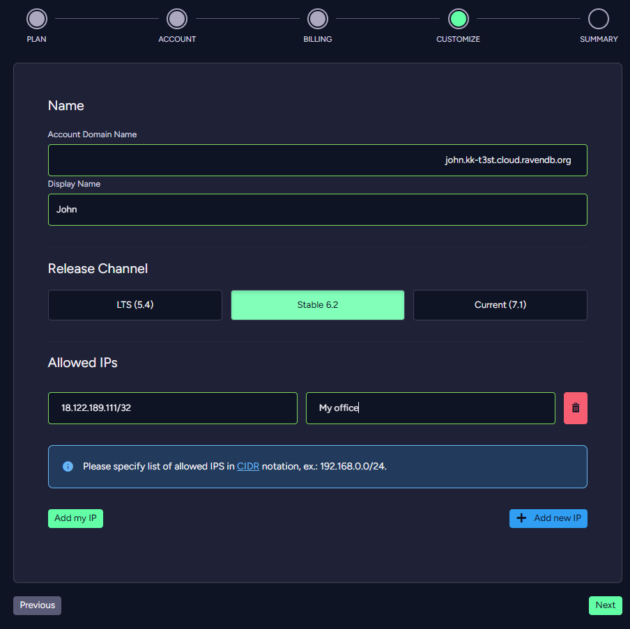

The **Display Name** is simply the name that would appear in your Cloud Products tab.  
<Admonition type="note" title="Important " id="important" href="#important">
  The **Allowed IPs** section determines which addresses would be allowed to manage your database.  
  This adds an important layer to your database security on the network level.
  You can read more about it in the [Security](../cloud-security.mdx#access-your-product) page.
</Admonition>

#### E. New Product: Summary  
The Summary stage shows you your choices and lets you edit them if you wish.

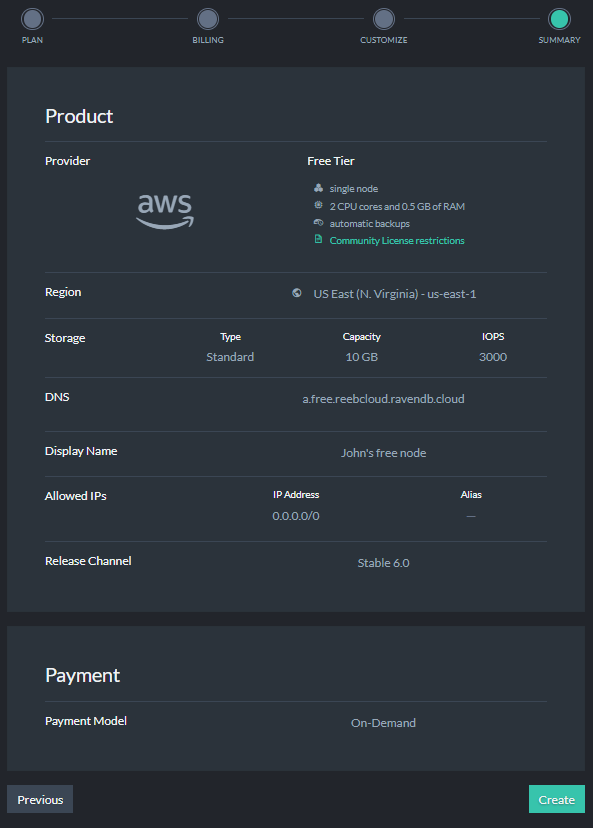
When you finish defining your product, the cloud provisioning routine will show you 
your new product's status until it's ready to go.  

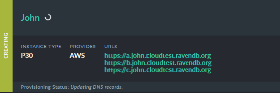

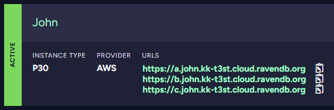

## View the Product Metrics

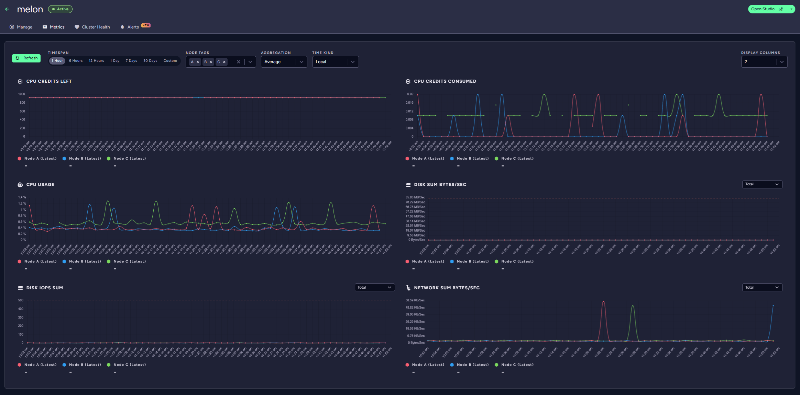

This allows you to analyse your machine resources for a selected time period and cluster node.
It's useful for analysing usage, instance overload and traffic.

<Admonition type="note" title="Access required">
The **Metrics** and **Cluster Health** buttons — on both the product list and the product view — require at least [**Viewer** access](../../cloud/cloud-account.mdx#permission-presets) to the product, and are disabled without it.
</Admonition>

## View the Cluster Health

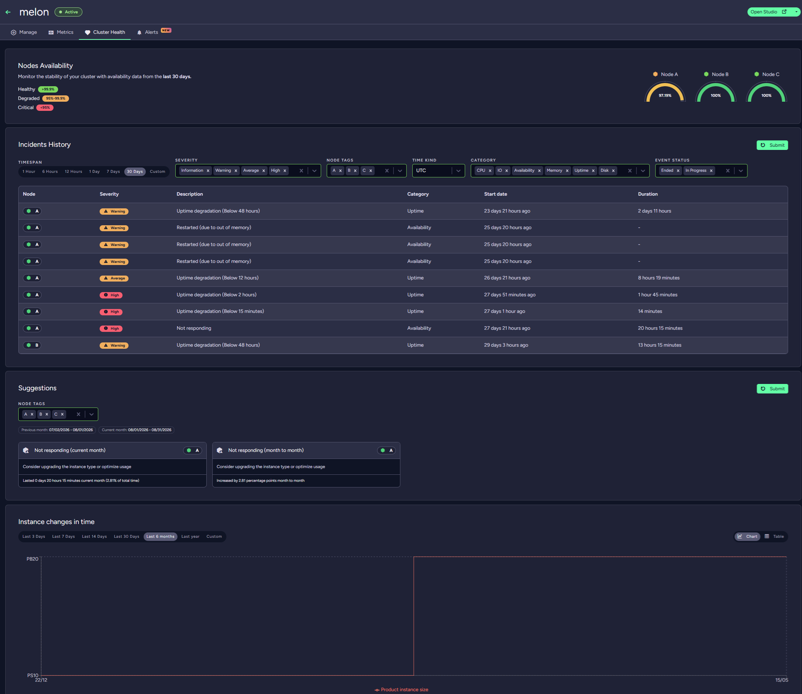

This allows you to analyse your cluster incidents for a selected *time period*, *cluster node*, *severity*, *category* and *event status*.  
In addition, **Cluster Health** generates suggestions for a selected *cluster node* based on incident trends that can help resolve cluster stability issues.
The view also shows node availability for the last 30 days and a history of product type changes.  
It's useful for analysing usage, instance overload and traffic.  

More details can be found [here](../cloud-maintenance-troubleshooting.mdx#cluster-health).

## View the Alerts

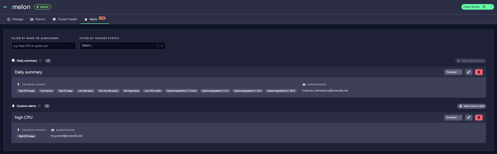

This allows you to have the events recorded by **Cluster Health** emailed to you, so you do not have to watch the Portal
to learn that an instance is under pressure. You can configure a single *daily summary* digest and any number of
*custom alerts* that fire as soon as a chosen event is recorded, each with its own list of recipients.

<Admonition type="note" title="Access required">
The **Alerts** tab requires the [Monitoring](../cloud-features.mdx#monitoring) feature to be enabled on the product,
plus at least [**Viewer** access](../../cloud/cloud-account.mdx#permission-presets) to it. Changing the rules
additionally requires the **Manage features** permission together with the
[**Security admin** add-on](../../cloud/cloud-account.mdx#permission-presets), and the product must be **Active**.
</Admonition>

More details can be found [here](../cloud-maintenance-troubleshooting.mdx#alerts).

## Managing an Existing Product

<Admonition type="note" title="Per-product permissions">
The actions available on a product depend on your [per-product permissions](../../cloud/cloud-account.mdx#product-permissions) — buttons for actions you are not permitted to perform are hidden or disabled, and the **Account Owner** always has full access.
</Admonition>

To modify an existing product, find it in the Products tab and click its Manage button.  

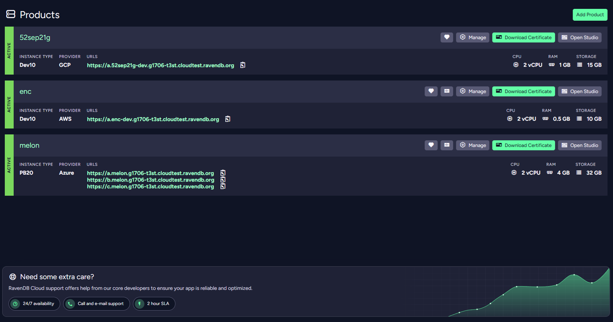

This is a general view of the product details page:

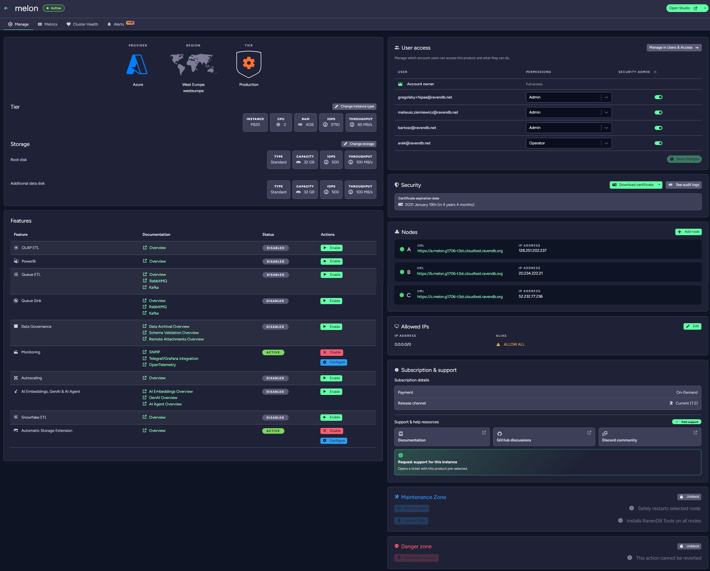

This is a general view of the serverless product details page:

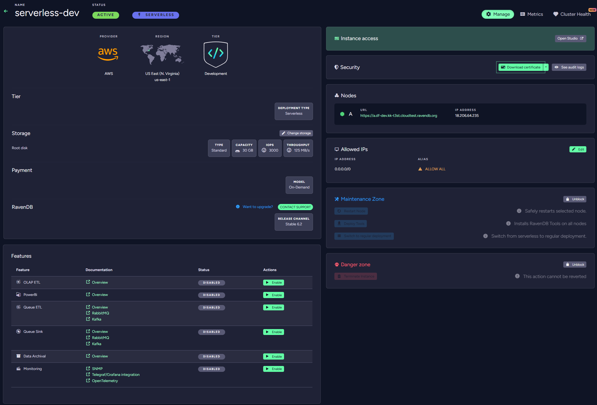

### Instance Access: Open Studio {#instance-access}

The bar at the top of the product view — above the **Manage**, **Metrics**, **Cluster Health** and **Alerts** tabs —
shows the product's name and status, and carries the **Open Studio** button that takes you to RavenDB Studio.

* On a **single-node** product, **Open Studio** is a plain button that opens that node's Studio in a new tab.
* On a **multi-node** product, **Open Studio** is a dropdown listing every node — **Node A**, **Node B**, and so on —
  so you can pick the node whose Studio you want to open.

The button appears only while the product is **Active** or **Deploying changes**. Until you have downloaded the client
certificate, hovering it shows the reminder *"Please remember to download Certificate before accessing studio"* —
Studio will not let you in without an installed certificate, so
[download it first](#security-your-certificate-audit-logs-and-allowed-ips).

<Admonition type="note" title="">
**Open Studio** is also available per product directly in the [Products list](#managing-an-existing-product), next to
the **Manage** button.
</Admonition>

### Change Instance Type and Storage  
You can view your configuration and change your product's instance type and storage size here.  

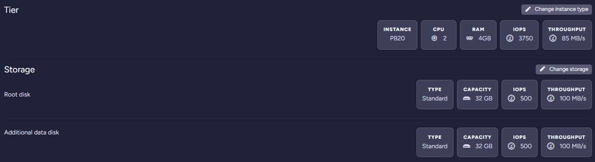
* **Change Instance Type**  
  Use sliders to set your desired configuration. This can be changed later as you need to scale to changing data processing needs.

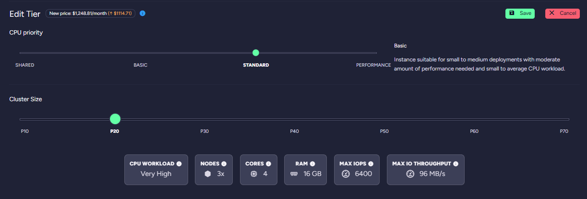

  <Admonition type="note" title="Important " id="important" href="#important">
    Changing instance type for Serverless product is not possible. 
  </Admonition>

  More details can be found [here](../cloud-scaling.mdx#scaling---change-instance-type).
* **Change Storage**  
  Use this slider to modify your product's storage.  

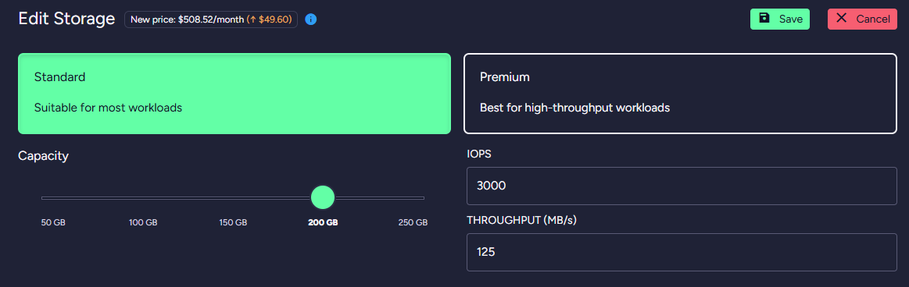

  Disk can be migrated to **Data Disk** using *Migrate disk* button.

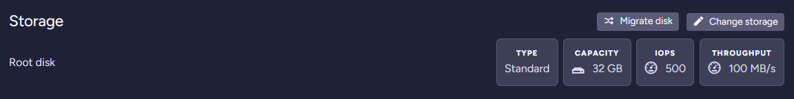

  When eligible, the *Storage* section also shows an **Upgrade to Premium V2** button to upgrade
  the disk to **Azure Premium SSD v2**.

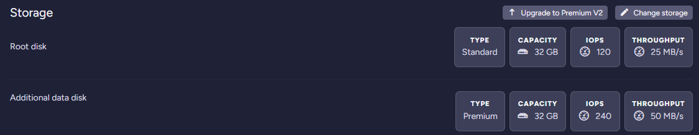

  More details can be found [here](../cloud-scaling.mdx#scaling---change-storage). For
  **Azure Premium SSD v2** — eligibility, constraints, and behavior of the upgrade — see
  [Azure Premium SSD v2](../cloud-scaling.mdx#azure-premium-ssd-v2).
  
### Security: Certificate and Audit Logs {#security-your-certificate-audit-logs-and-allowed-ips}

The **Security** card holds your instance's client certificate and its audit logs.
See the [Security](../../cloud/cloud-security.mdx) page for the wider picture.

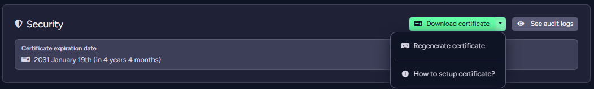

<Admonition type="note" title="Access required">
**Download certificate** and **Regenerate certificate** require the **Security admin** add-on — no
[base preset](../../cloud/cloud-account.mdx#permission-presets) grants it on its own.
**See audit logs** requires the [**Operator** preset](../../cloud/cloud-account.mdx#permission-presets) or higher.
Buttons you are not permitted to use are disabled, with a tooltip explaining why.
</Admonition>

* **Download certificate**  
  Downloads the **Initial Client Certificate** package — a zip archive containing the `.pfx` files.
  This is an **operator-level** certificate used to perform cluster-wide operations (like creating or deleting databases)
  and for your first login to RavenDB Studio.

  The first time you use it, the portal opens the **Downloading and Installing Initial Certificate** dialog, which walks
  you through downloading the package and installing it, with instructions for **Windows + Chrome** and
  **Linux + Chrome**. You can reopen that dialog later from **How to setup certificate?** in the dropdown next to the
  button.

* **Regenerate certificate**  
  Click the dropdown next to **Download certificate** and choose **Regenerate certificate**. Use it when your current
  certificate has expired, or when you want to stop using the one you hold.

  <Admonition type="warning" title="Note on Regeneration">
      Regenerating a certificate creates a new identity. After this operation, you must download and install the new certificate to maintain access via the portal.
  </Admonition>
  <Admonition type="danger" title="">
    The previous certificate is **not** automatically removed from the cluster by this operation. To revoke old certificates, you must use the RavenDB Studio Certificates view.
  </Admonition>

* **Certificate expiration date**  
  The card shows how long the current client certificate remains valid. Cloud client certificates are issued for
  **five years**, and renewal is handled for you:

  * **60 days** before expiry, the account is emailed a notice stating the expiration date and the date of the
    automatic renewal.
  * **30 days** before expiry, the certificate is regenerated automatically.

  An automatic renewal behaves like a manual one: download and install the new certificate to keep your access working,
  and remove the old certificate from the RavenDB Studio Certificates view when you no longer need it.

  <Admonition type="tip" title="Best Practice: Certificate Management">
    For maximum security and performance, we recommend using the initial certificate only for setup and emergency access.

    1. **Granular Permissions**: Create separate certificates for each user, developer, or application.
    2. **Least Privilege**: Use the Studio to assign specific roles (e.g., User vs. Admin) or restrict access to specific databases.
    3. **Save CPU Credits**: If your instance uses a burstable CPU (especially low-end instances), generating certificates can consume significant CPU credits.
      We recommend **generating certificates off-cloud** (on your own machine) and importing them into the Studio via **Settings > Certificates**.
  </Admonition>

* **See audit logs**  
  Opens the **Select date to load audit logs** dialog. Pick a year and month, then expand a node tag to list the audit
  log files that node recorded in that month and download them.

  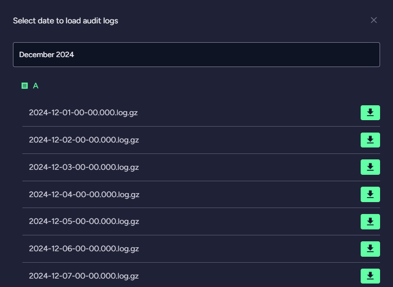

### Allowed IPs

The **Allowed IPs** card determines which addresses are allowed to connect to your database instance, adding an
important layer of security at the network level. It lists the current entries as **IP Address** and **Alias** pairs.
A `0.0.0.0/0` (**Allow all**) entry is pinned to the top of the list and flagged with a warning, because it leaves your
instance reachable from anywhere.

<Admonition type="note" title="Access required">
Editing the list requires the **Security admin** add-on — no
[base preset](../../cloud/cloud-account.mdx#permission-presets) grants it on its own. Without it the **Edit** button is
disabled, with a tooltip explaining why.
</Admonition>

Click **Edit** to change the list.

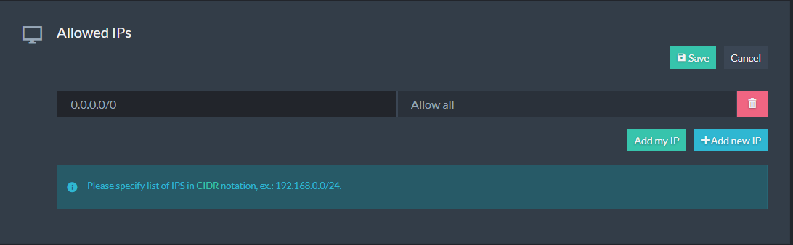

Each row takes an address in [CIDR notation](https://en.wikipedia.org/wiki/Classless_Inter-Domain_Routing)
(for example `192.168.0.0/24`) and a free-text alias. **Add my IP** inserts the address you are currently connecting
from, **Add new IP** adds an empty row, and the bin button removes a row. Click **Save** to apply your changes, or
**Cancel** to discard them.

<Admonition type="info" title="We recommend fortifying your security by allowing access only to specific IPs" id="we-recommend-fortifying-your-security-by-allowing-access-only-to-specific-ips" href="#we-recommend-fortifying-your-security-by-allowing-access-only-to-specific-ips">
You can increase your system's security further using this in-depth security measure and restrict access to
trusted sources, e.g. your application servers. 
More details can be found in the [Security](../cloud-security.mdx#access-your-product) page.
</Admonition>

### Manage features

You can view features available for your product, enable, disable and configure them here.  

<Admonition type="note" title="Important " id="important" href="#important">
After enabling features some of them must be configured to work properly.
</Admonition>

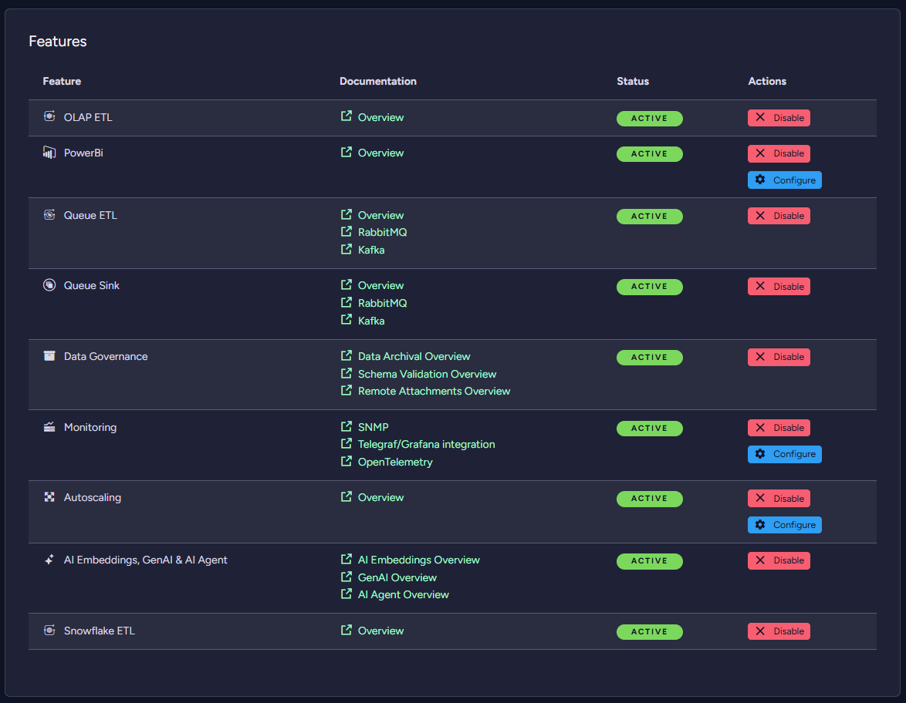

Available features are described on [Product Features](../cloud-features.mdx) page.

<Admonition type="note" title="Access required">
Enabling, disabling, and configuring features requires the [**Manager** (or **Admin**) preset](../../cloud/cloud-account.mdx#permission-presets) — this includes switching a *Serverless* product to regular deployment. Security-related features (**Monitoring/OpenTelemetry** and **Power BI**) additionally require the **Security admin** add-on to be enabled or disabled; see [Product Features](../cloud-features.mdx).
</Admonition>

### Nodes: Additional product nodes

You can expand your cluster by adding *more product nodes* to your cluster. This helps improve *High Availability* and *task/load balancing*.

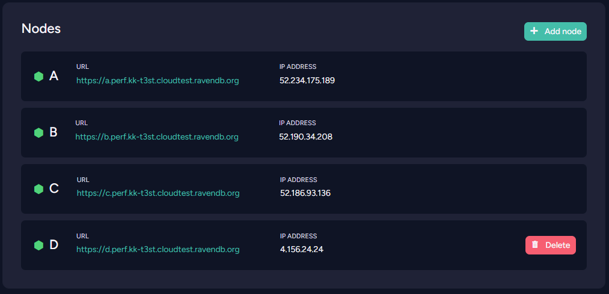

More details can be found [here](../cloud-scaling.mdx#additional-product-nodes---general).

### Subscription & support {#subscription-and-support}

The **Subscription & support** card gathers what your product is paying for, which RavenDB build it tracks, and where to
get help with it.

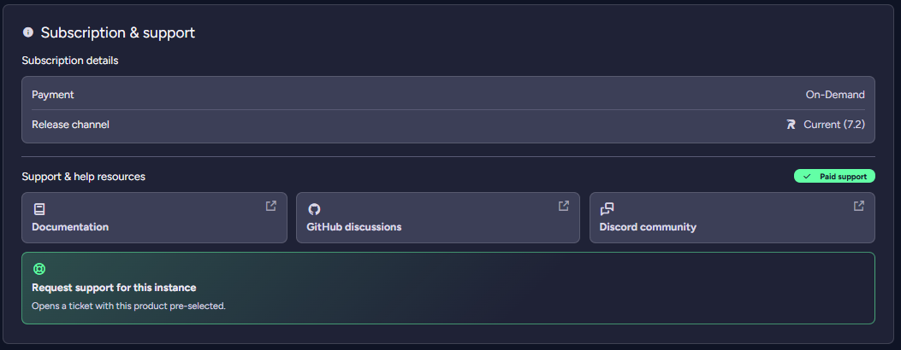

#### Subscription details

| Field | Description |
|---|---|
| **Payment** | Your payment model — *On-Demand*, *Yearly All Upfront* or *Yearly No Upfront*. See [Pricing, Payment and Billing](../cloud-pricing-payment-billing.mdx). |
| **Contract** | The date your current contract runs until. Shown only for term contracts. |
| **Release channel** | The RavenDB release channel this product tracks, as chosen in the [Customize](#d-new-product-customize) stage. |

When a newer release channel than the one your product tracks becomes available, an **Update available** pill appears
next to the release channel. Clicking it opens the [Support](./cloud-portal-support-tab.mdx#request-support-from-a-product)
view with this product selected, so you can ask for the upgrade — changing the release channel is not a self-service
action.

<Admonition type="note" title="Marketplace accounts">
For [Microsoft Azure](../cloud-microsoft-azure-marketplace.mdx) and [AWS](../cloud-aws-marketplace.mdx) Marketplace
accounts the **Payment** and **Contract** rows are not shown, because billing is handled by the provider. Only the
release channel appears.
</Admonition>

#### Support & help resources

This part of the card offers direct links to the *Documentation*, *GitHub discussions* and the *Discord community*,
and a badge showing whether the product is covered by **Paid support** or the **Free tier**.

If your account has an active paid support option, the card also offers **Request support for this instance**, which
opens the [Support](./cloud-portal-support-tab.mdx#request-support-from-a-product) view with this product already
selected. Otherwise it links to a comparison of the paid support plans.

<Admonition type="note" title="Access required">
The support badge and the request/compare panel are shown only to users with the
[**Support** account role](../../cloud/cloud-account.mdx#account-roles). The three resource links are always available.
</Admonition>

### Maintenance and Danger Zones
You can restart your product nodes, deploy additional tools and terminate your product here.

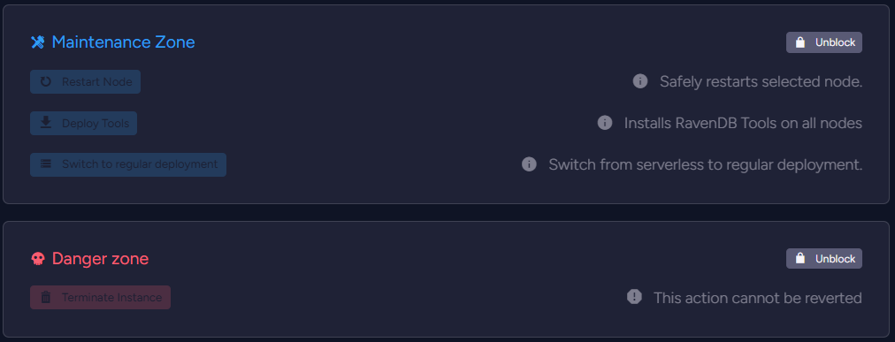
* **Maintenance Zone**  
  Use this tab to restart selected node and deploy RavenDB tools. For *Serverless* products, you can switch to regular deployment.
  
<Admonition type="danger" title="">
Changing your product deployment type is **irreversible**.
</Admonition>

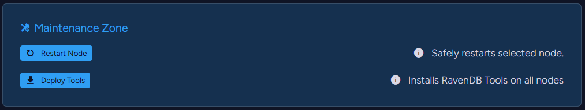
* **Danger Zone**  
  Use this tab's **Terminate** button to eliminate your cluster.

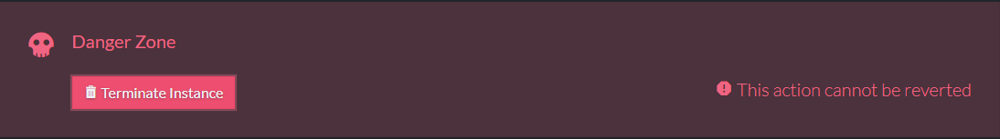

  <Admonition type="danger" title="">
  Terminating your instance is **irreversible**. Your data and cluster properties will be permanently lost.  
  </Admonition>

### User Access

The product view includes a **User Access** widget that lists the account users who have access to this product, together with their access level. If you can manage users, you can change a user's [preset](../cloud-account.mdx#permission-presets) and toggle the **Security admin** add-on directly in the widget, then click **Save changes** — without leaving the product view. The **Account Owner** is always shown with **full access**. Use **Manage in Users & Access** to open the [Users & Access](./cloud-portal-users-and-access-tab.mdx) page for the full user-management view. When no other users have been granted access yet, the widget shows an empty state.

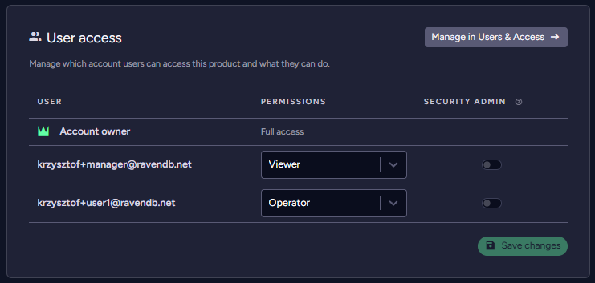

