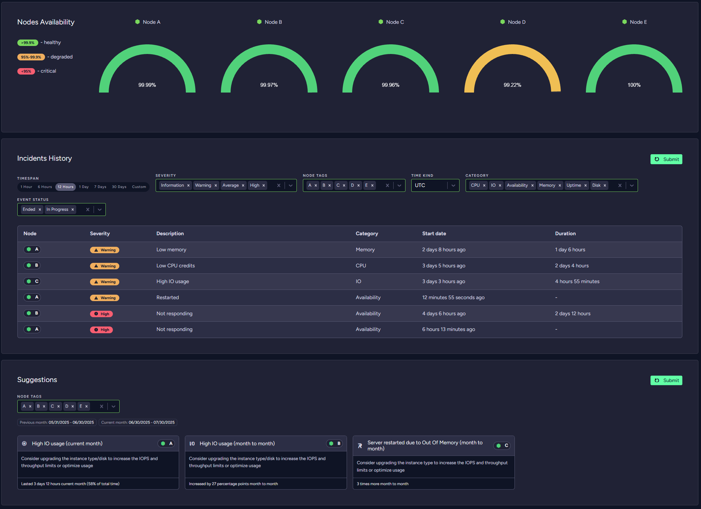
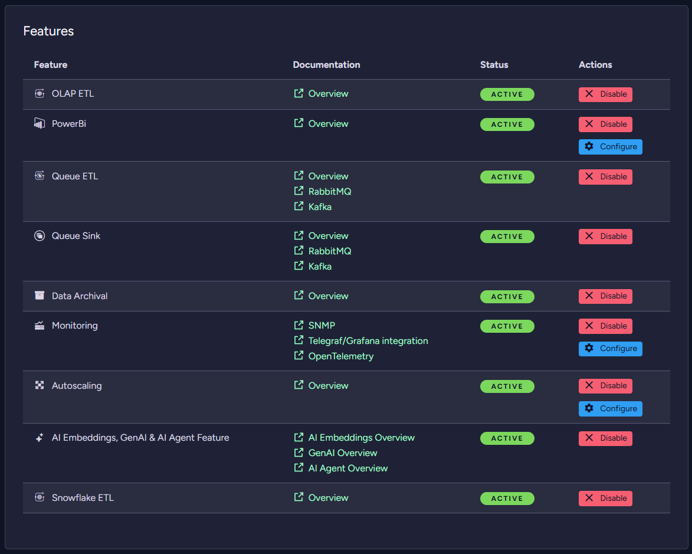

import Admonition from '@theme/Admonition';
import Tabs from '@theme/Tabs';
import TabItem from '@theme/TabItem';
import CodeBlock from '@theme/CodeBlock';
import LanguageSwitcher from "@site/src/components/LanguageSwitcher";
import LanguageContent from "@site/src/components/LanguageContent";

# Cloud Portal: The Products Tab

<Admonition type="note" title="Note">

The Products tab lets you [provision](../../cloud/cloud-overview.mdx#provisioning) a new cloud product, or manage an existing one.  

You can provision products of three types:  [Free](../../cloud/cloud-overview.mdx#the-free-tier), 
[Development](../../cloud/cloud-overview.mdx#the-development-tier) 
and [Production](../../cloud/cloud-overview.mdx#the-production-tier).  

* In this page:  
  * [Provisioning a New Product](../../cloud/portal/cloud-portal-products-tab.mdx#provisioning-a-new-product)  
  * [View the Product Metrics](../../cloud/portal/cloud-portal-products-tab.mdx#view-the-product-metrics)  
  * [View the Cluster Health](../../cloud/portal/cloud-portal-products-tab.mdx#view-the-cluster-health)  
  * [Managing an Existing Product](../../cloud/portal/cloud-portal-products-tab.mdx#managing-an-existing-product)  
     - [Change Instance Type and Storage](../../cloud/portal/cloud-portal-products-tab.mdx#change-instance-type-and-storage)  
     - [Security: Your Certificate, Audit Logs and Allowed IPs](../../cloud/portal/cloud-portal-products-tab.mdx#security-your-certificate-audit-logs-and-allowed-ips)  
     - [Manage features](#manage-features)
     - [Nodes: Additional product nodes](../../cloud/portal/cloud-portal-products-tab.mdx#nodes-additional-product-nodes)
     - [Maintenance and Danger Zones: Terminate and Restart your Instance](../../cloud/portal/cloud-portal-products-tab.mdx#maintenance-and-danger-zones-terminate-and-restart-your-instance)  
</Admonition>

## Provisioning a New Product

To provision a new product, open your Portal's Products tab and click **Add Product**.

The New Product wizard will open and walk you through the following simple stages:  
  
A. [Plan](../../cloud/portal/cloud-portal-products-tab.mdx#a-new-product-plan)  
B. [Billing](../../cloud/portal/cloud-portal-products-tab.mdx#b-new-product-billing)  
C. [Customize](../../cloud/portal/cloud-portal-products-tab.mdx#c-new-product-customize)  
D. [Summary](../../cloud/portal/cloud-portal-products-tab.mdx#d-new-product-summary)  
#### A. New Product: Plan
Use the Plan page to choose your product's cloud **Provider**, **Region** and **Tier**.  

  

1.  **Cloud Provider**  
   Choose your cloud host. It can currently be one of three providers:  
   Amazon AWS, Microsoft Azure, and Google Cloud Platform.  

2.  **Region**  
  Select where your equipment would be physically located.  

  
3.  **Tier**  
  You can raise a [Free node](../../cloud/cloud-instances.mdx#a-free-cloud-node), 
  a [Development node](../../cloud/cloud-instances.mdx#a-development-cloud-server) or a 
  [Production cluster](../../cloud/cloud-instances.mdx#a-production-cloud-cluster).  
  Learn more about them in the [Tiers and Instances](../../cloud/cloud-instances.mdx) page.  
#### B. New Product: Billing
Enter your billing details and click Next,  
or click **Skip Billing Information** to evaluate the cloud service using a basic free product.  

#### C. New Product: Customize
Choose your product's display name, release channel and allowed IP addresses.

The **Display Name** is simply the name that would appear in your Cloud Products tab.  
<Admonition type="note" title="Important " id="important" href="#important">
  The **Allowed IPs** section determines which addresses would be allowed to manage your database.  
  This adds an important layer to your database security on the network level.
  You can read more about it in the [Security](../cloud-security.mdx#access-your-product) page.
</Admonition>
#### D. New Product: Summary  
The Summary stage shows you your choices and lets you edit them if you wish.

When you finish defining your product, the cloud provisioning routine will show you 
your new product's status until it's ready to go.  

## View the Product Metrics

This allows you to analyse your machine resources for a selected time period and cluster node.
It's useful for analysing usage, instance overload and traffic.

## View the Cluster Health

This allows you to analyse your cluster incidents for a selected *time period*, *cluster node*, *severity*, *category* and *event status*.  
In addition, **Cluster Health** generates suggestions for a selected *cluster node* based on incident trends that can help resolve cluster stability issues.  
It's useful for analysing usage, instance overload and traffic.  

More details can be found [here](../cloud-maintenance-troubleshooting.mdx#cluster-health).

## Managing an Existing Product
  
To modify an existing product, find it in the Products tab and click its Manage button.  

This is a general view of the product details page:

### Change Instance Type and Storage  
You can view your configuration and change your product's instance type and storage size here.  

* **Change Instance Type**  
  Use sliders to set your desired configuration. This can be changed later as you need to scale to changing data processing needs.

  More details can be found [here](../cloud-scaling.mdx#change-instance-type).
* **Change Storage**  
  Use this slider to modify your product's storage.  

  On **Azure** disk can be migrated to **Data Disk** using *Migrate disk* button.

  More details can be found [here](../cloud-scaling.mdx#change-storage).
### Instance Access

* **Open Studio**  
  Click this button to open the RavenDB Studio of node A.

### Security: Your Certificate, Audit Logs and Allowed IPs  
Use the security tab to download your [certificate](../../cloud/cloud-security.mdx) or determine which addresses are 
allowed to connect your database instance.  

* **Download Certificate**  
  Click this button to download your certificate.  
  Your product will communicate only with trusted sources. Install this certificate only on trusted machines.  

* **Regenerate Certificate**  
  Click the dropdown button next to the *Download certificate*. Additional button to regenerate your certificate will appear.  
  If your certificate has expired, you can regenerate a new one.  
  After this operation you need to download the certificate again using **Download Certificate** button.  

  <Admonition type="danger" title="Danger"> 
  The previous certificate is not going to be removed by this operation. Old certificates can be
  removed using RavenDB Studio Certificates view.
  </Admonition>

* **See audit logs**
  Click this button to view audit logs. A popup will show where you have to select a year and month.
  You can download audit logs from there.
  

* **Edit**  
  Click this button to edit your product's list of Allowed IPs.

  

  <Admonition type="info" title="We recommend fortifying your security by allowing access only to specific IPs" id="we-recommend-fortifying-your-security-by-allowing-access-only-to-specific-ips" href="#we-recommend-fortifying-your-security-by-allowing-access-only-to-specific-ips">
  You can increase your system's security further using this in-depth security measure and restrict access to
  trusted sources, e.g. your application servers. 
  More details can be found in the [Security](../cloud-security.mdx#access-your-product) page.
  </Admonition>
### Manage features

You can view features available for your product, enable, disable and configure them here.  

<Admonition type="note" title="Important " id="important" href="#important">
After enabling features some of them must be configured to work properly.
</Admonition>

Available features are described on [Product Features](../cloud-features.mdx) page.
### Nodes: Additional product nodes

You can expand your cluster by adding *more product nodes* to your cluster. This helps improve *High Availability* and *task/load balancing*.

More details can be found [here](../cloud-scaling.mdx#additional-product-nodes---general).
### Maintenance and Danger Zones: Terminate and Restart your Instance
You can restart your product nodes, deploy additional tools and terminate your product here.

* **Maintenance Zone**  
  Use this tab to restart selected node and deploy RavenDB tools.

* **Danger Zone**  
  Use this tab's **Terminate** button to eliminate your cluster.

  <Admonition type="danger" title="Danger">
  Terminating your instance is **irreversible**. Your data and cluster properties will be permanently lost.  
  </Admonition>

