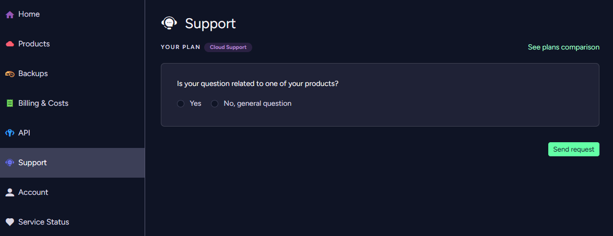
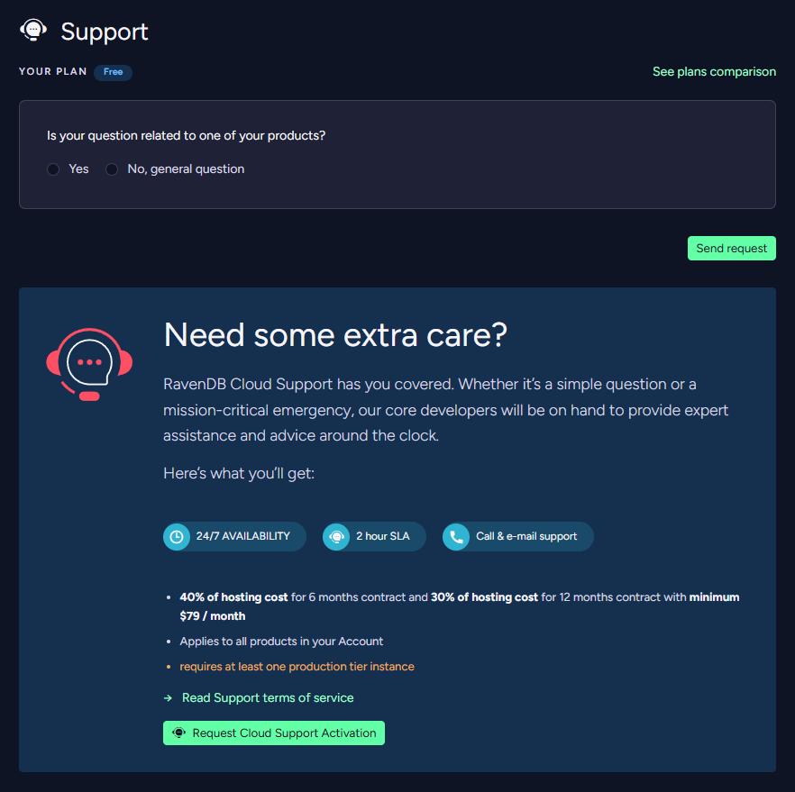
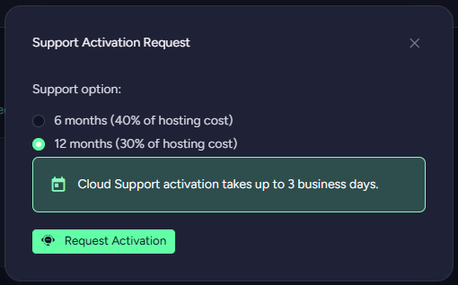

import Admonition from '@theme/Admonition';
import Tabs from '@theme/Tabs';
import TabItem from '@theme/TabItem';
import CodeBlock from '@theme/CodeBlock';
import LanguageSwitcher from "@site/src/components/LanguageSwitcher";
import LanguageContent from "@site/src/components/LanguageContent";

# Cloud Portal: The Support Tab

<Admonition type="note" title="Note">

Use the Support tab to contact our *RavenDB Cloud* support team.

* In this page:  
  * [The Support Tab](../../cloud/portal/cloud-portal-support-tab.mdx#the-support-tab)  
     * [Submit a General Support request](../../cloud/portal/cloud-portal-support-tab.mdx#submit-a-general-support-request)  
     * [Submit a Product-Related Support request](../../cloud/portal/cloud-portal-support-tab.mdx#submit-a-product-related-support-request)
     * [Request to enable the Cloud Support option](../../cloud/portal/cloud-portal-support-tab.mdx#request-to-enable-the-cloud-support-option)
</Admonition>
## The Support Tab

The root selection is between submitting a support request regarding a **general** topic or a **product-related** one.  
### Submit a General Support request  

   **1**. Select to raise a general question.  
   **2**. Select the issue severity: *Minor*, *Normal*, or *Critical*.  
   **3**. Select the expected response time: *Standard*, *Next business day*, or *Within 2 hours*.  
   **4**. Enter your support request title.  
   **5**. Enter your question.  
   **6**. Submit your support request.

You can read more about the *Severity* and *Response time* types in the [Support](../../cloud/cloud-support.mdx#response-time-types) page.
### Submit a Product-Related Support Request  

    
   **1**. Select to raise a Product-related question.  
   **2**. Select the product you relate to.  
   **3**. Select the issue severity: *Minor*, *Normal*, or *Critical*.  
   **4**. Select the expected response time: *Standard*, *Next business day*, or *Within 2 hours*.  
   **5**. Select the issue category.  
   **6**. Select the option associated with the instance restart action.  
   **7**. Enter your support request title.  
   **8**. Enter your question.  
   **9**. Submit your support request.

You can read more about the *Severity* and *Response time* types in the [Support](../../cloud/cloud-support.mdx#response-time-types) page.
### Request to enable the Cloud Support option

To request the **Cloud Support option**, please click the *Request Cloud Support Activation* button.
This will show you Support Activation Request Form. There you can select type of support you want to activate and send a
support request to our *RavenDB Cloud* support team with *Request Activation* button.

After verification, the support team will add the support option to your account, which 
will be confirmed in a separate email.

<Admonition type="info" title="Info">
Cloud Support activation takes up to **3 business days**.
</Admonition>

You can read more about available *support options* in the [Support](../../cloud/cloud-support.mdx#available-support-options) page.

