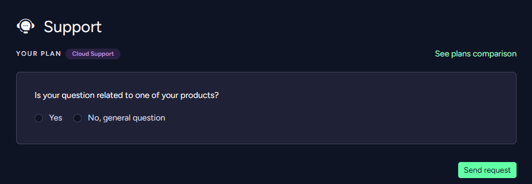
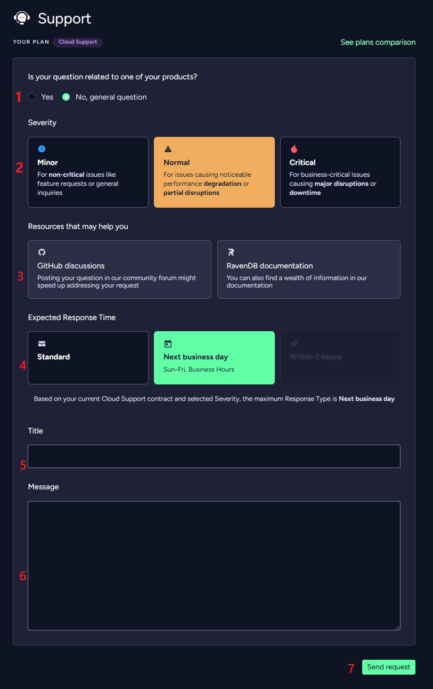
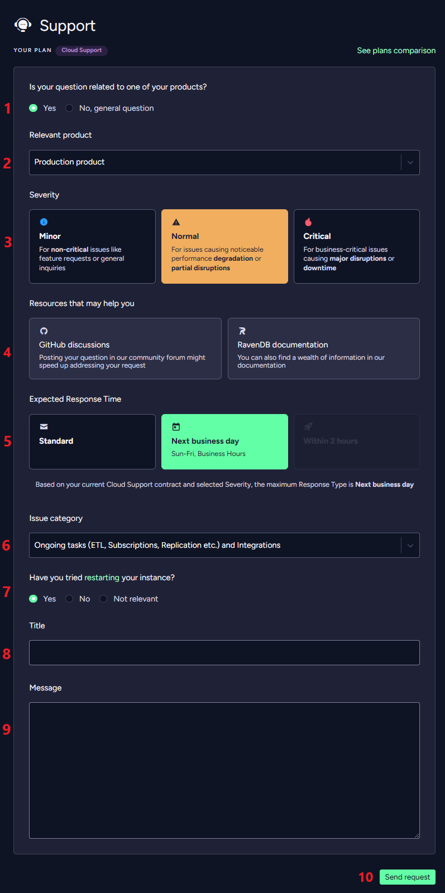
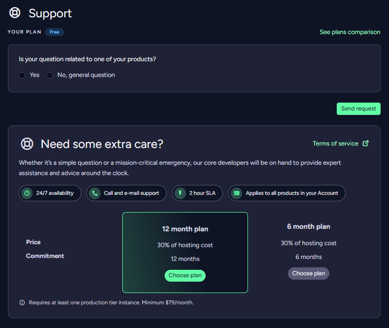
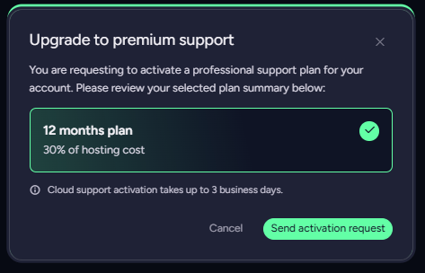
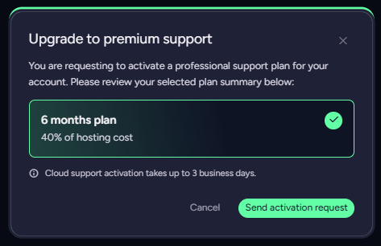

import Admonition from '@theme/Admonition';
import Tabs from '@theme/Tabs';
import TabItem from '@theme/TabItem';
import CodeBlock from '@theme/CodeBlock';
import LanguageSwitcher from "@site/src/components/LanguageSwitcher";
import LanguageContent from "@site/src/components/LanguageContent";

# Cloud Portal: The Support Tab

<Admonition type="note" title="">

Use the Support tab to contact our *RavenDB Cloud* support team.

* In this page:  
  * [The Support Tab](../../cloud/portal/cloud-portal-support-tab.mdx#the-support-tab)  
     * [Submit a General Support request](../../cloud/portal/cloud-portal-support-tab.mdx#submit-a-general-support-request)  
     * [Submit a Product-Related Support request](../../cloud/portal/cloud-portal-support-tab.mdx#submit-a-product-related-support-request)
     * [Resources that may help you](../../cloud/portal/cloud-portal-support-tab.mdx#resources-that-may-help-you)
     * [Request support from a product](../../cloud/portal/cloud-portal-support-tab.mdx#request-support-from-a-product)
     * [Request to enable the Cloud Support option](../../cloud/portal/cloud-portal-support-tab.mdx#request-to-enable-the-cloud-support-option)
</Admonition>
## The Support Tab

The root selection is between submitting a support request regarding a **general** topic or a **product-related** one.  

<Admonition type="note" title="Support role and product access">
A user with the account-level [**Support**](../../cloud/cloud-account.mdx#account-roles) role can open both general and product-related support requests for **any** product on the account — including **terminated** ones — without needing the per-product [**Read**](../../cloud/cloud-account.mdx#product-permissions) permission. The **Support** role only allows filing support requests; it does **not** grant any operational rights on products.
</Admonition>
### Submit a General Support request  

   **1**. Under *Is your question related to one of your products?*, choose **No, general question**.  
   **2**. Select the **Severity**: *Minor*, *Normal*, or *Critical*.  
   **3**. Pass the **Resources that may help you** step — see [below](#resources-that-may-help-you).  
   **4**. Select the **Expected Response Time**: *Standard*, *Next business day*, or *Within 2 hours*.  
   **5**. Enter a **Title**.  
   **6**. Enter your **Message**.  
   **7**. Click **Send request**.

You can read more about the *Severity* and *Response time* types in the [Support](../../cloud/cloud-support.mdx#severity-and-response-time-types) page.
### Submit a Product-Related Support Request  

    
   **1**. Under *Is your question related to one of your products?*, choose **Yes**.  
   **2**. Pick the **Relevant product**.  
   **3**. Select the **Severity**: *Minor*, *Normal*, or *Critical*.  
   **4**. Pass the **Resources that may help you** step — see [below](#resources-that-may-help-you).  
   **5**. Select the **Expected Response Time**: *Standard*, *Next business day*, or *Within 2 hours*.  
   **6**. Select the **Issue category**.  
   **7**. Answer *Have you tried restarting your instance?* — **Yes**, **No**, or **Not relevant**.  
   **8**. Enter a **Title**.  
   **9**. Enter your **Message**.  
   **10**. Click **Send request**.

You can read more about the *Severity* and *Response time* types in the [Support](../../cloud/cloud-support.mdx#severity-and-response-time-types) page.

### Resources that may help you

Both flows include a step you cannot skip. After choosing the severity — and, for a product-related request, the
product — the form shows a **Resources that may help you** panel linking to *GitHub discussions* and the
*RavenDB documentation*, in case your question is already answered there.

Below it, **Still looking for an answer?** offers a **Proceed to create support request** button. The button is briefly
disabled and counts down (*"You can proceed within…"*) before it can be clicked.

The rest of the form — starting with the **Expected Response Time** section — only appears once you click that button.
If you cannot find the response time options, this is why.

### Request support from a product

You do not have to start from the Support view. Every product view carries a
[**Subscription & support**](../../cloud/portal/cloud-portal-products-tab.mdx#subscription-and-support) card, which offers
direct links to the *Documentation*, *GitHub discussions* and the *Discord community*, and shows whether the product is
covered by **Paid support** or the **Free tier**.

* With an **active paid support option**, the panel offers **Request support for this instance**. It takes you to the
  Support view with the question type set to product-related and **this product already selected**, so you only need to
  fill in the request itself. You can still change the selected product before submitting.
* **Without** a paid support option, the panel instead links to a comparison of the paid support plans. See
  [Request to enable the Cloud Support option](../../cloud/portal/cloud-portal-support-tab.mdx#request-to-enable-the-cloud-support-option)
  below.

Opening the Support view directly works exactly as before — no product is pre-selected.

### Request to enable the Cloud Support option

If your account is on the **Free** plan, the Support view also shows a **Need some extra care?** panel offering the paid
support options. It lists what the option includes — *24/7 availability*, *call and e-mail support*, a *2 hour SLA*, and
coverage for **all products in your account** — with a link to the *Terms of service*.

Two commitments are offered — a **12 month plan** and a **6 month plan** — each shown with its price and commitment
length.

Click **Choose plan** on the one you want. An *Upgrade to premium support* dialog opens with a summary of the plan you
picked, which you confirm with **Send activation request**.

<Admonition type="note" title="Requirement">
The paid support option requires at least one **production tier** instance. Its price is a share of your hosting
cost, with a minimum of **$79/month**.
</Admonition>

After verification, the support team will add the support option to your account, which 
will be confirmed in a separate email.

<Admonition type="info" title="">
Cloud Support activation takes up to **3 business days**.
</Admonition>

You can read more about available *support options* in the [Support](../../cloud/cloud-support.mdx#available-support-options) page.

