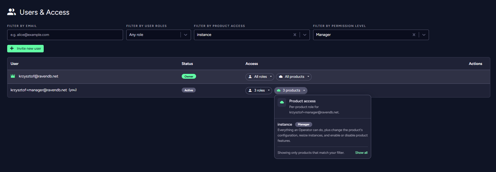
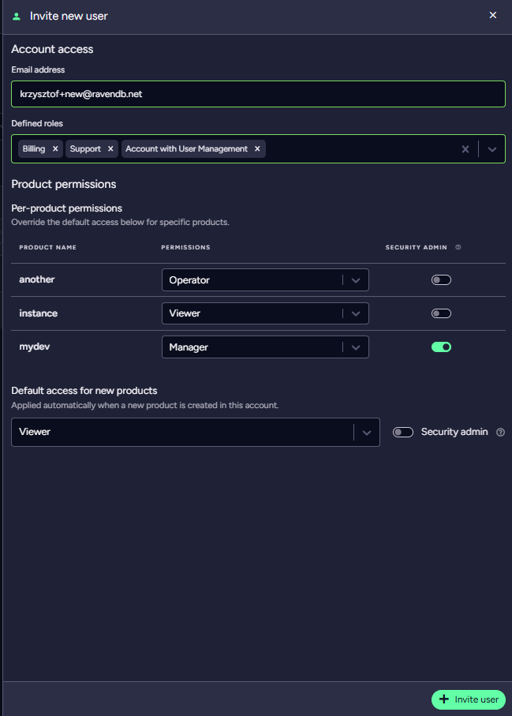
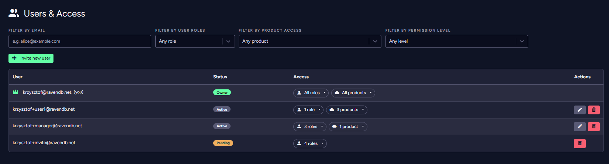
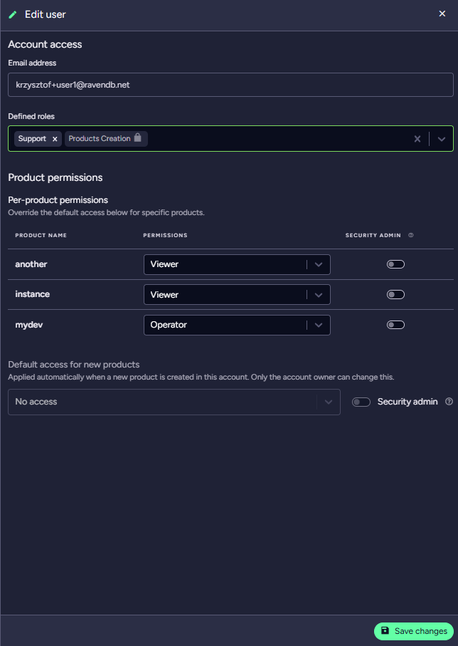

import Admonition from '@theme/Admonition';
import Tabs from '@theme/Tabs';
import TabItem from '@theme/TabItem';
import CodeBlock from '@theme/CodeBlock';
import LanguageSwitcher from "@site/src/components/LanguageSwitcher";
import LanguageContent from "@site/src/components/LanguageContent";

# Cloud Portal: The Users & Access Tab

<Admonition type="note" title="">

The **Users & Access** page lets you manage all users on your account: invite or remove members, assign their [account roles](../../cloud/cloud-account.mdx#account-roles), and manage their [per-product permissions](../../cloud/cloud-account.mdx#product-permissions).

* In this page:
   * [The users list](../../cloud/portal/cloud-portal-users-and-access-tab.mdx#the-users-list)
   * [Who can manage users and permissions](../../cloud/portal/cloud-portal-users-and-access-tab.mdx#who-can-manage-users-and-permissions)
   * [Adding a new user](../../cloud/portal/cloud-portal-users-and-access-tab.mdx#adding-a-new-user)
   * [Removing a user](../../cloud/portal/cloud-portal-users-and-access-tab.mdx#removing-a-user)
   * [Managing existing users](../../cloud/portal/cloud-portal-users-and-access-tab.mdx#managing-existing-users)
</Admonition>

## The users list

The Users & Access page lists every user on the account. Each row shows the user's **email**, their **status** (*Owner*, *Active*, or a pending invitation), and their **access** — split into their assigned [account roles](../../cloud/cloud-account.mdx#account-roles) and their per-product access.

Access is shown as two compact chips you can expand — for example *3 roles* and *3 products*. Expanding the product-access chip lists each product the user can access together with its level: the resolved [permission preset](../../cloud/cloud-account.mdx#permission-presets) (*Viewer*, *Operator*, *Manager*, or *Admin*), a **Security admin** badge where that add-on is enabled, or **Custom** for a legacy permission set that does not match any preset. The **Account Owner** is shown with full access to all products. Your own row is displayed the same way.

You can filter the list by email, by account role, by product access, and by permission level.

## Who can manage users and permissions

Managing users, roles, and product permissions is limited to the **Account Owner** and users with the **Account with User Management** role.

A user with the **Account with User Management** role can modify the roles of other users, with the exception of other **Account with User Management** users. They cannot assign or remove account roles that they do not possess themselves.

<Admonition type="note" title="Example" id="example" href="#example">
  A user with the **Account with User Management** and **Products Creation** roles can assign the **Products Creation** role to another user (provided that user does not have the **Account with User Management** role).
  A user with the **Account with User Management** and **Products Creation** roles cannot assign the **Billing** role to another user.
</Admonition>

Only the **Account Owner** can modify the roles of users who have the **Account with User Management** role, or assign/remove that specific role. The **Account Owner** can modify any role for any user.

Per-product permissions follow the same principle: in the edit-user panel, product controls are **locked with a padlock** for products the acting manager cannot access. See [Product permissions](../../cloud/cloud-account.mdx#who-can-manage-product-permissions) for the full rules.

You can read more about *account roles* and *product permissions* on the [Account](../../cloud/cloud-account.mdx#account-roles) page.

## Adding a new user

Click **Invite new user** at the top of the users list to open the invite panel. Both account roles and per-product permissions are set in this single panel.

   **1**. Provide an *email address*.
   **2**. Select the user's [account roles](../../cloud/cloud-account.mdx#account-roles).
   **3**. Assign *per-product permissions* using the [presets](../../cloud/cloud-account.mdx#permission-presets), and optionally set the user's [**Default access for new products**](../../cloud/cloud-account.mdx#default-access-for-new-products).
   **4**. Click **Invite user** to send the invitation.

## Removing a user

Each row in the users list has action buttons in the **Actions** column.

   * Click **Remove** (the trash icon) to remove an active user from the account.
   * Click **Cancel invitation** (the trash icon on a pending row) to withdraw a pending invitation.

The **Account Owner** row and your own row have no removal button.

## Managing existing users

Click the **Edit** button on a user's row to open the edit panel. As with the invite panel, account roles and per-product permissions are managed together here.

   **1**. Adjust the user's [account roles](../../cloud/cloud-account.mdx#account-roles).
   **2**. Adjust *per-product permissions* using the presets. Each preset shows a short description of what it grants. Products you cannot access yourself are **locked** (see the [subset rule](#who-can-manage-users-and-permissions) above). If you are the **Account Owner**, you can also update the user's **Default access for new products** here.
   **3**. Click **Save changes**.

<Admonition type="note" title="No access to a product">
Opening a product you have no access to shows a clear message — asking you to have your account administrator grant access via **Users & Access** — rather than a bare error. Ask an account administrator (the Account Owner or a user with the **Account with User Management** role) to grant you the appropriate [product permissions](../../cloud/cloud-account.mdx#product-permissions).
</Admonition>
