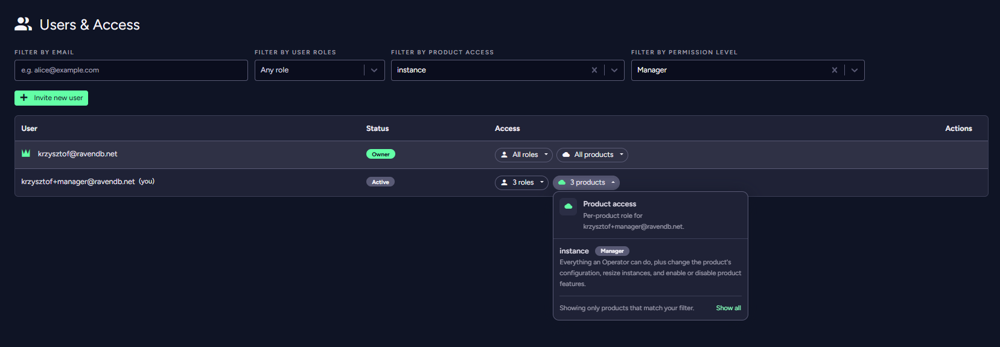
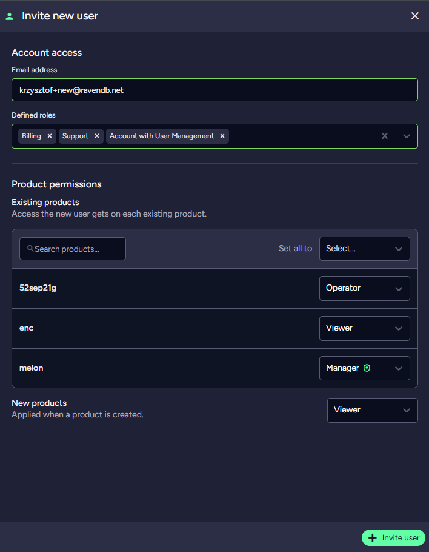
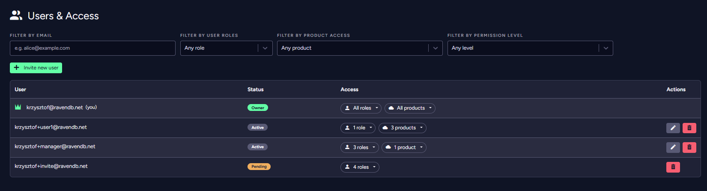
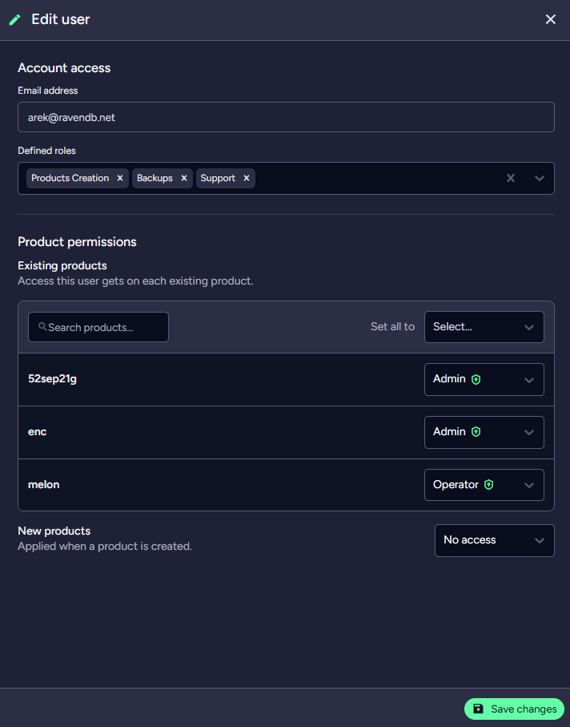

import Admonition from '@theme/Admonition';
import Tabs from '@theme/Tabs';
import TabItem from '@theme/TabItem';
import CodeBlock from '@theme/CodeBlock';
import LanguageSwitcher from "@site/src/components/LanguageSwitcher";
import LanguageContent from "@site/src/components/LanguageContent";

# Cloud Portal: The Users & Access Tab

<Admonition type="note" title="">

The **Users & Access** page lets you manage all users on your account: invite or remove members, assign their [account roles](../../cloud/cloud-account.mdx#account-roles), and manage their [per-product permissions](../../cloud/cloud-account.mdx#product-permissions).

* In this page:
   * [The users list](../../cloud/portal/cloud-portal-users-and-access-tab.mdx#the-users-list)
   * [Who can manage users and permissions](../../cloud/portal/cloud-portal-users-and-access-tab.mdx#who-can-manage-users-and-permissions)
   * [Adding a new user](../../cloud/portal/cloud-portal-users-and-access-tab.mdx#adding-a-new-user)
   * [Adding an SSO user](../../cloud/portal/cloud-portal-users-and-access-tab.mdx#adding-an-sso-user)
   * [Accepting an invitation](../../cloud/portal/cloud-portal-users-and-access-tab.mdx#accepting-an-invitation)
   * [Removing a user](../../cloud/portal/cloud-portal-users-and-access-tab.mdx#removing-a-user)
   * [Managing existing users](../../cloud/portal/cloud-portal-users-and-access-tab.mdx#managing-existing-users)
</Admonition>

## The users list

The Users & Access page lists every user on the account. Each row shows the user's **email**, their **status** (*Owner*, *Active*, or a pending invitation), and their **access** — split into their assigned [account roles](../../cloud/cloud-account.mdx#account-roles) and their per-product access.

When [External SSO](../../cloud/cloud-sso.mdx) is active, the list is split into two tables: **Cloud users**, who sign in with a magic link or with Google, GitHub or Microsoft, and **SSO users**, who sign in through your identity provider.

Access is shown as two compact chips you can expand — for example *3 roles* and *3 products*. Expanding the product-access chip lists each product the user can access together with its level: the resolved [permission preset](../../cloud/cloud-account.mdx#permission-presets) (*Viewer*, *Operator*, *Manager*, or *Admin*), a **Security admin** badge where that add-on is enabled, or **Custom** for a legacy permission set that does not match any preset. The **Account Owner** is shown with full access to all products. Your own row is displayed the same way.

You can filter the list by email, by account role, by product access, and by permission level.

## Who can manage users and permissions

Managing users, roles, and product permissions is limited to the **Account Owner** and users with the **Account with User Management** role.

A user with the **Account with User Management** role can modify the roles of other users, with the exception of other **Account with User Management** users. They cannot assign or remove account roles that they do not possess themselves.

<Admonition type="note" title="Example" id="example" href="#example">
  A user with the **Account with User Management** and **Products Creation** roles can assign the **Products Creation** role to another user (provided that user does not have the **Account with User Management** role).
  A user with the **Account with User Management** and **Products Creation** roles cannot assign the **Billing** role to another user.
</Admonition>

Only the **Account Owner** can modify the roles of users who have the **Account with User Management** role, or assign/remove that specific role. The **Account Owner** can modify any role for any user.

Per-product permissions follow the same principle: in the edit-user panel, product controls are **locked with a padlock** for products the acting manager cannot access. See [Product permissions](../../cloud/cloud-account.mdx#who-can-manage-product-permissions) for the full rules.

You can read more about *account roles* and *product permissions* on the [Account](../../cloud/cloud-account.mdx#account-roles) page.

## Adding a new user

Click **Invite new user** at the top of the users list to open the invite panel. Both account roles and per-product permissions are set in this single panel.

<Admonition type="note" title="">
When [External SSO](../../cloud/cloud-sso.mdx) is active in *Sign-in only* mode, the button reads **Add new SSO user**. To invite a Cloud user, open its dropdown and select **Invite new Cloud user**.
</Admonition>

   **1**. Provide an *email address*.
   **2**. Select the user's [account roles](../../cloud/cloud-account.mdx#account-roles).
   **3**. Under **Product permissions**, set the user's access to each product listed in **Existing products**, by choosing a [preset](../../cloud/cloud-account.mdx#permission-presets) from the product's access-level menu. The **Security admin** add-on is a switch at the bottom of the same menu. Use **Search products** to find a product, and **Set all to** to apply one level to all listed products.
   **4**. If you are the **Account Owner**, optionally set the user's [default access for new products](../../cloud/cloud-account.mdx#default-access-for-new-products) under **New products**.
   **5**. Click **Invite user** to send the invitation.

## Adding an SSO user

When [External SSO](../../cloud/cloud-sso.mdx) is active in **Sign-in only** mode, you add the people who sign in through your identity provider as SSO users:

   **1**. Click **Add new SSO user**.
   **2**. Enter the user's *email address* — the address your identity provider reports for them.
   **3**. Select the user's [account roles](../../cloud/cloud-account.mdx#account-roles). If you are the **Account Owner**, you can also set their access to **New products**.
   **4**. Click **Add user**.

Adding an SSO user sends no email. Share the **Sign-in link for your team** from the SSO settings page with them — see [Signing in with SSO](../../cloud/cloud-sso.mdx#signing-in-with-sso). To give an SSO user access to existing products, [edit](#managing-existing-users) the user after adding them.

In **Sign-in and user provisioning (SCIM)** mode, your identity provider creates the SSO users, so they are not added here.

## Accepting an invitation

An invited user receives an email with an invitation link.

* **From the email** — click the link, then **Sign in & accept the invitation**. If you do not have a RavenDB Cloud login for that email address yet, you are taken to registration first. If the link has expired, is invalid, or has already been used, the page says so — ask the account administrator for a new invitation.
* **From the Portal** — open the profile menu at the bottom of the sidebar and select **Invitations**. Click **Accept** on the pending invitation. The Portal confirms with *Joined …*, and the account appears under **Organizations**. If accepting fails, you see *Couldn't accept the invitation — try again.*

## Removing a user

Each row in the users list has action buttons in the **Actions** column.

   * Click **Remove** (the trash icon) to remove an active user from the account.
   * Click **Cancel invitation** (the trash icon on a pending row) to withdraw a pending invitation.

The **Account Owner** row and your own row have no removal button.

## Managing existing users

Click the **Edit** button on a user's row to open the edit panel. As with the invite panel, account roles and per-product permissions are managed together here.

   **1**. Adjust the user's [account roles](../../cloud/cloud-account.mdx#account-roles).
   **2**. Adjust *per-product permissions* under **Existing products**, using each product's access-level menu. Each preset shows a short description of what it grants. Products you cannot access yourself are **locked** (see the [subset rule](#who-can-manage-users-and-permissions) above). If you are the **Account Owner**, you can also update the user's default access under **New products**.
   **3**. Click **Save changes**.

<Admonition type="note" title="SSO users managed by your identity provider">
In **Sign-in and user provisioning (SCIM)** mode, SSO users cannot be edited or removed here: their **Edit** and **Remove** buttons are disabled. Their roles and product permissions come from the [group to role mapping](../../cloud/cloud-sso.mdx#group-to-role-mapping), and they are removed by deactivating them at your identity provider.
</Admonition>

<Admonition type="note" title="No access to a product">
Opening a product you have no access to shows a clear message — asking you to have your account administrator grant access via **Users & Access** — rather than a bare error. Ask an account administrator (the Account Owner or a user with the **Account with User Management** role) to grant you the appropriate [product permissions](../../cloud/cloud-account.mdx#product-permissions).
</Admonition>
