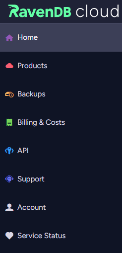

import Admonition from '@theme/Admonition';
import Tabs from '@theme/Tabs';
import TabItem from '@theme/TabItem';
import CodeBlock from '@theme/CodeBlock';
import LanguageSwitcher from "@site/src/components/LanguageSwitcher";
import LanguageContent from "@site/src/components/LanguageContent";

# Cloud Portal  

<Admonition type="note" title="Note">

[Logging into your account](../../cloud/cloud-overview#login-to-your-account)
takes you to your account's Portal, which gives you access to all the different aspects of your cloud account.

* In this page:
    * [Cloud Portal overview](../../cloud/portal/cloud-portal#cloud-portal-overview)  
</Admonition>
## Cloud Portal overview

* **[The Home Tab](../../cloud/portal/cloud-portal-home-tab)**  
  Use this tab to manage your account and assigned roles, and to view useful resources.

* **[The Products Tab](../../cloud/portal/cloud-portal-products-tab)**  
  Use this tab to [provision new products](../../cloud/portal/cloud-portal-products-tab#provisioning-a-new-product) and
  [manage existing ones](../../cloud/portal/cloud-portal-products-tab#managing-an-existing-product).  

* **[The Backups Tab](../../cloud/portal/cloud-portal-backups-tab)**  
  Use this tab to view and restore [mandatory database backups](../../cloud/cloud-backup-and-restore#the-mandatory-backup-routine)
  that your instances have created for you.

* **[The Billing & Costs Tab](../../cloud/portal/cloud-portal-billing-tab)**  
  Use the Billing & Costs tab to view your billing history and expected payments.

* **[The API Tab](../../cloud/portal/cloud-portal-api-tab)**  
  Use the API tab to explore the RavenDB Cloud API and manage your API keys.

* **[The Support Tab](../../cloud/portal/cloud-portal-support-tab)**  
  Use this tab to contact Support regarding [general issues](../../cloud/portal/cloud-portal-support-tab#submit-a-general-support-call),
  [product-specific issues](../../cloud/portal/cloud-portal-support-tab#submit-a-product-specific-support-call) and special requests.

* **[The Account Tab](../../cloud/portal/cloud-portal-account-tab)**  
  Use the account tab to view and edit your invoices and credit card information.

* **[The Service Status Tab](https://status.ravendb.net/)**  
  Use this tab to check the status of our system and view active and archived incidents.

