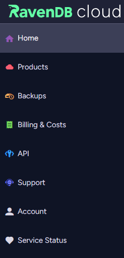

import Admonition from '@theme/Admonition';
import Tabs from '@theme/Tabs';
import TabItem from '@theme/TabItem';
import CodeBlock from '@theme/CodeBlock';
import LanguageSwitcher from "@site/src/components/LanguageSwitcher";
import LanguageContent from "@site/src/components/LanguageContent";

# Cloud Portal  

<Admonition type="note" title="">

[Logging into your account](../cloud-overview.mdx#login-to-your-account)
takes you to your account's Portal, which gives you access to all the different aspects of your cloud account.

* In this page:
    * [Cloud Portal overview](#cloud-portal-overview)  
</Admonition>
## Cloud Portal overview

* **[The Home Tab](./cloud-portal-home-tab.mdx)**  
  Use this tab to manage your account and assigned roles, and to view useful resources.

* **[The Products Tab](./cloud-portal-products-tab.mdx)**  
  Use this tab to [provision new products](./cloud-portal-products-tab.mdx#provisioning-a-new-product) and
  [manage existing ones](./cloud-portal-products-tab.mdx#managing-an-existing-product).  

* **[The Backups Tab](./cloud-portal-backups-tab.mdx)**  
  Use this tab to view and restore [mandatory database backups](../cloud-backup-and-restore.mdx#the-mandatory-backup-routine)
  that your instances have created for you.

* **[The Billing & Costs Tab](./cloud-portal-billing-tab.mdx)**  
  Use the Billing & Costs tab to view your billing history and expected payments.

* **[The API Tab](./cloud-portal-api-tab.mdx)**  
  Use the API tab to explore the RavenDB Cloud API and manage your API keys.

* **[The Support Tab](./cloud-portal-support-tab.mdx)**  
  Use this tab to contact Support regarding [general issues](./cloud-portal-support-tab.mdx#submit-a-general-support-request),
  [product-specific issues](./cloud-portal-support-tab.mdx#submit-a-product-related-support-request) and special requests.

* **[The Account Tab](./cloud-portal-account-tab.mdx)**  
  Use the account tab to view and edit your invoices and credit card information.

* **[The Service Status Tab](https://status.ravendb.net/)**  
  Use this tab to check the status of our system and view active and archived incidents.

