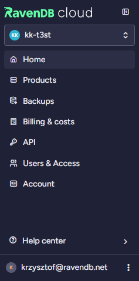

import Admonition from '@theme/Admonition';
import Tabs from '@theme/Tabs';
import TabItem from '@theme/TabItem';
import CodeBlock from '@theme/CodeBlock';
import LanguageSwitcher from "@site/src/components/LanguageSwitcher";
import LanguageContent from "@site/src/components/LanguageContent";

# Cloud Portal  

<Admonition type="note" title="">

[Logging into your account](../../cloud/cloud-overview.mdx#login-to-your-account)
takes you to your account's Portal, which gives you access to all the different aspects of your cloud account.

* In this page:
    * [Cloud Portal overview](../../cloud/portal/cloud-portal.mdx#cloud-portal-overview)  
        * [Sidebar views](../../cloud/portal/cloud-portal.mdx#sidebar-views)  
        * [Help center](../../cloud/portal/cloud-portal.mdx#help-center)  
        * [Profile](../../cloud/portal/cloud-portal.mdx#profile)  
</Admonition>
## Cloud Portal overview

You navigate the Portal from the **sidebar** on the left. It can be collapsed to icons only, using the control next to
the logo, to give the current view more room.

At the top of the sidebar, the **account switcher** lets you move between the cloud accounts you have access to. Each
account is identified by its **domain name**. See
[Multi-account configuration](../../cloud/cloud-account.mdx#multi-account-configuration).

### Sidebar views

* **[Home](../../cloud/portal/cloud-portal-home-tab.mdx)**  
  Manage your account and assigned roles, and view useful resources.

* **[Products](../../cloud/portal/cloud-portal-products-tab.mdx)**  
  [Provision new products](../../cloud/portal/cloud-portal-products-tab.mdx#provisioning-a-new-product) and
  [manage existing ones](../../cloud/portal/cloud-portal-products-tab.mdx#managing-an-existing-product), including their
  [metrics](../../cloud/portal/cloud-portal-products-tab.mdx#view-the-product-metrics),
  [cluster health](../../cloud/portal/cloud-portal-products-tab.mdx#view-the-cluster-health) and
  [alerts](../../cloud/portal/cloud-portal-products-tab.mdx#view-the-alerts).

* **[Backups](../../cloud/portal/cloud-portal-backups-tab.mdx)**  
  View and restore [mandatory database backups](../../cloud/cloud-backup-and-restore.mdx#the-mandatory-backup-routine)
  that your instances have created for you.

* **[Billing & costs](../../cloud/portal/cloud-portal-billing-tab.mdx)**  
  View your billing history, expected payments and a
  [breakdown of your costs](../../cloud/portal/cloud-portal-billing-tab.mdx#cost-details).

* **[API](../../cloud/portal/cloud-portal-api-tab.mdx)**  
  Explore the RavenDB Cloud API and manage your API keys.

* **[Users & Access](../../cloud/portal/cloud-portal-users-and-access-tab.mdx)**  
  Invite account members and manage their [account roles](../../cloud/cloud-account.mdx#account-roles) and
  [per-product permissions](../../cloud/cloud-account.mdx#product-permissions).

* **[Account](../../cloud/portal/cloud-portal-account-tab.mdx)**  
  View and edit your invoices and credit card information.

<Admonition type="note" title="">
Which views you see depends on your access — for example, *Billing & costs* requires the **Billing**
[account role](../../cloud/cloud-account.mdx#account-roles), and *Users & Access* requires
**Account with User Management**. Views you have no role for are not shown.

**Products** is gated differently: it appears if you hold the **Products Creation**
[account role](../../cloud/cloud-account.mdx#account-roles), or if you have
[per-product permissions](../../cloud/cloud-account.mdx#product-permissions) on at least one product. The
**Account Owner** always sees it.
</Admonition>

### Help center

The **Help center** entry at the bottom of the sidebar opens a menu with:

* **[Support](../../cloud/portal/cloud-portal-support-tab.mdx)** — contact Support regarding
  [general issues](../../cloud/portal/cloud-portal-support-tab.mdx#submit-a-general-support-request),
  [product-specific issues](../../cloud/portal/cloud-portal-support-tab.mdx#submit-a-product-related-support-request)
  and special requests. This entry requires the **Support**
  [account role](../../cloud/cloud-account.mdx#account-roles); the other three are always available.
* **Documentation** — this documentation.
* **Community** — the RavenDB community resources.
* **[Service status](https://status.ravendb.net/)** — the status of our system, with active and archived incidents.

### Profile

The **profile** entry, also at the bottom of the sidebar, shows your user name and gives you access to your profile
settings — including [Multi-Factor Authentication](../../cloud/cloud-security.mdx#mfa) — and to **Log out**.

