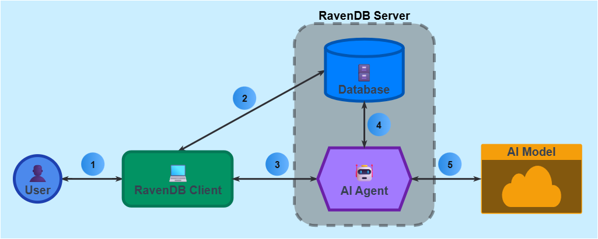

import Admonition from '@theme/Admonition';
import Tabs from '@theme/Tabs';
import TabItem from '@theme/TabItem';
import CodeBlock from '@theme/CodeBlock';
import LanguageSwitcher from "@site/src/components/LanguageSwitcher";
import LanguageContent from "@site/src/components/LanguageContent";

# AI agents: Overview
<Admonition type="note" title="">

* An **AI Agent** is an ongoing service that resides on a RavenDB server.  
  After its creation by a RavenDB client, an agent can respond to client requests by mediating between the client, an AI model, and a RavenDB database.  
  
* An AI agent can provide the AI model with a set of Query and Action tools.  
  The AI model can then facilitate these tools and query the database or request the client to perform actions.  

* The client gains this way the ability to communicate with an AI model that has access to the database, and to easily automate complex workflows that leverage the AI model's insights and suggestions.  

* In this article:
   * [Common use cases](../../ai-integration/ai-agents/ai-agents_overview#common-use-cases)  
   * [Defining and running AI agents](../../ai-integration/ai-agents/ai-agents_overview#defining-and-running-an-ai-agent)
      * [The main stages in defining an AI agent](../../ai-integration/ai-agents/ai-agents_overview#the-main-stages-in-defining-an-ai-agent)
      * [Initiating a conversation](../../ai-integration/ai-agents/ai-agents_overview#initiating-a-conversation)
   * [AI agent usage flow chart](../../ai-integration/ai-agents/ai-agents_overview#ai-agent-usage-flow-chart)
   * [Streaming LLM responses (RavenDB 7.1.3 and up)](../../ai-integration/ai-agents/ai-agents_overview#streaming-llm-responses-ravendb-713-and-up)
   * [Security concerns](../../ai-integration/ai-agents/ai-agents_overview#security-concerns)
   * [AI agents and other AI features](../../ai-integration/ai-agents/ai-agents_overview#ai-agents-and-other-ai-features)

</Admonition>

## Common use cases

AI agents are designed to easily integrate AI capabilities into applications and workflows. They can interact with users, intelligently retrieve and process data from public sites and proprietary databases, and apply actions based on roles they are requested to take and the data they have access to. Some of the tasks and applications they can be tailored to perform include:  

* **Customer support chatbot agents** can answer customer queries based on information available to the public as well as internal knowledge bases, provide troubleshooting steps, and guide users through processes in real time.  

* **Data analysis and reporting agents** can analyze large datasets to extract relevant data and present it in a user-friendly format, escalate customer issues and application output, create reports and highlight points of interest, and help businesses make informed decisions.  

* **Automated content generation agents** can generate summaries, add automated comments to articles and and application-generated contents, reference readers to related material, and create marketing content based on user input and stored information.

* **Workflow automation agents** can automate repetitive tasks such as email sorting, spam filtering, form filling, or file organization.  

* **Intelligent recommendation agents** can provide personalized recommendations based on user preferences and available data, e.g. a _library assistant_ suggesting books and other resources, an _HR office assistant_ recommending rewards for employees based on their performance and available facilities near their residence, or an _e-commerce assistant_ recommending products.  

## Defining and running an AI agent

An AI agent is defined by a client and runs on a RavenDB server.  
Once defined, the agent can be invoked by the client to handle user requests, respond to events tracked by the client, and so on.  

<Admonition type="note" title="">
* [Learn to create an AI agent using the client API](../../ai-integration/ai-agents/creating-ai-agents/creating-ai-agents_api)  
* [Learn to create an AI agent using Studio](../../ai-integration/ai-agents/creating-ai-agents/creating-ai-agents_studio)  
</Admonition>

### The main stages in defining an AI agent:
To define an AI agent, the client needs to specify -  

* A **connection string** to the AI model  

* An **agent configuration** that includes:  

  * Basic agent settings, like the unique ID by which the system recognizes the task.  

  * A **system prompt** that defines AI model characteristics like its role.  

  * Optional **agent parameters** whose values will be provided by the client when starting a 
    conversation.  
    Agent parameters can be included in queries triggered by the LLM.  

  * <a id="initial-context-queries"/>Optional **query tools** that the LLM will be able to invoke freely.  
    The LLM will be able to use these tools to query the database through the agent and get the results.  
    <Admonition type="note" title="">
    You can optionally mark a query tool as an **initial context query**.  
    Initial context queries are executed by the agent immediately when it starts a conversation with the LLM, without waiting for the LLM to invoke them, to include data that is relevant for the conversation in the initial context sent to the LLM.  
    E.g., an initial context query can provide the LLM the last 5 orders placed by a customer, as context for an answer that the LLM is requested to provide about the customer's order history.  
    </Admonition>
    <a id="llm-parameters"/>A query tool's RQL query may include -  
      * **Agent parameters** whose values are provided by the client (discussed below).  
      * **LLM parameters** whose values will be provided by the LLM when it invokes the query tool.  
        The LLM can fill these parameters with values that are relevant to the current conversation.  
        E.g.,  
        A query tool's RQL query may include an LLM parameter called `$productCategory`.  
        When the LLM invokes this query tool, it may fill `$productCategory` with `smartphones`, to get data about smartphones from the database.  
        The agent will replace `$productCategory` with `smartphones` before running the query.  

  * Optional **action tools** that the LLM will be able to invoke freely.  
    The LLM will be able to use these tools to request the client to perform actions.  

### Initiating a conversation:
To start a conversation with the LLM, the agent will send it an **initial context** that includes -  

* Pre-defined [agent configuration](../../ai-integration/ai-agents/ai-agents_overview#the-main-stages-in-defining-an-ai-agent) elements (automatically sent by the agent):  
   * The system prompt  
   * Optional agent parameters  
   * Optional Query tools,  
     and if any query tool is marked as an initial context query - results for this query.  
   * Optional Action tools  

* A **response object** - a JSON schema that defines the layout for the LLM response.  
  The response object can be defined either as part of the pre-set agent configuration,  
  or by the client when it invokes the agent.  
  <Admonition type="note" title="">
  Allowing the client to set the response object when it starts the agent gives it the ability to tailor each conversation to its current needs.  
  </Admonition>
  
* **Values for agent parameters**  
  If agent parameters were defined in the agent configuration, the client is required to provide their values to the agent when starting a conversation.  

     E.g.,  
     The agent configuration may include an agent parameter called `$country`.  
     A query tool may include an RQL query like `from "Orders" where ShipTo.Country == $country`, using this agent parameter.  
     When the client starts a conversation with the agent, it will be required to provide the value for `$country`, e.g. `France`.  
     When the LLM requests the agent to invoke this query tool, the agent will replace `$country` with `France` before running the query.  

     <Admonition type="note" title="">
     Providing query values when starting a conversation gives the client the ability to shape and limit the scope of LLM queries by its objectives.  
     </Admonition>

* Optional **conversation history**  
  To continue a conversation with the LLM, the agent will need to send it the entire history of the conversation so far.  
  Conversations are automatically kept in documents in the `@conversations` collection. The client will need to reference the agent to the conversation that it wants to continue.  

* A **user prompt**, set by the client, that defines this part of the conversation.  
  The user prompt may be, for example, a question or a request for particular information.  

## AI agent usage flow chart

The flow chart below illustrates interactions between the User, RavenDB client, AI agent, AI model, and RavenDB database.  

1. **User`<->`Client** flow  
   Users can use clients that interact with the AI agent.  
   The user can provide agent parameters values through the client, and get responses from the agent.

2. **Client`<->`Database** flow  
   The client can interact with the database directly, either by its own initiative or as a result of AI agent action requests (query requests are handled by the agent).  
   When performing actions on behalf of the AI agent, the client will return the agent the results of these actions.  

3. **Client`<->`Agent** flow  
    * To invoke an agent, the client needs to provide it with an [initial context](../../ai-integration/ai-agents/ai-agents_overview#initiating-a-conversation).  
    * During the conversation, the agent may send to the client action requests on behalf of the LLM.  
      The client will need to process these requests and return action results to the agent.  
    * When the LLM provides the agent with its final response, the agent will provide it to the client.  
      The client does not need to reply to this message.  
    * E.g., the client can pass the agent a research topic, a user prompt that guides the AI model to 
      act as a research assistant, and the history of the conversation so far.  
      The agent can respond with a summary of the research topic, and a request for the client to save it in the database.  

4. **Agent`<->`Database** flow  
    * The agent can query the database on behalf of the AI model.  
      When the query ends, the agent will return its results to the AI model.  
    * When the agent is requested to run a query that includes _agent parameters_, 
      it will replace these parameters with values provided by the client before 
      running the query.  
    * When the agent is requested to run a query that includes _LLM parameters_, 
      it will replace these parameters with values provided by the LLM before 
      running the query.  

5. **Agent`<->`Model** flow  
    * **When a conversation is started**, the agent needs to provide the AI model with 
      an [initial context](../../ai-integration/ai-agents/ai-agents_overview#initiating-a-conversation), partly defined by the agent configuration and partly by the client.  
    * **During the conversation**, the AI model can respond to the agent with -  
       * Requests for queries.  
         If a query includes LLM parameters, the LLM will include values for them, and the agent will replace the parameters with these values, run the query, and return its results to the LLM.  
         If a query includes agent parameters, the agent will replace them with values provided by the client, run the query, and return its results to the LLM.
       * Requests for actions.  
         The agent will pass such requests to the client and return their results to the LLM.  
       * The final response to the user prompt, in the layout defined by the response object.  
         The agent will pass the response to the client (which doesn't need to reply to it).  

## Streaming LLM responses (RavenDB 7.1.3 and up)

Rather than wait for the LLM to finish generating a response and then pass it in its entirety to the client, the agent can stream response chunks (determined by the LLM, e.g. words or symbols) to the client one by one, immediately as each chunk is returned by the LLM, allowing the client to process and display the response gradually.  

Streaming can ease the processing of lengthy LLM responses for clients, and create a better user experience by keeping users from waiting and providing them with a continuous, fluent interaction.  

Streaming is supported by most AI models, including OpenAI services like GPT-4 and Ollama models.  

[Learn how to stream LLM responses using the API](../../ai-integration/ai-agents/creating-ai-agents/creating-ai-agents_api#stream-llm-responses)  

## Security concerns

https://issues.hibernatingrhinos.com/issue/RavenDB-24777/AI-Agent-Security-Concerns

## AI agents and other AI features

### AI agents and vector search
