import Admonition from '@theme/Admonition';
import Tabs from '@theme/Tabs';
import TabItem from '@theme/TabItem';
import CodeBlock from '@theme/CodeBlock';
import LanguageSwitcher from "@site/src/components/LanguageSwitcher";
import LanguageContent from "@site/src/components/LanguageContent";
import Panel from "@site/src/components/Panel";
import ContentFrame from "@site/src/components/ContentFrame";

# AI Agents Integration: Studio
<Admonition type="note" title="">

* In this article:
   * [Create AI Agent](../../../ai-integration/ai-agents/creating-ai-agents/creating-ai-agents_studio.mdx#create-ai-agent)  
   * [Configure basic settings](../../../ai-integration/ai-agents/creating-ai-agents/creating-ai-agents_studio.mdx#configure-basic-settings)
   * [Set agent parameters](../../../ai-integration/ai-agents/creating-ai-agents/creating-ai-agents_studio.mdx#set-agent-parameters)
   * [Define agent tools](../../../ai-integration/ai-agents/creating-ai-agents/creating-ai-agents_studio.mdx#define-agent-tools)
      * [Add query tools](../../../ai-integration/ai-agents/creating-ai-agents/creating-ai-agents_studio.mdx#add-query-tools)
      * [Add action tools](../../../ai-integration/ai-agents/creating-ai-agents/creating-ai-agents_studio.mdx#add-action-tools)
   * [Define sub-agents](../../../ai-integration/ai-agents/creating-ai-agents/creating-ai-agents_studio.mdx#define-sub-agents)
   * [Configure chat trimming](../../../ai-integration/ai-agents/creating-ai-agents/creating-ai-agents_studio.mdx#configure-chat-trimming)
   * [Save and Run your agent](../../../ai-integration/ai-agents/creating-ai-agents/creating-ai-agents_studio.mdx#save-and-run-your-agent)
      * [Start new chat](../../../ai-integration/ai-agents/creating-ai-agents/creating-ai-agents_studio.mdx#start-new-chat)
      * [Adding file attachments](../../../ai-integration/ai-agents/creating-ai-agents/creating-ai-agents_studio.mdx#adding-file-attachments)
      * [Agent interaction](../../../ai-integration/ai-agents/creating-ai-agents/creating-ai-agents_studio.mdx#agent-interaction)
      * [Action tool dialog](../../../ai-integration/ai-agents/creating-ai-agents/creating-ai-agents_studio.mdx#action-tool-dialog)
      * [Agent results](../../../ai-integration/ai-agents/creating-ai-agents/creating-ai-agents_studio.mdx#agent-results)
   * [Test your agent](../../../ai-integration/ai-agents/creating-ai-agents/creating-ai-agents_studio.mdx#test-your-agent)
      * [Runtime view and Test results](../../../ai-integration/ai-agents/creating-ai-agents/creating-ai-agents_studio.mdx#runtime-view-and-test-results)

</Admonition>

<Panel heading="Create AI Agent">

To create an AI agent, open: **AI hub &gt; AI Agents** and click **Add new agent**

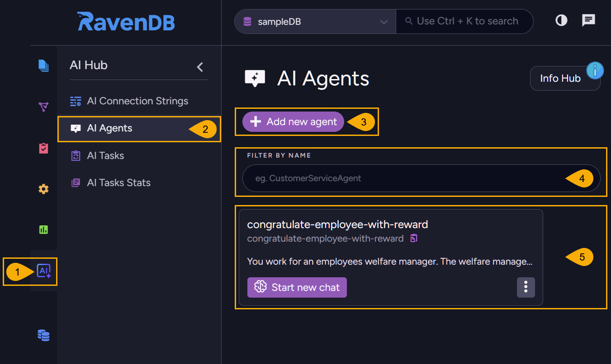

1. **AI Hub**  
   Click to open the [AI Hub view](../../../ai-integration/ai-tasks-list-view.mdx).  
   Use this view to handle AI connection strings and tasks, and to view task statistics.  
2. **AI Agents**  
   Click to open the AI Agents view.  
   Use this view to list, configure, or remove your agents.  
3. **Add new agent**  
   Click to add an AI agent.  

      The **Create AI Agent** dialog will open, allowing you to define and test your agent.  

      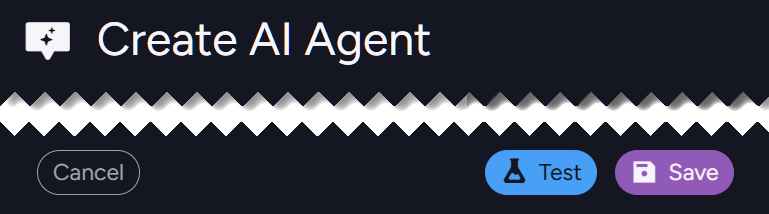

      Use the buttons at the bottom bar to Cancel, Save, or Test your changes.  

4. **Filter by name**  
   When multiple agents are created, you can filter them by a string you enter here.  

5. **Defined agent**  
   After defining an agent, it is listed in this view, allowing you to run, edit, or remove the agent.

</Panel>

<Panel heading="Configure basic settings">

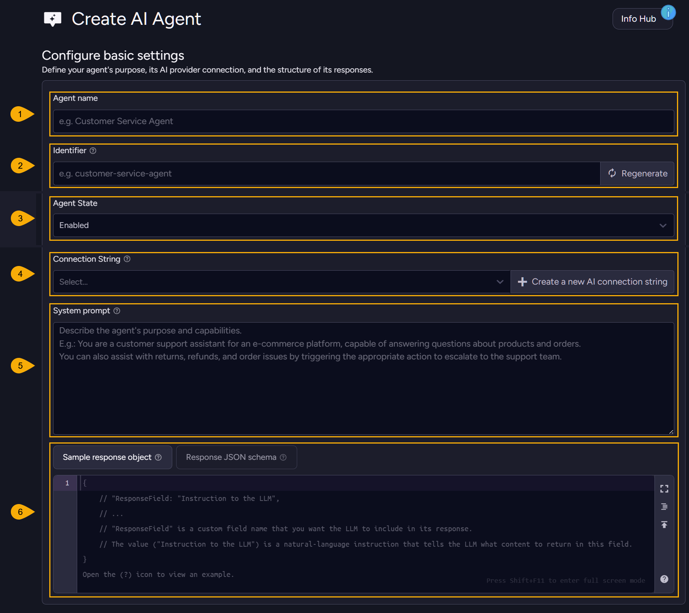

1. **Agent name**  
   Enter a name for the agent.  
   e.g., **CustomerSupportAgent**  

2. **Identifier**  
   Enter a unique identifier for the agent,  
   or click **Regenerate** to create it automatically.  

3. **Agent state**  
   Enable or Disable the agent.

4. **Connection String**  

      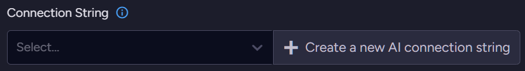
   
      **Select** an existing [connection string](../../../ai-integration/connection-strings/overview.mdx) 
      that the agent will use to connect your LLM of choice,  
      or click **Create a new AI connection string** to define a new string.  
      Your agent can use a local LLM like Ollama, or an external model like OpenAI.  
   
      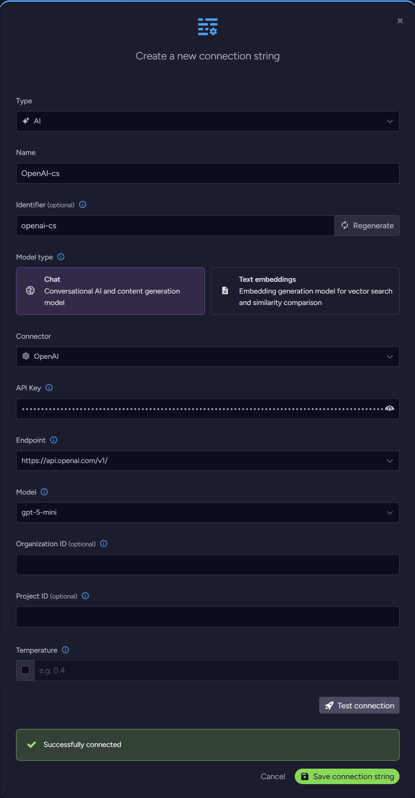

5. **System prompt**  
   Enter a prompt that determines LLM characteristics like its role and purpose.  

6. **Sample response object** and **Response JSON schema**  
   Define a response JSON object for the LLM reply, either as a sample object or as a formal schema.  
    - The response object guides the LLM in composing its replies, and can ease their parsing 
      by the client.  
    - Defining a sample object is normally simpler.  
    - Behind the scenes, RavenDB will translate a sample object to a JSON schema format before sending it to the LLM, but if you prefer, you can define it yourself.  
    - After defining a sample object, you can open the schema tab and click the "View schema" button to see the generated schema.  

      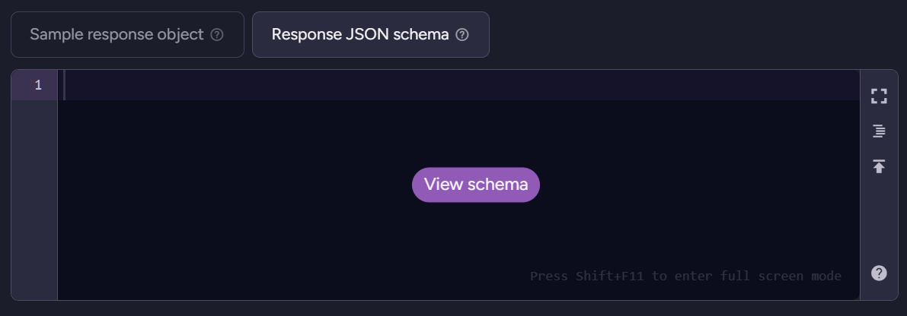

</Panel>

<Panel heading="Set agent parameters">

After setting an agent parameter, it can be included in query tool RQL queries.  
Values for agent parameters are provided by the client when a conversation is started.  
[Read more about agent parameters](../../../ai-integration/ai-agents/overview.mdx#query-parameters).

To add an agent parameter:  
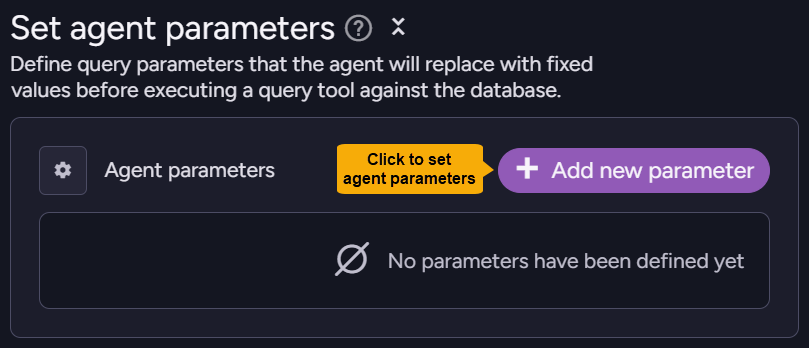

To set agent parameter options:
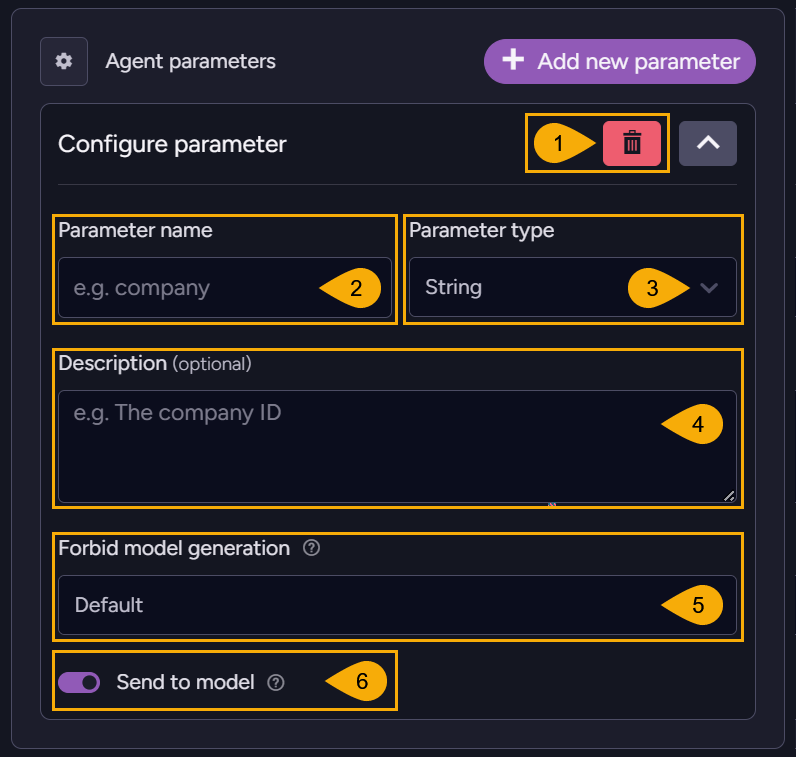

1. **Remove parameter**  
   Remove a set parameter or cancel the creation of a new one.

2. **Parameter name**  
   Enter a name for the parameter.  

3. **Parameter type**  
   Select a type for the parameter.  
   Select "Any" to allow the LLM to fill in any JSON value.  
   If a specific type is selected, the server will validate the value provided by the client against it and reject mismatches with a descriptive error message.

4. **Description**  
   Describe the parameter in plain language so the LLM will understand its purpose.  

5. **Forbid model generation**  
   Enable to prevent the LLM from generating a value for this parameter.  

6. **Send to model**  
   Enable to allow the LLM to see the value of this parameter.  
   Disable to hide the parameter value from the LLM.

</Panel>

<Panel heading="Define agent tools">

Define **Query** and **Action** agent tools.  

* Query tools you define here can be used freely by the LLM to trigger the agent to retrieve data from the database and return it to the LLM.  
* Action tools can trigger the client to perform actions such as removing a spam entry from a comments section or adding a comment to an article.  
* The LLM has no direct access to the database or any other server property; all queries and actions are performed through the agent.  
* [Find an AI agent usage flow chart here](../../../ai-integration/ai-agents/overview.mdx#ai-agent-usage-flow-chart)

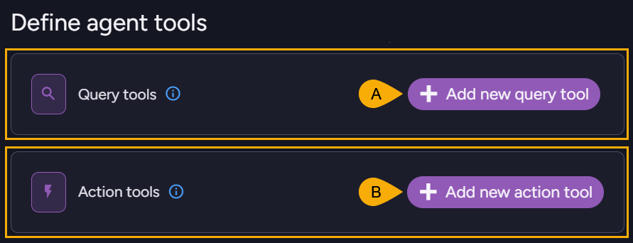

<ContentFrame>

### A. Add query tools:

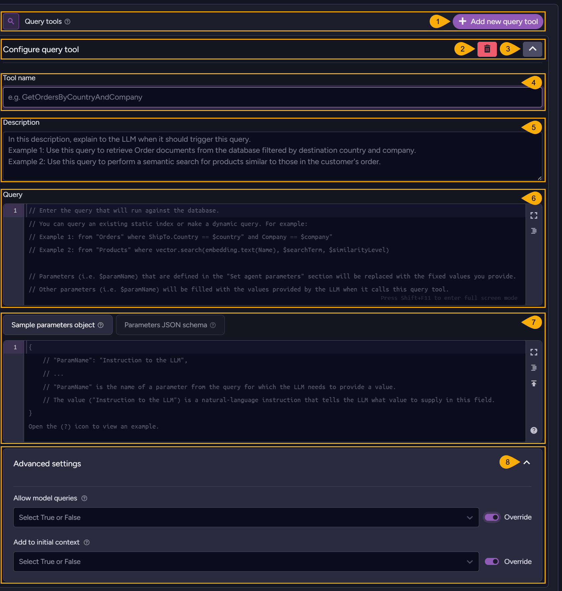

1. **Add new query tool**  
   Click to add a new query tool.

2. **Remove**  
   Click to remove this tool.  

3. **Expand/Collapse tool**
   Click to expand or collapse the tool's details.  

4. **Tool name**  
   Enter a name for the query tool.  

5. **Description**  
   Write a description that will explain to the LLM in natural language what the attached query can be used for.  
   e.g., `apply this query when you need to retrieve the details of all the companies that reside in a certain country`  

6. **Query**  
   Enter the query that the agent will run when the LLM requests it to use this tool.  

7. **Sample parameters object** and **Parameters JSON schema**  
   Set a schema (as a sample object or a formal JSON schema) that allows the LLM to fill query parameters with values.  
   [Read more about query parameters](../../../ai-integration/ai-agents/overview.mdx#query-parameters)  

8. **Advanced settings**  
   Click to expand advanced query tool settings.  

    * **Allow model queries**  
      Enable to allow the LLM to trigger the execution of this query tool.  
      <Admonition type="note" title="">
      When disabled, the LLM will not be able to trigger this tool - but if the tool is set as an [initial-context query](../../../ai-integration/ai-agents/overview.mdx#initial-context-queries) the agent will still be able to execute it when it is started.  
      </Admonition>

       * **Override**  
         By default, the model **can** call the query on demand.  
         Enable **Override** to change this behavior for this query tool.  

    * **Add to initial context**  
      Enable to set this tool as an [initial-context query](../../../ai-integration/ai-agents/overview.mdx#initial-context-queries).  
      An initial-context query is executed by the agent as it starts a conversation with the LLM **without waiting for the LLM to invoke the tool**, allowing the agent to provide the LLM with relevant data at the very beginning of the conversation.  
      Disable to prevent the agent from executing the query on startup.  
      <Admonition type="note" title="">
      An initial-context query is **not allowed** to use LLM parameters, since the LLM will not have the opportunity to fill the parameters with values before the query is executed.  
      The query **can** use agent parameters, whose values are provided by the user when the conversation is started.  
      </Admonition>

       * **Override**  
         By default, the query is **not** executed at conversation start.  
         Enable **Override** to change this behavior for this query tool.  

</ContentFrame>

<ContentFrame>

### B. Add action tools:

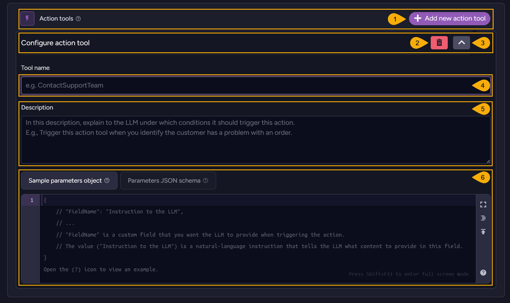

1. **Add new action tool**  
   Click to add a new action tool.

2. **Remove**  
   Click to remove this tool.  

3. **Expand/Collapse tool**
   Click to expand or collapse the tool's details.  

4. **Tool name**  
   Enter a name for the action tool.  

5. **Description**  
   Enter a description that explains to the LLM in natural language when this action tool should be applied.  
   e.g., `apply this action tool when you need to create a new summary document`  

6. **Sample parameters object** and **Parameters JSON schema**  
   Set a sample object or a JSON schema that the LLM can populate when it invokes the action tool. The agent will pass this information to the client to guide it through the action it is requested to perform.  
   
      If you define both a sample parameters object and a schema, only the schema will be used.  

</ContentFrame>

</Panel>

<Panel heading="Define sub-agents">

Providing your agent with specialist sub-agents allows it to delegate tasks, keep each agent's context cleaner and more focused, and reduce token consumption.

[Learn more about sub-agents](../../../ai-integration/ai-agents/multi-agents.mdx)

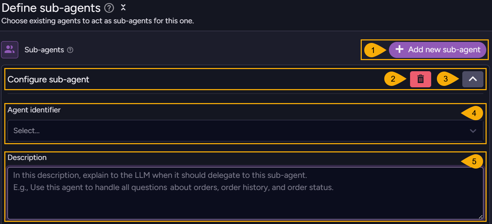

1. **Add new sub-agent**  
   Click to add a new sub-agent.  

2. **Remove**  
   Click to remove this sub-agent.  
   This does not delete the sub-agent from the database, but only removes it from this agent's configuration. 

3. **Expand/Collapse sub-agent**  
   Click to expand or collapse the sub-agent's details.

4. **Agent identifier**  
   Select an agent by its identifier, to set it as a sub-agent for this agent.  
   Sub-agents are not created in this dialog, but just selected from the list of agents already defined for this database.  

5. **Description**  
   Enter a description that explains to the LLM in natural language when this sub-agent should be invoked.  
   e.g., `invoke this sub-agent to handle customer support requests related to order issues`

</Panel>


<Panel heading="Configure chat trimming">

LLMs have no memory of prior interactions.  
To allow a continuous conversation, each time the agent sends to the LLM a new prompt or request, it sends along with it the whole conversation up to this point.  
To minimize the size of such messages, you can set the agent to summarize conversations.  

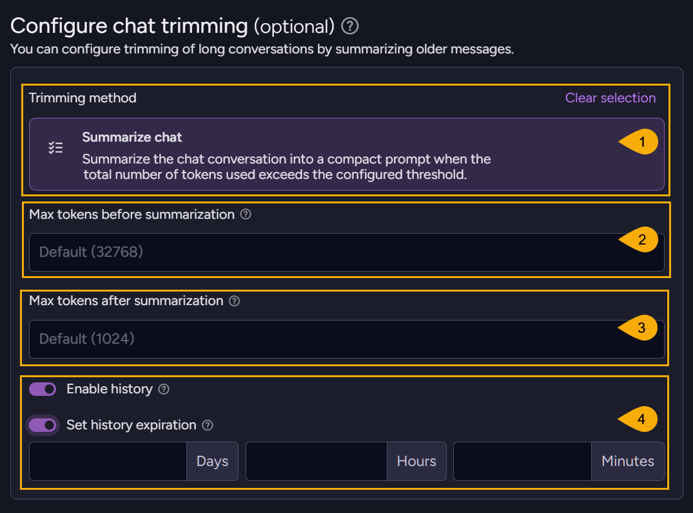

1. **Summarize chat**  
   Use this option to limit the size of the conversation history. If its size breaches this limit, chat history will be summarized before it is sent to the LLM.  

2. **Max tokens Before summarization**  
   If the conversation contains a total number of tokens larger than the limit you set here, the conversation will be summarized.  

3. **Max tokens After summarization**  
   Set the maximum number of tokens that will be left in the conversation after it is summarized.  
   Messages exceeding this limit will be removed, starting with the oldest.  
   
4. **History**  
     * **Enable history**  
       When history is enabled, a copy of the original conversation is kept in a dedicated document in the `@conversations-history` collection, even after the conversation has been summarized.

     * **Set history expiration**  
       When this option is enabled, conversations will be deleted from the 
       `@conversations-history` collection once their age exceeds the period 
       you set.  

</Panel>

<Panel heading="Save and Run your agent">

When you're done configuring your agent, save it using the **Save** button at the bottom.  


You will find your agent in the main **AI Agents** view, where you can run or edit it.  

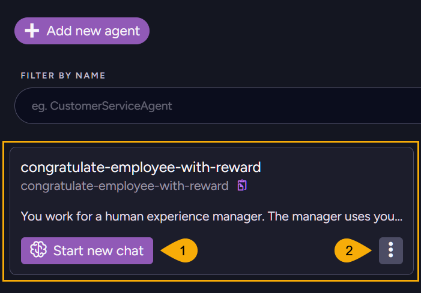

1. **Start new chat**  
   Click to start your agent.  

2. **Edit agent**  
   Click to edit the agent.  

<ContentFrame>

### Start new chat:

Starting a new chat will open the chat window, where you can provide values 
for the parameters you defined for this agent and enter a user prompt that explains 
to the agent what you expect from this session.  

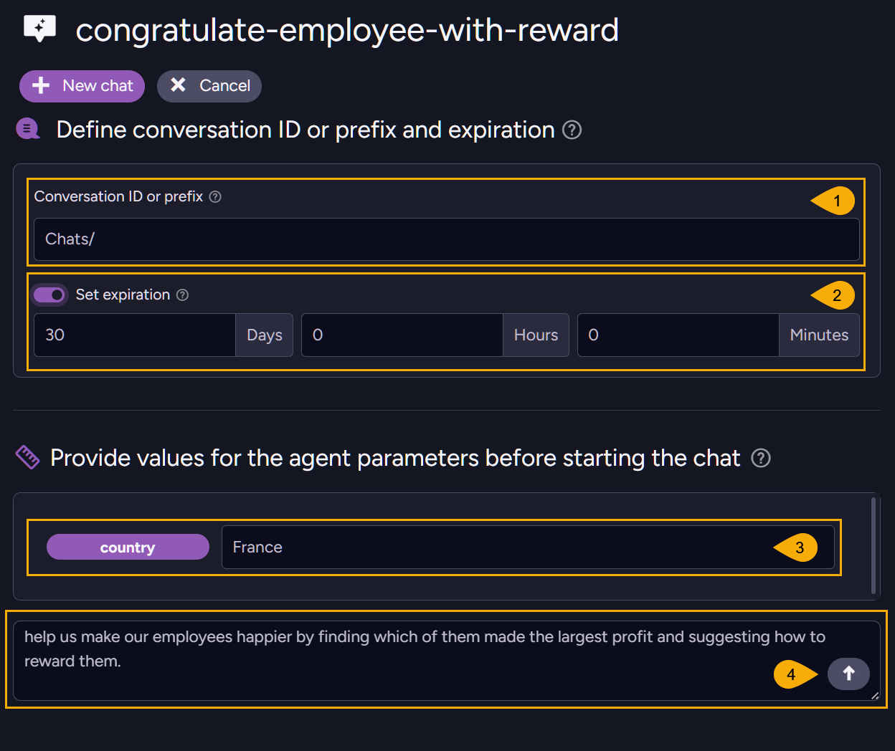

1. **Conversation ID or prefix**  
    - Entering **a prefix** (e.g. `Chats/`) will start a new conversation, with the prefix preceding an automatically-created conversation ID.  
    - Entering **the ID of a conversation that doesn't exist yet** will also start a new conversation.  
    - Entering **the ID of an existing conversation** will send the entire conversation to the LLM and allow you to continue where you left off.  
 
2. **Set expiration**  
   Enable this option and set an expiration period to automatically delete conversations from the `@conversations` collection when their age exceeds the set period.  
 
3. **Agent parameters**  
   Enter a value for each parameter defined in the agent configuration.  
   The LLM will embed these values in query tool RQL queries where you included agent parameters.  
   e.g., If you enter `France` here as the value for `Country`, a query tool's `from "Orders" where ShipTo.Country == $country` RQL query will be executed as `from "Orders" where ShipTo.Country == "France"`.  

4. **User prompt**  
   Use the user prompt to explain to the agent, in natural language, what 
   this session is about.  

</ContentFrame>

<ContentFrame>

### Adding file attachments:

You can attach files to any conversation turn, allowing the LLM to analyze the file content as part of its response. Attachments are sent to the LLM together with the user prompt when you submit the message.

<Admonition type="note" title="">
Note that the LLM must support multimodal input for image attachments to be processed. Confirm attachment support with your LLM provider before use.
</Admonition>

To add an attachment, click the **attachment icon** in the prompt bar.

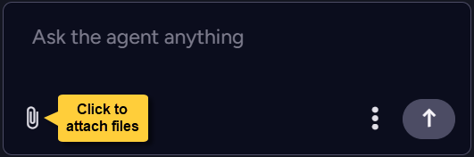

---

A menu opens, allowing you to choose the attachments source.

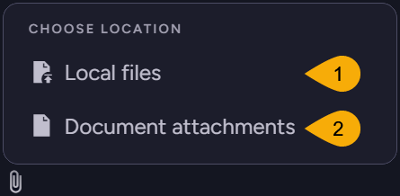

1. **Local files**  
   Use this option to open a file picker and select one or more files from your computer.  
   Supported file types: `.pdf`, `.txt`, `.jpg`, `.jpeg`, `.png`, `.gif`, `.webp`

   <Admonition type="note" title="">
   You can also drag files from your file system directly onto the chat window,  
   or paste files from the clipboard.  
   </Admonition>

2. **Document attachments**  
   Use this option to copy an attachment that is already stored in a RavenDB document.  
    * Select a document whose attachments you want to send to the LLM.
      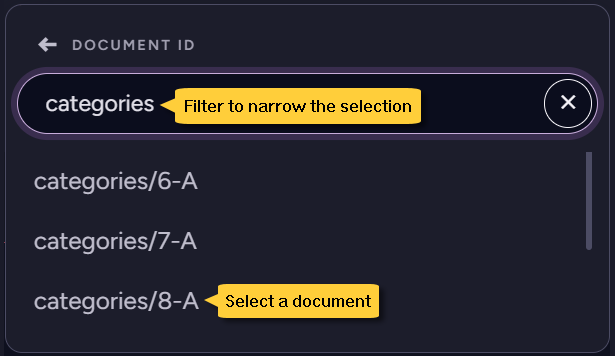
    * Select one or more of the document's attachments.
      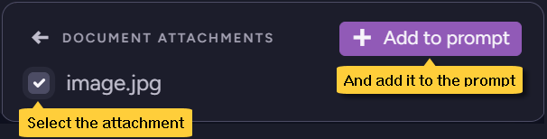

---

Selected attachments are added as pending badges above the prompt input.  
Click **×** to remove an attachment before sending.
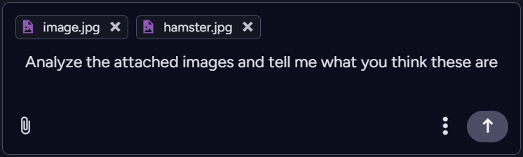

After you send the message, attachments appear as downloadable badges in the conversation history alongside the message they were sent with. Click a badge to download the file.
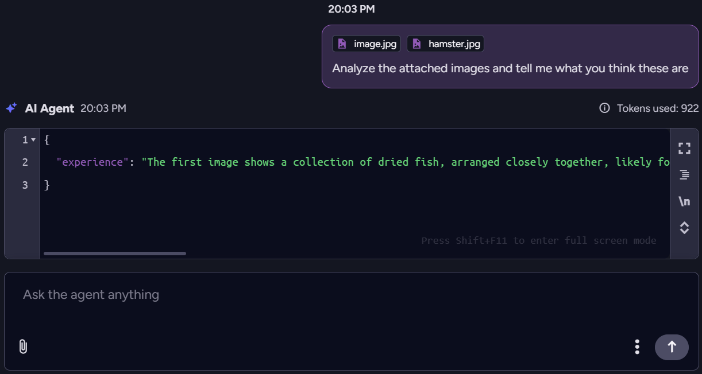

</ContentFrame>

<ContentFrame>

### Agent interaction:
        
Running the agent presents its components and interactions.  

Agent parameters and their values:

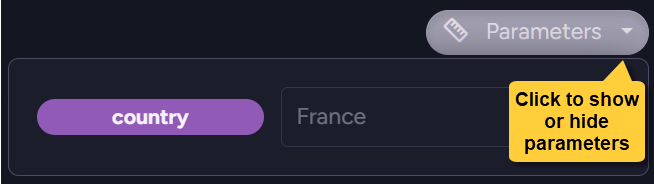

The system prompt set for the LLM and the user prompt:

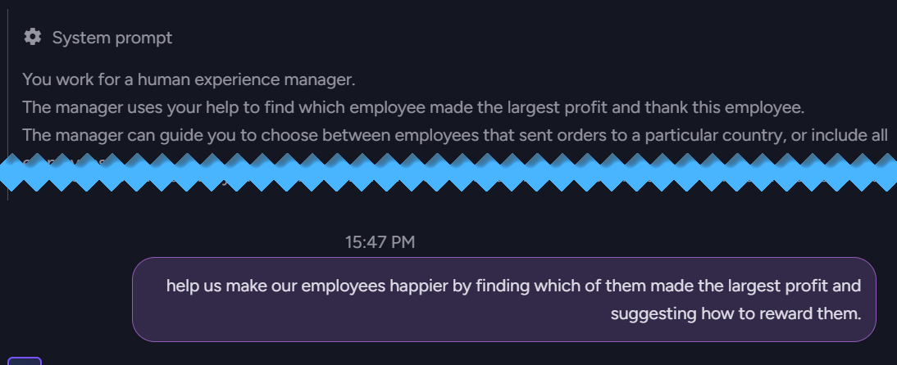

The query tools and their activity:

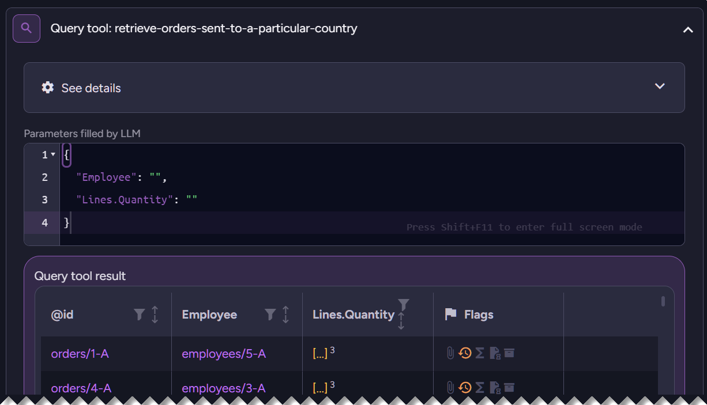

You can view the raw data of the agent's activity in JSON form as well:  

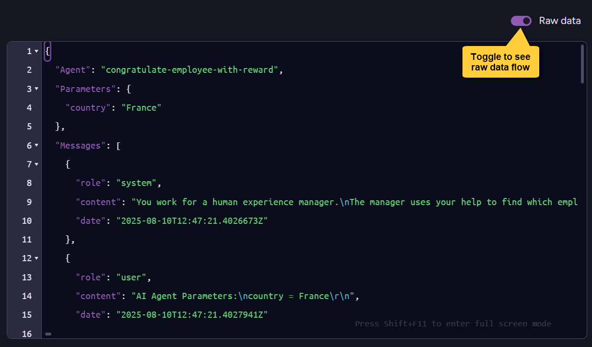

</ContentFrame>

<ContentFrame>

### Action tool dialog:

If the agent runs action tools, you will be given a dialog showing the 
information provided by the LLM when it requests the action, and a dialog inviting 
you to enter the results when you finish performing it.  

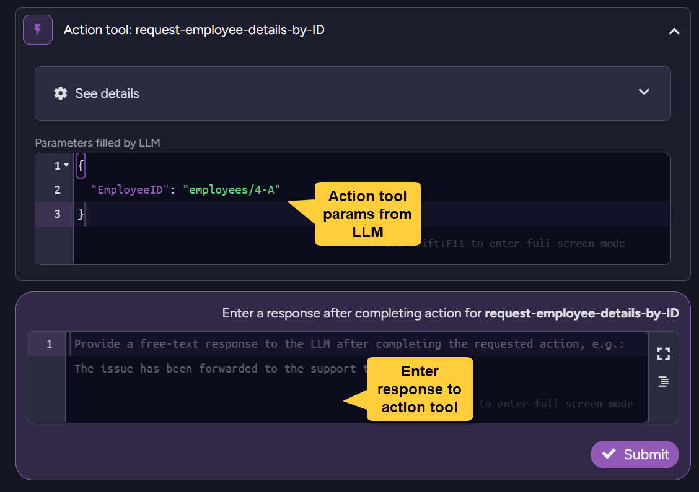

</ContentFrame>

<ContentFrame>

### Agent results:

And finally, when the AI model finishes its processing, you will be able to see its response.  
As with all other dialog boxes, you can expand the view to see the content or minimize it to see it in its context.

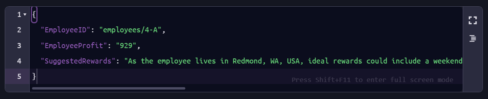

</ContentFrame>

</Panel>

<Panel heading="Test your agent">

You can test your agent while creating or editing it, to examine its configuration and operability before you deploy it. The test interface resembles the one you see when you run your agent normally via Studio, but conversations are not kept in the `@conversations` or `@conversations-history` collections.  

To test your agent, click **Test** at the bottom of the agent configuration view.  


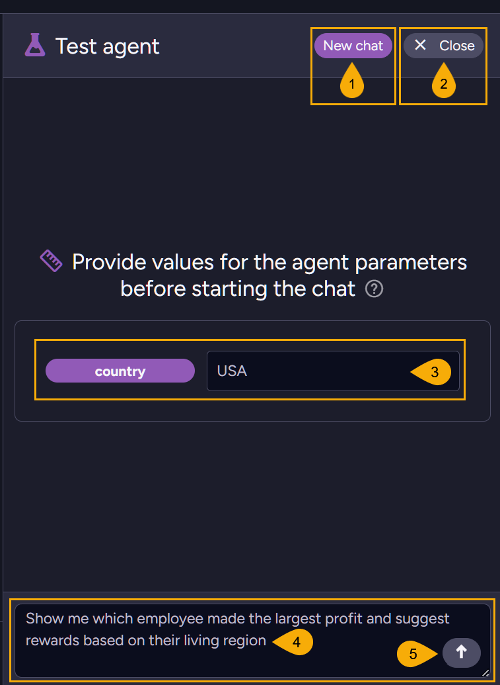


1. **New Chat**  
   Click to start a new chat.  
2. **Close**  
   Click to return to the AI Agents configuration view.  
3. **Enter parameter value**  
   Enter a value for each parameter defined in the agent configuration.  
   The LLM will be able to replace these parameters with fixed values 
   when it uses query or action tools in which these parameters are embedded.  
4. **Agent prompt**  
   Explain to the agent in natural language what this session is about.  
5. **Send prompt**  
   Click to pass your parameter values and user prompt to the agent and run the test.  
   You can keep sending prompts to the agent and receiving its replies in 
   a continuous conversation.  

<ContentFrame>

### Runtime view and Test results:

You will see the components that take part in the agent's run and be able to enter and send requested information for action tools. Each tool can be minimized to see it in context or expanded to view the data it carries.  

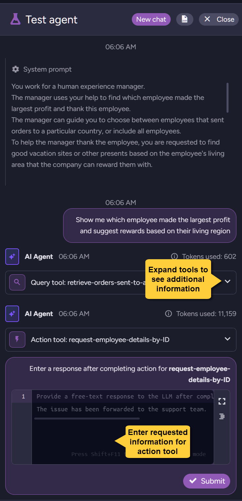

When the LLM finishes processing, you will see its response.  

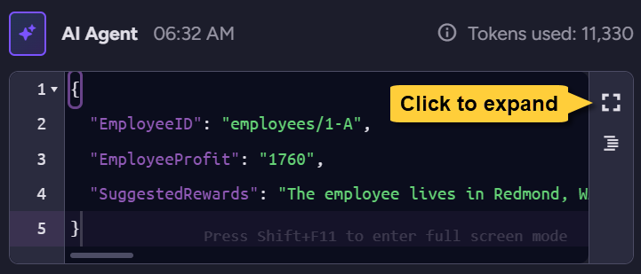

You can expand the dialog or copy the content to see the response in detail.

```json
{
   "EmployeeID": "employees/1-A",
   "EmployeeProfit": "1760",
   "SuggestedRewards": "The employee lives in Redmond, WA, USA. For a special reward, consider a weekend getaway to the Pacific Northwest's scenic sites such as a stay at a luxury resort in Seattle or a relaxing wine tasting tour in Woodinville. Alternatively, you could offer gift cards for outdoor excursions in the Cascade Mountains or tickets to major cultural events in the Seattle area."
}
```

</ContentFrame>

</Panel>


