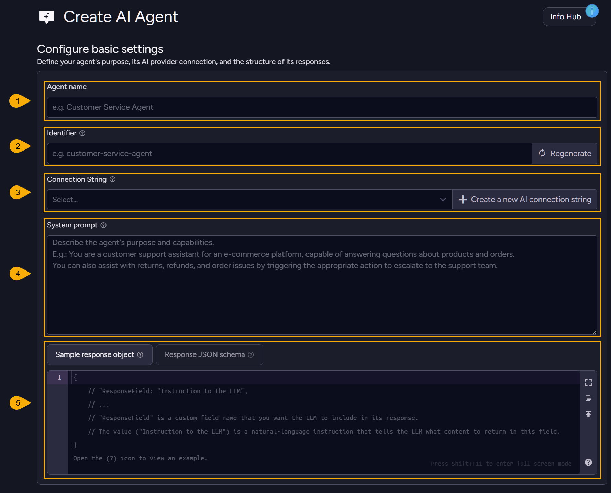
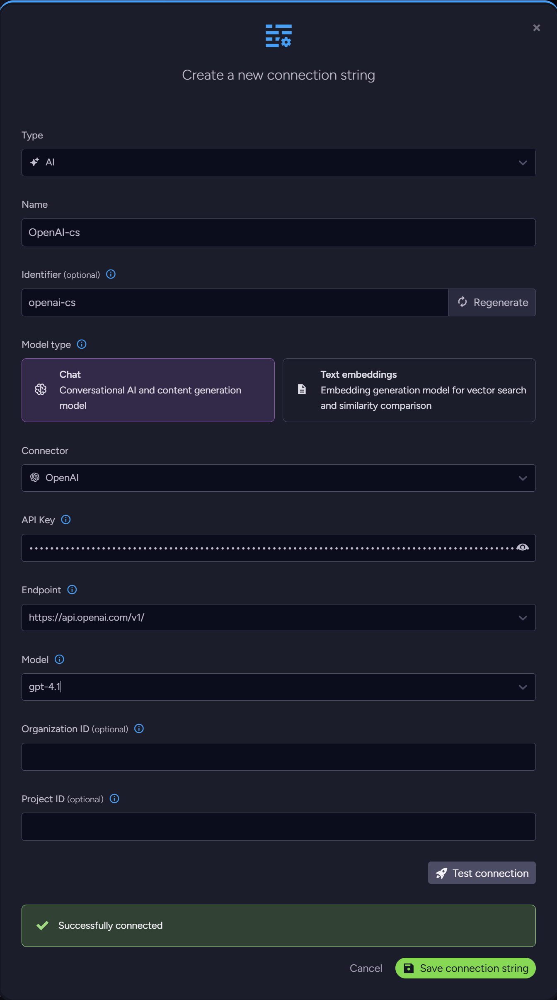
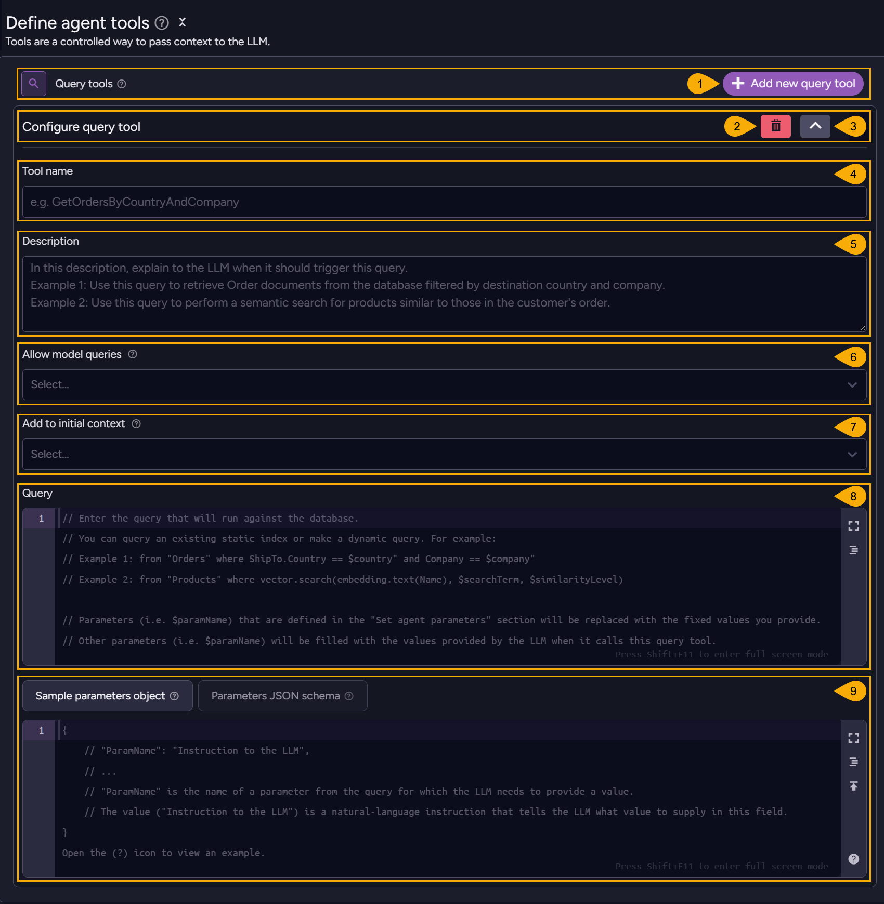
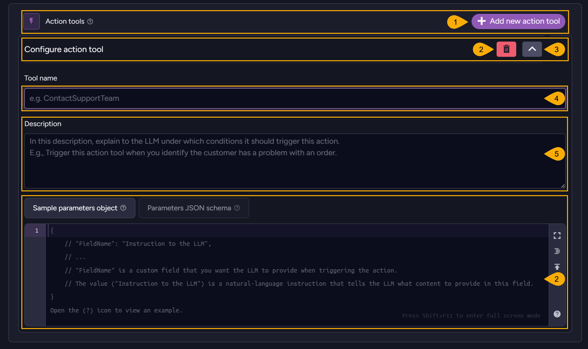

import Admonition from '@theme/Admonition';
import Tabs from '@theme/Tabs';
import TabItem from '@theme/TabItem';
import CodeBlock from '@theme/CodeBlock';
import LanguageSwitcher from "@site/src/components/LanguageSwitcher";
import LanguageContent from "@site/src/components/LanguageContent";

# AI Agents Integration: Studio
<Admonition type="note" title="">

* In this article:
   * [Create AI Agent](../../../ai-integration/ai-agents/creating-ai-agents/creating-ai-agents_studio#create-ai-agent)  
   * [Configure basic settings](../../../ai-integration/ai-agents/creating-ai-agents/creating-ai-agents_studio#configure-basic-settings)
   * [Set agent parameters](../../../ai-integration/ai-agents/creating-ai-agents/creating-ai-agents_studio#set-agent-parameters)
   * [Define agent tools](../../../ai-integration/ai-agents/creating-ai-agents/creating-ai-agents_studio#define-agent-tools)
      * [Add query tools](../../../ai-integration/ai-agents/creating-ai-agents/creating-ai-agents_studio#add-query-tools)
      * [Add action tools](../../../ai-integration/ai-agents/creating-ai-agents/creating-ai-agents_studio#add-action-tools)
   * [Configure chat trimming](../../../ai-integration/ai-agents/creating-ai-agents/creating-ai-agents_studio#configure-chat-trimming)
   * [Save and Run your agent](../../../ai-integration/ai-agents/creating-ai-agents/creating-ai-agents_studio#save-and-run-your-agent)
      * [Start new chat](../../../ai-integration/ai-agents/creating-ai-agents/creating-ai-agents_studio#start-new-chat)
      * [Agent interaction](../../../ai-integration/ai-agents/creating-ai-agents/creating-ai-agents_studio#agent-interaction)
      * [Action tool dialog](../../../ai-integration/ai-agents/creating-ai-agents/creating-ai-agents_studio#action-tool-dialog)
      * [Agent results](../../../ai-integration/ai-agents/creating-ai-agents/creating-ai-agents_studio#agent-results)
   * [Test your agent](../../../ai-integration/ai-agents/creating-ai-agents/creating-ai-agents_studio#test-your-agent)
      * [Runtime view and Test results](../../../ai-integration/ai-agents/creating-ai-agents/creating-ai-agents_studio#runtime-view-and-test-results)

</Admonition>

## Create AI Agent

To create an AI agent, open **AI hub &gt; AI Agents** and click **Add new agent**.

1. **AI Hub**  
   Click to open the [AI Hub view](../../../ai-integration/ai-tasks-list-view.mdx).  
   Use this view to handle AI connection strings and tasks, and to view task statistics.  
2. **AI Agents**  
   Click to open the AI Agents view.  
   Use this view to list, configure, or remove your agents.  
3. **Add new agent**  
   Click to add an AI agent.  

      The **Create AI Agent** dialog will open, allowing you to define and test your agent.  

      

      Use the buttons at the bottom bar to Cancel, Save, or Test your changes.  

4. **Filter by name**  
   When multiple agents are created, you can filter them by a string you enter here.  

5. **Defined agent**  
   After defining an agent, it is listed in this view, allowing you to run, edit, or remove the agent.

## Configure basic settings

1. **Agent name**  
   Enter a name for the agent
   E.g., **CustomerSupportAgent**  

2. **Identifier**  
   Enter a unique identifier for the agent,  
   or click **Regenerate** to create it automatically  

3. **Connection String**  

      
   
      **Select** an existing [connection string](../../../ai-integration/connection-strings/connection-strings-overview.mdx) 
      that the agent will use to connect your LLM of choice,  
      or click **Create a new AI connection string** to define a new string.  
      Your agent can use a local LLM like Ollama, or an external model like OpenAI.  
   
      

4. **System prompt**  
   Enter a prompt that determines LLM characteristics like its role and purpose.  

5. **Sample response object** and **Response JSON schema**  
   Define a response JSON object for the LLM reply, either as a sample object or as a formal schema.  
    - The response object guides the LLM in composing its replies, and can ease their parsing 
      by the client.  
    - Defining a sample object is normally simpler.  
    - Behind the scenes, RavenDB will translate a sample object to a JSON schema format 
      before sending it to the LLM, but if you prefer it you can define it yourself.  
    - After defining a sample object, you can open the schema tab and click the "View schema" 
      button to see the generated schema.  
      

## Set agent parameters

Define **agent parameters**.  
After defining an agent parameter, it can be included in query tools RQL queries.  
Values for agent parameters are provided by the client, when it starts a conversation.  
[Read more about parameters](../../../ai-integration/ai-agents/ai-agents_overview#query-parameters).

1. **Add new parameter**  
   Click to add an agent parameter.  
   
2. **Name**  
   Enter agent parameter name.  

3. **Description**  
   Describe the parameter in plane language so the LLM would understand its purpose.  

4. **Remove parameter**  
   Remove a defined parameter from the list.

## Define agent tools

Define **Query** and **Action** agent tools.  

* Query tools you define here can be freely used by the LLM.
   * Query tools can trigger the agent to retrieve data from the database and return it to 
     the LLM.  
   * Action tools can trigger the client to perform actions such as removing a spam entry from 
     a comments section or adding a comment to an article.  
* The LLM has no direct access to the database or any other server property, all queries and 
  actions are performed through the agent.  
* [Find an AI agent usage flow chart here](../../../ai-integration/ai-agents/ai-agents_overview#ai-agent-usage-flow-chart)

1. **Query tools**  
   Click to add a new query tool.  

2. **Action tools**  
   Click to add a new action tool.  

### Add query tools:

1. **Add new query tool**  
   Click to add a new query tool.

2. **Remove**  
   Click to remove this tool.  

3. **Expand/Collapse tool**
   Click to expand or collapse the tool's details.  

4. **Tool name**  
   Enter a name for the query tool.  

5. **Description**  
   Write a description that will explain to the LLM in natural language what the attached query can be used for.  
   E.g., `apply this query when you need to retrieve the details of all the companies that reside in a certain country`  

6. **Allow model queries**  
   Enable to allow the LLM to trigger the execution of this query tool.  
   Disable to prevent the LLM from using this tool.  
   <Admonition type="note" title="">
   When disabled, the LLM will not be able to trigger this tool - but if the tool is set as an [initial context query](../../../ai-integration/ai-agents/ai-agents_overview#initial-context-queries) the agent will still be able to execute it when it is started.  
   </Admonition>

7. **Add to initial context**  
   Enable to set the query tool as an [initial context query](../../../ai-integration/ai-agents/ai-agents_overview#initial-context-queries).  
   When enabled, the agent will execute the query immediately when it starts a conversation with the LLM without waiting for the LLM to invoke the tool, to include data that is relevant for the conversation in the initial context sent to the LLM.  
   Disable to prevent the agent from executing the query on startup.  
   <Admonition type="note" title="">
   An initial context query is **not allowed** to use LLM parameters, since the LLM will not have the opportunity to fill the parameters with values before the query is executed.  
   The query **can** use agent parameters, whose values are provided by the user when the conversation is started.  
   </Admonition>

8. **Query**  
   Enter the query that the agent will run when the LLM requests it to use this tool.  

9. **Sample parameters object** and **Parameters JSON schema**  
   Set a schema (in the form of a sample object or a formal JSON schema) through which the LLM will be able to fill query parameters with values.  
   [Read more about query parameters](../../../ai-integration/ai-agents/ai-agents_overview#query-parameters)  

### Add action tools:

1. **Add new action tool**  
   Click to add a new action tool.

2. **Remove**  
   Click to remove this tool.  

3. **Expand/Collapse tool**
   Click to expand or collapse the tool's details.  

4. **Tool name**  
   Enter a name for the action tool.  

5. **Description**  
   Enter a description that explains to the LLM in natural language when this action tool should be applied.  
   E.g., `apply this action tool when you need to create a new summary document`  

6. **Sample parameters object** and **Parameters JSON schema**  
   Set a sample object or a JSON schema that the the LLM can populate when it invokes the action tool. The agent will pass this information to the client to guide it through the action it is requested to perform.  
   
      If you define both a sample response object and a schema, only the schema will be used.  

## Configure chat trimming

The LLM keeps no record of previous conversations it conducted.  
To allow a continuous conversation, the agent sends the LLM the entire conversation history 
when a chat is started. To minimize the size of these messages, you can set the agent to summarize them rather than send the LLM their full length version.  

1. **Summarize chat**  
   Use this option to limit the size of the conversation history. If its size breaches this 
   limit, chat history will be summarized before it is sent to the LLM.  

2. **Max tokens Before summarization**  
   If the conversation contains a total number of tokens larger than the limit you set here, 
   the conversation will be summarized.  

3. **Max tokens After summarization**  
   Set the maximum number of tokens that will be left in the conversation after it is summarized.  
   Messages exceeding the set limit will be removed, starting with the oldest.  
   
1. **History**  
     * **Enable history**  
       When history is enabled the chat sent to the LLM will be summarized, but copies of the original chats will be kept in dedicated documents in the `@conversations-history` collection.  
     * **Set history expiration**  
       When this option is enabled, conversations will be deleted from the 
       `@conversations-history` collection when their age exceeds the period 
       you set in the time boxes.  

## Save and Run your agent

When you're done configuring your agent, save it using the **save** button at the bottom.  

You will find your agent in the main **AI Agents** view, where you can run or edit it.  

1. **Start new chat**  
   Click to start your agent.  

2. **Edit agent**  
   Click to edit the agent.  

### Start new chat:

Starting a new chat will open the chat window, where you can provide values 
for the parameters you defined for this agent and enter a user prompt that explains 
to the agent what you expect from this session.  

1. **Conversation ID or prefix**  
    - Entering a prefix (e.g. `Chats/`) will start a new conversation, with the prefix 
      preceding an automatically-created conversation ID.  
    - Entering the ID of a conversation that doesn't exist will start a new conversation as well.  
    - Entering the ID of an existing conversation will send its history 
      to the LLM and allow you to continue where you left off.  
 
2. **Set expiration**  
   Enable this option and set an expiration period to automatically delete conversations 
   from the `@Conversations` collection when their age exceeds the set period.  
 
3. **Agent parameters**  
   Enter a value for each parameter defined in the agent configuration.  
   The LLM will embed these values in query tools RQL queries where you 
   included agent parameters.  
   E.g., If you enter `France` here as the value for `Country`, 
   a query tool's `from "Orders" where ShipTo.Country == $country` RQL query 
   will be executed as `from "Orders" where ShipTo.Country == "France"`.  

4. **User prompt**  
   Use the user prompt to explain to the agent in natural language what 
   this session is about.  

### Agent interaction:
        
Running the agent presents its components and interactions.  

Agent parameters and their values:

The system prompt set for the LLM and the user prompt:

The query tools and their activity:

You can view the raw data of the agent's activity in JSON form as well:  

### Action tool dialog:

If the agent runs action tools, you will be given a dialog that shows you the 
information provided by the LLM when it requests the action, and a dialog inviting 
you to reply with the results of the action when you finish performing it.  

### Agent results:

And finally, when the AI model finishes its work and negotiations, you will be able to see its response.
As with all other dialog boxes, you can expand the view to see the content or minimize it to see it in its context.

## Test your agent

You can test your agent while creating or editing it, to examine its configuration 
and operability before you deploy it. The test interface resembles the one you see 
when you run your agent normally via Studio, but conversations are not kept in the 
`@conversations` or `@conversations-history`.  

To test your agent, click **Test** at the bottom of the agent configuration view.  

1. **New Chat**  
   Click to start a new chat  
2. **Close**  
   Click to return to the AI Agents configuration view.  
3. **Enter parameter value**  
   Enter a value for each parameter defined in the agent configuration.  
   The LLM will be able to replace these parameters with fixed values 
   when it uses query or action tools in which these parameters are embedded.  
4. **Agent prompt**  
   Explain to the agent in natural language what this session is about.  
5. **Send prompt**  
   Click to pass your agent your parameter values and user prompt and run the test.  
   You can keep sending prompts to the agent and receiving its replies in 
   a continuous conversation.  

### Runtime view and Test results:

You will see the components that take part in the agent's run and be able 
to enter and send requested information for action tools. Each tool can be 
minimized to see it in context or expanded to view the data it carries.  

When the LLM finishes processing, you will see its response.  

You can expand the dialog or copy the content to see the response in detail.
<TabItem value="json" label="json">
<CodeBlock language="json">
{`\{
  "EmployeeID": "employees/1-A",
  "EmployeeProfit": "1760",
  "SuggestedRewards": "The employee lives in Redmond, WA, USA. For a special reward, consider a weekend getaway to the Pacific Northwest's scenic sites such as a stay at a luxury resort in Seattle or a relaxing wine tasting tour in Woodinville. Alternatively, you could offer gift cards for outdoor excursions in the Cascade Mountains or tickets to major cultural events in the Seattle area."
\}
`}
</CodeBlock>
</TabItem>

