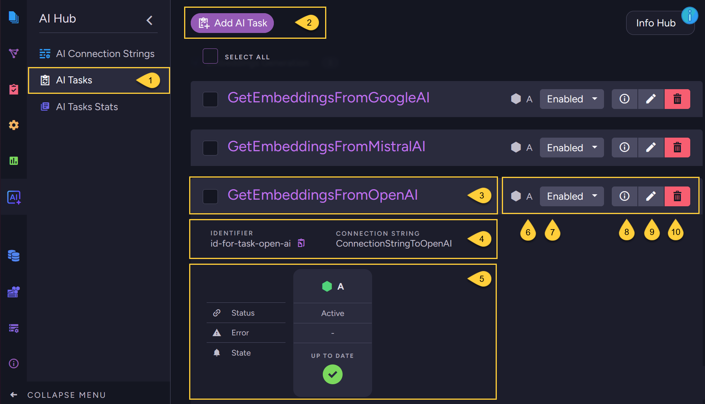

import Admonition from '@theme/Admonition';
import Tabs from '@theme/Tabs';
import TabItem from '@theme/TabItem';
import CodeBlock from '@theme/CodeBlock';
import LanguageSwitcher from "@site/src/components/language-switcher";
import LanguageContent from "@site/src/components/language-content";

# AI Tasks - List View
<Admonition type="note" title="Note">

* In this view, you can manage RavenDB's AI tasks -  
  create new tasks, edit existing ones, or delete them as needed.

* AI tasks are part of RavenDB's ongoing tasks. Learn more in [Ongoing Tasks - Overview](../studio/database/tasks/ongoing-tasks/general-info)

* Currently, the only supported AI task type is [embeddings generation](../ai-integration/generating-embeddings/overview).
* In this article:
  * [AI Tasks - list view](../ai-integration/ai-tasks-list-view#ai-tasks---list-view)

</Admonition>
## AI Tasks - list view

1. Go to **AI Hub &gt; AI Tasks**.

2. **Add AI Task**: Click to create a new AI task.

3. **Task name**: This is the name of the task.

4. **Identifier**: The string identifier defined for the task.  
   **Connection string**: The name of the connection string defined in the task.

5. **Task status**: Displays the task's state and progress.

6. **Assigned node**: The node in the database group responsible for the task.

7. **Enable/Disable**: Toggle the task on or off.

8. **Details**: Click to view the detailed information about the task.

9. **Edit**: Click to modify the task.

10. **Delete**: Click to remove the task.

