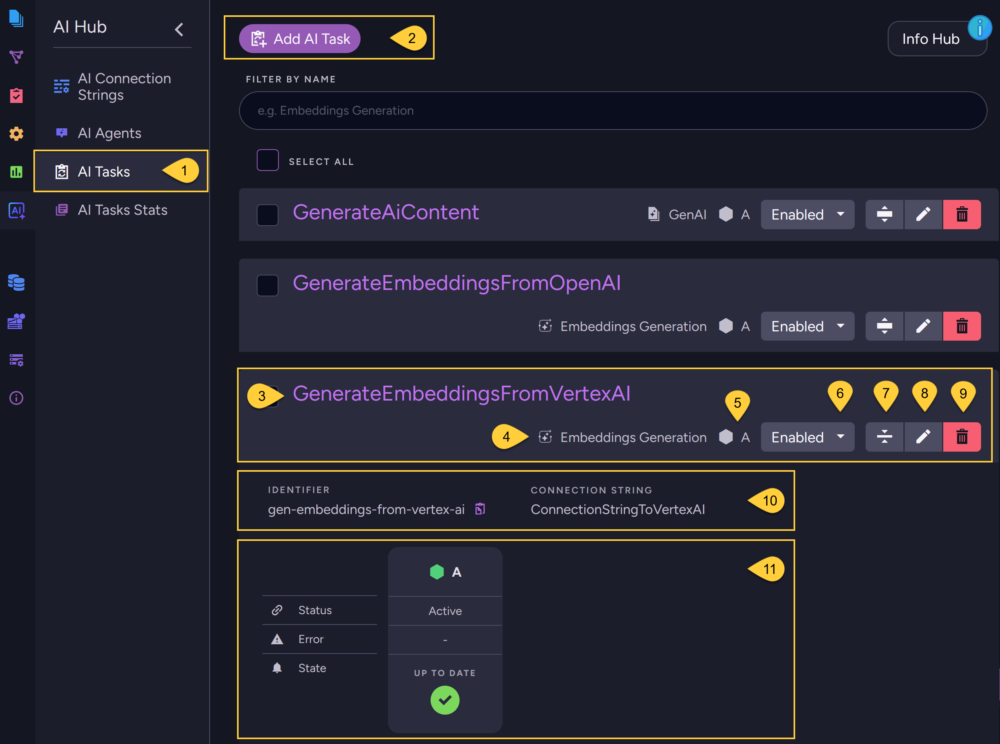

import Admonition from '@theme/Admonition';
import Tabs from '@theme/Tabs';
import TabItem from '@theme/TabItem';
import CodeBlock from '@theme/CodeBlock';
import LanguageSwitcher from "@site/src/components/LanguageSwitcher";
import LanguageContent from "@site/src/components/LanguageContent";

# AI Tasks - List View

<Admonition type="note" title="">

* RavenDB supports the following AI tasks:
  * [Embeddings generation task](../ai-integration/generating-embeddings/overview.mdx)
  * [Gen AI task](../ai-integration/gen-ai-integration/overview.mdx)

* AI tasks are part of RavenDB's ongoing tasks.  
  Learn more in [Ongoing Tasks - Overview](../studio/database/tasks/ongoing-tasks/general-info.mdx).

* In the **AI Tasks - List view**, you can manage RavenDB's AI tasks -  
  create new tasks, edit existing ones, or delete them as needed.    

* In this article:
  * [AI Tasks - list view](../ai-integration/ai-tasks-list-view.mdx#ai-tasks---list-view)

</Admonition>

## AI Tasks - list view

1. Go to **AI Hub &gt; AI Tasks**.

2. **Add AI Task**: Click to create a new AI task.

3. **Task name**: The name of an existing AI task.

4. **Task type**: The type of task: _Embeddings Generation_ or _Gen AI_.

5. **Assigned node**: The node in the database group that is responsible for running the task.

6. **Enable/Disable**: Click to enable or disable the task.

7. **Details**: Click to view detailed information about the task.

8. **Edit**: Click to modify the task.

9. **Delete**: Click to remove the task.

10. **Identifier**: The string identifier defined for the task.  
    **Connection string**: The name of the connection string used by the task.

11. **Task status**: Displays the task’s current state and progress.
