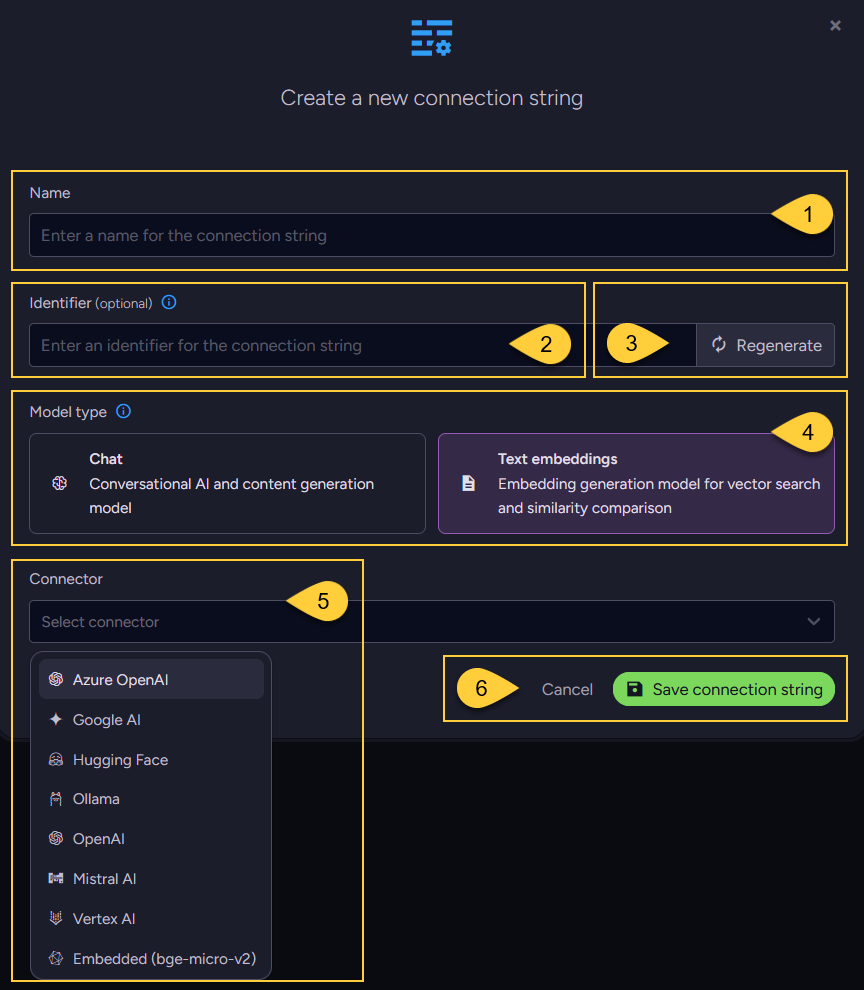

import Admonition from '@theme/Admonition';
import Tabs from '@theme/Tabs';
import TabItem from '@theme/TabItem';
import CodeBlock from '@theme/CodeBlock';
import LanguageSwitcher from "@site/src/components/LanguageSwitcher";
import LanguageContent from "@site/src/components/LanguageContent";

# AI Connection Strings - Overview

<Admonition type="note" title="">
    
* AI connection strings define how RavenDB connects to external AI models.  
  Each connection string specifies the provider and the model to use.  
  The model can be either a chat model or a text embedding model.

* These connection strings are then used by AI-powered features in RavenDB, such as:  
  * [Embeddings Generation Tasks](../../ai-integration/generating-embeddings/overview.mdx) -  
    use **text embedding models** to generate vector embeddings from document content for vector search.
  * [Gen AI Tasks](../../ai-integration/gen-ai-integration/gen-ai-overview) and [AI Agents](../../ai-integration/ai-agents/ai-agents_overview) -  
    interact with **chat models** for reasoning, summarization, or conversational workflows.

* RavenDB supports connecting to external providers such as:  
  OpenAI, Azure OpenAI, Hugging Face, Google AI, Vertex AI, Ollama, Mistral AI,  
  or to RavenDB’s embedded model (bge-micro-v2).

* While each task can have only one connection string,  
  you can define multiple connection strings in your database to support different providers or configurations.  
  A single connection string can also be reused across multiple tasks in the database.

* The AI connection strings can be created from:  
  * The **AI Connection Strings view** in the Studio -  
    where you can create, edit, and delete connection strings that are not in use.
  * The **Client API** -  
    examples are available in the dedicated articles for each provider.

---
 
* In this article:
  * [The AI Connection Strings view](../../ai-integration/connection-strings/connection-strings-overview.mdx#the-ai-connection-strings-view)
  * [Creating an AI connection string](../../ai-integration/connection-strings/connection-strings-overview.mdx#creating-an-ai-connection-string)
    
</Admonition>

## The AI Connection Strings view

1. Go to the **AI Hub** menu.

2. Open the **AI Connection Strings** view.

3. Click **"Add new"** to create a new connection string.

4. View the list of all AI connection strings that have been defined.

5. Edit or delete a connection string.  
   Only connection strings that are not in use by a task can be deleted.

## Creating an AI connection string

<a id="identifier" />

1. **Name**  
   Enter a unique name for the connection string.

2. **Identifier**  
   Enter a unique identifier for the connection string.  
   Each AI connection string in the database must have a distinct identifier.

     If not specified, or when clicking the "Regenerate" button,  
     RavenDB automatically generates the identifier based on the connection string name. For example:
       * If the connection string name is: _"My connection string to Google AI"_
       * The generated identifier will be: _"my-connection-string-to-google-ai"_
  
     Allowed characters: only lowercase letters (a-z), numbers (0-9), and hyphens (-).  
     For exmaple, see how this identifier is used in the [embeddings cache collection](../../ai-integration/generating-embeddings/embedding-collections.mdx#the-embeddings-cache-collection).

3. **Regenerate**  
   Click "Regenerate" to automatically create an identifier based on the connection string name.

4. **Model type**  
   Select the type of model you want to interact with:  
   * **Chat model**  
     Select this type to use a conversational model for content generation and dialogue.
   * **Text embedding model**  
     Select this type to generate vector embeddings from your document content for vector search.

5. **Connector**  
   Select an AI provider from the dropdown menu.  
   This opens a dialog where you can configure the connection details for the selected provider.  
   
       The list of available providers is filtered based on the selected model type.  
       (Some providers are currently supported in RavenDB only for text embedding models).  
       
       Configuration details for each provider are explained in the following articles:  
       * [Azure Open AI](../../ai-integration/connection-strings/azure-open-ai.mdx)
       * [Google AI](../../ai-integration/connection-strings/google-ai.mdx) (_embeddings only_)
       * [Hugging Face](../../ai-integration/connection-strings/hugging-face.mdx) (_embeddings only_)
       * [Ollama](../../ai-integration/connection-strings/ollama.mdx)
       * [OpenAI](../../ai-integration/connection-strings/open-ai.mdx)
       * [Mistral AI](../../ai-integration/connection-strings/mistral-ai.mdx) (_embeddings only_)
       * [Vertex AI](../../ai-integration/connection-strings/vertex-ai.mdx) (_embeddings only_)
       * [Embedded model (bge-micro-v2)](../../ai-integration/connection-strings/embedded.mdx) (_embeddings only_)

6. Once you complete all configurations for the selected provider in the dialog,  
   save the connection string definition.
