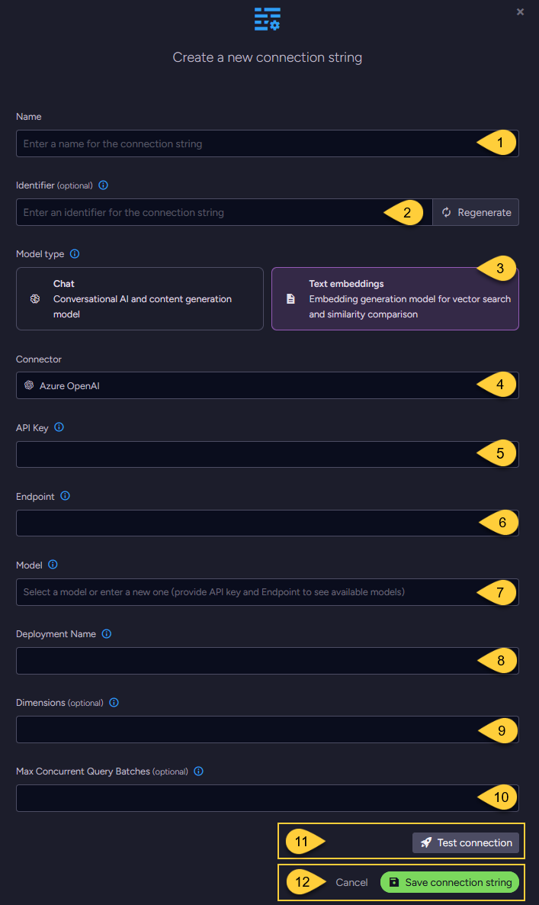
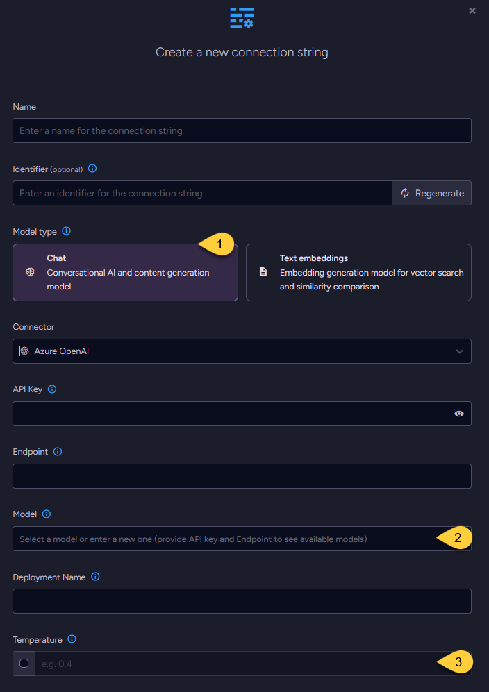

import Admonition from '@theme/Admonition';
import Tabs from '@theme/Tabs';
import TabItem from '@theme/TabItem';
import CodeBlock from '@theme/CodeBlock';

<Admonition type="note" title="">

* This article explains how to define a connection string to the [Azure OpenAI Service](https://azure.microsoft.com/en-us/products/ai-services/openai-service),  
  enabling RavenDB to use Azure OpenAI models for [Embeddings generation tasks](../../../ai-integration/generating-embeddings/overview.mdx),
  [Gen AI tasks](../../../ai-integration/gen-ai-integration/overview.mdx), and [AI agents](../../../ai-integration/ai-agents/overview.mdx).    
    
* In this article:
  * [Define the connection string - from the Studio](../../../ai-integration/connection-strings/azure-open-ai.mdx#define-the-connection-string---from-the-studio)
    * [Configuring a text embedding model](../../../ai-integration/connection-strings/azure-open-ai.mdx#configuring-a-text-embedding-model)
    * [Configuring a chat model](../../../ai-integration/connection-strings/azure-open-ai.mdx#configuring-a-chat-model)
  * [Define the connection string - from the Client API](../../../ai-integration/connection-strings/azure-open-ai.mdx#define-the-connection-string---from-the-client-api)
  * [Syntax](../../../ai-integration/connection-strings/azure-open-ai.mdx#syntax) 
    
</Admonition>

## Define the connection string - from the Studio

### Configuring a text embedding model



1. **Name**  
   Enter a name for this connection string.

2. **Identifier** (optional)  
   Enter an identifier for this connection string.  
   Learn more about the identifier in the [connection string identifier](../../../ai-integration/connection-strings/overview.mdx#identifier) section.

3. **Model Type**  
   Select "Text Embeddings".

4. **Connector**  
   Select **Azure OpenAI** from the dropdown menu.

5. **API key**  
   Enter the API key used to authenticate requests to the Azure OpenAI service.

6. **Endpoint**  
   Enter the base URL of your Azure OpenAI resource.

7. **Model**  
   Select or enter an Azure OpenAI text embedding model from the dropdown list or enter a new one.

8. **Deployment name**  
   Specify the unique identifier assigned to your model deployment in your Azure environment.

9. **Dimensions** (optional)  
   * Specify the number of dimensions for the output embeddings.  
     Supported only by _text-embedding-3_ and later models.  
   * If not specified, the model's default dimensionality is used.

10. **Max concurrent query batches**: (optional)  
    * When making vector search queries, the content of the search terms must also be converted to embeddings to compare them against the stored vectors.  
      Requests to generate such query embeddings via the AI provider are sent in batches.
    * This parameter defines the maximum number of these batches that can be processed concurrently.  
      You can set a default value using the [Ai.Embeddings.MaxConcurrentBatches](../../../server/configuration/ai-integration-configuration.mdx#aiembeddingsmaxconcurrentbatches) configuration key.

11. Click **Test Connection** to confirm the connection string is set up correctly.

12. Click **Save** to store the connection string or **Cancel** to discard changes.

### Configuring a chat model

* When configuring a chat model, the UI displays the same base fields as those used for [text embedding models](../../../ai-integration/connection-strings/azure-open-ai.mdx#configuring-a-text-embedding-model),  
  including the connection string _Name_, optional _Identifier_, _API Key_, _Endpoint_, _Deployment Name_, and _Model_ name.

* One additional setting is specific to chat models: _Temperature_.



1. **Model Type**  
   Select "Chat".

2. **Model**  
   Enter the name of the Azure OpenAI model to use for chat completions.

3. **Temperature** (optional)  
   The temperature setting controls the randomness and creativity of the model’s output.  
   Valid values typically range from `0.0` to `2.0`:  
     * Higher values (e.g., `1.0` or above) produce more diverse and creative responses.
     * Lower values (e.g., `0.2`) result in more focused, consistent, and deterministic output.
     * If not explicitly set, Azure OpenAI uses a default temperature of `1.0`.  
       See [Azure OpenAI chat completions parameters](https://learn.microsoft.com/en-us/azure/ai-foundry/openai/reference#request-body-2).

---

## Define the connection string - from the Client API

<Tabs groupId='languageSyntax'>
<TabItem value="Connection_string_for_text_embedding_model" label="Connection_string_for_text_embedding_model">
```python
store = DocumentStore([ravendb_url], database_name)
store.initialize()

# Define the connection string to Azure OpenAI
connection_string = AiConnectionString(
    # Connection string name & identifier
    name="ConnectionStringToAzureOpenAI",
    identifier="identifier-to-the-connection-string",
    # Model type
    model_type=AiModelType.TEXT_EMBEDDINGS,
    # Azure OpenAI settings
    azure_openai_settings=AzureOpenAiSettings(
        api_key="your-api-key",
        endpoint="https://your-resource-name.openai.azure.com",
        # Name of text embedding model to use
        model="text-embedding-3-small",
        deployment_name="your-deployment-name",
        # Optionally, override the default maximum number of query embedding batches
        # that can be processed concurrently.
        embeddings_max_concurrent_batches=10,
    ),
)

# Deploy the connection string to the server
put_connection_string_op = PutConnectionStringOperation(connection_string)
put_connection_string_result = store.maintenance.send(put_connection_string_op)
```
</TabItem>
<TabItem value="Connection_string_for_chat_model" label="Connection_string_for_chat_model">
```python
store = DocumentStore([ravendb_url], database_name)
store.initialize()

# Define the connection string to Azure OpenAI
connection_string = AiConnectionString(
    # Connection string name & identifier
    name="ConnectionStringToAzureOpenAI",
    identifier="identifier-to-the-connection-string",
    # Model type
    model_type=AiModelType.CHAT,
    # Azure OpenAI settings
    azure_openai_settings=AzureOpenAiSettings(
        api_key="your-api-key",
        endpoint="https://your-resource-name.openai.azure.com",
        # Name of chat model to use
        model="gpt-4o-mini",
        deployment_name="your-deployment-name",
        # Optionally, set the model's temperature
        temperature=0.4,
    ),
)

# Deploy the connection string to the server
put_connection_string_op = PutConnectionStringOperation(connection_string)
put_connection_string_result = store.maintenance.send(put_connection_string_op)
```
</TabItem>
</Tabs>

## Syntax

<TabItem value="azure_open_ai_settings" label="azure_open_ai_settings">
```python
class AiConnectionString(ConnectionString):
    def __init__(
        self,
        name: str,
        identifier: str,
        # ...
        model_type: AiModelType = None,
        azure_openai_settings: Optional[AzureOpenAiSettings] = None,
    ):
        ...

class AzureOpenAiSettings(OpenAiBaseSettings):
    def __init__(
        self,
        api_key: str = None,
        endpoint: str = None,
        model: str = None,
        deployment_name: str = None,
        # Relevant only for text embedding models:
        # Specifies the number of dimensions in the generated embedding vectors.
        dimensions: int = None,
        # Relevant only for chat models:
        # Controls the randomness and creativity of the model's output.
        # Higher values (e.g., 1.0 or above) produce more diverse and creative responses.
        # Lower values (e.g., 0.2) result in more focused and deterministic output.
        # If set to 'null', the temperature is not sent and the model's default will be used.
        temperature: float = None,
        embeddings_max_concurrent_batches: int = None,
    ):
        super().__init__(api_key, endpoint, model, dimensions, temperature, embeddings_max_concurrent_batches)
        ...

class OpenAiBaseSettings(AbstractAiSettings, ABC):
    def __init__(
        self,
        api_key: str = None,
        endpoint: str = None,
        model: str = None,
        dimensions: int = None,
        temperature: float = None,
        embeddings_max_concurrent_batches: int = None,
    ):
        super().__init__(embeddings_max_concurrent_batches)
        ...

class AbstractAiSettings:
    def __init__(self, embeddings_max_concurrent_batches: int = None):
        ...
```
</TabItem>
