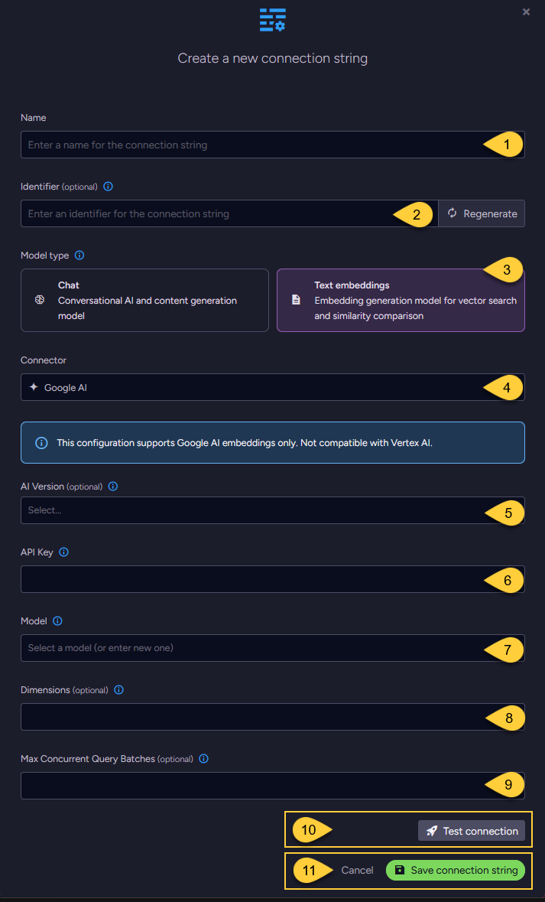
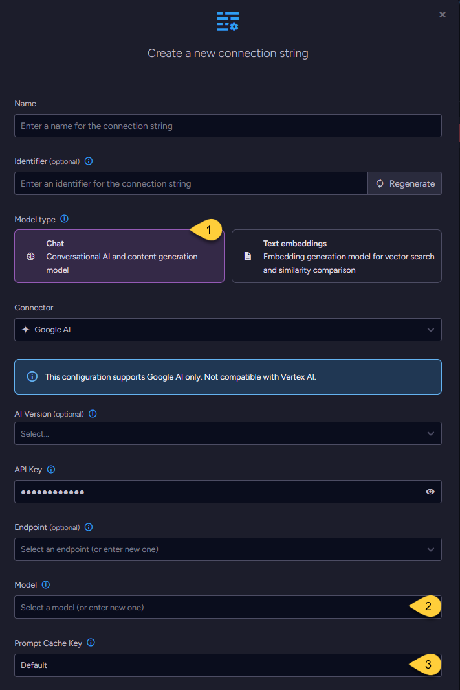

import Admonition from '@theme/Admonition';
import Tabs from '@theme/Tabs';
import TabItem from '@theme/TabItem';
import CodeBlock from '@theme/CodeBlock';
import ContentFrame from '@site/src/components/ContentFrame';
import Panel from '@site/src/components/Panel';

<Admonition type="note" title="">
    
* This article explains how to define a connection string to the [Google AI service](https://ai.google.dev/gemini-api/docs),  
  enabling RavenDB to use Google AI models for [Embeddings generation tasks](../../../ai-integration/generating-embeddings/overview.mdx),
  [Gen AI tasks](../../../ai-integration/gen-ai-integration/overview.mdx), and [AI agents](../../../ai-integration/ai-agents/overview.mdx).

* This configuration is not compatible with Vertex AI endpoints or credentials.  

* In this article:
  * [Define the connection string - from Studio](../../../ai-integration/connection-strings/google-ai.mdx#define-the-connection-string-from-studio)
    * [Configuring a text embedding model](../../../ai-integration/connection-strings/google-ai.mdx#configuring-a-text-embedding-model)
    * [Configuring a chat model](../../../ai-integration/connection-strings/google-ai.mdx#configuring-a-chat-model)
  * [Define the connection string - from the Client API](../../../ai-integration/connection-strings/google-ai.mdx#define-the-connection-string-from-the-client-api)
  * [Syntax](../../../ai-integration/connection-strings/google-ai.mdx#syntax) 
    
</Admonition>

<Panel heading="Define the connection string - from Studio">
    
### Configuring a text embedding model    



1. **Name**  
   Enter a name for this connection string.

2. **Identifier** (optional)  
   Enter an identifier for this connection string.  
   Learn more about the identifier in the [connection string identifier](../../../ai-integration/connection-strings/overview.mdx#the-connection-string-identifier) section.

3. **Model Type**  
   Select "Text Embeddings".

4. **Connector**  
   Select **Google AI** from the dropdown menu.

5. **AI Version** (optional)  
   * Select the Google AI API version to use.
   * If not specified, `V1_Beta` is used. Learn more in [API versions explained](https://ai.google.dev/gemini-api/docs/api-versions).

6. **API key**  
   Enter the API key used to authenticate requests to Google's AI services.

7. **Model**  
   Select or enter the Google AI text embedding model to use.

8. **Dimensions** (optional)  
   * Specify the number of dimensions for the output embeddings.  
   * If not specified, the model's default dimensionality is used.

9. **Max concurrent query batches**: (optional)
   * When making vector search queries, the content of the search terms must also be converted to embeddings to compare them against the stored vectors.  
     Requests to generate such query embeddings via the AI provider are sent in batches.
   * This parameter defines the maximum number of these batches that can be processed concurrently.  
     You can set a default value using the [Ai.Embeddings.MaxConcurrentBatches](../../../server/configuration/ai-integration-configuration.mdx#aiembeddingsmaxconcurrentbatches) configuration key.

10. Click **Test Connection** to confirm the connection string is set up correctly.

11. Click **Save** to store the connection string or **Cancel** to discard changes.
    
--- 
    
### Configuring a chat model

* When configuring a chat model, the UI displays the same base fields as those used for [text embedding models](../../../ai-integration/connection-strings/google-ai.mdx#configuring-a-text-embedding-model),  
  including the connection string _Name_, optional _Identifier_, _AI Version_, _API Key_, _Endpoint_, and _Model_ name.

* One additional setting is specific to chat models: _Prompt Cache Key_.



1. **Model Type**  
   Select "Chat".

2. **Model**  
   Enter the name of the Google AI model to use for chat completions.

3. **Prompt Cache Key** (optional)
    
   * Controls whether RavenDB includes the `prompt_cache_key` field in chat completion 
     requests sent to the AI provider when using [AI Agents](../../../ai-integration/ai-agents/overview.mdx).
    
   * When enabled (set to _True_), RavenDB sends the [Conversation's document ID](../../../ai-integration/ai-agents/overview.mdx#what-is-a-conversation) 
     in the `prompt_cache_key` field with each request.
     This can help the AI provider identify requests that belong to the same conversation and reuse a previously cached prompt prefix (system prompt + prior messages).
   
   * Why this helps:  
     AI providers typically process requests on many servers.
     **Without a cache key**, consecutive requests from the same conversation may be handled by different servers, each reprocessing the entire conversation from scratch.
     **With the cache key**, the provider can route the request to the same machine that handled the previous turn, where the computed prefix is likely still in memory.
     The provider then only needs to process the new messages, reducing latency and cost. 
    
   * The full conversation content is still sent with every request.
     The cache key is only a provider-side optimization hint. RavenDB does not control the provider's caching behavior.
    
   * **Options:**
     * `Default` - `False` (Disabled for Google AI).  
     * `True` - Always send the cache key.  
     * `False` - Never send the cache key.  
        Set to _False_ if your provider does not support the field and returns errors instead of ignoring it.

</Panel>

<Panel heading="Define the connection string - from the Client API">

<Tabs groupId='languageSyntax'>    
<TabItem value="Connection_string_for_text_embedding_model" label="Connection_string_for_text_embedding_model">
```csharp
using (var store = new DocumentStore())
{
    // Define the connection string to Google AI
    var connectionString = new AiConnectionString
    {
        // Connection string name & identifier
        Name = "ConnectionStringToGoogleAI", 
        Identifier = "identifier-to-the-connection-string", // optional
        
        // Model type
        ModelType = AiModelType.TextEmbeddings,
    
        // Google AI connection settings
        GoogleSettings = new GoogleSettings(
            apiKey: "your-api-key",
            model: "text-embedding-004",
            aiVersion: GoogleAIVersion.V1)
    };
    
    // Optionally, override the default maximum number of query embedding batches
    // that can be processed concurrently 
    connectionString.GoogleSettings.EmbeddingsMaxConcurrentBatches = 10;
    
    // Deploy the connection string to the server
    var operation = 
        new PutConnectionStringOperation<AiConnectionString>(connectionString);
    var putConnectionStringResult = store.Maintenance.Send(operation);
}
```
</TabItem>
<TabItem value="Connection_string_for_chat_model" label="Connection_string_for_chat_model">
```csharp
using (var store = new DocumentStore())
{
    // Define the connection string to Google AI
    var connectionString = new AiConnectionString
    {
        // Connection string name & identifier
        Name = "ConnectionStringToGoogleAI", 
        Identifier = "identifier-to-the-connection-string", // optional
        
        // Model type
        ModelType = AiModelType.TextEmbeddings,
    
        // Google AI connection settings
        GoogleSettings = new GoogleSettings(
            apiKey: "your-api-key",
            model: "text-embedding-004",
            aiVersion: GoogleAIVersion.V1)
    };
    
    // Optionally, enable or disable prompt prefix caching
    connectionString.GoogleSettings.EnablePromptCache = true;
    
    // Deploy the connection string to the server
    var operation = 
        new PutConnectionStringOperation<AiConnectionString>(connectionString);
    var putConnectionStringResult = store.Maintenance.Send(operation);
}
```
</TabItem>    
</Tabs>    

</Panel>

<Panel heading="Syntax">

<TabItem value="google_ai_settings" label="google_ai_settings">
```csharp
public class AiConnectionString
{
    public string Name { get; set; }
    public string Identifier { get; set; }
    public AiModelType ModelType { get; set; }
    public GoogleSettings GoogleSettings { get; set; }
}

public class GoogleSettings : AbstractAiSettings
{
    public string ApiKey { get; set; }
    public string Model { get; set; }
    public GoogleAIVersion? AiVersion { get; set; }
    
    // Relevant only for TEXT EMBEDDING models:
    // Specifies the number of dimensions in the generated embedding vectors.
    public int? Dimensions { get; set; }
    
    // Relevant only for CHAT models:
    // Controls whether the 'prompt_cache_key' field is included in chat completion requests.
    // When enabled, the conversation's document ID is sent as the cache key to the AI provider.
    // Default: disabled (false) for Google AI
    public bool? EnablePromptCache { get; set; } // optional
}

public enum GoogleAIVersion
{
    V1, // Represents the "v1" version of the Google AI API
    V1_Beta // Represents the "v1beta" version of the Google AI API
}

public class AbstractAiSettings
{
    public int? EmbeddingsMaxConcurrentBatches { get; set; }
}
```
</TabItem>
    
</Panel>