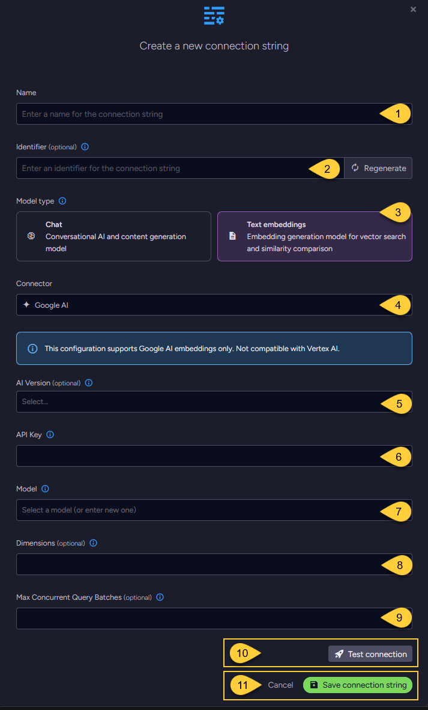

import Admonition from '@theme/Admonition';
import Tabs from '@theme/Tabs';
import TabItem from '@theme/TabItem';
import CodeBlock from '@theme/CodeBlock';

<Admonition type="note" title="">

* This article explains how to define a connection string to [Google AI](https://ai.google.dev/gemini-api/docs/embeddings),  
  enabling RavenDB to seamlessly integrate its [Embeddings generation tasks](../../../ai-integration/generating-embeddings/overview.mdx) with Google's AI services.

* This configuration supports **Google AI embeddings** only.  
  It is not compatible with Vertex AI endpoints or credentials.  

* RavenDB currently supports only text embeddings with Google AI.  
  Chat models are not supported through this integration.    

* In this article:
  * [Define the connection string - from Studio](../../../ai-integration/connection-strings/google-ai.mdx#define-the-connection-string---from-studio)
  * [Define the connection string - from the Client API](../../../ai-integration/connection-strings/google-ai.mdx#define-the-connection-string---from-the-client-api)
  * [Syntax](../../../ai-integration/connection-strings/google-ai.mdx#syntax) 
    
</Admonition>

## Define the connection string - from Studio



1. **Name**  
   Enter a name for this connection string.

2. **Identifier** (optional)  
   Enter an identifier for this connection string.  
   Learn more about the identifier in the [connection string identifier](../../../ai-integration/connection-strings/overview.mdx#the-connection-string-identifier) section.

3. **Model Type**  
   Select "Text Embeddings".

4. **Connector**  
   Select **Google AI** from the dropdown menu.

5. **AI Version** (optional)  
   * Select the Google AI API version to use.
   * If not specified, `V1_Beta` is used. Learn more in [API versions explained](https://ai.google.dev/gemini-api/docs/api-versions).

6. **API key**  
   Enter the API key used to authenticate requests to Google's AI services.

7. **Model**  
   Select or enter the Google AI text embedding model to use.

8. **Dimensions** (optional)  
   * Specify the number of dimensions for the output embeddings.  
   * If not specified, the model's default dimensionality is used.

9. **Max concurrent query batches**: (optional)
   * When making vector search queries, the content of the search terms must also be converted to embeddings to compare them against the stored vectors.  
     Requests to generate such query embeddings via the AI provider are sent in batches.
   * This parameter defines the maximum number of these batches that can be processed concurrently.  
     You can set a default value using the [Ai.Embeddings.MaxConcurrentBatches](../../../server/configuration/ai-integration-configuration.mdx#aiembeddingsmaxconcurrentbatches) configuration key.

10. Click **Test Connection** to confirm the connection string is set up correctly.

11. Click **Save** to store the connection string or **Cancel** to discard changes.

## Define the connection string - from the Client API

<TabItem value="google_ai_connection_string_embedding" label="google_ai_connection_string_embedding">
```python
store = DocumentStore([ravendb_url], database_name)
store.initialize()

# Define the connection string to Google AI
connection_string = AiConnectionString(
    # Connection string name & identifier
    name="ConnectionStringToGoogleAI",
    identifier="identifier-to-the-connection-string",
    # Model type
    model_type=AiModelType.TEXT_EMBEDDINGS,
    # Google AI connection settings
    google_settings=GoogleSettings(api_key="your-api-key", model="text-embedding-004", ai_version=GoogleAiVersion.V1),
)

# Optionally, override the default maximum number of query embedding batches that can be processed concurrently
connection_string.google_settings.embeddings_max_concurrent_batches = 10

# Deploy the connection string to the server
put_connection_string_op = PutConnectionStringOperation(connection_string)
put_connection_string_result = store.maintenance.send(put_connection_string_op)
```
</TabItem>

## Syntax

<TabItem value="google_ai_settings" label="google_ai_settings">
```python
class AiConnectionString(ConnectionString):
    def __init__(
       self,
       name: str,
       identifier: str,
       # ...
       model_type: AiModelType = None,
       google_settings: Optional[GoogleSettings] = None,
    ): ...

class GoogleSettings(AbstractAiSettings):
    def __init__(
        self,
        model: str = None,
        api_key: str = None,
        ai_version: GoogleAiVersion = None,
        dimensions: int = None,
        embeddings_max_concurrent_batches: int = None,
    ):
        super().__init__(embeddings_max_concurrent_batches)
        ...

class GoogleAiVersion(Enum):
    V1 = "V1" # Represents the "v1" version of the Google AI API
    V1_Beta = "V1_Beta" # Represents the "v1beta" version of the Google AI API

class AbstractAiSettings:
    def __init__(self, embeddings_max_concurrent_batches: int = None): ...
```
</TabItem>
