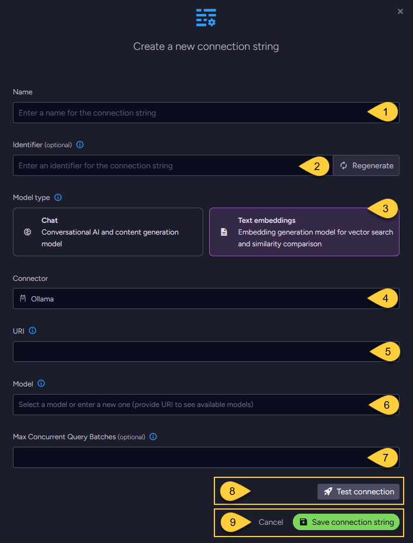
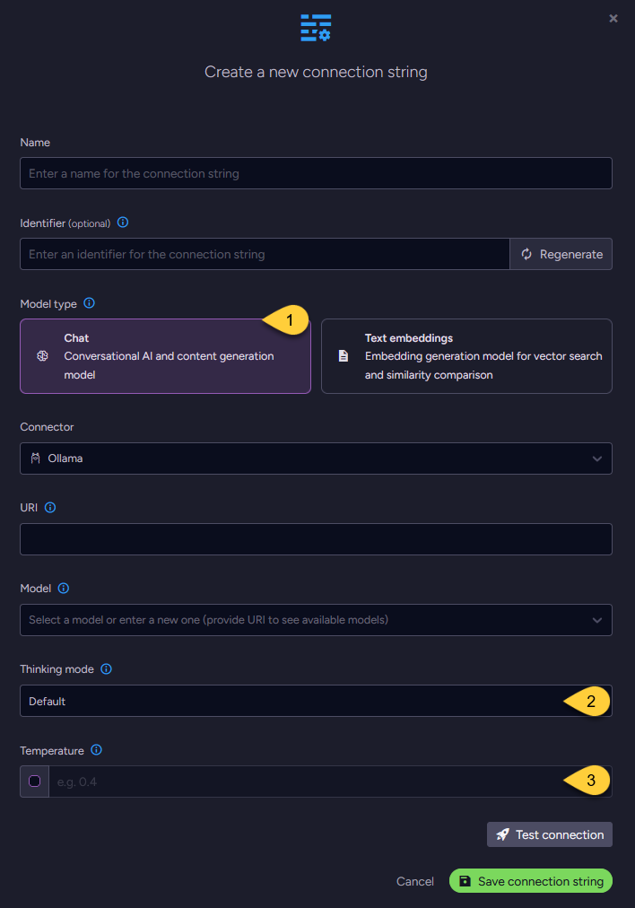

import Admonition from '@theme/Admonition';
import Tabs from '@theme/Tabs';
import TabItem from '@theme/TabItem';
import CodeBlock from '@theme/CodeBlock';

<Admonition type="note" title="">
    
* This article explains how to define a connection string to [Ollama](https://ollama.com/blog/embedding-models),      
  enabling RavenDB to use Ollama models for [Embeddings generation tasks](../../../ai-integration/generating-embeddings/overview.mdx),
  [Gen AI tasks](../../../ai-integration/gen-ai-integration/gen-ai-overview.mdx), and [AI agents](../../../ai-integration/ai-agents/ai-agents_overview.mdx).

* In this article:
  * [Define the connection string - from the Studio](../../../ai-integration/connection-strings/ollama.mdx#define-the-connection-string---from-the-studio)
    * [Configuring a text embedding model](../../../ai-integration/connection-strings/ollama.mdx#configuring-a-text-embedding-model)
    * [Configuring a chat model](../../../ai-integration/connection-strings/ollama.mdx#configuring-a-chat-model)
  * [Define the connection string - from the Client API](../../../ai-integration/connection-strings/ollama.mdx#define-the-connection-string---from-the-client-api)
  * [Syntax](../../../ai-integration/connection-strings/ollama.mdx#syntax) 
    
</Admonition>

## Define the connection string - from the Studio

### Configuring a text embedding model



1. **Name**  
   Enter a name for this connection string.

2. **Identifier** (optional)  
   Learn more about the identifier in the [connection string identifier](../../../ai-integration/connection-strings/connection-strings-overview.mdx#identifier) section.

3. **Model Type**  
   Select "Text Embeddings".

4. **Connector**  
   Select **Ollama** from the dropdown menu.

5. **URI**  
   Enter the Ollama API URI.

6. **Model**  
   Specify the Ollama text embedding model to use.

7. **Max concurrent query batches**: (optional)
   * When making vector search queries, the content of the search terms must also be converted to embeddings to compare them against the stored vectors.  
     Requests to generate such query embeddings via the AI provider are sent in batches.
   * This parameter defines the maximum number of these batches that can be processed concurrently.  
     You can set a default value using the [Ai.Embeddings.MaxConcurrentBatches](../../../server/configuration/ai-integration-configuration.mdx#aiembeddingsmaxconcurrentbatches) configuration key.

8. Click **Test Connection** to confirm the connection string is set up correctly.

9. Click **Save** to store the connection string or **Cancel** to discard changes.

### Configuring a chat model

* When configuring a chat model, the UI displays the same base fields as those used for [text embedding models](../../../ai-integration/connection-strings/ollama.mdx#configuring-a-text-embedding-model),  
  including the connection string _Name_, optional _Identifier_, _URI_, and _Model_ name.

* In addition, two fields are specific to chat models: _Temperature_ and _Thinking mode_. 



1. **Model Type**  
   Select "Chat".

2. **Model**  
   Enter the name of the Ollama model to use for chat completions.

3. **Thinking mode** (optional)  
   The thinking mode setting controls whether the model outputs its internal reasoning steps before returning the final answer.
   * When setting to `Enabled`:  
     the model outputs a series of intermediate reasoning steps (chain of thought) before the final answer.  
     This may improve output quality for complex tasks, but increases response time and token usage.
   * When setting to `Disabled`:  
     the model returns only the final answer, without exposing intermediate steps.  
     This is typically faster and more cost-effective (uses fewer tokens),  
     but may reduce quality on complex reasoning tasks.
   * When setting to `Default`:  
     The model’s built-in default will be used.
     This value may vary depending on the selected model.  
     Set this parameter based on the trade-off between task complexity and speed/cost requirements.

4. **Temperature** (optional)  
   The temperature setting controls the randomness and creativity of the model’s output.  
   Valid values typically range from `0.0` to `2.0`:  
     * Higher values (e.g., `1.0` or above) produce more diverse and creative responses.
     * Lower values (e.g., `0.2`) result in more focused, consistent, and deterministic output.
     * If not explicitly set, Ollama defaults to a temperature of `0.8`.  
       See [Ollama's parameters reference](https://ollama.readthedocs.io/en/modelfile/?utm_source=chatgpt.com#valid-parameters-and-values).

---

## Define the connection string - from the Client API

<Tabs groupId='languageSyntax'>
<TabItem value="Connection_string_for_text_embedding_model" label="Connection_string_for_text_embedding_model">
```csharp
using (var store = new DocumentStore())
{
    // Define the connection string to Ollama
    var connectionString = new AiConnectionString
    {
        // Connection string Name & Identifier
        Name = "ConnectionStringToOllama", 
        Identifier = "identifier-to-the-connection-string", // optional
        
        // Model type
        ModelType = AiModelType.TextEmbeddings,
        
        // Ollama connection settings
        OllamaSettings = new OllamaSettings
        {
            Uri = "http://localhost:11434",
            
            // Name of text embedding model to use
            Model = "mxbai-embed-large",
            
            // Optionally, override the default maximum number of query embedding batches
            // that can be processed concurrently 
            EmbeddingsMaxConcurrentBatches = 10
        }
    };
    
    // Deploy the connection string to the server
    var putConnectionStringOp = new PutConnectionStringOperation<AiConnectionString>(connectionString);
    var putConnectionStringResult = store.Maintenance.Send(putConnectionStringOp);
}
```
</TabItem>
<TabItem value="Connection_string_for_chat_model" label="Connection_string_for_chat_model">
```csharp
using (var store = new DocumentStore())
{
    // Define the connection string to Ollama
    var connectionString = new AiConnectionString
    {
        // Connection string Name & Identifier
        Name = "ConnectionStringToOllama", 
        Identifier = "identifier-to-the-connection-string", // optional
        
        // Model type
        ModelType = AiModelType.Chat,
        
        // Ollama connection settings
        OllamaSettings = new OllamaSettings
        {
            Uri = "http://localhost:11434",
            
            // Name of chat model to use
            Model = "llama3:8b-instruct",
            
            // Optionally, set the model's temperature
            Temperature = 0.4,
            
            // Optionally, set the model's thinking behavior
            Think = true
        }
    };
    
    // Deploy the connection string to the server
    var putConnectionStringOp = new PutConnectionStringOperation<AiConnectionString>(connectionString);    
    var putConnectionStringResult = store.Maintenance.Send(putConnectionStringOp);
}
```
</TabItem>
</Tabs>

## Syntax

<TabItem value="ollama_settings" label="ollama_settings">
```csharp
public class AiConnectionString
{
    public string Name { get; set; }
    public string Identifier { get; set; }
    public AiModelType ModelType { get; set; }
    public OllamaSettings OllamaSettings { get; set; }
}

public class OllamaSettings : AbstractAiSettings
{
    // The base URI of your Ollama server
    // For a local setup, use: "http://localhost:11434"
    public string Uri { get; set; }
    
    // The name of the model to use 
    public string Model { get; set; }
    
    // Relevant only for chat models:
    // Control whether the model outputs its internal reasoning steps before returning the final answer.
    // 'true'  - the model outputs intermediate reasoning steps (chain of thought) before the final answer.
    // 'false' - the model returns only the final answer, without exposing intermediate steps.
    // 'null'  - the model’s default behavior is used.
    public bool? Think { get; set; }
    
    // Relevant only for chat models:
    // Controls the randomness and creativity of the model’s output.
    // Higher values (e.g., 1.0 or above) produce more diverse and creative responses.
    // Lower values (e.g., 0.2) result in more focused and deterministic output.
    // If set to 'null', the temperature is not sent and the model's default will be used.
    public double? Temperature { get; set; }
}

public class AbstractAiSettings
{
    public int? EmbeddingsMaxConcurrentBatches { get; set; }
}
```
</TabItem>
