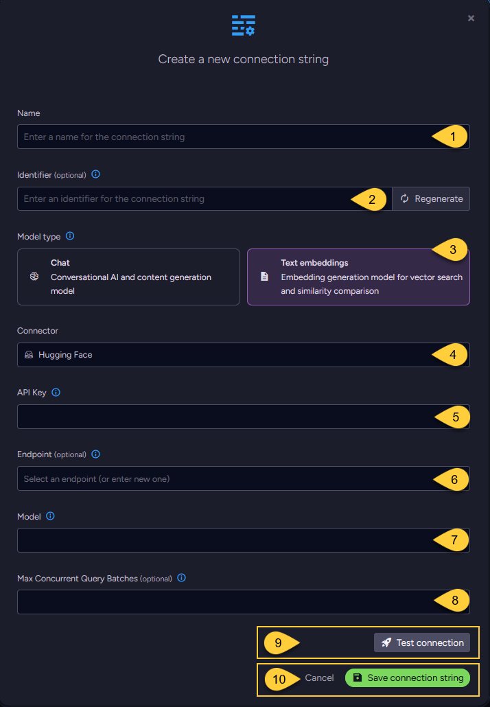

import Admonition from '@theme/Admonition';
import Tabs from '@theme/Tabs';
import TabItem from '@theme/TabItem';
import CodeBlock from '@theme/CodeBlock';
import LanguageSwitcher from "@site/src/components/LanguageSwitcher";
import LanguageContent from "@site/src/components/LanguageContent";

export const supportedLanguages = ["csharp"];

# Connection String to Hugging Face
<LanguageSwitcher supportedLanguages={supportedLanguages} />
<LanguageContent language="csharp">

<Admonition type="note" title="Note">

* This article explains how to define a connection string to the [Hugging Face's text embedding services](https://huggingface.co/docs/text-embeddings-inference/en/index),  
  enabling RavenDB to seamlessly integrate its [embeddings generation tasks](../../ai-integration/generating-embeddings/overview) within your environment.

* In this article:
  * [Define the connection string - from the Studio](../../ai-integration/connection-strings/hugging-face#define-the-connection-string---from-the-studio)
  * [Define the connection string - from the Client API](../../ai-integration/connection-strings/hugging-face#define-the-connection-string---from-the-client-api)
  * [Syntax](../../ai-integration/connection-strings/hugging-face#syntax) 
    
</Admonition>
## Define the connection string - from the Studio

1. **Name**  
   Enter a name for this connection string.

2. **Identifier** (optional)  
   Learn more about the identifier in the [connection string identifier](../../ai-integration/connection-strings/connection-strings-overview#the-connection-string-identifier) section.

3. **Connector**  
   Select **Hugging Face** from the dropdown menu.

4. **API key**  
   Enter the API key used to authenticate requests to Hugging Face's text embedding services.

5. **Endpoint** (optional)  
   Select or enter the Hugging Face endpoint for generating embeddings from text.  
   If not specified, the default endpoint is used.  
   (`https://api-inference.huggingface.co/`)

6. **Model**  
   Specify the Hugging Face text embedding model to use.

7. **Max concurrent query batches**: (optional)
   * When making vector search queries, the content of the search terms must also be converted to embeddings to compare them against the stored vectors.
     Requests to generate such query embeddings via the AI provider are sent in batches.
   * This parameter defines the maximum number of these batches that can be processed concurrently.  
     You can set a default value using the [Ai.Embeddings.MaxConcurrentBatches](../../server/configuration/ai-integration-configuration#ai.embeddings.maxconcurrentbatches) configuration key.

8. Click **Test Connection** to confirm the connection string is set up correctly.

9. Click **Save** to store the connection string or **Cancel** to discard changes.

## Define the connection string - from the Client API

<TabItem value="something-something" label="create_connection_string_hugging_face">
<CodeBlock language="csharp">
{`using (var store = new DocumentStore())
\{
    // Define the connection string to Hugging Face
    var connectionString = new AiConnectionString
    \{
        // Connection string name & identifier
        Name = "ConnectionStringToHuggingFace", 
        Identifier = "identifier-to-the-connection-string", // optional
        
        // Hugging Face connection settings
        HuggingFaceSettings = new HuggingFaceSettings(
            apiKey: "your-api-key",
            endpoint: "https://api-inference.huggingface.co/",
            model: "sentence-transformers/all-MiniLM-L6-v2")
    \};
    
    // Optionally, override the default maximum number of query embedding batches
    // that can be processed concurrently 
    connectionString.HuggingFaceSettings.EmbeddingsMaxConcurrentBatches = 10;
    
    // Deploy the connection string to the server
    var operation = new PutConnectionStringOperation<AiConnectionString>(connectionString);
    var putConnectionStringResult = store.Maintenance.Send(operation);
\}
`}
</CodeBlock>
</TabItem>

## Syntax

<TabItem value="something-something" label="hugging_face_settings">
<CodeBlock language="csharp">
{`public class AiConnectionString
\{
    public string Name \{ get; set; \}
    public string Identifier \{ get; set; \}
    public HuggingFaceSettings HuggingFaceSettings \{ get; set; \}
\}

public class HuggingFaceSettings : AbstractAiSettings
\{
    public string ApiKey \{ get; set; \}
    public string Endpoint \{ get; set; \}
    public string Model \{ get; set; \}
\}

public class AbstractAiSettings
\{
    public int? EmbeddingsMaxConcurrentBatches \{ get; set; \}
\}
`}
</CodeBlock>
</TabItem>

</LanguageContent>

<!---
### Vector Search
- [RavenDB as a vector database](../../ai-integration/vector-search/ravendb-as-vector-database)
- [Vector search using a static index](../../ai-integration/vector-search/vector-search-using-static-index)
- [Vector search using a dynamic query](../../ai-integration/vector-search/vector-search-using-dynamic-query)

### Embeddings Generation
- [Generating embeddings - overview](../../ai-integration/generating-embeddings/overview)
- [Embeddings generation task](../../ai-integration/generating-embeddings/embeddings-generation-task)

### AI Connection Strings
- [Connection strings - overview](../../ai-integration/connection-strings/connection-strings-overview)

-->