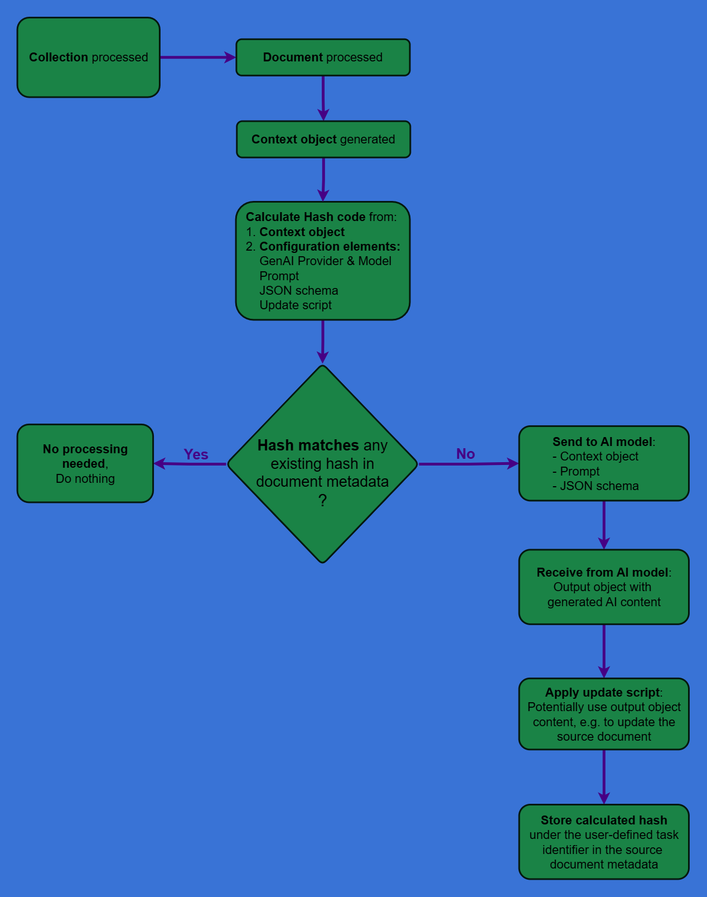
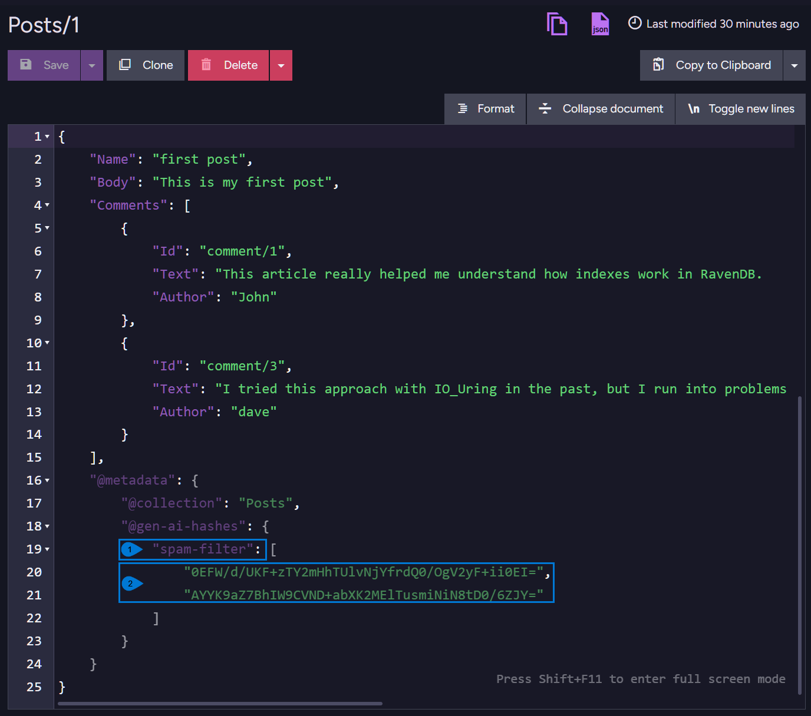
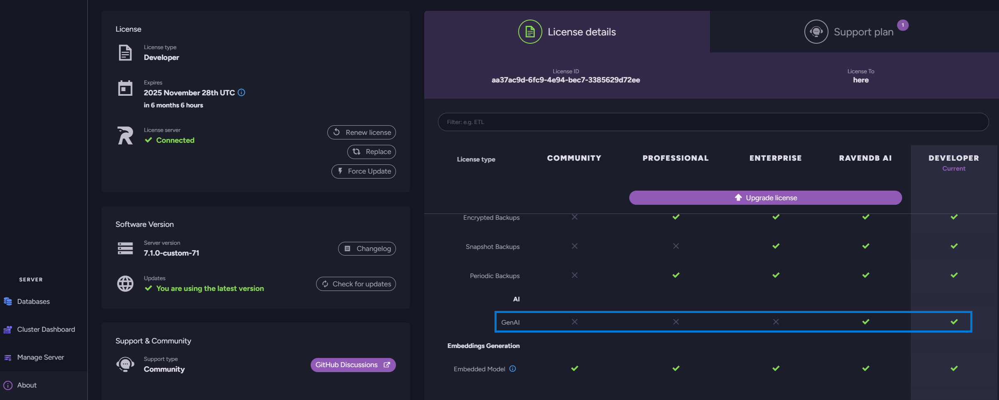

import Admonition from '@theme/Admonition';
import Tabs from '@theme/Tabs';
import TabItem from '@theme/TabItem';
import CodeBlock from '@theme/CodeBlock';
import LanguageSwitcher from "@site/src/components/LanguageSwitcher";
import LanguageContent from "@site/src/components/LanguageContent";

# GenAI Integration: Overview
<Admonition type="note" title="">

* **GenAI Integration** allows RavenDB to connect and interact with Generative AI models, 
  introducing numerous new ways for intelligent, autonomous data processing in production.  
  
     A task can be built in minutes, e.g. to Classify customer inquiries based on sentiment, Generate automated responses to frequently asked questions, Escalate support tickets, Summarize lengthy documents, Provide relevant recommendations, Tag and prioritize content for efficient retrieval, Enhance data security by detecting anomalies, Optimize inventory predictions... or endless other options, bound only by our creativity.  

* **Ongoing GenAI tasks** can be easily defined, tested and deployed using API or Studio.  

     While creating a GenAI task via Studio, a smart interactive environment is provided, 
     allowing each phase of the task to be tested in a secluded playground, freely and without 
     harming your data, but also produce result sets that can be tried out by the next phase.  

* **You can use local and remote AI models**, e.g. a local `Ollama llama3.2` service during 
  a development phase that requires speed and no additional costs, and a remote `OpenAI gpt-4o-mini` 
  when you need a live service with advanced capabilities.  

* In this article:
   * [RavenDB GenAI tasks](../../ai-integration/gen-ai-integration/gen-ai-overview#ravendb-genai-tasks)
     * [The flow](../../ai-integration/gen-ai-integration/gen-ai-overview#the-flow)
     * [The elements](../../ai-integration/gen-ai-integration/gen-ai-overview#the-elements)
     * [How to create and run a GenAI task](../../ai-integration/gen-ai-integration/gen-ai-overview#how-to-create-and-run-a-genai-task)
   * [Runtime](../../ai-integration/gen-ai-integration/gen-ai-overview#runtime)
     * [Tracking of processed document parts](../../ai-integration/gen-ai-integration/gen-ai-overview#tracking-of-processed-document-parts)
   * [Licensing](../../ai-integration/gen-ai-integration/gen-ai-overview#licensing)
   * [Supported services](../../ai-integration/gen-ai-integration/gen-ai-overview#supported-services)
   * [Common use cases](../../ai-integration/gen-ai-integration/gen-ai-overview#common-use-cases)

</Admonition>

<hr />

## RavenDB GenAI tasks

RavenDB offers an integration of generative AI capabilities through user-defined **GenAI tasks**.  
A GenAI task is an ongoing process that continuously monitors a document collection associated with it, and reacts when a document is added or modified by Retrieving the document, Generating "context objects" based on its data, Sending these objects to a generative AI model along with instructions regarding what to do with the data and how to format the reply, and potentially Acting upon the model's response.  

### The flow:
Let's put the stages described above in order.

1. A GenAI task continuously monitors the collection it is associated with.  
2. When a document is added or modified, the task retrieves it.  
3. The task generates context objects based on the source document data.  
   To generate these objects, the task applies a user-defined [context generation script](../../ai-integration/gen-ai-integration/gen-ai-overview#the-elements_context-objects) 
   that runs through the source document and generates context objects based on the document data.  
4. The task sends each context object to a GenAI model for processing.  
    * The task is associated with a [Connection string](../../ai-integration/gen-ai-integration/create-gen-ai-task/create-gen-ai-task_studio#studio_connection-string) 
      that defines how to connect to the AI model.
    * Each context object is sent via a separate connection to the AI model.  
      (note that the number of concurrent connections to the AI model is configurable via the [MaxConcurrency](../../ai-integration/gen-ai-integration/create-gen-ai-task/create-gen-ai-task_api#genaiconfiguration) setting.)  
    * Each context object is sent along with a user-defined [Prompt](../../ai-integration/gen-ai-integration/gen-ai-overview#the-elements_prompt), 
      that instructs the AI model what to do with the data, and 
      a user-defined [JSON schema](../../ai-integration/gen-ai-integration/gen-ai-overview#the-elements_json-schema) 
      that instructs the AI model how to shape its response.  
5. When the AI model returns its response, a user-defined [Update script](../../ai-integration/gen-ai-integration/gen-ai-overview#the-elements_update-script) 
   is applied to handle the results.  

### The elements:
These are the elements that need to be defined for a GenAI task.

* [Connection string](../../ai-integration/gen-ai-integration/create-gen-ai-task/create-gen-ai-task_studio#studio_connection-string)  
  The connection string defines the connection to the GenAI model.  

* <a id="the-elements_context-objects"/>**Context generation script**  
  The context generation script goes through the source document,  
  and applies the `ai.genContext` method to create **context objects** based on the source document's data.  
  E.g. -  
  <TabItem value="javascript" label="javascript">

      ```javascript
      for(const comment of this.Comments) {
         // Use the \`ai.genContext\` method to generate a context object for each comment.  
         ai.genContext({Text: comment.Text, Author: comment.Author, Id: comment.Id});
      }
      ```
      </TabItem>

   * RavenDB will pass the AI model **not** the source document, but the generated context objects.  
   * Producing a series of context objects that share a clear common format can add the communication 
     with the AI model a methodical, reliable aspect that is under our full control.  
   * This is also an important security layer added between the database and the AI model, that 
     you can use to ensure that only data you actually want to share with the AI model is passed on.  

* <a id="the-elements_json-schema"/>**JSON schema**  
  This is a JSON-based object that defines the layout of the AI model's response.  
  This object can be either an **explicit JSON schema**, or a **sample response object** 
  that RavenDB will turn to a JSON schema for us.  
  
  It is normally easier to provide a sample response object, and let RavenDB create 
  the schema behind the scenes. E.g. -  
  <Tabs groupId='languageSyntax'>
  <TabItem value="Sample_response_object" label="Sample_response_object">
   
  ```json
  { 
      "Blocked": true, 
      "Reason": "Concise reason for why this comment was marked as spam or ham" 
  }
  ```
  </TabItem>
  <TabItem value="Explicit_JSON_schema" label="Explicit_JSON_schema">

  ```json
  {
    "name": "some-name",
    "strict": true,
    "schema": {
      "type": "object",
      "properties": {
        "Blocked": {
          "type": "boolean"
        },
        "Reason": {
          "type": "string",
          "description": "Concise reason for why this comment was marked as spam or ham"
        }
      },
      "required": [
        "Blocked",
        "Reason"
      ],
      "additionalProperties": false
    }
  }
  ```
  </TabItem>
  </Tabs>

* <a id="the-elements_prompt"/>**Prompt**  
  The prompt relays to the AI model what we need it to do.  
   * It can be phrased in natural language.  
   * Since the JSON schema already specifies the response layout, including what fields we'd 
     like the AI model to fill and with what content, the prompt can be used simply to explain 
     what we want the model to do.  
     E.g. -  
     <TabItem value="plain" label="plain">

     ```plain
     Check if the following blog post comment is spam or not.  
     m comment typically includes irrelevant or promotional content, excessive 
     , misleading information, or is written with the intent to manipulate search 
     ngs or advertise products/services.  
     der the language, intent, and relevance of the comment to the blog post topic.
     ```
     </TabItem>

* <a id="the-elements_update-script"/>**Update Script**  
  The update script is executed when the AI model responds to a context object we've sent it.  
   * The update script can take any action, based on the information included in the model's response.  
     It can, for example, Modify the source document, Create new documents populated by AI-generated text, 
     Remove existing documents, and so on.  
     The following script, for example, removes a comment from a blog post if the AI has concluded 
     that the comment is spam.  
     <TabItem value="javascript" label="javascript">

      ```javascript
      const idx = this.Comments.findIndex(c => c.Id == $input.Id);  
      if($output.Blocked)
      {
          this.Comments.splice(idx, 1);  
      } 
      ```
      </TabItem>

   * The update script can also be used as an additional security measure, and apply only actions 
     that we trust not to inflict any damage.  

### How to create and run a GenAI task:

* You can use [Studio's intuitive wizard](../../ai-integration/gen-ai-integration/create-gen-ai-task/create-gen-ai-task_studio#add-a-genai-task) 
  to create GenAI tasks. The wizard will guide you through the task creation phases, 
  exemplify where needed, and provide you with convenient, interactive, secluded "playgrounds" 
  for free interactive experimenting.  
* You can also create GenAI tasks using the [Client API](../../ai-integration/gen-ai-integration/create-gen-ai-task/create-gen-ai-task_api) 

<hr />

## Runtime

Once you complete the configuration and save the task, it will start running (if enabled).  
The task will monitor the collection associated with it, and process documents as they are 
added or modified.  

### Tracking of processed document parts:

* After creating a [context object](../../ai-integration/gen-ai-integration/create-gen-ai-task/create-gen-ai-task_studio#generate-context-objects) 
  for a document part and processing it, the GenAI task will create a hash code and log it in the document's metadata, under a property named after the user-defined task identifier.  
  <Admonition type="note" title="">
  The hash code is computed based on these elements:  
   * The context object  
   * The prompt  
   * The GenAI provider and model (e.g. OpenAI gpt-4o-mini)
   * The JSON schema  
   * The update script
  </Admonition>
* If the task is requested to process this document part again, it will compute a new hash code based on these elements, and compare it with the existing hash, logged in the document metadata.  
   * If the new hash differs from the existing one, it will indicate that the content or the configuration has changed, and the task will reprocess this document part.  
   * If the new hash is identical to the existing one, the task will conclude that the context object was already processed with the exact same content and task configuration, and skip reprocessing it.  

      

      <a id="gen-ai-metadata"/>

      1. **Identifier**  
        This is the user-defined task identifier (defined as part of the configuration).  
      2. **Hash codes**  
        These hash codes were created after processing the document.  
        The codes were computed per comment, based on the comment's content and the current task configuration.  
        When the document is processed again, the task will generate a new hash code for each comment. If the comment or the task configuration has changed, the new hash will differ from the existing one and trigger reprocessing. If none of them changed, the identical hash will indicate that no reprocessing is needed.  

<hr />

## Licensing

For RavenDB to support the GenAI Integration feature, you need a `RavenDB AI` license type.  
A `Developer` license will also enable the feature for experimentation and development.  



<hr />

## Supported services

Supported services include:

* `OpenAI` and `OpenAI-compatible` services  
* `Ollama`  

<hr />

## Common use cases

GenAI tasks can be used to address a wide variety of use cases. Here are some examples.  

### Content analysis & moderation:
* **Content categorization**  
  Automatically tag and organize articles, documents, or media files
* **Spam and content filtering**  
  Automatically detect and flag spam, offensive, or inappropriate comments, reviews, or posts
* **Sentiment analysis**  
  Classify customer feedback, support tickets, or social media mentions by emotional tone

### Data enrichment & enhancement:
* **Document summarization**  
  Generate concise summaries of lengthy reports, articles, or legal documents
* **Data extraction**  
  Pull key details like dates, names, amounts, or entities from unstructured text
* **Content translation**  
  Automatically translate documents or user-generated content

### Smart automation & workflows
* **Support ticket routing**  
  Analyze incoming tickets and automatically assign priority levels or route to appropriate teams
* **Compliance checking**  
  Scan documents for regulatory compliance issues or policy violations
* **Data quality improvement**  
  Standardize formats, correct inconsistencies, or enrich incomplete records

### Enhanced search & discovery
* **Intelligent tagging**  
  Generate relevant keywords and metadata for better document searchability
* **Content recommendations**  
  Suggest related articles, products, or resources based on document analysis
* **Knowledge extraction**  
  Build searchable knowledge bases from unstructured document collections

### Business intelligence & insights
* **Trend detection**  
  Identify patterns and emerging themes in customer communications or market data
* **Competitive analysis**  
  Monitor and analyze competitor mentions, pricing, or product information
* **Risk assessment**  
  Flag potentially problematic contracts, transactions, or communications


