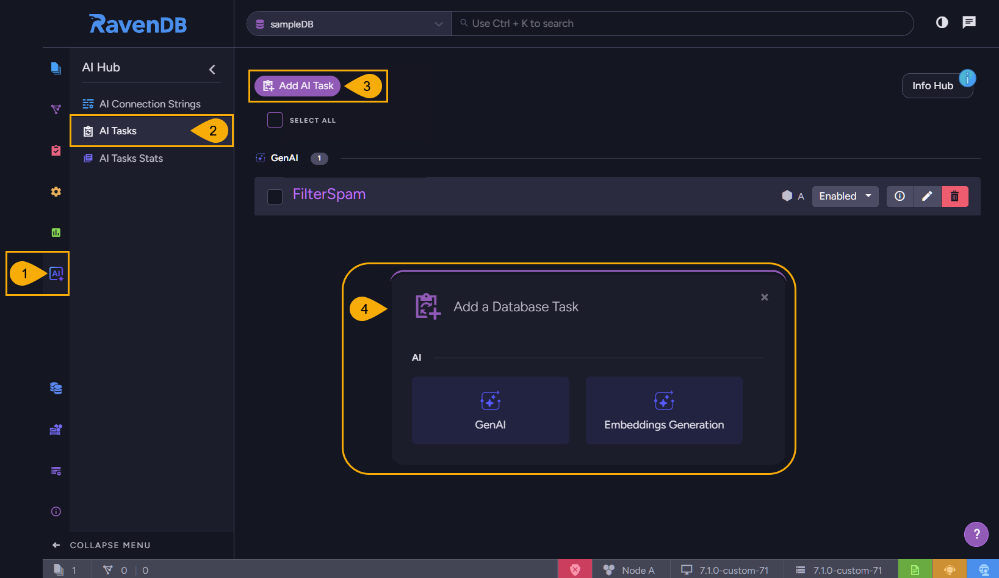
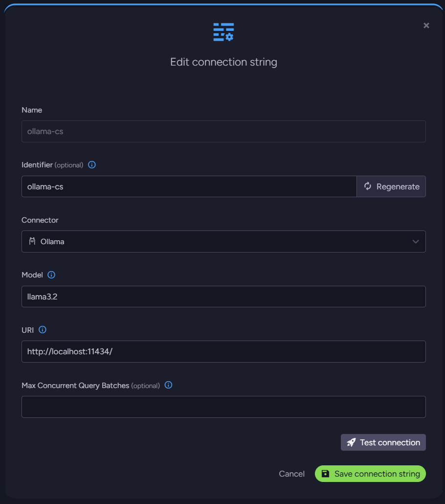
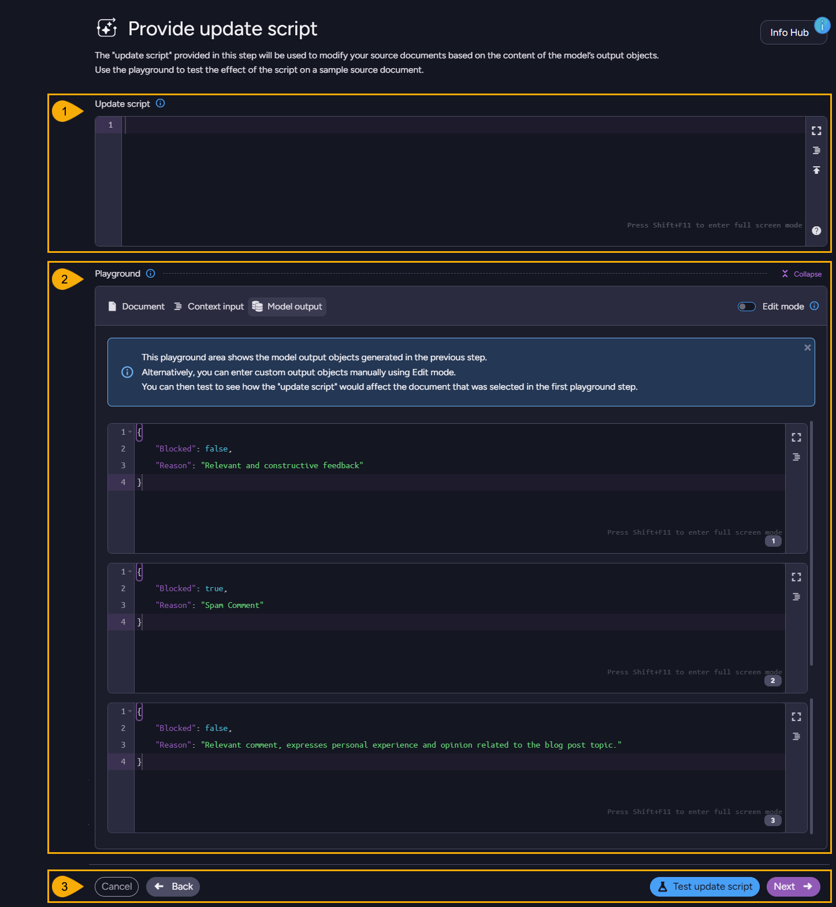

import Admonition from '@theme/Admonition';
import Tabs from '@theme/Tabs';
import TabItem from '@theme/TabItem';
import CodeBlock from '@theme/CodeBlock';
import LanguageSwitcher from "@site/src/components/LanguageSwitcher";
import LanguageContent from "@site/src/components/LanguageContent";

# GenAI Integration: Studio
<Admonition type="note" title="Note">

* In this article:
    * [GenAI Task](../../ai-integration/gen-ai-integration/gen-ai-studio#genai-task)  
    * [Add a GenAI Task](../../ai-integration/gen-ai-integration/gen-ai-studio#add-a-genai-task)
    * [Configure basic settings](../../ai-integration/gen-ai-integration/gen-ai-studio#configure-basic-settings)
    * [Generate context objects](../../ai-integration/gen-ai-integration/gen-ai-studio#generate-context-objects)
    * [Define Prompt and JSON schema](../../ai-integration/gen-ai-integration/gen-ai-studio#define-prompt-and-json-schema)
    * [Provide update script](../../ai-integration/gen-ai-integration/gen-ai-studio#provide-update-script)
    * [Review configuration and Save task](../../ai-integration/gen-ai-integration/gen-ai-studio#review-configuration-and-save-task)

</Admonition>
## GenAI Task

### What does a GenAI task do?
A GenAI task is an ongoing task that:  

1. Retrieves documents from a collection of your choice.  
2. Shapes each retrieved document into an easy-to-handle "context object".  
3. Sends context objects one by one to an AI model for processing.  
4. Handles the AI model's output.  
### The GenAI Task wizard
Studio's [AI Tasks](../../ai-integration/ai-tasks-list-view) view includes a GenAI **wizard**.  
Using this wizard, we can easily **create and configure** our task, as well as **test each step 
of its creation** in a dedicated "playground".  
We will go through the task creation and testing sequence below, using the wizard.  
### Sample data
While demonstrating the creation and testing of a GenAI task, we will use the following 
sample document, illustrating a blog post with an array of comments, of which one is spam.  
We will use our GenAI task to go through the comments and identify spam entries so we can 
remove them.  
To use this sample through this guide, simply create a document named `posts/1` with the 
following content.  

<TabItem value="something" label="json">
<CodeBlock language="json">
{`\{
    "Name": "first post",
    "Body": "This is my first post",
    "Comments": [
        \{
            "Id": "comment/1",
            "Text": "This article really helped me understand how indexes work in RavenDB. Great write-up!",
            "Author": "John"
        \},
        \{
            "Id": "comment/2",
            "Text": "Learn how to make $5000/month from home! Visit click4cash.biz.example now!!!",
            "Author": "shady_marketer"
        \},
        \{
            "Id": "comment/3",
            "Text": "I tried this approach with IO_Uring in the past, but I run into problems with security around the IO systems and the CISO didn't let us deploy that to production. It is more mature at this point?",
            "Author": "dave"
        \}
    ],
    "@metadata": \{
        "@collection": "Posts"
    \}
\}
`}
</CodeBlock>
</TabItem>

## Add a GenAI Task
To add a new GenAI task, open: **AI Hub** &gt; **AI Tasks** &gt; **Add AI Task** &gt; **GenAI**  

1. **AI Hub**  
   Click to open the [AI Hub view](../../ai-integration/ai-tasks-list-view).  
   Use this view to handle AI connection strings and tasks, and to view task statistics.  
2. **AI Tasks**  
   Click to open the AI Tasks view.  
   Use this view to list, configure, or remove AI tasks.  
3. **Add AI Task**  
   Click to add an AI task.  
4. **GenAI**  
   Click to open a wizard that will guide you through the creation and testing of your GenAI task.  
   The steps of this wizard are explained below, starting with basic GenAI task settings.  

## Configure basic settings

1. **Task name**  
   Give your task a meaningful name.  

2. <a id="unique-identifier"/>**Identifier**  
   Give your task a unique identifier that will be used by the GenAI task.  
    * You can name the identifier yourself, or click **Regenerate** to name it automatically.  
    * When you complete creating the task and run it, the task will add a metadata property 
      to documents it processes, named after the identifier you define here. The task will 
      use this property to keep track of document parts it had already processed.  
      See an example [here](../../ai-integration/gen-ai-integration/gen-ai-studio#run-time).  

3. **Task state**  
   Use this switch to enable or disable the task.  

4. **Set responsible node**  
   Toggle ON to pick which cluster node will be responsible for this task.  
   Toggle OFF for the cluster to pick a responsible node for you.  

5. <a id="studio_connection-string"/>**Connection string**  
   The Gen AI task will use an AI model to process your data.  
   It can be a local AI model like Ollama, or an external model like OpenAI.  
   Use this bar to Select or Create the connection string that the GenAI task 
   will use to connect the AI model.  
    * You can create the connection string either here or in the dedicated 
      [AI Connection Strings](../../ai-integration/connection-strings/connection-strings-overview) view.  
    * Here is an example for a connection string to a local [Ollama](../../ai-integration/connection-strings/ollama) 
      AI model capable of filtering spam entries from a blog.  
      
         
   
6. **Steps completed**  
   This interactive board maps the steps needed to create a GenAI task, and marks 
   your current location in the task creation course.  
   As you advance through the wizard you'll be able to define and test your settings, 
   and eventually review and save your task.  

## Generate context objects

1. **Source collection**  
   Select the collection whose documents this GenAI task will process.  
   E.g., the `Posts` collection.  

2. <a id="studio_context-generation-script"/>**Context generation script**  
   Provide a JavaScript, that your GenAI task will run over each document it retrieves 
   from the selected collection.  
    * The purpose of the script you provide here is to format the documents' data in 
      common `Context object` that can be easily and methodically processed by the AI model.  
    * An example for a context generation script can be: 
<TabItem value="something" label="javascript">
<CodeBlock language="javascript">
{`// go through all the comments left for this blog
for(const comment of this.Comments)
\{
    // Use the \`ai.genContext\` method to generate a context object for each comment.  
    ai.genContext(\{Text: comment.Text, Author: comment.Author, Id: comment.Id\});
\} 
`}
</CodeBlock>
</TabItem>
      

3. <a id="generate-context-objects-playground"/>**Playground**  
   Each of the steps from now on is equipped with its own playground, allowing you 
   to test what actually happens when you apply your configuration.  
   <Admonition type="note" title="Note">
   The playground is a secluded environment, using it will **not** modify your documents.  
   </Admonition>
    * **Collapse/Expand**  
      Toggle to hide or show the playground area.  
    * **Edit mode**  
       * Toggle OFF to use the selected document as the source for the generated context.  
       * Toggle ON to edit the document freely before running the test.  
    * **Select a document from the source collection**  
      Select a document to test your context generation script on.  
       * To use the same sample document we're using to demonstrate the process, 
         add `posts/1` and select it here.  
       * Or if you prefer it, click `enter a document manually` and enter the sample document content yourself.  
    * To run the test, click the **Test context** button.  
      If all works well, you will see a list of context objects created by your script, one for each comment.  
      
         
   
4. **Controls**  
    * **Cancel**  
      Click to cancel any changes made in the task.  
    * **Back**  
      Click to return to the previous step, [Configure basic settings](../../ai-integration/gen-ai-integration/gen-ai-studio#configure-basic-settings).  
    * **Test Context**  
      Click to test your context generation script on the document selected/entered in the playground area.  
       * You do not have to use the playground; you'll be able to define and save your task without testing 
         it first.  
       * However, running the test here will allow you to use the generated result set in the playground of 
         the next wizard step.  
    * **Next**  
      Click to advance to the next step, [Define prompt & JSON schema](../../ai-integration/gen-ai-integration/gen-ai-studio#define-prompt-and-json-schema).  

## Define Prompt and JSON schema

* The GenAI task will send the AI model each context object (configured in the previous step) 
  on its own connection, along with the prompt and JSON schema you provide in this view.  
* The context provides the data for the model to process.  
  The prompt determines what the model should do with the data.  
  The JSON schema formats the returned results.  

1. **Prompt**  
   These are the instructions for the AI model.  
   For our spam filtering GenAI task, we can specify, for example:  
<TabItem value="something" label="plain">
<CodeBlock language="plain">
{`Check if the following blog post comment is spam or not.  
A spam comment typically includes irrelevant or promotional content, excessive links, 
misleading information, or is written with the intent to manipulate search rankings or 
advertise products/services. 
Consider the language, intent, and relevance of the comment to the blog post topic.
`}
</CodeBlock>
</TabItem>

2. **JSON schema**  
   The AI model will return a results JSON object for each context object sent to it.  
   Here, we determine what format the AI model would give the result objects it returns.  
    * **Use sample object**  
      Select this option to provide an object that the AI model will use as an example.  
      The results object will be formatted as the sample object you provide.  
      
         E.g. if you select this option and provide this object:  
<TabItem value="something" label="json">
<CodeBlock language="json">
{`\{ 
   "Blocked": true, 
   "Reason": "Concise reason for why this comment was marked as spam or ham" 
\}
`}
</CodeBlock>
</TabItem>
    
         Then result objects returned by the AI model may look like:  

<TabItem value="something" label="json">
<CodeBlock language="json">
{`\{
    "Blocked": false,
    "Reason": "Relevant and genuine"
\}
`}
</CodeBlock>
</TabItem>
<TabItem value="something" label="json">
<CodeBlock language="json">
{`\{
    "Blocked": true,
    "Reason": "Spam"
\}
`}
</CodeBlock>
</TabItem>

    * **Provide JSON schema**  
      Or you can provide not a sample, but a formal JSON schema.  
      Note that providing a sample object is more convenient, but behind the scenes - 
      the object is translated into a formal JSON schema in any case. If you prefer. 
      you can skip the translation phase and provide the results object format in the 
      structure of a formal JSON schema to begin with.  

3. **Playground**  
   Use this playground to send the AI model context objects with their prompts and schemas, 
   and see the results returned by the AI model.  
    * **Collapse/Expand**  
      Toggle to hide or show the playground area.  
    * **Edit mode**  
       * Toggle OFF to use the results generated using the playground of the previous step.  
       * Toggle ON to edit the context objects freely before trying out your prompt and schema on them.  
         This option gives you the freedom to test any context objects you like, regardless of the results 
         generated by the playground of the previous step.  
    * To run the test, click the **Test model** button.  
      The GenAI task will send the model each context in its own transaction, accompanied 
      by the prompt and JSON schema defined above. 
      The AI model will process the results and return them in the format set by your schema.  
      E.g. -  
      
         

4. **Controls**  
    * **Cancel**  
      Click to cancel any changes made in the task.  
    * **Back**  
      Click to return to the previous step, [Generate context objects](../../ai-integration/gen-ai-integration/gen-ai-studio#generate-context-objects).  
    * **Test Context**  
      Click to test the prompt and JSON schema you define above, on the context objects generated from the 
      document you provided.  
    * **Next**  
      Click to advance to the next step, [Provide update script](../../ai-integration/gen-ai-integration/gen-ai-studio#provide-update-script).  

## Provide update script

Now that the AI model returned its output, the Gen AI task needs to know what to do with it.  
The update script set in this step, determines what actions should be taken on the arrival of the results.  

1. **Update script**  
   Provide a JavaScript that processes each results object returned from the AI model and takes needed actions.  
   In our case, as the results determine whether each blog comment is spam or not, the script can react 
   to results indicating that a comment is spam, by removing the comment.  
<TabItem value="something" label="javascript">
<CodeBlock language="javascript">
{`// Find the comment
const idx = this.Comments.findIndex(c => c.Id == $input.Id);  
// Was detected as spam
if($output.Blocked)
\{
    // Remove this comment
    this.Comments.splice(idx, 1); // remove
\}  
`}
</CodeBlock>
</TabItem>

2. <a id="provide-update-script-playground"/>**Playground**  
   Use this playground to verify that your update script does what you want it to do.  
   In the case of our spam filtering task, we can check whether the comment that was 
   detected as spam was removed from the blog post.  

      

      * **Edit mode**  
         * Toggle OFF to use the results generated using the playground of the previous step.  
         * Toggle ON to edit the model output freely before testing your update script on it.  
           This option gives you the freedom to test any content you like, regardless of the results 
           generated by the playground of the previous step.  

3. **Controls**  
    * **Cancel**  
      Click to cancel any changes made in the task.  
    * **Back**  
      Click to return to the previous step, [Define Prompt and JSON schema](../../ai-integration/gen-ai-integration/gen-ai-studio#define-prompt-and-json-schema).  
    * **Test Context**  
      Click to test the update script you define above.  
      Note that even though in our case we remove comments from existing documents, 
      the update script can leave the original document unchanged, create new documents, 
      and so on - as you choose.  
    * **Next**  
      Click to advance to the next step, [Review configuration and Save task](../../ai-integration/gen-ai-integration/gen-ai-studio#review-configuration-and-save-task).  

## Review configuration and Save task

Use this final step to review your GenAI task configuration before saving and executing it.  
If your task is enabled, it will start running when you save it.  

<Admonition type="warning" title="Precautions" id="precautions" href="#precautions">

* Make sure you fully understand what your task does before saving it.  
* Be aware of any modifications it may make.  
* Take any precaution to protect your data, including ensuring it is backed up.  
</Admonition>

1. **Review Configuration**  
   Click a step's **Edit** button to view and modify its current configuration.  
   Click a script/object **Show** button to view its current content.  
   
2. **Controls**  
    * **Cancel**  
      Click to cancel any changes made in the task.  
    * **Back**  
      Click to return to the previous step, [Provide update script](../../ai-integration/gen-ai-integration/gen-ai-studio#provide-update-script).  
    * **Save**  
      Save your task

