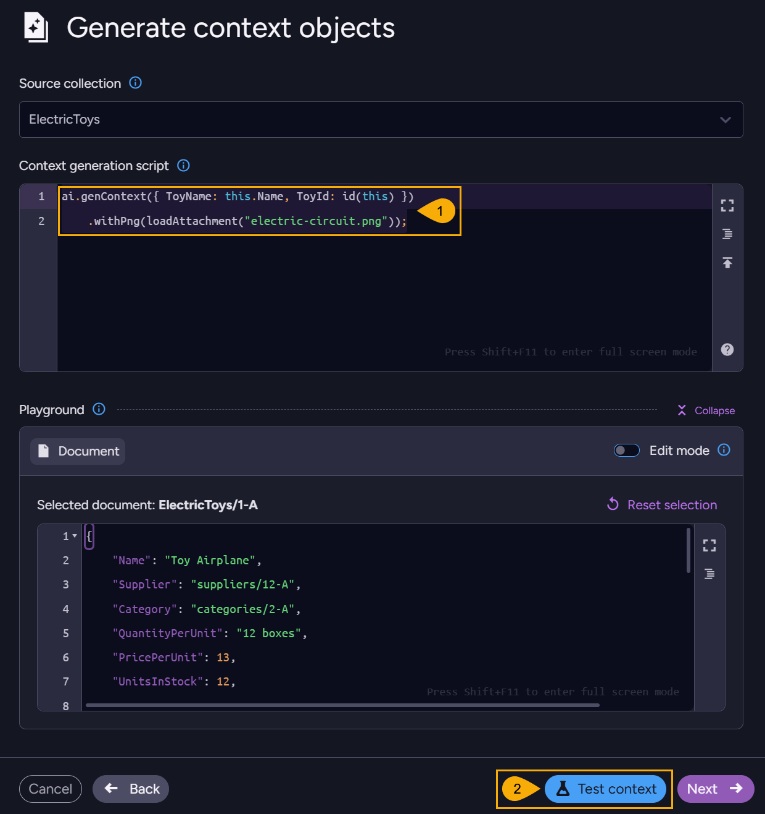
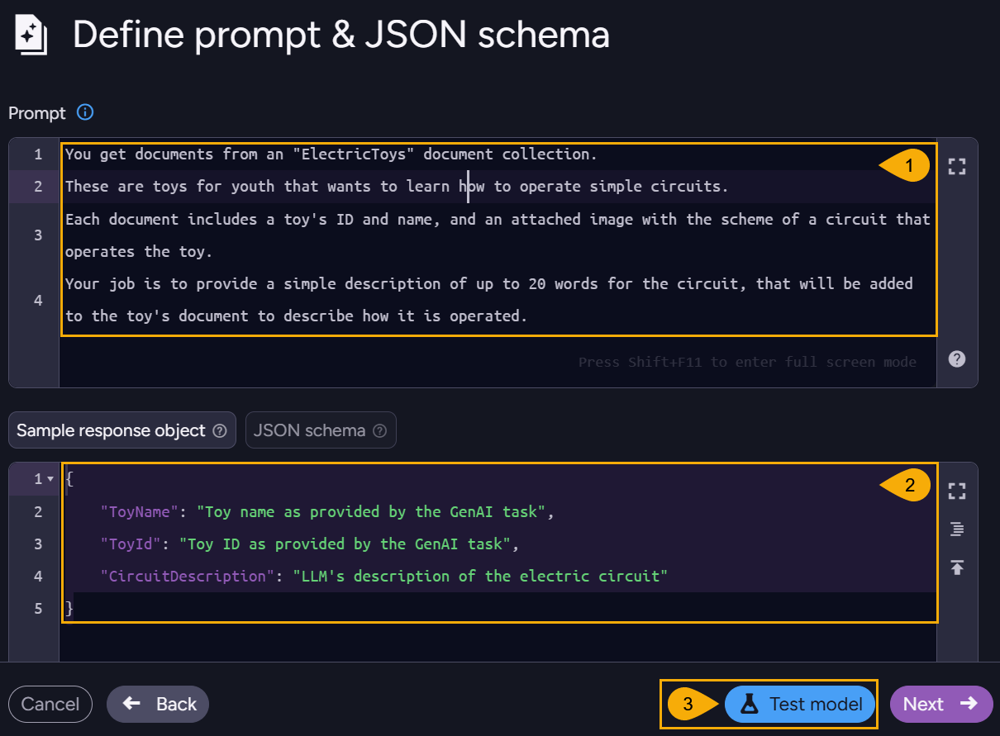
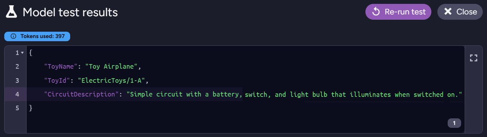
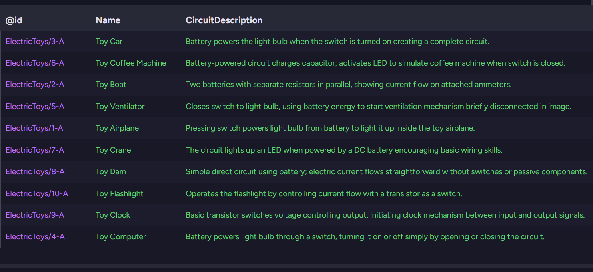

import Admonition from '@theme/Admonition';
import Tabs from '@theme/Tabs';
import TabItem from '@theme/TabItem';
import CodeBlock from '@theme/CodeBlock';
import LanguageSwitcher from "@site/src/components/LanguageSwitcher";
import LanguageContent from "@site/src/components/LanguageContent";

# Process attachments: Studio
<Admonition type="note" title="">

* When a GenAI task sends to the LLM a document that files are attached to, the task 
  can send the attached files along with the document so the LLM would process them as well.  
  This way you can, for example, make the LLM analyze technical schemes attached to product documents, review reports attached to user profiles, and so on.  

* Supported file types are:  
    * Plain text files
    * Image files: `jpeg`, `png`, `webp`, `gif`
    * PDF files  

* Attached text files are sent to the LLM as plain text.  
  Attached PDF and image files are sent to the LLM in a base64 format.

* Make sure the LLM model you use is capable of handling the attachments you send it.  
  E.g., to process image files you can use OpenAI's `gpt-4.1-mini` model.  

* In this article:
    * [Include attachments in the Context generation script](../../../ai-integration/gen-ai-integration/process-attachments/processing-attachments_studio#include-attachments-in-the-context-generation-script)
       * [Conditional attachment](../../../ai-integration/gen-ai-integration/process-attachments/processing-attachments_studio#conditional-attachment)
       * [Multiple attachments](../../../ai-integration/gen-ai-integration/process-attachments/processing-attachments_studio#multiple-attachments)
       * [Embedding base64-encoded images in the context object](../../../ai-integration/gen-ai-integration/process-attachments/processing-attachments_studio#embedding-base64-encoded-images-in-the-context-object)
       * [Embedding text in the context object](../../../ai-integration/gen-ai-integration/process-attachments/processing-attachments_studio#embedding-text-in-the-context-object)
    * [Set task Prompt and JSON schema](../../../ai-integration/gen-ai-integration/process-attachments/processing-attachments_studio#set-task-prompt-and-json-schema)
    * [Set task Update script](../../../ai-integration/gen-ai-integration/process-attachments/processing-attachments_studio#set-task-update-script)

</Admonition>

<hr />

## Include attachments in the Context generation script

<Admonition type="note" title="">

Our example GenAI task sends the LLM documents from the `ElectricToys` collection.  
Each document of this collection has an image file named `electric-circuit.png` attached to it, that illustrates a simple electric circuit that operates the toy. For example:  


We want the LLM to analyze each circuit scheme, and return a short explanation of how the circuit operates.  
We will then embed this explanation in the original document.  
</Admonition>

* Learn about the GenAI task's context generation script and how to set it [here](../../../ai-integration/gen-ai-integration/create-gen-ai-task/create-gen-ai-task_studio#generate-context-objects).

* When creating the context object that will be sent to the LLM, include document attachments by specifying them in the context generation script. The LLM will receive and process the attachments along with the main document content.

* Use the `with<FileType>` method of the `ai.genContext` object to include document attachments.  
  Replace `<FileType>` with the type of the attachment you want to include:  
    * `withText` - for plain text files  
    * `withPng` - for PNG image files  
    * `withJpeg` - for JPEG image files  
    * `withWebp` - for WEBP image files  
    * `withGif` - for GIF image files  
    * `withPdf` - for PDF files

* Pass `with<FileType>` the attached file using `loadAttachment` with the file name as an argument.

* The context generation script below includes in the context object the source document's Name and ID, and uses `withPng` to also include the `electric-circuit.png` file attached to the document.  
      ```javascript
      ai.genContext({ ToyName: this.Name, ToyId: id(this) })
          .withPng(loadAttachment("electric-circuit.png"));
      ```



1. **Context generation script**  
   Provide a JavaScript that generates the context object sent to the AI model for each document processed by the GenAI task.  
   In the script, include any attachment you want the LLM to process,  
   
2. **Test context**  
   Click to test your context generation script to ensure it works as expected.  
   The test result shows the generated context object, including the attached files.  
   
       
       
       * **See attachments**: Click for a list of attachments icluded in the context:
             

### Conditional attachment:

When `loadAttachment` fails to load an attachment, it will return `null`.  
You can use this to condition the delivery of an attachment on `loadAttachment`'s succees to load it.  
Including a non-existing attachment in the context object will not generate an error, but the LLM will receive a "not found" message instead of the attachment.  

```javascript
// Verify attachment existance before sending it to the LLM
const img = loadAttachment("electric-circuit.png");
if (img != null) {
   ai.genContext({ ToyName: this.Name, ToyId: id(this) })
      .withPng(img);
} else {
   ai.genContext({ ToyName: this.Name, ToyId: id(this) });
}
```

### Multiple attachments:

You can include multiple attachments in the context object.  
E.g., to include both a PNG and a PDF attachment, use:

```javascript
const img = loadAttachment("electric-circuit.png");
const pdf = loadAttachment("circuit-diagram.pdf");
ai.genContext({ ToyName: this.Name, ToyId: id(this) })
   .withPng(img)
   .withPdf(pdf);
```

### Embedding base64-encoded images in the context object:

You can embed base64-encoded images in the context object instead of sending them as separate attachments.  
E.g.,  

```javascript
// Base64-encoded image string
const starImage = "iVBORw0KGgoAAAANSUhEUgAAACUAAAAkCAYAAAAOwvOmAAAACXBIWXMAABYlAAAWJQFJUiTwAAAAB3RJTUUH6QkOABYvpxl9JgAAA6VJREFUWIXNmL9vG2UYxz/Pe45TJ45BdIlAQgilTdK0YihCsCAW1IHCDv8BAjYGRsQfgMRC5w4MbDAgxIL4IaHCQJe0glYkRaFVQ5M0iY3PPt+9X4a7Om5qn12fCf1Kr3X2Pffc55679/s+PpMkHjG5SSVStEEyocubDJSHxrWnseRPJsFVHEqg9hbOQ3jtWUT8CEAZ1NfmsQTAY+ENKFivwlBRYw+nBJXAJ1BfW0xJ/y8oIaKbT4IHZRxOHt9ZQwWqVQBK+PYqLm52s1gGFv6+gLCxsQpAGa3rL+D7nFkI3/x57MxjQgkfXsZoDYyIbryIP0ooyWhcf568tUAxJPVfx7qFI0DdS+tBSkf4I84NqYNB5/ZZPKCHrJk9uPYpnUrW8xUwton3f6JV/w6/+wlmCZZTBlN2PXOvk0y/QvWx13DHFpA5zOVbhqmXym+h8BLNO1/Q3P+F6WAV50SQpCfwxeynq8AgSkoElVexx89SeeJNnC2BOVAG1bg6j2mT3irf8x31gORVpqhkYAlUTl5Jobwg/O04+B3kKWrIY8kb1FZ2kZ/NHnQTleU7+KmXsYk1M6NLBtWTTWAWM5dCOQyTqJ74lqR8/shgLBvVE01cqUxqBnZgCWYBJqO28CXMvH8kUDKYPRVhpQpYkEKZHbIEZR+CcPMjku0P/xsay9xiJQKm7nnOwe5BPbrkiTYvEG+/m+vcDyuld4i55Q5Q6s88GEr4RHT2Pye+9dZEgExAMM3McivtIaz/NB8IlYIlmIl472vCv94o7FPSFDOnIlzgs7vVf6r3r18mswDwWPBcMZpuwhgz3zu/+moEV/K0tz6eDJMJG8EIR4AKUHiRYU3BKJLo2xSOAQXEuwVxetT+YWjIcCgZKJgEDk6Q7FwYHjeUyUfIJTkBB5vG/V3FA6EG4c7w3n0oVNT4Pj/AA1NnmDndovzUN2mXMUAmmLJ1IM79v5rvU0B9/SVc49KhZQBw4Eo1Kot/A9NpfJaptfkVfut82hRmv1nPsZUzwh1aWnqVW6kkAYU3DwizRB33DJWlOtOLe12g3qDy/DmOnRbl+U+7y0o3wsCpTl6pcqFcAIE2ukljq1FdalNb+QMXVAf2gkaAIcrH32ZuWQS1D+7b3777WX4jqRz5xOufK+ju5VnF7W15L3nv8w7JSSa1br2nxirauXpOUjIwNBdKuq2ktaGOvJKcJCMydUdj/R15Hw+MzX3Q6b6msOzNwISad5HNlv75/gUYA5gJ5sXALwAAAABJRU5ErkJggg==";
ai.genContext({ ToyName: this.Name, ToyId: id(this) })
   .withPng(starImage);
```

### Embedding text in the context object:

You can embed plain text in the context object instead of sending it as a separate attachment.  
E.g.,  

```javascript
const imageDescription = "Simple switch turning the toy on and off";
ai.genContext({ ToyName: this.Name, ToyId: id(this) })
   .withText(imageDescription)
```

or - 

```javascript
ai.genContext({ ToyName: this.Name, ToyId: id(this) })
   .withText("Simple switch turning the toy on and off")
```

<hr />

## Set task Prompt and JSON schema

* Learn about the GenAI task's Prompt and JSON schema and how to set them [here](../../../ai-integration/gen-ai-integration/create-gen-ai-task/create-gen-ai-task_studio#define-prompt-and-json-schema).

* While defining the task prompt and JSON schema, consider the attachments you include in the context object.  
  Make sure your prompt instructs the LLM to analyze the attached files, and that your Sample response object (or JSON schema) is designed to capture LLM output derived from these files.

* In the examples below, the prompt instructs the LLM to analyze the electric circuit scheme attached to each toy document, and the Sample response object is designed to capture a description of the circuit based on the analysis of the attached image.

      * **Prompt example**:  
        ```text
        You get documents from an "ElectricToys" document collection.
        These are toys for youth that wants to learn how to operate simple circuits.
        Each document includes a toy's ID and name, and an attached image with the scheme of a circuit that operates the toy.
        Your job is to provide a simple description of up to 20 words for the circuit, that will be added to the toy's document to describe how it is operated.
        ```
      * **Sample response object example**:  
        ```json
        {
          "ToyName": "Toy name as provided by the GenAI task",
          "ToyId": "Toy ID as provided by the GenAI task",
          "CircuitDescription": "LLM's description of the electric circuit"
        }
        ```


1. **Prompt**  
   Provide a prompt that instructs the AI model how to process each document, including its attachments.  
   In the prompt, specify what information you expect the AI model to derive from the attached files (in this case - a description of the electric circuit depicted by the attached image).

2. **Sample response object / JSON schema**  
   Define a response object or a schema that outlines the structure of the response you expect from the AI model.  
   Ensure the schema includes fields that will capture the AI model's analysis of the attached files (in this case - a field for the circuit description).

3. **Test model**  
   Click to test your prompt and JSON schema to ensure they work as expected.  
   The test result shows a sample response from the AI model, formatted according to your JSON schema, including information about the attached file.

       

<hr />

## Set task Update script

* Learn about the GenAI task's Update script and how to set it [here](../../../ai-integration/gen-ai-integration/create-gen-ai-task/create-gen-ai-task_studio#provide-update-script).

* Provide an update script that processes the AI model's responses, including any response derived from the attached files, and updates the source documents in your database accordingly.

* In the example below, the update script takes the circuit description provided by the LLM, and simply updates the source document's `CircuitDescription` field with it.

      ```javascript
     this.CircuitDescription = $output.CircuitDescription;
      ```


1. **Update script**  
   Provide a JavaScript that processes the results object returned from the AI model and takes needed actions.  
2. **Test update script**  
    Click to test your update script to ensure it works as expected.
    The test result shows how the currently processed document will be updated based on the AI model's response, including any information derived from the attached files.
    
        

        Here is a list of all documents in the ElectricToys collection, after they were sent by the GenAI task to the LLM along with their attached images and updated according to its analysis:

        