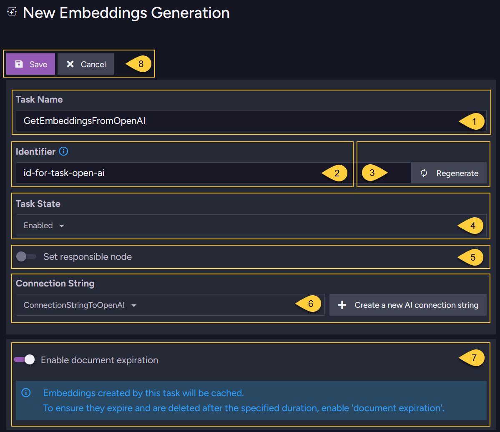
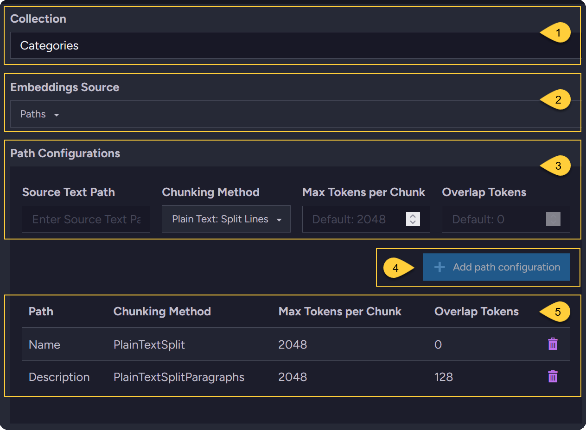
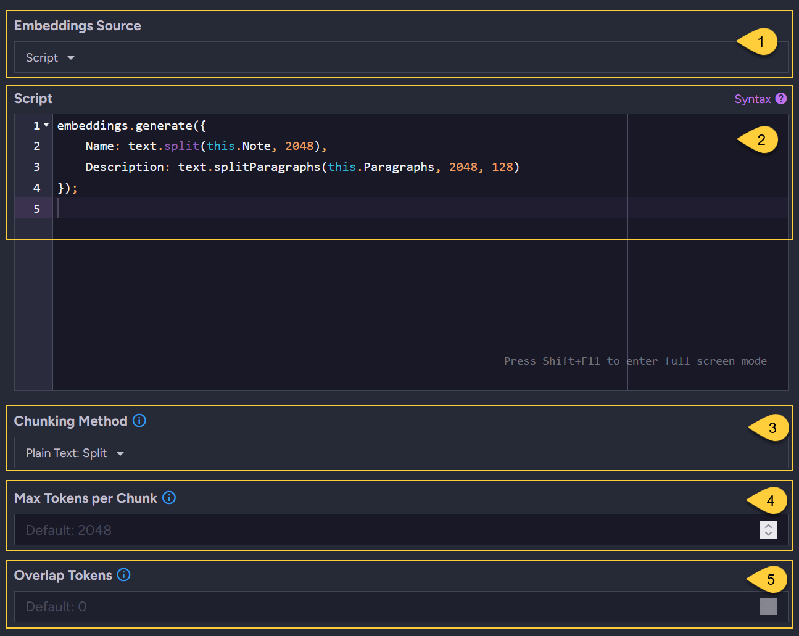

import Admonition from '@theme/Admonition';
import Tabs from '@theme/Tabs';
import TabItem from '@theme/TabItem';
import CodeBlock from '@theme/CodeBlock';

<Admonition type="note" title="">

* In RavenDB, you can define AI tasks to automatically generate embeddings from your document content.  
  These embeddings are then stored in [dedicated collections](../../../ai-integration/generating-embeddings/embedding-collections.mdx) within the database,  
  enabling [Vector search](../../../ai-integration/vector-search/ravendb-as-vector-database.mdx) on your documents.

* This article explains how to configure such a task.  
  It is recommended to first refer to this [Overview](../../../ai-integration/generating-embeddings/overview.mdx#embeddings-generation---overview)
  to understand the embeddings generation process flow.

* In this article:
    * [Configuring an embeddings generation task - from the Studio](../../../ai-integration/generating-embeddings/embeddings-generation-task.mdx#configuring-an-embeddings-generation-task---from-the-studio)
    * [Configuring an embeddings generation task - from the Client API](../../../ai-integration/generating-embeddings/embeddings-generation-task.mdx#configuring-an-embeddings-generation-task---from-the-client-api)
      * [Define source using PATHS](../../../ai-integration/generating-embeddings/embeddings-generation-task.mdx#configure-an-embeddings-generation-task---define-source-using-paths)
      * [Define source using SCRIPT](../../../ai-integration/generating-embeddings/embeddings-generation-task.mdx#configure-an-embeddings-generation-task---define-source-using-script)
    * [Chunking methods and tokens](../../../ai-integration/generating-embeddings/embeddings-generation-task.mdx#chunking-methods-and-tokens)
    * [Syntax](../../../ai-integration/generating-embeddings/embeddings-generation-task.mdx#syntax)
    
</Admonition>

## Configuring an embeddings generation task - from the Studio

* **Define the general task settings**:

     

  1. **Name**  
     Enter a name for the task.
  2. **Identifier**  
     Enter a unique identifier for the task.  
     Each AI task in the database must have a distinct identifier.  

        If not specified, or when clicking the "Regenerate" button,  
        RavenDB automatically generates the identifier based on the task name. For example:     
        * If the task name is: _"Generate embeddings from OpenAI"_
        * The generated identifier will be: _"generate-embeddings-from-openai"_
      
        Allowed characters: only lowercase letters (a-z), numbers (0-9), and hyphens (-).  
  
        **This identifier is used:**  
        * When querying embeddings generated by the task via a dynamic query.  
          An example is available in [Querying pre-made embeddings](../../../ai-integration/vector-search/vector-search-using-dynamic-query.mdx#querying-pre-made-embeddings-generated-by-tasks).
        * When indexing the embeddings generated by the task.  
          An example is available in [Indexing pre-made text-embeddings](../../../ai-integration/vector-search/vector-search-using-static-index.mdx#indexing-pre-made-text-embeddings).
        * In documents in the [Embeddings collection](../../../ai-integration/generating-embeddings/embedding-collections.mdx#the-embeddings-collection),  
          where the task identifier is used to identify the origin of each embedding.
     
        See how this identifier is used in the [Embeddings collection](../../../ai-integration/generating-embeddings/embedding-collections.mdx#the-embeddings-collection)
        documents that reference the generated embeddings.  
  
  3. **Regenerate**  
     Click "Regenerate" to automatically create an identifier based on the task name.
  4. **Task state**  
     Enable/Disable the task.
  5. **Responsible node**  
     Select a node from the [Database group](../../../studio/database/settings/manage-database-group.mdx) to be the responsible node for this task.
  6. **Connection string**  
     Select a previously defined [AI connection string](../../../ai-integration/connection-strings/connection-strings-overview.mdx) or create a new one.
  7. **Enable document expiration**  
     This toggle appears only if the [Document expiration feature](../../../studio/database/settings/document-expiration.mdx) is Not enabled in the database.
     Enabling document expiration ensures that embeddings in the `@embeddings-cache` collection are automatically deleted when they expire.
  8. **Save**  
     Click _Save_ to store the task definition or _Cancel_.

* **Define the embeddings source - using PATHS**:
  
    

  1. **Collection**  
     Enter or select the source document collection from the dropdown.
  2. **Embeddings source**  
     Select `Paths` to define the source content by specifying document properties.
  3. **Source text path**  
     Enter the property name from the document that contains the text for embedding generation.
  4. **Chunking method**  
     Select the method for splitting the source text into chunks.  
     Learn more in [Chunking methods and tokens](../../../ai-integration/generating-embeddings/embeddings-generation-task.mdx#chunking-methods-and-tokens).
  5. **Max tokens per chunk**  
     Enter the maximum number of tokens allowed per chunk (this depends on the service provider).
  6. **Add path configuration**  
     Click to add the specified to the list.
* **Define the embeddings source - using SCRIPT**:
  
    

  1. **Embeddings source**  
     Select `Script` to define the source content and chunking methods using a JavaScript script.
  2. **Script**  
     Refer to section [Chunking methods and tokens](../../../ai-integration/generating-embeddings/embeddings-generation-task.mdx#chunking-methods-and-tokens) for available JavaScript methods.
  3. **Chunking method**  
     The selected chunking method will be used by default when no method is specified in the script.  
     e.g., when the script contains: `Name: this.Name`.
  4. **Max tokens per chunk**:  
     Enter the default value to use when no specific value is set for the chunking method in the script.
* **Define quantization and expiration -  
  for the generated embeddings from the source documents**:

    

  1. **Quantization**  
     Select the quantization method that RavenDB will apply to embeddings received from the service provider.  
     Available options:  
     * Single (no quantization)
     * Int8
     * Binary
  2. **Embeddings cache expiration**  
     Set the expiration period for documents stored in the `@embeddings-cache` collection.  
     These documents contain embeddings generated from the source documents, serving as a cache for these embeddings.  
     The default initial period is `90` days. This period may be extended when the source documents change.  
     Learn more in [The embeddings cache collection](../../../ai-integration/generating-embeddings/embedding-collections.mdx#the-embeddings-cache-collection).
  3. **Regenerate embeddings**  
     This toggle is visible only when editing an existing task.  
     Toggle ON to regenerate embeddings for all documents in the collection, as specified by the _Paths_ or _Script_.

* **Define chunking method & expiration -  
  for the embedding generated from a search term in a vector search query**:

    

  1. **Querying**  
     This label indicates that this section configures parameters only for embeddings  
     generated by the task for **search terms** in vector search queries.
  2. **Chunking method**  
     Select the method for splitting the search term into chunks.  
     Learn more in [Chunking methods and tokens](../../../ai-integration/generating-embeddings/embeddings-generation-task.mdx#chunking-methods-and-tokens).
  3. **Max tokens per chunk**  
     Enter the maximum number of tokens allowed per chunk (this depends on the service provider).
  4. **Embeddings cache expiration**  
     Set the expiration period for documents stored in the `@embeddings-cache` collection.  
     These documents contain embeddings generated from the search terms, serving as a cache for these embeddings.  
     The default period is `14` days. Learn more in [The embeddings cache collection](../../../ai-integration/generating-embeddings/embedding-collections.mdx#the-embeddings-cache-collection).

## Configuring an embeddings generation task - from the Client API

<Admonition type="note" title="">

#### Configure an embeddings generation task - define source using PATHS:

<TabItem value="create_embeddings_task_1" label="create_embeddings_task_1">
```csharp
// Define a connection string that will be used in the task definition:
// ====================================================================

var connectionString = new AiConnectionString
{
    // Connection string name & identifier
    Name = "ConnectionStringToOpenAI", 
    Identifier = "id-for-open-ai-connection-string",
        
    // OpenAI connection settings
    OpenAiSettings = new OpenAiSettings(
        apiKey: "your-api-key",
        endpoint: "https://api.openai.com/v1",
        model: "text-embedding-3-small")
};

// Deploy the connection string to the server:
// ===========================================
var putConnectionStringOp = 
    new PutConnectionStringOperation<AiConnectionString>(connectionString);
var putConnectionStringResult = store.Maintenance.Send(putConnectionStringOp);

// Define the embeddings generation task:
// ======================================
var embeddingsTaskConfiguration = new EmbeddingsGenerationConfiguration
{
    // General info:
    Name = "GetEmbeddingsFromOpenAI",
    Identifier = "id-for-task-open-ai",
    ConnectionStringName = "ConnectionStringToOpenAI",
    Disabled = false,
    
    // Embeddings source & chunking methods - using PATHS configuration:
    Collection = "Categories",
    EmbeddingsPathConfigurations = [
        new EmbeddingPathConfiguration() { 
            Path = "Name", 
            ChunkingOptions = new()
            {
                ChunkingMethod = ChunkingMethod.PlainTextSplit,
                MaxTokensPerChunk = 2048
            }
        },
        new EmbeddingPathConfiguration()
        {
            Path = "Description", 
            ChunkingOptions = new()
            {
                ChunkingMethod = ChunkingMethod.PlainTextSplitLines,
                MaxTokensPerChunk = 2048
            }
        },
    ],
    
    // Quantization & expiration -
    // for embeddings generated from source documents:
    Quantization = VectorEmbeddingType.Single,
    EmbeddingsCacheExpiration = TimeSpan.FromDays(90),
    
    // Chunking method and expiration -
    // for the embeddings generated from search term in vector search query:
    ChunkingOptionsForQuerying = new()
    {
        ChunkingMethod = ChunkingMethod.PlainTextSplit,
        MaxTokensPerChunk = 2048
    },
    
    EmbeddingsCacheForQueryingExpiration = TimeSpan.FromDays(14)
};

// Deploy the connection string to the server:
// ===========================================
var addEmbeddingsGenerationTaskOp =
    new AddEmbeddingsGenerationOperation(embeddingsTaskConfiguration);
var addAiIntegrationTaskResult = store.Maintenance.Send(addEmbeddingsGenerationTaskOp);
```
</TabItem>

</Admonition>

<Admonition type="note" title="">

#### Configure an embeddings generation task - define source using SCRIPT:

* To configure the source content using a script -  
  use the `EmbeddingsTransformation` object instead of the `EmbeddingsPathConfigurations` object.

* The rest of the configuration properties are the same as in the example above.

* Call `embeddings.generate(object)` within the script and apply the appropriate text-splitting methods to each field inside the object.
  Each KEY in the object represents a document field, and the VALUE is a text-splitting function that processes the field's content before generating embeddings.

* These methods ensure that the text chunks derived from document fields stay within the token limits required by the provider, preventing request rejection.
  Learn more in [Chunking methods and tokens](../../../ai-integration/generating-embeddings/embeddings-generation-task.mdx#chunking-methods-and-tokens).
 
* For example:  

<TabItem value="create_embeddings_task_2" label="create_embeddings_task_2">
```csharp
// Source collection:
Collection = "Categories",

// Use 'EmbeddingsTransformation':
EmbeddingsTransformation = new EmbeddingsTransformation()
{
    // Define the script:
    Script = 
        @"embeddings.generate({

            // Process the document 'Name' field using method text.split().
            // The text content will be split into chunks of up to 2048 tokens.
            Name: text.split(this.Name, 2048),

            // Process the document 'Description' field using method text.splitLines().
            // The text content will be split into chunks of up to 2048 tokens.
            Description: text.splitLines(this.Description, 2048)
        });"
},
```
</TabItem>

* If no chunking method is provided in the script,  
  you can set the default chunking method and the maximum tokens per chunk to be used as follows:

<TabItem value="create_embeddings_task_3" label="create_embeddings_task_3">
```csharp
Collection = "Categories",
EmbeddingsTransformation = new EmbeddingsTransformation()
{
    Script = 
        @"embeddings.generate({

            // No chunking method is specified here
            Name: this.Name,
            Description: this.Description
        });",
    
    // Specify the default chunking method and max tokens per chunk
    // to use in the script
    ChunkingOptions = new ChunkingOptions()
    {
        ChunkingMethod = ChunkingMethod.PlainTextSplit,
        MaxTokensPerChunk = 2048
    } 
},
```
</TabItem>

</Admonition>

## Chunking methods and tokens

**Tokens and processing limits**:  

* A token is the fundamental unit that Large Language Models (LLMs) use to process text.  
  AI service providers that generate embeddings from text enforce token limits for each processed text part.  
  If a text exceeds the provider’s limit, it may be truncated or rejected.

**Using chunking methods**:  

* To handle lengthy text, you can define chunking strategies in the task definition and specify the desired number of tokens per chunk.
  Chunking splits large input texts into smaller, manageable chunks, each containing no more than the specified maximum number of tokens.  

* The maximum number of tokens per chunk depends on the AI service provider and the specific model defined in the [connection string](../../../ai-integration/connection-strings/connection-strings-overview.mdx).
  While RavenDB does not tokenize text, it estimates the number of tokens for chunking purposes by dividing the text length by 4.

* The AI provider generates a single embedding for each chunk.  
  Depending on the maximum tokens per chunk setting, a single input text may result in multiple embeddings.

**Available chunking methods**:  

RavenDB offers several chunking methods that can be applied per source type.  
These methods determine how input text is split before being sent to the provider.  

<Admonition type="note" title="">

* `PlainText: Split`  
  Splits a plain text string into multiple chunks based on the specified maximum token count.  
  Estimates token lengths based on an average of 4 characters per token and applies a 0.75 ratio to determine chunk sizes.
  Ensures that words are not split mid-way when forming chunks.  

     **Applies to**:  
     Fields containing plain text strings.  
     **Return Value**:   
     A list of text chunks (strings), where each chunk approximates the specified maximum token count without breaking words.

* `PlainText: Split Lines`  
  Uses the Semantic Kernel _SplitPlainTextLines_ method.  
  Splits a plain text string into individual lines based on line breaks and whitespace while ensuring that each line does not exceed the specified maximum token limit.  

     **Applies to**:  
     Fields containing an array of plain text strings.  
     **Return value**:  
     A list of text segments (lines) derived from the original input, preserving line structure while ensuring token constraints.

* `PlainText: Split Paragraphs`  
  Uses the Semantic Kernel _SplitPlainTextParagraphs_ method.  
  Combines consecutive lines to form paragraphs while ensuring each paragraph is as complete as possible without exceeding the specified token limit.
  
     **Applies to**:  
     Fields containing an array of plain text strings.  
     **Return value**:   
     A list of paragraphs, where each paragraph consists of grouped lines that preserve readability without exceeding the token limit.

* `Markdown: Split Lines`   
  Uses the Semantic Kernel _SplitMarkDownLines_ method.  
  Splits markdown content into individual lines at line breaks while ensuring that each line remains within the specified token limit.
  Preserves markdown syntax, ensuring each line remains an independent, valid segment.  
  
     **Applies to**:  
     Fields containing strings with markdown content.  
     **Return value**:   
     A list of markdown lines, each respecting the token limit while maintaining the original formatting.

* `Markdown: Split Paragraphs`  
  Uses the Semantic Kernel _SplitMarkdownParagraphs_ method.  
  Groups lines into coherent paragraphs at designated paragraph breaks while ensuring each paragraph remains within the specified token limit.
  Preserves markdown formatting to maintain structure.
  
     **Applies to**:  
     Fields containing an array of strings with markdown content.  
     **Return value**:  
     A list of markdown paragraphs, each respecting the token limit and maintaining structural integrity.   

* `HTML: Strip`  
  Removes HTML tags from the content and splits the resulting plain text into chunks based on a specified token limit.  

     **Applies to**:  
     Fields containing strings with HTML.   
     **Return value**:  
     A list of text chunks derived from the stripped content, ensuring each chunk remains within the token limit.

</Admonition>
**Chunking method syntax for the JavaScript scripts**:  

<TabItem value="javascript" label="javascript">
```javascript
// Available text-splitting methods:
// =================================

// Plain text methods:
text.split(text, maxTokensPerChunk);
text.splitLines(text, maxTokensPerChunk);
text.splitParagraphs(lines, maxTokensPerChunk);

// Markdown methods:
markdown.splitLines(text, maxTokensPerChunk);
markdown.splitParagraphs(lines, maxTokensPerChunk);

// HTML processing:
html.strip(htmlText, maxTokensPerChunk);
```
</TabItem>

| Parameter             | Type       | Description                                  |
|-----------------------|------------|----------------------------------------------|
| **text**              | `string`   | A plain text or markdown string to split.    |
| **lines**             | `string[]` | An array of text lines to split into chunks. |
| **htmlText**          | `string`   | A string containing HTML content to process. |
| **maxTokensPerChunk** | `number`   | The maximum tokens allowed per chunk.        |

## Syntax

#### The embeddings generation task configuration:

<TabItem value="syntax_1" label="syntax_1">
```csharp
// The 'EmbeddingsGenerationConfiguration' class inherits from 'EtlConfiguration'
// and provides the following specialized configurations for the embeddings generation task:
// =========================================================================================

public class EmbeddingsGenerationConfiguration : EtlConfiguration<AiConnectionString>
{
    public string Identifier { get; set; }
    public string Collection { get; set; }
    public List<EmbeddingPathConfiguration> EmbeddingsPathConfigurations { get; set; }
    public EmbeddingsTransformation EmbeddingsTransformation { get; set; }
    public VectorEmbeddingType Quantization { get; set; }
    public ChunkingOptions ChunkingOptionsForQuerying { get; set; }
    public TimeSpan EmbeddingsCacheExpiration { get; set; } = TimeSpan.FromDays(90);
    public TimeSpan EmbeddingsCacheForQueryingExpiration { get; set; } = TimeSpan.FromDays(14);
}
```
</TabItem>

| Parameter                                | Type                               | Description                                                                                                                                                                                                                        |
|------------------------------------------|------------------------------------|------------------------------------------------------------------------------------------------------------------------------------------------------------------------------------------------------------------------------------|
| **Identifier**                           | `string`                           | The identifier of the embeddings generation task.                                                                                                                                                                                  |
| **Collection**                           | `string`                           | The name of the source collection from which documents are processed for embeddings generation.                                                                                                                                    |
| **EmbeddingsPathConfigurations**         | `List<EmbeddingPathConfiguration>` | A list of properties inside documents that contain text to be embedded, along with their chunking settings.                                                                                                                        |
| **EmbeddingsTransformation**             | `EmbeddingsTransformation `        | An object that contains a script defining the transformations and processing applied to the source text before generating embeddings.                                                                                              |
| **Quantization**                         | `VectorEmbeddingType  `            | The quantization type for the generated embeddings.                                                                                                                                                                                |
| **ChunkingOptionsForQuerying**           | `ChunkingOptions `                 | The chunking method and maximum token limit used when processing search terms in vector search queries.                                                                                                                            |
| **EmbeddingsCacheExpiration**            | `TimeSpan `                        | The expiration period for documents in the [Embedding cache collection](../../../ai-integration/generating-embeddings/embedding-collections.mdx#the-embeddings-cache-collection) that contain embeddings generated from source documents. |
| **EmbeddingsCacheForQueryingExpiration** | `TimeSpan `                        | The expiration period for documents in the embedding cache collection that contain embeddings generated from search terms in vector search queries.                                                                                |

<TabItem value="syntax_2" label="syntax_2">
```csharp
public class EmbeddingPathConfiguration
{
    public string Path { get; set; }
    public ChunkingOptions ChunkingOptions { get; set; }
}

public class ChunkingOptions
{
    public ChunkingMethod ChunkingMethod { get; set; } // Default is PlainTextSplit
    public int MaxTokensPerChunk { get; set; } = 512;
}

public enum ChunkingMethod
{
    PlainTextSplit,
    PlainTextSplitLines,
    PlainTextSplitParagraphs,
    MarkDownSplitLines,
    MarkDownSplitParagraphs,
    HtmlStrip
}

public class EmbeddingsTransformation
{
    public string Script { get; set; }
    public ChunkingOptions ChunkingOptions {get; set;}
}

public enum VectorEmbeddingType
{
    Single,
    Int8,
    Binary,
    Text
}
```
</TabItem>
    
#### Deploying the embeddings generation task:

<TabItem value="syntax_3" label="syntax_3">
```csharp
public AddEmbeddingsGenerationOperation(EmbeddingsGenerationConfiguration configuration);
```
</TabItem>
