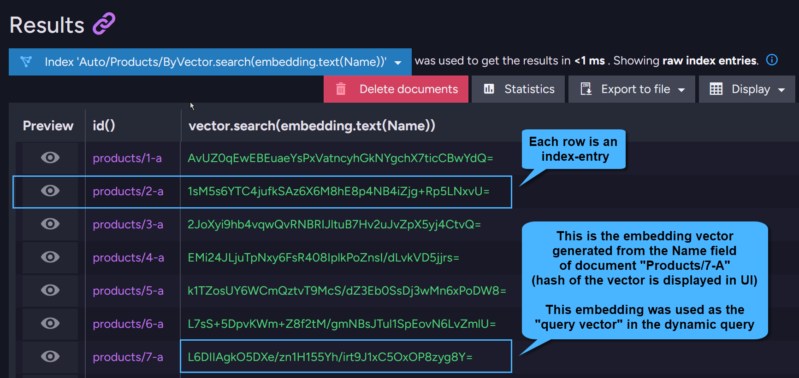

import Admonition from '@theme/Admonition';
import Tabs from '@theme/Tabs';
import TabItem from '@theme/TabItem';
import CodeBlock from '@theme/CodeBlock';

<Admonition type="note" title="">

* This article explains how to run a vector search using a **dynamic query**.  
  To learn how to run a vector search using a static-index, see [vector search using a static-index](../../../ai-integration/vector-search/vector-search-using-static-index.mdx).

* In this article:
  * [What is a vector search](../../../ai-integration/vector-search/vector-search-using-dynamic-query.mdx#what-is-a-vector-search)
  * [Dynamic vector search - query overview](../../../ai-integration/vector-search/vector-search-using-dynamic-query.mdx#dynamic-vector-search---query-overview)
     * [Creating embeddings for the auto-index](../../../ai-integration/vector-search/vector-search-using-dynamic-query.mdx#creating-embeddings-for-the-auto-index)
     * [Retrieving results](../../../ai-integration/vector-search/vector-search-using-dynamic-query.mdx#retrieving-results)
     * [The dynamic query parameters](../../../ai-integration/vector-search/vector-search-using-dynamic-query.mdx#the-dynamic-query-parameters)
     * [Corax auto-indexes](../../../ai-integration/vector-search/vector-search-using-dynamic-query.mdx#corax-auto-indexes)
  * [Dynamic vector search - querying TEXT](../../../ai-integration/vector-search/vector-search-using-dynamic-query.mdx#dynamic-vector-search---querying-text)
     * [Querying raw text](../../../ai-integration/vector-search/vector-search-using-dynamic-query.mdx#querying-raw-text)
     * [Querying pre-made embeddings generated by tasks](../../../ai-integration/vector-search/vector-search-using-dynamic-query.mdx#querying-pre-made-embeddings-generated-by-tasks)
  * [Dynamic vector search - querying NUMERICAL content](../../../ai-integration/vector-search/vector-search-using-dynamic-query.mdx#dynamic-vector-search---querying-numerical-content)
  * [Dynamic vector search - querying for similar documents](../../../ai-integration/vector-search/vector-search-using-dynamic-query.mdx#dynamic-vector-search---querying-for-similar-documents)
  * [Dynamic vector search - exact search](../../../ai-integration/vector-search/vector-search-using-dynamic-query.mdx#dynamic-vector-search---exact-search)
  * [Quantization options](../../../ai-integration/vector-search/vector-search-using-dynamic-query.mdx#quantization-options)
  * [Querying vector fields and regular data in the same query](../../../ai-integration/vector-search/vector-search-using-dynamic-query.mdx#querying-vector-fields-and-regular-data-in-the-same-query)
  * [Combining multiple vector searches in the same query](../../../ai-integration/vector-search/vector-search-using-dynamic-query.mdx#combining-multiple-vector-searches-in-the-same-query)
  * [Syntax](../../../ai-integration/vector-search/vector-search-using-dynamic-query.mdx#syntax)
    
</Admonition>

## What is a vector search

* Vector search is a method for finding documents based on their **contextual similarity** to the search item provided in a given query.
 
* Your data is converted into vectors, known as **embeddings**, and stored in a multidimensional space.  
  Unlike traditional keyword-based searches, which rely on exact matches,
  vector search identifies vectors closest to your query vector and retrieves the corresponding documents.

## Dynamic vector search - query overview

<Admonition type="note" title="">

#### Overview

* A dynamic vector search query can be performed on:  
  * Raw text stored in your documents.
  * Pre-made embeddings that you created yourself and stored using these [Data types](../../../ai-integration/vector-search/data-types-for-vector-search.mdx).
  * Pre-made embeddings that are automatically generated from your document content  
    by RavenDB's [Embeddings generation tasks](../../../ai-integration/generating-embeddings/overview.mdx) using external service providers.

* Note: Vector search queries cannot be used with [Subscription queries](../../../client-api/data-subscriptions/creation/api-overview.mdx#subscription-query).

* When executing a dynamic vector search query, RavenDB creates a [Corax Auto-Index](../../../ai-integration/vector-search/vector-search-using-dynamic-query.mdx#corax-auto-indexes) to process the query,  
  and the results are retrieved from that index.    

* To make a **dynamic vector search query**:
    * From the Client API - use method `VectorSearch()`
    * In RQL - use method `vector.search()`
    * Examples are provided below

</Admonition>

<Admonition type="note" title="">

#### Creating embeddings for the Auto-index

* **Creating embeddings from TEXTUAL content**:  

    * **Pre-made embeddings via tasks**:  
      Embeddings can be created from textual content in your documents by defining [Tasks that generate embeddings](../../../ai-integration/generating-embeddings/overview.mdx).  
      When performing a dynamic vector search query over textual data and explicitly specifying the task,
      results will be retrieved by comparing your search term against the embeddings previously generated by that task.  
      A query example is available in: [Querying pre-made embeddings generated by tasks](../../../ai-integration/vector-search/vector-search-using-dynamic-query.mdx#querying-pre-made-embeddings-generated-by-tasks).  
  
    * **Default embeddings generation**:  
      When querying textual data without specifying a task, RavenDB generates an embedding vector for the specified document field in each document of the queried collection,
      using the built-in [bge-micro-v2](https://huggingface.co/TaylorAI/bge-micro-v2) sentence-transformer model.
      A query example is available in: [Querying raw text](../../../ai-integration/vector-search/vector-search-using-dynamic-query.mdx#querying-raw-text).

* **Creating embeddings from NUMERICAL arrays**:  
  When querying over pre-made numerical arrays that are already in vector format,  
  RavenDB will index them without transformation (unless further quantization is applied).  
  A query example is available in: [Vector search on numerical content](../../../ai-integration/vector-search/vector-search-using-dynamic-query.mdx#dynamic-vector-search---querying-numerical-content).
    <Admonition type="warning" title="">
    To avoid index errors, ensure that the dimensionality of these numerical arrays (i.e., their length)  
    is consistent across all your source documents for the field you are querying.  
    If you wish to enforce such consistency -  
    perform a vector search using a [Static-index](../../../ai-integration/vector-search/vector-search-using-static-index.mdx) instead of a dynamic query.
    </Admonition> 

* **Quantizing the embeddings**:  
  The embeddings are quantized based on the parameters specified in the query.  
  Learn more about quantization in [Quantization options](../../../ai-integration/vector-search/vector-search-using-dynamic-query.mdx#quantization-options).

* **Indexing the embeddings**:  
  RavenDB indexes the embeddings on the server using the [HNSW algorithm](https://en.wikipedia.org/wiki/Hierarchical_navigable_small_world).  
  This algorithm organizes embeddings into a high-dimensional graph structure,  
  enabling efficient retrieval of Approximate Nearest Neighbors (ANN) during queries.

</Admonition>

<Admonition type="note" title="">

#### Retrieving results

* **Processing the query**:  
  To ensure consistent comparisons, the **search term** is transformed into an embedding vector using the same method as the document fields.
  The server will search for the most similar vectors in the indexed vector space,
  taking into account all the [query parameters](../../../ai-integration/vector-search/vector-search-using-dynamic-query.mdx#the-dynamic-query-parameters) described below.  
  The documents that correspond to the resulting vectors are then returned to the client. 

* **Search results**:  
  By default, the resulting documents will be ordered by their score.
  You can modify this behavior using the [Indexing.Corax.VectorSearch.OrderByScoreAutomatically](../../../server/configuration/indexing-configuration.mdx#indexingcoraxvectorsearchorderbyscoreautomatically) configuration key.  
  In addition, you can apply any of the 'order by' methods to your query, as explained in [sort query results](../../../client-api/session/querying/sort-query-results.mdx).

</Admonition>

<Admonition type="note" title="">

#### The dynamic query parameters

* **Source data format**  
  RavenDB supports performing vector search on TEXTUAL values or NUMERICAL arrays.  
  the source data can be formatted as `Text`, `Single`, `Int8`, or `Binary`.

* **Target quantization**  
  You can specify the quantization encoding for the embeddings that will be created from source data.  
  Learn more about quantization in [Quantization options](../../../ai-integration/vector-search/vector-search-using-dynamic-query.mdx#quantization-options).  

* **Minimum similarity**  
  You can specify the minimum similarity to use when searching for related vectors.  
  The value can be between `0.0f` and `1.0f`.  
    * A value closer to `1.0f` requires higher similarity between vectors,  
      while a value closer to `0.0f` allows for less similarity.
    * **Important**: To filter out less relevant results when performing vector search queries,  
      it is recommended to explicitly specify the minimum similarity level at query time.

    If not specified, the default value is taken from the following configuration key:
    [Indexing.Corax.VectorSearch.DefaultMinimumSimilarity](../../../server/configuration/indexing-configuration.mdx#indexingcoraxvectorsearchdefaultminimumsimilarity).

* **Number of candidates**  
  You can specify the maximum number of vectors that RavenDB will return from a graph search.  
  The number of the resulting documents that correspond to these vectors may be:
    * lower than the number of candidates - when multiple vectors originated from the same document.
    * higher than the number of candidates - when the same vector is shared between multiple documents.

    If not specified, the default value is taken from the following configuration key:
    [Indexing.Corax.VectorSearch.DefaultNumberOfCandidatesForQuerying](../../../server/configuration/indexing-configuration.mdx#indexingcoraxvectorsearchdefaultnumberofcandidatesforquerying).

* **Search method**
    * _Approximate Nearest-Neighbor search_ (Default):   
      Search for related vectors in an approximate manner, providing faster results.
    * _Exact search_:   
      Perform a thorough scan of the vectors to find the actual closest vectors,  
      offering better accuracy but at a higher computational cost.  
      Learn more in [Exact search](../../../ai-integration/vector-search/vector-search-using-dynamic-query.mdx#dynamic-vector-search---exact-search).

</Admonition>

<Admonition type="note" title="">

#### Corax auto-indexes

* Only [Corax indexes](../../../indexes/search-engine/corax.mdx) support vector search.

* Even if your **default auto-index engine** is set to Lucene (via [Indexing.Auto.SearchEngineType](../../../server/configuration/indexing-configuration.mdx#indexingautosearchenginetype)),  
  performing a vector search using a dynamic query will create a new auto-index based on Corax.

* Normally, new dynamic queries extend existing [auto-indexes](../../../client-api/session/querying/how-to-query.mdx#queries-always-provide-results-using-an-index) if they require additional fields.  
  However, a dynamic query with a vector search will not extend an existing Lucene-based auto-index.

    <Admonition type="note" title="">
    For example, suppose you have an existing **Lucene**-based auto-index on the Employees collection: e.g.:  
    `Auto/Employees/ByFirstName`.  

    Now, you run a query that:  

      * searches for Employees by _LastName_ (a regular text search)
      * and performs a vector search over the _Notes_ field.

    The following new **Corax**-based auto-index will be created:  
    `Auto/Employees/ByLastNameAndVector.search(embedding.text(Notes))`,  
    and the existing **Lucene** index on Employees will not be deleted or extended.    
    </Admonition>
 
</Admonition>

## Dynamic vector search - querying TEXT

### Querying raw text

* The following example searches for Product documents where the _'Name'_ field is similar to the search term `"italian food"`.

* Since the query does Not specify an [Embeddings generation task](../../../ai-integration/generating-embeddings/overview.mdx),
  RavenDB dynamically generates embedding vectors for the _'Name'_ field of each document in the queried collection using the built-in  
  [bge-micro-v2](https://huggingface.co/TaylorAI/bge-micro-v2) text-embedding model.
  The generated embeddings are indexed within the auto-index.  
  Unlike embeddings pre-made by tasks, this process does not create dedicated collections for storing embeddings.  

* Since this query does not specify a target quantization format,
  the generated embedding vectors will be encoded in the default _Single_ format (single-precision floating-point).  
  Refer to [Quantization options](../../../ai-integration/vector-search/vector-search-using-dynamic-query.mdx#quantization-options) for examples that specify the destination quantization.

<Tabs groupId='languageSyntax'>
<TabItem value="Query" label="Query">
<CodeBlock language="csharp">
{`var similarProducts = session.Query<Product>()
     // Perform a vector search
     // Call the 'VectorSearch' method
    .VectorSearch(
        // Call 'WithText'
        // Specify the document field in which to search for similar values
        field => field.WithText(x => x.Name),
        // Call 'ByText' 
        // Provide the term for the similarity comparison
        searchTerm => searchTerm.ByText("italian food"),
        // It is recommended to specify the minimum similarity level
        0.82f,
        // Optionally, specify the number of candidates for the search
        20)
     // Waiting for not-stale results is not mandatory
     // but will assure results are not stale
    .Customize(x => x.WaitForNonStaleResults())
    .ToList();
`}
</CodeBlock>
</TabItem>
<TabItem value="Query_async" label="Query_async">
<CodeBlock language="csharp">
{`var similarProducts = await asyncSession.Query<Product>()
    .VectorSearch(
        field => field.WithText(x => x.Name), 
        searchTerm => searchTerm.ByText("italian food"),
        0.82f,
        20)
    .Customize(x => x.WaitForNonStaleResults())
    .ToListAsync();
`}
</CodeBlock>
</TabItem>
<TabItem value="DocumentQuery" label="DocumentQuery">
<CodeBlock language="csharp">
{`var similarProducts = session.Advanced
    .DocumentQuery<Product>()
    .VectorSearch(
        field => field.WithText(x => x.Name),
        searchTerm => searchTerm.ByText("italian food"),
        0.82f,
        20)
    .WaitForNonStaleResults()
    .ToList();
`}
</CodeBlock>
</TabItem>
<TabItem value="DocumentQuery_async" label="DocumentQuery_async">
<CodeBlock language="csharp">
{`var similarProducts = await asyncSession.Advanced
    .AsyncDocumentQuery<Product>()
    .VectorSearch(
        field => field.WithText(x => x.Name),
        searchTerm => searchTerm.ByText("italian food"),
        0.82f,
        20)
    .WaitForNonStaleResults()
    .ToListAsync();
`}
</CodeBlock>
</TabItem>
<TabItem value="RawQuery" label="RawQuery">
<CodeBlock language="csharp">
{`var similarProducts = session.Advanced
    .RawQuery<Product>(@"
        from 'Products'
        // Wrap the document field 'Name' with 'embedding.text' to indicate the source data type
        where vector.search(embedding.text(Name), $searchTerm, 0.82, 20)")
    .AddParameter("searchTerm", "italian food")
    .WaitForNonStaleResults()
    .ToList();
`}
</CodeBlock>
</TabItem>
<TabItem value="RawQuery_async" label="RawQuery_async">
<CodeBlock language="csharp">
{`var similarProducts = await asyncSession.Advanced
    .AsyncRawQuery<Product>(@"
        from 'Products'
        // Wrap the document field 'Name' with 'embedding.text' to indicate the source data type
        where vector.search(embedding.text(Name), $searchTerm, 0.82, 20)")
    .AddParameter("searchTerm", "italian food")
    .WaitForNonStaleResults()
    .ToListAsync();
`}
</CodeBlock>
</TabItem>
<TabItem value="RQL" label="RQL">
<CodeBlock language="sql">
{`// Query the Products collection
from "Products"
// Call 'vector.search'
// Wrap the document field 'Name' with 'embedding.text' to indicate the source data type
where vector.search(embedding.text(Name), "italian food", 0.82, 20)
`}
</CodeBlock>
</TabItem>
    </Tabs>

* Executing the above query on the RavenDB sample data will create the following **auto-index**:  
  `Auto/Products/ByVector.search(embedding.text(Name))`

    
  
* Running the same query at a lower similarity level will return more results related to _"Italian food"_ but they may be less similar:

    

### Querying pre-made embeddings generated by tasks

* The following example searches for Category documents where the _'Name'_ field is similar to the search term `"candy"`.

* The query explicitly specifies the **identifier** of the embeddings generation task that was defined in  
  [this example](../../../ai-integration/generating-embeddings/embeddings-generation-task.mdx#configuring-an-embeddings-generation-task---from-the-studio).
  Results are retrieved by comparing the search term against the pre-made embeddings generated by this task, which are stored in the
  [Embedding collections](../../../ai-integration/generating-embeddings/embedding-collections.mdx).

* To ensure consistent comparisons, the search term is transformed into an embedding using the same embeddings generation task.

<Tabs groupId='languageSyntax'>
<TabItem value="Query" label="Query">
<CodeBlock language="csharp">
{`var similarCategories = session.Query<Category>()
    .VectorSearch(
        field => field
             // Call 'WithText'
             // Specify the document field in which to search for similar values
            .WithText(x => x.Name)
             // Call 'UsingTask'
             // Specify the identifier of the task that generated
             // the embeddings for the Name field
            .UsingTask("id-for-task-open-ai"),
        // Call 'ByText' 
        // Provide the search term for the similarity comparison
        searchTerm => searchTerm.ByText("candy"),
        // It is recommended to specify the minimum similarity level
        0.75f)
    .Customize(x => x.WaitForNonStaleResults())
    .ToList();
`}
</CodeBlock>
</TabItem>
<TabItem value="Query_async" label="Query_async">
<CodeBlock language="csharp">
{`var similarCategories = await asyncSession.Query<Category>()
    .VectorSearch(
        field => field
            .WithText(x => x.Name)
            .UsingTask("id-for-task-open-ai"),
        searchTerm => searchTerm.ByText("candy"),
        0.75f)
    .Customize(x => x.WaitForNonStaleResults())
    .ToListAsync();
`}
</CodeBlock>
</TabItem>
<TabItem value="DocumentQuery" label="DocumentQuery">
<CodeBlock language="csharp">
{`var similarCategories = session.Advanced
    .DocumentQuery<Category>()
    .VectorSearch(
        field => field
            .WithText(x => x.Name)
            .UsingTask("id-for-task-open-ai"),
        searchTerm => searchTerm.ByText("candy"),
        0.75f)
    .WaitForNonStaleResults()
    .ToList();
`}
</CodeBlock>
</TabItem>
<TabItem value="DocumentQuery_async" label="DocumentQuery_async">
<CodeBlock language="csharp">
{`var similarCategories = await asyncSession.Advanced
    .AsyncDocumentQuery<Category>()
    .VectorSearch(
        field => field
            .WithText(x => x.Name)
            .UsingTask("id-for-task-open-ai"),
        searchTerm => searchTerm.ByText("candy"),
        0.75f)
    .WaitForNonStaleResults()
    .ToListAsync();
`}
</CodeBlock>
</TabItem>
<TabItem value="RawQuery" label="RawQuery">
<CodeBlock language="csharp">
{`var similarCategories = session.Advanced
    .RawQuery<Category>(@"
        from 'Categories'
        // Specify the identifier of the task that generated the embeddings inside 'ai.task'
        where vector.search(embedding.text(Name, ai.task('id-for-task-open-ai')), $searchTerm, 0.75)")
    .AddParameter("searchTerm", "candy")
    .WaitForNonStaleResults()
    .ToList();
`}
</CodeBlock>
</TabItem>
<TabItem value="RawQuery_async" label="RawQuery_async">
<CodeBlock language="csharp">
{`var similarCategories = await asyncSession.Advanced
    .AsyncRawQuery<Category>(@"
        from 'Categories'
        // Specify the identifier of the task that generated the embeddings inside 'ai.task'
        where vector.search(embedding.text(Name, ai.task('id-for-task-open-ai')), $searchTerm, 0.75)")
    .AddParameter("searchTerm", "candy")
    .WaitForNonStaleResults()
    .ToListAsync();
`}
</CodeBlock>
</TabItem>
<TabItem value="RQL" label="RQL">
<CodeBlock language="sql">
{`// Query the Categories collection
from "Categories"
// Call 'vector.search'
// Specify the identifier of the task that generated the embeddings inside the 'ai.task' method
where vector.search(embedding.text(Name, ai.task('id-for-task-open-ai')), $searchTerm, 0.75)
{"searchTerm": "candy"}
`}
</CodeBlock>
</TabItem>
</Tabs>

* Executing the above query on the RavenDB sample data will create the following **auto-index**:  
  `Auto/Categories/ByVector.search(embedding.text(Name|ai.task('id-for-task-open-ai')))`

## Dynamic vector search - querying NUMERICAL content

* The following examples will use the sample data shown below.  
  The _Movie_ class includes various formats of numerical vector data.  
  Note: This sample data is minimal to keep the examples simple.

* Note the usage of RavenDB's dedicated data type, [RavenVector](../../../ai-integration/vector-search/data-types-for-vector-search.mdx#ravenvector), which is highly optimized for reading and writing arrays to disk.
  Learn more about the source data types suitable for vector search in [Data types for vector search](../../../ai-integration/vector-search/data-types-for-vector-search.mdx).

* Unlike vector searches on text, where RavenDB transforms the raw text into an embedding vector,  
  numerical vector searches require your source data to already be in an embedding vector format.  

* If your raw data is in a _float_ format, you can request further quantization of the embeddings that will be indexed in the auto-index.
  See an example of this in: [Quantization options](../../../ai-integration/vector-search/vector-search-using-dynamic-query.mdx#quantization-options).  

* Raw data that is already formatted as _Int8_ or _Binary_ **cannot** be quantized to lower-form (e.g. Int8 -&gt; Int1).  
  When storing data in these formats in your documents, you should use [RavenDB’s `vectorQuantizer` methods](../../../ai-integration/vector-search/vector-search-using-dynamic-query.mdx#vectorquanitzer).

#### Sample data:

<Tabs groupId='languageSyntax'>
<TabItem value="Class" label="Class">
<CodeBlock language="csharp">
{`// Sample class representing a document with various formats of numerical vectors
public class Movie
{
    public string Id { get; set; }
    public string Title { get; set; }
    
    // This field will hold numerical vector data - Not quantized
    public RavenVector<float> TagsEmbeddedAsSingle { get; set; }
    
    // This field will hold numerical vector data - Quantized to Int8
    public sbyte[][] TagsEmbeddedAsInt8 { get; set; }
    
    // This field will hold numerical vector data - Encoded in Base64 format
    public List<string> TagsEmbeddedAsBase64 { get; set; }
}
`}
</CodeBlock>
</TabItem>
<TabItem value="Sample_data" label="Sample_data">
<CodeBlock language="csharp">
{`using (var session = store.OpenSession())
{
    var movie1 = new Movie()
    {
        Title = "Hidden Figures",
        Id = "movies/1",
    
        // Embedded vector represented as float values
        TagsEmbeddedAsSingle = new RavenVector<float>(new float[]
        {
            6.599999904632568f, 7.699999809265137f
        }),
        
        // Embedded vectors encoded in Base64 format
        TagsEmbeddedAsBase64 = new List<string>()
        {
            "zczMPc3MTD6amZk+", "mpmZPs3MzD4AAAA/"
        },
        
        // Array of embedded vectors quantized to Int8
        TagsEmbeddedAsInt8 = new sbyte[][]
        {
            // Use RavenDB's quantization methods to convert float vectors to Int8
            VectorQuantizer.ToInt8(new float[] { 0.1f, 0.2f }),
            VectorQuantizer.ToInt8(new float[] { 0.3f, 0.4f })
        },
    };

    var movie2 = new Movie()
    {
        Title = "The Shawshank Redemption",
        Id = "movies/2",
    
        TagsEmbeddedAsSingle =new RavenVector<float>(new float[]
        {
            8.800000190734863f, 9.899999618530273f
        }),
        TagsEmbeddedAsBase64 = new List<string>() {"zcxMPs3MTD9mZmY/", "zcxMPpqZmT4zMzM/"},
        TagsEmbeddedAsInt8 = new sbyte[][]
        {
            VectorQuantizer.ToInt8(new float[] { 0.5f, 0.6f }),
            VectorQuantizer.ToInt8(new float[] { 0.7f, 0.8f })
        }
    };

    session.Store(movie1);
    session.Store(movie2);
    session.SaveChanges();
}
`}
</CodeBlock>
</TabItem>
<TabItem value="Sample_document" label="Sample_document">
<CodeBlock language="csharp">
{`{
    "Title": "Hidden Figures",
    
    "TagsEmbeddedAsSingle": {
        "@vector": [
            6.599999904632568,
            7.699999809265137
        ]
    },
    
    "TagsEmbeddedAsInt8": [
        [
            64,
            127,
            -51,
            -52,
            76,
            62
        ],
        [
            95,
            127,
            -51,
            -52,
            -52,
            62
        ]
    ],
    
    "TagsEmbeddedAsBase64": [
        "zczMPc3MTD6amZk+",
        "mpmZPs3MzD4AAAA/"
    ],
    
    "@metadata": {
        "@collection": "Movies"
    }
}
`}
</CodeBlock>
</TabItem>
</Tabs>

#### Examples:

These examples search for Movie documents with vectors similar to the one provided in the query.

<Admonition type="note" title="">

* Search on the `TagsEmbeddedAsSingle` field,  
  which contains numerical data in **floating-point format**. 

<Tabs groupId='languageSyntax'>
<TabItem value="Query" label="Query">
<CodeBlock language="csharp">
{`var similarMovies = session.Query<Movie>()
     // Perform a vector search
     // Call the 'VectorSearch' method
    .VectorSearch(
        // Call 'WithEmbedding', specify:
        // * The source field that contains the embedding in the document
        // * The source embedding type
        field => field.WithEmbedding(
            x => x.TagsEmbeddedAsSingle, VectorEmbeddingType.Single),
        // Call 'ByEmbedding'
        // Provide the vector for the similarity comparison
        queryVector => queryVector.ByEmbedding(
            new RavenVector<float>(new float[] { 6.599999904632568f, 7.699999809265137f })),
        // It is recommended to specify the minimum similarity level
        0.85f,
        // Optionally, specify the number of candidates for the search
        10)
    .Customize(x => x.WaitForNonStaleResults())
    .ToList();
`}
</CodeBlock>
</TabItem>
<TabItem value="Query_async" label="Query_async">
<CodeBlock language="csharp">
{`var similarMovies = await asyncSession.Query<Movie>()
    .VectorSearch(
        field => field.WithEmbedding(
            x => x.TagsEmbeddedAsSingle, VectorEmbeddingType.Single),
        queryVector => queryVector.ByEmbedding(
            new RavenVector<float>(new float[] { 6.599999904632568f, 7.699999809265137f })),
        0.85f,
        10)
    .Customize(x => x.WaitForNonStaleResults())
    .ToListAsync();
`}
</CodeBlock>
</TabItem>
<TabItem value="DocumentQuery" label="DocumentQuery">
<CodeBlock language="csharp">
{`var similarMovies = session.Advanced
    .DocumentQuery<Movie>()
    .VectorSearch(
        field => field.WithEmbedding(
            x => x.TagsEmbeddedAsSingle, VectorEmbeddingType.Single),
        queryVector => queryVector.ByEmbedding(
            new RavenVector<float>(new float[] { 6.599999904632568f, 7.699999809265137f })),
        0.85f,
        10)
    .WaitForNonStaleResults()
    .ToList();
`}
</CodeBlock>
</TabItem>
<TabItem value="DocumentQuery_async" label="DocumentQuery_async">
<CodeBlock language="csharp">
{`var similarMovies = await asyncSession.Advanced
    .AsyncDocumentQuery<Movie>()
    .VectorSearch(
        field => field.WithEmbedding(
            x => x.TagsEmbeddedAsSingle, VectorEmbeddingType.Single),
        queryVector => queryVector.ByEmbedding(
            new RavenVector<float>(new float[] { 6.599999904632568f, 7.699999809265137f })),
        0.85f,
        10)
    .WaitForNonStaleResults()
    .ToListAsync();
`}
</CodeBlock>
</TabItem>
<TabItem value="RawQuery" label="RawQuery">
<CodeBlock language="csharp">
{`var similarProducts = session.Advanced
    .RawQuery<Movie>(@"
        from 'Movies' 
        where vector.search(TagsEmbeddedAsSingle, $queryVector, 0.85, 10)")
    .AddParameter("queryVector", new RavenVector<float>(new float[]
        {
            6.599999904632568f, 7.699999809265137f
        }))
    .WaitForNonStaleResults()
    .ToList();
`}
</CodeBlock>
</TabItem>
<TabItem value="RawQuery_async" label="RawQuery_async">
<CodeBlock language="csharp">
{`var similarProducts = await asyncSession.Advanced
    .AsyncRawQuery<Movie>(@"
        from 'Movies' 
        where vector.search(TagsEmbeddedAsSingle, $queryVector, 0.85, 10)")
    .AddParameter("queryVector", new RavenVector<float>(new float[]
        {
            6.599999904632568f, 7.699999809265137f
        }))
    .WaitForNonStaleResults()
    .ToListAsync();
`}
</CodeBlock>
</TabItem>
<TabItem value="RQL" label="RQL">
<CodeBlock language="sql">
{`from "Movies"
// The source document field type is interpreted as 'Single' by default
where vector.search(TagsEmbeddedAsSingle, $queryVector, 0.85, 10)
{ "queryVector" : { "@vector" : [6.599999904632568, 7.699999809265137] }}
`}
</CodeBlock>
</TabItem>
</Tabs>

</Admonition>
<Admonition type="note" title="">

* Search on the `TagsEmbeddedAsInt8` field,  
  which contains numerical data that is already quantized in **_Int8_ format**.

<Tabs groupId='languageSyntax'>
<TabItem value="Query" label="Query">
<CodeBlock language="csharp">
{`var similarMovies = session.Query<Movie>()
    .VectorSearch(
        // Call 'WithEmbedding', specify:
        // * The source field that contains the embeddings in the document
        // * The source embedding type
        field => field.WithEmbedding(
            x => x.TagsEmbeddedAsInt8, VectorEmbeddingType.Int8),
        // Call 'ByEmbedding'
        // Provide the vector for the similarity comparison
        // (provide a single vector from the vector list in the TagsEmbeddedAsInt8 field)
        queryVector => queryVector.ByEmbedding(
            // The provided vector MUST be in the same format as was stored in your document
            // Call 'VectorQuantizer.ToInt8' to transform the raw data to the Int8 format  
            VectorQuantizer.ToInt8(new float[] { 0.1f, 0.2f })))
    .Customize(x => x.WaitForNonStaleResults())
    .ToList();
`}
</CodeBlock>
</TabItem>
<TabItem value="RQL" label="RQL">
<CodeBlock language="sql">
{`from "Movies"
// Wrap the source document field name with 'embedding.i8' to indicate the source data type
where vector.search(embedding.i8(TagsEmbeddedAsInt8), $queryVector)
{ "queryVector" : [64, 127, -51, -52, 76, 62] }
`}
</CodeBlock>
</TabItem>
</Tabs>

</Admonition>
<Admonition type="note" title="">

* Search on the `TagsEmbeddedAsBase64` field,  
  which contains numerical data represented in **_Base64_ format**.

<Tabs groupId='languageSyntax'>
<TabItem value="Query" label="Query">
<CodeBlock language="csharp">
{`var similarMovies = session.Query<Movie>()
    .VectorSearch(
        // Call 'WithBase64', specify:
        // * The source field that contains the embeddings in the document
        // * The source embedding type
        //   (the type from which the Base64 string was constructed)
        field => field.WithBase64(x => x.TagsEmbeddedAsBase64, VectorEmbeddingType.Single),
        // Call 'ByBase64'
        // Provide the Base64 string that represents the vector to query against
        queryVector => queryVector.ByBase64("zczMPc3MTD6amZk+"))
    .Customize(x => x.WaitForNonStaleResults())
    .ToList();
`}
</CodeBlock>
</TabItem>
<TabItem value="RQL" label="RQL">
<CodeBlock language="sql">
{`from "Movies"
// * Wrap the source document field name using 'embedding.<format>' to specify
//   the source data type from which the Base64 string was generated.
// * If the document field is Not wrapped, 'single' is assumed as the default source type. 
where vector.search(TagsEmbeddedAsBase64, $queryVectorBase64)
{ "queryVectorBase64" : "zczMPc3MTD6amZk+" }
`}
</CodeBlock>
</TabItem>
</Tabs>

</Admonition>

## Dynamic vector search - querying for similar documents

* In the above examples, to find documents with similar content, the query was given an arbitrary input -  
  either a [raw textual search term](../../../ai-integration/vector-search/vector-search-using-dynamic-query.mdx#dynamic-vector-search---querying-text) 
  or a [numerical query vector](../../../ai-integration/vector-search/vector-search-using-dynamic-query.mdx#dynamic-vector-search---querying-numerical-content).

* RavenDB also allows you to search for documents whose content is similar to an **existing document**:  

   * To do so, use the `ForDocument` method and specify the existing document ID. See the example below.

   * When performing a dynamic vector query over a field, index-entries are generated in the auto-index, 
     one per document in the collection. Each index-entry contains the document ID and the embedding vector for the queried field.  

   * RavenDB retrieves the embedding that was indexed for the queried field in the specified document and uses it as the query vector for the similarity comparison.

   * The results will include documents whose indexed embeddings are most similar to the one stored in the referenced document’s index-entry.

<Tabs groupId='languageSyntax'>
<TabItem value="Query" label="Query">
<CodeBlock language="csharp">
{`var similarProducts = session.Query<Product>()
    // Perform a vector search
    // Call the 'VectorSearch' method
    .VectorSearch(
         // Call 'WithText'
         // Specify the document field in which to search for similar values
        field => field.WithText(x => x.Name),
         // Call 'ForDocument' 
         // Provide the document ID for which you want to find similar documents.
         // The embedding stored in the auto-index for the specified document
         // will be used as the "query vector".
        embedding => embedding.ForDocument("Products/7-A"),
        0.82f)
    .Customize(x => x.WaitForNonStaleResults())
    .ToList();
`}
</CodeBlock>
</TabItem>
<TabItem value="Query_async" label="Query_async">
<CodeBlock language="csharp">
{`var similarProducts = await asyncSession.Query<Product>()
    .VectorSearch(
        field => field.WithText(x => x.Name), 
        embedding => embedding.ForDocument("Products/7-A"),
        0.82f)
    .Customize(x => x.WaitForNonStaleResults())
    .ToListAsync();
`}
</CodeBlock>
</TabItem>
<TabItem value="DocumentQuery" label="DocumentQuery">
<CodeBlock language="csharp">
{`var similarProducts = session.Advanced
    .DocumentQuery<Product>()
    .VectorSearch(
        field => field.WithText(x => x.Name),
        embedding => embedding.ForDocument("Products/7-A"),
        0.82f)
    .WaitForNonStaleResults()
    .ToList();
`}
</CodeBlock>
</TabItem>
<TabItem value="DocumentQuery_async" label="DocumentQuery_async">
<CodeBlock language="csharp">
{`var similarProducts = await asyncSession.Advanced
    .AsyncDocumentQuery<Product>()
    .VectorSearch(
        field => field.WithText(x => x.Name),
        embedding => embedding.ForDocument("Products/7-A"),
        0.82f)
    .WaitForNonStaleResults()
    .ToListAsync();
`}
</CodeBlock>
</TabItem>
<TabItem value="RawQuery" label="RawQuery">
<CodeBlock language="csharp">
{`var similarProducts = session.Advanced
    .RawQuery<Product>(@"
        from 'Products'
        // Pass a document ID to the 'forDoc' method to find similar documents
        where vector.search(embedding.text(Name), embedding.forDoc($documentID), 0.82)")
    .AddParameter("$documentID", "Products/7-A")
    .WaitForNonStaleResults()
    .ToList();
`}
</CodeBlock>
</TabItem>
<TabItem value="RawQuery_async" label="RawQuery_async">
<CodeBlock language="csharp">
{`var similarProducts = await asyncSession.Advanced
    .AsyncRawQuery<Product>(@"
        from 'Products'
        // Pass a document ID to the 'forDoc' method to find similar documents
        where vector.search(embedding.text(Name), embedding.forDoc($documentID), 0.82)")
    .AddParameter("$documentID", "Products/7-A")
    .WaitForNonStaleResults()
    .ToListAsync();
`}
</CodeBlock>
</TabItem>
<TabItem value="RQL" label="RQL">
<CodeBlock language="sql">
{`from "Products"
// Pass a document ID to the 'forDoc' method to find similar documents
where vector.search(embedding.text(Name), embedding.forDoc($documentID), 0.82)
{"documentID" : "Products/7-A"}
`}
</CodeBlock>
</TabItem>
</Tabs>

Running the above example on RavenDB’s sample data returns the following documents that have similar content in their _Name_ field:
(Note: the results include the referenced document itself, _Products/7-A_)

<TabItem value="csharp" label="csharp">
<CodeBlock language="csharp">
{`// ID: products/7-A  ... Name: "Uncle Bob's Organic Dried Pears"
// ID: products/51-A ... Name: "Manjimup Dried Apples"
// ID: products/6-A  ... Name: "Grandma's Boysenberry Spread"
`}
</CodeBlock>
</TabItem>

The auto-index generated by running the above dynamic query is:  
`Auto/Products/ByVector.search(embedding.text(Name))`

You can **view the index-entries** of this auto-index in the Studio's query view:

1. Go to the Query view in the Studio
2. Query the index
3. Open the settings dialog:

## Dynamic vector search - exact search

* When performing a dynamic vector search query, you can specify whether to perform an **exact search** to find the closest similar vectors in the vector space:
  * A thorough scan will be performed to find the actual closest vectors.
  * This ensures better accuracy but comes at a higher computational cost.

* If exact is Not specified, the search defaults to the **Approximate Nearest-Neighbor** (ANN) method,  
  which finds related vectors in an approximate manner, offering faster results.

* The following example demonstrates how to specify the exact method in the query.  
  Setting the param is similar for both text and numerical content searches.

<Tabs groupId='languageSyntax'>
<TabItem value="Query" label="Query">
<CodeBlock language="csharp">
{`var similarProducts = session.Query<Product>()
    .VectorSearch(
        field => field.WithText(x => x.Name),
        searchTerm => searchTerm.ByText("italian food"),
        // Optionally, set the 'isExact' param to true to perform an Exact search
        isExact: true)
    .Customize(x => x.WaitForNonStaleResults())
    .ToList();
`}
</CodeBlock>
</TabItem>
<TabItem value="Query_async" label="Query_async">
<CodeBlock language="csharp">
{`var similarProducts = await asyncSession.Query<Product>()
    .VectorSearch(
        field => field.WithText(x => x.Name), 
        searchTerm => searchTerm.ByText("italian food"),
        isExact: true)
    .Customize(x => x.WaitForNonStaleResults())
    .ToListAsync();
`}
</CodeBlock>
</TabItem>
<TabItem value="DocumentQuery" label="DocumentQuery">
<CodeBlock language="csharp">
{`var similarProducts = session.Advanced
    .DocumentQuery<Product>()
    .VectorSearch(
        field => field.WithText(x => x.Name),
        searchTerm => searchTerm.ByText("italian food"),
        isExact: true)
    .WaitForNonStaleResults()
    .ToList();
`}
</CodeBlock>
</TabItem>
<TabItem value="DocumentQuery_async" label="DocumentQuery_async">
<CodeBlock language="csharp">
{`var similarProducts = await asyncSession.Advanced
    .AsyncDocumentQuery<Product>()
    .VectorSearch(
        field => field.WithText(x => x.Name),
        searchTerm => searchTerm.ByText("italian food"),
        isExact: true)
    .WaitForNonStaleResults()
    .ToListAsync();
`}
</CodeBlock>
</TabItem>
<TabItem value="RawQuery" label="RawQuery">
<CodeBlock language="csharp">
{`var similarProducts = session.Advanced
    .RawQuery<Product>(@"
        from 'Products'
        // Wrap the query with the 'exact()' method
        where exact(vector.search(embedding.text(Name), $searchTerm))")
    .AddParameter("searchTerm", "italian food")
    .WaitForNonStaleResults()
    .ToList();
`}
</CodeBlock>
</TabItem>
<TabItem value="RawQuery_async" label="RawQuery_async">
<CodeBlock language="csharp">
{`var similarProducts = await asyncSession.Advanced
    .AsyncRawQuery<Product>(@"
        from 'Products'
        // Wrap the query with the 'exact()' method
        where exact(vector.search(embedding.text(Name), $searchTerm))")
    .AddParameter("searchTerm", "italian food")
    .WaitForNonStaleResults()
    .ToListAsync();
`}
</CodeBlock>
</TabItem>
<TabItem value="RQL" label="RQL">
<CodeBlock language="sql">
{`from "Products"
// Wrap the vector.search query with the 'exact()' method
where exact(vector.search(embedding.text(Name), "italian food"))
`}
</CodeBlock>
</TabItem>
</Tabs>

## Quantization options

#### What is quantization:

Quantization is a technique that reduces the precision of numerical data.
It converts high-precision values, such as 32-bit floating-point numbers, into lower-precision formats like 8-bit integers or binary representations.

The quantization process, applied to each dimension (or item) in the numerical array, 
serves as a form of compression by reducing the number of bits used to represent each value in the vector.
For example, transitioning from 32-bit floats to 8-bit integers significantly reduces data size while preserving the vector's essential structure.  

Although it introduces some precision loss, quantization minimizes storage requirements and optimizes memory usage.
It also reduces computational overhead, making operations like similarity searches faster and more efficient.

#### Quantization in RavenDB:

For non-quantized raw 32-bit data or text stored in your documents,
RavenDB allows you to choose the quantization format for the generated embeddings stored in the index.  
The selected quantization type determines the similarity search technique that will be applied.

If no target quantization format is specified, the `Single` option will be used as the default.

The available quantization options are:  

   * `Single` (a 32-bit floating point value per dimension):  
     Provides precise vector representations.  
     The [Cosine similarity](https://en.wikipedia.org/wiki/Cosine_similarity) method will be used for searching and matching.  

   * `Int8` (an 8-bit integer value per dimension):  
     Reduces storage requirements while maintaining good performance.  
     Saves up to 75% storage compared to 32-bit floating-point values.  
     The Cosine similarity method will be used for searching and matching.  

   * `Binary` (1-bit per dimension):  
     Minimizes storage usage, suitable for use cases where binary representation suffices.  
     Saves approximately 96% storage compared to 32-bit floating-point values.  
     The [Hamming distance](https://en.wikipedia.org/wiki/Hamming_distance) method will be used for searching and matching.  
      
     <Admonition type="note" title="">
     If your documents contain data that is already quantized,  
     it cannot be re-quantized to a lower precision format (e.g., Int8 cannot be converted to Binary).
     </Admonition>

#### Examples

<Admonition type="note" title="">

* In this example: 
  * The source data consists of text.
  * The generated embeddings will use the _Int8_ format.

<Tabs groupId='languageSyntax'>
<TabItem value="Query" label="Query">
<CodeBlock language="csharp">
{`var similarProducts = session.Query<Product>()
    .VectorSearch(
        field => field
            // Specify the source text field for the embeddings
            .WithText(x => x.Name)
            // Set the quantization type for the generated embeddings
            .TargetQuantization(VectorEmbeddingType.Int8),
        searchTerm => searchTerm
            // Provide the search term for comparison
            .ByText("italian food"))
    .Customize(x => x.WaitForNonStaleResults())
    .ToList();
`}
</CodeBlock>
</TabItem>
<TabItem value="Query_async" label="Query_async">
<CodeBlock language="csharp">
{`var similarProducts = await asyncSession.Query<Product>()
    .VectorSearch(
        field => field
            .WithText(x => x.Name)
            .TargetQuantization(VectorEmbeddingType.Int8),
        searchTerm => searchTerm
            .ByText("italian food"))
    .Customize(x => x.WaitForNonStaleResults())
    .ToListAsync();
`}
</CodeBlock>
</TabItem>
<TabItem value="DocumentQuery" label="DocumentQuery">
<CodeBlock language="csharp">
{`var similarProducts = session.Advanced
    .DocumentQuery<Product>()
    .VectorSearch(
        field => field
            .WithText(x => x.Name)
            .TargetQuantization(VectorEmbeddingType.Int8), 
        searchTerm => searchTerm
            .ByText("italian food"))
    .WaitForNonStaleResults()
    .ToList();
`}
</CodeBlock>
</TabItem>
<TabItem value="DocumentQuery_async" label="DocumentQuery_async">
<CodeBlock language="csharp">
{`var similarProducts = await asyncSession.Advanced
    .AsyncDocumentQuery<Product>()
    .VectorSearch(
        field => field
            .WithText(x => x.Name)
            .TargetQuantization(VectorEmbeddingType.Int8),
        searchTerm => searchTerm
            .ByText("italian food"))
    .WaitForNonStaleResults()
    .ToListAsync();
`}
</CodeBlock>
</TabItem>
<TabItem value="RawQuery" label="RawQuery">
<CodeBlock language="csharp">
{`var similarProducts = session.Advanced
    .RawQuery<Product>(@"
        from 'Products'
        // Wrap the 'Name' field with 'embedding.text_i8'
        where vector.search(embedding.text_i8(Name), $searchTerm)")
    .AddParameter("searchTerm", "italian food")
    .WaitForNonStaleResults()
    .ToList();
`}
</CodeBlock>
</TabItem>
<TabItem value="RawQuery_async" label="RawQuery_async">
<CodeBlock language="csharp">
{`var similarProducts = await asyncSession.Advanced
    .AsyncRawQuery<Product>(@"
        from 'Products'
        // Wrap the 'Name' field with 'embedding.text_i8'
        where vector.search(embedding.text_i8(Name), $searchTerm)")
    .AddParameter("searchTerm", "italian food")
    .WaitForNonStaleResults()
    .ToListAsync();
`}
</CodeBlock>
</TabItem>
<TabItem value="RQL" label="RQL">
<CodeBlock language="sql">
{`from "Products"
// Wrap the 'Name' field with 'embedding.text_i8'
where vector.search(embedding.text_i8(Name), $searchTerm)
{ "searchTerm" : "italian food" }
`}
</CodeBlock>
</TabItem>
</Tabs>

</Admonition>
<Admonition type="note" title="">

* In this example:  
    * The source data is an array of 32-bit floats.
    * The generated embeddings will use the _Binary_ format.

<Tabs groupId='languageSyntax'>
<TabItem value="Query" label="Query">
<CodeBlock language="csharp">
{`var similarMovies = session.Query<Movie>()
    .VectorSearch(
        field => field
            // Specify the source field and its type   
            .WithEmbedding(x => x.TagsEmbeddedAsSingle, VectorEmbeddingType.Single)
            // Set the quantization type for the generated embeddings
            .TargetQuantization(VectorEmbeddingType.Binary),
        queryVector => queryVector
            // Provide the vector to use for comparison
            .ByEmbedding(new RavenVector<float>(new float[]
            {
                6.599999904632568f, 7.699999809265137f
            })))
    .Customize(x => x.WaitForNonStaleResults())
    .ToList();
`}
</CodeBlock>
</TabItem>
<TabItem value="Query_async" label="Query_async">
<CodeBlock language="csharp">
{`var similarMovies = await asyncSession.Query<Movie>()
    .VectorSearch(
        field => field
            .WithEmbedding(x => x.TagsEmbeddedAsSingle, VectorEmbeddingType.Single)
            .TargetQuantization(VectorEmbeddingType.Binary),
        queryVector => queryVector
            .ByEmbedding(new RavenVector<float>(new float[]
             {
                 6.599999904632568f, 7.699999809265137f
             })))
    .Customize(x => x.WaitForNonStaleResults())
    .ToListAsync();
`}
</CodeBlock>
</TabItem>
<TabItem value="DocumentQuery" label="DocumentQuery">
<CodeBlock language="csharp">
{`var similarProducts = session.Advanced
    .DocumentQuery<Movie>()
    .VectorSearch(
        field => field
            .WithEmbedding(x => x.TagsEmbeddedAsSingle, VectorEmbeddingType.Single)
            .TargetQuantization(VectorEmbeddingType.Binary),
        queryVector => queryVector
            .ByEmbedding(new RavenVector<float>(new float[]
             {
                 6.599999904632568f, 7.699999809265137f
             })))
    .WaitForNonStaleResults()
    .ToList();
`}
</CodeBlock>
</TabItem>
<TabItem value="DocumentQuery_async" label="DocumentQuery_async">
<CodeBlock language="csharp">
{`var similarProducts = await asyncSession.Advanced
    .AsyncDocumentQuery<Movie>()
    .VectorSearch(
        field => field
            .WithEmbedding(x => x.TagsEmbeddedAsSingle, VectorEmbeddingType.Single)
            .TargetQuantization(VectorEmbeddingType.Binary),
        queryVector => queryVector
            .ByEmbedding(new RavenVector<float>(new float[]
             {
                 6.599999904632568f, 7.699999809265137f
             })))
    .WaitForNonStaleResults()
    .ToListAsync();
`}
</CodeBlock>
</TabItem>
<TabItem value="RawQuery" label="RawQuery">
<CodeBlock language="csharp">
{`var similarMovies = session.Advanced
    .RawQuery<Movie>(@"
        from 'Movies'
        // Wrap the 'TagsEmbeddedAsSingle' field with 'embedding.f32_i1'
        where vector.search(embedding.f32_i1(TagsEmbeddedAsSingle), $queryVector)")
    .AddParameter("queryVector", new RavenVector<float>(new float[]
        {
            6.599999904632568f, 7.699999809265137f
        }))
    .WaitForNonStaleResults()
    .ToList();
`}
</CodeBlock>
</TabItem>
<TabItem value="RawQuery_async" label="RawQuery_async">
<CodeBlock language="csharp">
{`var similarMovies = await asyncSession.Advanced
    .AsyncRawQuery<Movie>(@"
        from 'Movies'
        // Wrap the 'TagsEmbeddedAsSingle' field with 'embedding.f32_i1'
        where vector.search(embedding.f32_i1(TagsEmbeddedAsSingle), $queryVector)")
    .AddParameter("queryVector", new RavenVector<float>(new float[]
        {
            6.599999904632568f, 7.699999809265137f
        }))
    .WaitForNonStaleResults()
    .ToListAsync();
`}
</CodeBlock>
</TabItem>
<TabItem value="RQL" label="RQL">
<CodeBlock language="sql">
{`from "Movies"
// Wrap the 'TagsEmbeddedAsSingle' field with 'embedding.f32_i1'
where vector.search(embedding.f32_i1(TagsEmbeddedAsSingle), $queryVector)
{ "queryVector" : { "@vector" : [6.599999904632568,7.699999809265137] }}
`}
</CodeBlock>
</TabItem>
</Tabs>

</Admonition>

#### Field configuration methods in RQL:  

The following methods are available for performing a vector search via RQL:

<Admonition type="note" title="">

* `embedding.text`:  
  Generates embeddings from text as multi-dimensional vectors with 32-bit floating-point values,  
  without applying quantization.  

* `embedding.text_i8`:  
  Generates embeddings from text as multi-dimensional vectors with 8-bit integer values.

* `embedding.text_i1`:   
  Generates embeddings from text as multi-dimensional vectors in a binary format.  
* `embedding.f32_i8`:  
  Converts multi-dimensional vectors with 32-bit floating-point values into vectors with 8-bit integer values.  

* `embedding.f32_i1`:  
  Converts multi-dimensional vectors with 32-bit floating-point values into vectors in a binary format.  
* `embedding.i8`:  
  Indicates that the source data is already quantized as Int8  (cannot be further quantized).  

* `embedding.i1`:  
  Indicates that the source data is already quantized as binary (cannot be further quantized).  

</Admonition>

Wrap the field name using any of the relevant methods listed above, based on your requirements.  
For example, the following RQL encodes **text to Int8**:

<Tabs groupId='languageSyntax'>
<TabItem value="RQL" label="RQL">
<CodeBlock language="sql">
{`from "Products"
// Wrap the document field with 'embedding.text_i8'
where vector.search(embedding.text_i8(Name), "italian food", 0.82, 20)
`}
</CodeBlock>
</TabItem>
</Tabs>

When the field name is Not wrapped in any method,
the underlying values are treated as numerical values in the form of **32-bit floating-point** (Single) precision.
For example, the following RQL will use the floating-point values as they are, without applying further quantization:

<Tabs groupId='languageSyntax'>
<TabItem value="RQL" label="RQL">
<CodeBlock language="sql">
{`from "Movies"
// No wrapping
where vector.search(TagsEmbeddedAsSingle, $queryVector, 0.85, 10)
{"queryVector" : { "@vector" : [6.599999904632568, 7.699999809265137] }}
`}
</CodeBlock>
</TabItem>
</Tabs>

## Querying vector fields and regular data in the same query

* You can perform a vector search and a regular search in the same query.  
  A single auto-index will be created for both search predicates.

* In the following example, results will include Product documents with content similar to "Italian food" in their _Name_ field and a _PricePerUnit_ above 20.
  The following auto-index will be generated:  
  `Auto/Products/ByPricePerUnitAndVector.search(embedding.text(Name))`.

<Tabs groupId='languageSyntax'>
<TabItem value="Query" label="Query">
<CodeBlock language="csharp">
{`var similarProducts = session.Query<Product>()
     // Perform a filtering condition:
    .Where(x => x.PricePerUnit > 35)
     // Perform a vector search:
    .VectorSearch(
        field => field.WithText(x => x.Name),
        searchTerm => searchTerm.ByText("italian food"),
        0.75f, 16)
    .Customize(x => x.WaitForNonStaleResults())
    .ToList();
`}
</CodeBlock>
</TabItem>
<TabItem value="Query_async" label="Query_async">
<CodeBlock language="csharp">
{`var similarProducts = await asyncSession.Query<Product>()
    .Where(x => x.PricePerUnit > 35)
    .VectorSearch(
        field => field.WithText(x => x.Name),
        searchTerm => searchTerm.ByText("italian food"),
        0.75f, 16)
    .Customize(x => x.WaitForNonStaleResults())
    .ToListAsync();
`}
</CodeBlock>
</TabItem>
<TabItem value="DocumentQuery" label="DocumentQuery">
<CodeBlock language="csharp">
{`var similarProducts = session.Advanced
    .DocumentQuery<Product>()
    .VectorSearch(
        field => field.WithText(x => x.Name),
        searchTerm => searchTerm.ByText("italian food"),
        0.75f, 16)
    .WhereGreaterThan(x => x.PricePerUnit, 35)
    .WaitForNonStaleResults()
    .ToList();
`}
</CodeBlock>
</TabItem>
<TabItem value="DocumentQuery_async" label="DocumentQuery_async">
<CodeBlock language="csharp">
{`var similarProducts = await asyncSession.Advanced
    .AsyncDocumentQuery<Product>()
    .VectorSearch(
        field => field.WithText(x => x.Name),
        searchTerm => searchTerm.ByText("italian food"),
        0.75f, 16)
    .WhereGreaterThan(x => x.PricePerUnit, 35)
    .WaitForNonStaleResults()
    .ToListAsync();
`}
</CodeBlock>
</TabItem>
<TabItem value="RawQuery" label="RawQuery">
<CodeBlock language="csharp">
{`var similarProducts = session.Advanced
    .RawQuery<Product>(@"
        from 'Products'
        where (PricePerUnit > $minPrice) and (vector.search(embedding.text(Name), $searchTerm, 0.75, 16))")
    .AddParameter("minPrice", 35.0)
    .AddParameter("searchTerm", "italian food")
    .WaitForNonStaleResults()
    .ToList();
`}
</CodeBlock>
</TabItem>
<TabItem value="RawQuery_async" label="RawQuery_async">
<CodeBlock language="csharp">
{`var similarProducts = await asyncSession.Advanced
    .AsyncRawQuery<Product>(@"
        from 'Products'
        where (PricePerUnit > $minPrice) and (vector.search(embedding.text(Name), $searchTerm, 0.75, 16))")
    .AddParameter("minPrice", 35.0)
    .AddParameter("searchTerm", "italian food")
    .WaitForNonStaleResults()
    .ToListAsync();
`}
</CodeBlock>
</TabItem>
<TabItem value="RQL" label="RQL">
<CodeBlock language="sql">
{`from "Products"
// The filtering condition:
where (PricePerUnit > $minPrice)
and (vector.search(embedding.text(Name), $searchTerm, 0.75, 16))
{ "minPrice" : 35.0, "searchTerm" : "italian food" }
`}
</CodeBlock>
</TabItem>
</Tabs>

<Admonition type="info" title="">

**Impact of _NumberOfCandidates_ on query results**:  

* When combining a vector search with a filtering condition, the filter applies only to the documents retrieved within the `NumberOfCandidates` param limit.
  Increasing or decreasing _NumberOfCandidates_ can affect the query results.
  A larger _NumberOfCandidates_ increases the pool of documents considered,
  improving the chances of finding results that match both the vector search and the filter condition.

* For example, in the above query, the vector search executes with: Similarity `0.75f` and NumberOfCandidates `16`.
  Running this query on RavenDB's sample data returns **2** documents. 

* However, if you increase _NumberOfCandidates_, the query will retrieve more candidate documents before applying the filtering condition.
  If you run the following query:

<Tabs groupId='languageSyntax'>
<TabItem value="RQL" label="RQL">
<CodeBlock language="sql">
{`from "Products"
where (PricePerUnit > $minPrice)
// Run vector search with similarity 0.75 and NumberOfCandidates 25
and (vector.search(embedding.text(Name), $searchTerm, 0.75, 25))
{ "minPrice" : 35.0, "searchTerm" : "italian food" }
`}
</CodeBlock>
</TabItem>
</Tabs>

    now the query returns **4** documents instead of **2**.

</Admonition>

## Combining multiple vector searches in the same query

* You can combine multiple vector search statements in the same query using logical operators.  
  This is useful when you want to retrieve documents that match more than one vector-based criterion.
 
* This can be done using [DocumentQuery](../../../client-api/session/querying/how-to-query.mdx#sessionadvanceddocumentquery),
  [RawQuery](../../../client-api/session/querying/how-to-query.mdx#sessionadvancedrawquery) or raw [RQL](../../../client-api/session/querying/what-is-rql.mdx).

* In the example below, the results will include companies that match one of two vector search conditions:  
  * Companies from European countries with a _Name_ similar to "snack"
  * Or companies with a _Name_ similar to "dairy"

* Running the query example on the RavenDB sample data will generate the following auto-index:  
  `Auto/Companies/ByVector.search(embedding.text(Address.Country))AndVector.search(embedding.text(Name))`.  
  This index includes two vector fields: _Address.Country_ and _Name_.

<Tabs groupId='languageSyntax'>
<TabItem value="DocumentQuery" label="DocumentQuery">
<CodeBlock language="csharp">
{`var companies = session.Advanced
    .DocumentQuery<Company>()
     // Use OpenSubclause & CloseSubclause to differentiate between clauses:
     // ====================================================================
    
    .OpenSubclause()
    .VectorSearch( // Search for companies that sell snacks or similar
        field => field.WithText(x => x.Name),
        searchTerm => searchTerm.ByText("snack"),
        minimumSimilarity: 0.78f
    )
     // Use 'AndAlso' for an AND operation
    .AndAlso()
    .VectorSearch( // Search for companies located in Europe
        field => field.WithText(x => x.Address.Country),
        searchTerm => searchTerm.ByText("europe"),
        minimumSimilarity: 0.82f
    )
    .CloseSubclause()
     // Use 'OrElse' for an OR operation
    .OrElse()
    .OpenSubclause()
    .VectorSearch( // Search for companies that sell dairy products or similar
        field => field.WithText(x => x.Name),
        v => v.ByText("dairy"),
        minimumSimilarity: 0.80f
    )
    .CloseSubclause()
    .WaitForNonStaleResults()
    .ToList();
`}
</CodeBlock>
</TabItem>
<TabItem value="DocumentQuery_async" label="DocumentQuery_async">
<CodeBlock language="csharp">
{`var companies = await asyncSession.Advanced
    .AsyncDocumentQuery<Company>()
    .OpenSubclause()
    .VectorSearch(
        field => field.WithText(x => x.Name),
        searchTerm => searchTerm.ByText("snack"),
        minimumSimilarity: 0.78f
    )
    .AndAlso()
    .VectorSearch(
        field => field.WithText(x => x.Address.Country),
        searchTerm => searchTerm.ByText("europe"),
        minimumSimilarity: 0.82f
    )
    .CloseSubclause()
    .OrElse()
    .OpenSubclause()
    .VectorSearch(
        field => field.WithText(x => x.Name),
        searchTerm => searchTerm.ByText("dairy"),
        minimumSimilarity: 0.80f
    )
    .CloseSubclause()
    .WaitForNonStaleResults()
    .ToListAsync();
`}
</CodeBlock>
</TabItem>
<TabItem value="RawQuery" label="RawQuery">
<CodeBlock language="csharp">
{`var companies = session.Advanced
    .RawQuery<Company>(@"
        from Companies
        where 
            (
                vector.search(embedding.text(Name), $searchTerm1, 0.78)
                and
                vector.search(embedding.text(Address.Country), $searchTerm2, 0.82)
            )
            or
            (
                vector.search(embedding.text(Name), $searchTerm3, 0.80)
            )
    ")
    .AddParameter("searchTerm1", "snack")
    .AddParameter("searchTerm2","europe")
    .AddParameter("searchTerm3", "dairy")
    .WaitForNonStaleResults()
    .ToList();
`}
</CodeBlock>
</TabItem>
<TabItem value="RawQuery_async" label="RawQuery_async">
<CodeBlock language="csharp">
{`var companies = await asyncSession.Advanced
    .AsyncRawQuery<Company>(@"
        from Companies
        where 
            (
                vector.search(embedding.text(Name), $searchTerm1, 0.78)
                and
                vector.search(embedding.text(Address.Country), $searchTerm2, 0.82)
            )
            or
            (
                vector.search(embedding.text(Name), $searchTerm3, 0.80)
            )
    ")
    .AddParameter("searchTerm1", "snack")
    .AddParameter("searchTerm2","europe")
    .AddParameter("searchTerm3", "dairy")
    .WaitForNonStaleResults()
    .ToListAsync();
`}
</CodeBlock>
</TabItem>
<TabItem value="RQL" label="RQL">
<CodeBlock language="sql">
{`from "Companies"
where
(
  vector.search(embedding.text(Name), $searchTerm1, 0.78)
  and
  vector.search(embedding.text(Address.Country), $searchTerm2, 0.82)
)
or
(
  vector.search(embedding.text(Name), $searchTerm3, 0.80)
)
{"searchTerm1" : "snack", "searchTerm2" : "europe", "searchTerm3" : "dairy"}
`}
</CodeBlock>
</TabItem>
  </Tabs>

<Admonition type="info" title="">

**How multiple vector search clauses are evaluated**:

* Each vector search clause is evaluated independently - the search algorithm runs separately for each vector field.

* Each clause retrieves a limited number of candidates, determined by the _NumberOfCandidates_ parameter.
  * You can explicitly set this value in the query clause, see [query parameters](../../../ai-integration/vector-search/vector-search-using-dynamic-query.mdx#the-dynamic-query-parameters).  
  * If not specified, it is taken from the [Indexing.Corax.VectorSearch.DefaultNumberOfCandidatesForQuerying](../../../server/configuration/indexing-configuration.mdx#indexingcoraxvectorsearchdefaultnumberofcandidatesforquerying) configuration key (default is 16).
 
* **The final result set** is computed by applying the logical operators (and, or) between these independently retrieved sets.

* To improve the chances of getting intersecting results, consider increasing the _NumberOfCandidates_ in each vector search clause.
  This expands the pool of documents considered by each clause, raising the likelihood of finding matches that satisfy the combined logic.

</Admonition>

## Syntax

`VectorSearch`:  

<TabItem value="syntax_1" label="syntax_1">
<CodeBlock language="csharp">
{`public IRavenQueryable<T> VectorSearch<T>(
    Func<IVectorFieldFactory<T>, IVectorEmbeddingTextField> textFieldFactory,
    Action<IVectorEmbeddingTextFieldValueFactory> textValueFactory,
    float? minimumSimilarity = null,
    int? numberOfCandidates = null,
    bool isExact = false);

public IRavenQueryable<T> VectorSearch<T>(
    Func<IVectorFieldFactory<T>, IVectorEmbeddingField> embeddingFieldFactory,
    Action<IVectorEmbeddingFieldValueFactory> embeddingValueFactory,
    float? minimumSimilarity = null,
    int? numberOfCandidates = null,
    bool isExact = false);

public IRavenQueryable<T> VectorSearch<T>(
    Func<IVectorFieldFactory<T>, IVectorField> embeddingFieldFactory,
    Action<IVectorFieldValueFactory> embeddingValueFactory,
    float? minimumSimilarity = null,
    int? numberOfCandidates = null,
    bool isExact = false);
`}
</CodeBlock>
</TabItem>

| Parameter                 | Type                                                      | Description                                                                                                                         |
|---------------------------|-----------------------------------------------------------|-------------------------------------------------------------------------------------------------------------------------------------|
| **textFieldFactory**      | `Func<IVectorFieldFactory<T>, IVectorEmbeddingTextField>` | Factory creating textual vector field for indexing purposes.                                                                        |
| **textValueFactory**      | `Action<IVectorEmbeddingTextFieldValueFactory>`           | Factory preparing queried data to be used in vector search.                                                                         |
| **embeddingFieldFactory** | `Func<IVectorFieldFactory<T>, IVectorEmbeddingField>`     | Factory creating embedding vector field for indexing purposes.                                                                      |
| **embeddingValueFactory** | `Action<IVectorEmbeddingFieldValueFactory>`               | Factory preparing queried data to be used in vector search.                                                                         |
| **embeddingFieldFactory** | `Func<IVectorFieldFactory<T>, IVectorField>`              | Factory using existing, already indexed vector field.                                                                               |
| **embeddingValueFactory** | `Action<IVectorFieldValueFactory>`                        | Factory preparing queried data to be used in vector search.                                                                         |
| **minimumSimilarity**     | `float?`                                                  | Minimum similarity between the queried value and the indexed value for the vector search to match.                                  |
| **numberOfCandidates**    | `int?`                                                    | Number of candidate nodes for the HNSW algorithm. Higher values improve accuracy but require more computation.                   |
| **isExact**               | `bool`                                                    | `false` - vector search will be performed in an approximate manner. `true` - vector search will be performed in an exact manner. |

The default value for `minimumSimilarity` is defined by this configuration key:  
[Indexing.Corax.VectorSearch.DefaultMinimumSimilarity ](../../../server/configuration/indexing-configuration.mdx#indexingcoraxvectorsearchdefaultnumberofcandidatesforquerying).

The default value for `numberOfCandidates` is defined by this configuration key:  
[Indexing.Corax.VectorSearch.DefaultNumberOfCandidatesForQuerying](../../../server/configuration/indexing-configuration.mdx#indexingcoraxvectorsearchdefaultminimumsimilarity).

`IVectorFieldFactory`:

<TabItem value="syntax_2" label="syntax_2">
<CodeBlock language="csharp">
{`public interface IVectorFieldFactory<T>
\{
    // Methods for the dynamic query:
    // ==============================
    
    public IVectorEmbeddingTextField WithText(string documentFieldName);
    public IVectorEmbeddingTextField WithText(Expression<Func<T, object>> propertySelector);
    
    public IVectorEmbeddingField WithEmbedding(string documentFieldName, 
        VectorEmbeddingType storedEmbeddingQuantization = VectorEmbeddingType.Single);
    public IVectorEmbeddingField WithEmbedding(Expression<Func<T, object>> propertySelector,
        VectorEmbeddingType storedEmbeddingQuantization = VectorEmbeddingType.Single);
    
    public IVectorEmbeddingField WithBase64(string documentFieldName,
        VectorEmbeddingType storedEmbeddingQuantization = VectorEmbeddingType.Single);
    public IVectorEmbeddingField WithBase64(Expression<Func<T, object>> propertySelector,
        VectorEmbeddingType storedEmbeddingQuantization = VectorEmbeddingType.Single);
    
    // Methods for querying a static index:
    // ====================================
    
    public IVectorField WithField(string indexFieldName);
    public IVectorField WithField(Expression<Func<T, object>> indexPropertySelector);
\}
`}
</CodeBlock>
</TabItem>

| Parameter                       | Type                          | Description                                                                            |
|---------------------------------|-------------------------------|----------------------------------------------------------------------------------------|
| **documentFieldName**           | `string`                      | The name of the document field containing text / embedding / base64 encoded data.   |
| **indexFieldName**              | `string`                      | The name of the index-field that vector search will be performed on.                   |
| **propertySelector**            | `Expression<Func<T, object>>` | Path to the document field containing text / embedding /base64 encoded data.        |
| **indexPropertySelector**       | `Expression<Func<T, object>>` | Path to the index-field containing indexed data.                                       |
| **storedEmbeddingQuantization** | `VectorEmbeddingType`         | Quantization format of the stored embeddings. Default: `VectorEmbeddingType.Single` |

`IVectorEmbeddingTextField` & `IVectorEmbeddingField`:

<TabItem value="syntax_3" label="syntax_3">
<CodeBlock language="csharp">
{`public interface IVectorEmbeddingTextField
\{
    public IVectorEmbeddingTextField TargetQuantization(
        VectorEmbeddingType targetEmbeddingQuantization);
    
    public IVectorEmbeddingTextField UsingTask(
        string embeddingsGenerationTaskIdentifier);
\}

public interface IVectorEmbeddingField
\{
    public IVectorEmbeddingField TargetQuantization(
        VectorEmbeddingType targetEmbeddingQuantization);
\}
`}
</CodeBlock>
</TabItem>

| Parameter                              | Type                  | Description                                                                                                                                                                                               |
|----------------------------------------|-----------------------|-----------------------------------------------------------------------------------------------------------------------------------------------------------------------------------------------------------|
| **targetEmbeddingQuantization**        | `VectorEmbeddingType` | The desired target quantization format.                                                                                                                                                                   |
| **embeddingsGenerationTaskIdentifier** | `string `             | The identifier of an embeddings generation task. Used to locate the embeddings generated by the task in the [Embedding collections](../../../ai-integration/generating-embeddings/embedding-collections.mdx). |

<TabItem value="syntax_4" label="syntax_4">
<CodeBlock language="csharp">
{`public enum VectorEmbeddingType
\{
    Single,
    Int8,
    Binary,
    Text
\}
`}
</CodeBlock>
</TabItem>

`IVectorEmbeddingTextFieldValueFactory` & `IVectorEmbeddingFieldValueFactory`:

<TabItem value="syntax_5" label="syntax_5">
<CodeBlock language="csharp">
{`public interface IVectorEmbeddingTextFieldValueFactory
\{
    // Defines the queried text(s)
    public void ByText(string text);
    public void ByTexts(IEnumerable<string> texts);
    
    // Query by the embedding(s) indexed from the specified document for the queried field 
    public void ForDocument(string documentId);
\}

public interface IVectorEmbeddingFieldValueFactory
\{
    // Define the queried embedding:
    // =============================
    
    // 'embeddings' is an enumerable containing embedding values
    public void ByEmbedding<T>(IEnumerable<T> embedding) where T : unmanaged, INumber<T>;
    public void ByEmbedding<T>(IEnumerable<IEnumerable<T>> embeddings) where T : unmanaged, INumber<T>;
    
    
    // 'embeddings' is an array containing embedding values
    public void ByEmbedding<T>(T[] embedding) where T : unmanaged, INumber<T>;
    public void ByEmbeddings<T>(T[][] embeddings) where T : unmanaged, INumber<T>;
    
    // 'embedding\` is a \`RavenVector\` containing embedding values
    public void ByEmbedding<T>(RavenVector<T> embedding) where T : unmanaged, INumber<T>;
    
    // 'base64Embedding' is encoded as base64 string(s).
    public void ByBase64(string base64Embedding);
    public void ByBase64(IEnumerable<string> base64Embeddings);
\}
`}
</CodeBlock>
</TabItem>

#### `RavenVector`:  

RavenVector is RavenDB's dedicated data type for storing and querying numerical embeddings.  
Learn more in [RavenVector](../../../ai-integration/vector-search/data-types-for-vector-search.mdx#ravenvector).

<TabItem value="syntax_6" label="syntax_6">
<CodeBlock language="csharp">
{`public class RavenVector<T>()
\{
    public T[] Embedding \{ get; set; \}
\} 
`}
</CodeBlock>
</TabItem>

#### `VectorQuanitzer`:   

RavenDB provides the following quantizer methods.  
Use them to transform your raw data to the desired format.  
Other quantizers may not be compatible.  

<TabItem value="syntax_7" label="syntax_7">
<CodeBlock language="csharp">
{`public static class VectorQuantizer
\{
    public static sbyte[] ToInt8(float[] rawEmbedding);
    public static byte[] ToInt1(ReadOnlySpan<float> rawEmbedding);
\}
`}
</CodeBlock>
</TabItem>
