import Admonition from '@theme/Admonition';
import Tabs from '@theme/Tabs';
import TabItem from '@theme/TabItem';
import CodeBlock from '@theme/CodeBlock';
import LanguageSwitcher from "@site/src/components/LanguageSwitcher";
import LanguageContent from "@site/src/components/LanguageContent";
import Panel from "@site/src/components/Panel";
import ContentFrame from "@site/src/components/ContentFrame";

# One-time database backup

<Admonition type="note" title="">

* Database backups are typically scheduled using [periodic backup tasks](../../backup/create/periodic-tasks/database-backup) and created automatically according to the defined schedule.  
However, you can also back up any database on demand, whenever needed.  

- You can define a **one-time backup configuration** and run it to create a backup immediately.

- You can also trigger any **periodic backup task** defined for your database, to create a backup now.  

* In this article:  
  * [Running a one-time backup operation using the client API](../../backup/create/one-time-backup#running-a-one-time-backup-operation-using-the-client-api)
     * [Defining and running a one-time backup operation](../../backup/create/one-time-backup#defining-and-running-a-one-time-backup-operation)
     * [Triggering a backup task to run a backup operation immediately](../../backup/create/one-time-backup#triggering-a-backup-task-to-run-a-backup-operation-immediately)

  * [Running a one-time backup operation using Studio](../../backup/create/one-time-backup#running-a-one-time-backup-operation-using-studio)
     * [Defining and running a one-time backup operation](../../backup/create/one-time-backup#defining-and-running-a-one-time-backup-operation-1)
     * [Triggering a backup task to run a backup operation immediately](../../backup/create/one-time-backup#triggering-a-backup-task-to-run-a-backup-operation-immediately-1)


</Admonition>

<Panel heading="Running a one-time backup operation using the client API">

<ContentFrame>

## Defining and running a one-time backup operation

To define and run a one-time backup operation:  
* Define a **backup configuration** using a `BackupConfiguration` instance.  
* Pass the instance to `BackupOperation` to run the backup.  

**Example**:  
```csharp
// Set the backup configuration
var config = new BackupConfiguration
{
    // Set backup type
    BackupType = BackupType.Backup, 
    
    // Store in a local folder
    LocalSettings = new LocalSettings
    {
        FolderPath = @"D:\RavenDB\Backups"
    }
};

// Run backup operation
Operation<StartBackupOperationResult> op = 
    await store.Maintenance.SendAsync(new BackupOperation(config));
```

---

#### Setting backup type:

- Set the backup type using the backup configuration `BackupType` _enum_ property.  
  You can assign it with `BackupType.Backup` to create logical backups,  
  or with `BackupType.Snapshot` for snapshot images.  

  e.g.,  
  ```csharp
  var config = new BackupConfiguration
  {
      // ...

      BackupType = BackupType.Snapshot,
      
      // ...
  };
  ```

- [See `BackupType` syntax](../../)

---

#### Setting storage destinations:

- Set storage destinations using the backup configuration storage classes:  
   - Local path: `LocalSettings`  
   - Amazon S3: `S3Settings` and `AmazonSettings`  
   - Amazon Glacier: `GlacierSettings` and `AmazonSettings`  
   - Azure Blob Storage: `AzureSettings`  
   - FTP server: `FtpSettings`  
   - Google Cloud Storage: `GoogleCloudSettings`  

  e.g.,  
  ```csharp
  var config = new BackupConfiguration
  {
      // ...

      LocalSettings = new LocalSettings
      {
          FolderPath = backupPath
      },
      AzureSettings = new AzureSettings
      {
          // Use your Azure credentials here
      },

      // ...
  };
  ```

- [See destinations-related syntax](../../)

---

#### Setting encryption:

Set backup encryption using the backup configuration `BackupEncryptionSettings` property.  

* [Snapshots](../../backup/overview#snapshot-image-encryption) are exact images of the database, and as such are automatically encrypted when the database is encrypted (using the same encryption key as the database) or unencrypted when the database is not encrypted.  

* [Logical backups](../../backup/overview#logical-backup-encryption) can be encrypted or not, regardless of the database encryption.  
   - Use `BackupEncryptionSettings.EncryptionMode` to select if and how backups should be encrypted.  
   Available options are:  
      - `EncryptionMode.None` - Do not encrypt backups
      - `EncryptionMode.UseDatabaseKey` - Encrypt the backup using the same encryption key as the database.  
        This option is relevant only when the database is encrypted.  
      - `EncryptionMode.UseProvidedKey` - Use a key provided by the user.  
        This option can be used both when the database is encrypted and when it isn't.  
        If you use your own key, provide it via `BackupEncryptionSettings.Key`.  

     e.g.,
     ```csharp
     var config = new BackupConfiguration
     {
        // ...

        // Encrypt a logical backup using a user-provided key
        BackupEncryptionSettings = new BackupEncryptionSettings
        {
            // A Base64-encoded encryption key
            Key = "0eZ6g9f2k+GxH8c4Yv4xNwqzJ48m3o3x7lKQyqgQXct=",
            EncryptionMode = EncryptionMode.UseProvidedKey
        }

        // ...
     };
     ```

* [See `BackupEncryptionSettings` and `EncryptionMode` syntax](../../)

</ContentFrame>

<ContentFrame>

### Aborting a running backup operation

To abort a backup operation:  
- Pass the operation ID to `KillOperationCommand`.  
- Also pass to `KillOperationCommand` the operation node tag, so it would target the cluster node that runs the backup operation.
  
**Example:**  
```csharp
  // Set the backup configuration
var config = new BackupConfiguration
{
    // Set backup type
    BackupType = BackupType.Backup, 
    
    // Store in a local folder
    LocalSettings = new LocalSettings
    {
        FolderPath = @"D:\RavenDB\Backups"
    }
};

// Run backup operation
Operation<StartBackupOperationResult> op = 
    await store.Maintenance.SendAsync(new BackupOperation(config));

// Abort the backup by killing the running operation
long operationId = op.Id;
string nodeTag = op.NodeTag;

await store.Commands(store.Database).ExecuteAsync(
    new KillOperationCommand(operationId, nodeTag));
```

---

<Admonition type="note" title="">

Note that after aborting the backup operation, you may need to **manually clean up**:  
* Partial **local** files, left while creating the backup.  
* Partial or temporary **remote** uploads.  
</Admonition>


</ContentFrame>

---

## Syntax

<ContentFrame>

### Backup configuration

<Tabs groupId='configuration'>
<TabItem value="BackupConfiguration" label="BackupConfiguration">

**Backup configuration**
```csharp
class BackupConfiguration
{
    BackupType BackupType
    BackupUploadMode BackupUploadMode
    SnapshotSettings SnapshotSettings
    BackupEncryptionSettings BackupEncryptionSettings
    int? MaxReadOpsPerSecond
    LocalSettings LocalSettings
    S3Settings S3Settings
    GlacierSettings GlacierSettings
    AzureSettings AzureSettings
    FtpSettings FtpSettings
    GoogleCloudSettings GoogleCloudSettings
}
```
<br />
| Property                     | Type                     | Description |
|------------------------------|--------------------------|-----------------------------|
| **BackupType**               | `BackupType`            | Backup type (snapshot or logical backup) |
| **BackupUploadMode**         | `BackupUploadMode`      | Upload mode (via local storage or directly to destination) |
| **SnapshotSettings**         | `SnapshotSettings`      | Snapshot settings |
| **BackupEncryptionSettings** | `BackupEncryptionSettings` | Encryption settings |
| **MaxReadOpsPerSecond**      | `int?`                  | Maximum number of read operations per second allowed during backup. |
| **LocalSettings**            | `LocalSettings`         | Local storage settings |
| **S3Settings**               | `S3Settings`            | Amazon S3 backup settings |
| **GlacierSettings**          | `GlacierSettings`       | Amazon Glacier backup settings |
| **AzureSettings**            | `AzureSettings`         | Azure backup settings |
| **FtpSettings**              | `FtpSettings`           | FTP-based backup settings |
| **GoogleCloudSettings**      | `GoogleCloudSettings`   | Google Cloud backup settings |

</TabItem>
</Tabs>

---

### Classes and enums used in the backup configuration

<Tabs groupId='additional-classes'>
<TabItem value="BackupType" label="BackupType">

A backup configuration property that defines the **backup type**.
```csharp
enum BackupType
{
    Backup,
    Snapshot
}
```
<br />
| Property | Description |
|----------|-------------|
| **Backup** | Logical backup |
| **Snapshot** | Snapshot image |

</TabItem>
<TabItem value="BackupUploadMode" label="BackupUploadMode">

A backup configuration property that defines the backups **upload mode**.
```csharp
enum BackupUploadMode
{
    Default,
    DirectUpload
}
```
<br />
| Property | Description |
|----------|-------------|
| **Default** | Store backup in local path and then upload to the destination |
| **DirectUpload** | Upload backup directly to the destination without storing locally |

</TabItem>
<TabItem value="SnapshotSettings" label="SnapshotSettings">

A backup configuration property that defines **snapshot images settings**.
```csharp
class SnapshotSettings
{
    SnapshotBackupCompressionAlgorithm? CompressionAlgorithm
    CompressionLevel CompressionLevel
    bool ExcludeIndexes
}
```
<br />
| Property | Type | Description |
|----------|------|-------------|
| **CompressionAlgorithm** | `SnapshotBackupCompressionAlgorithm?` | The compression algorithm used for the snapshot image.<br />`Zstd` or `Deflate` |
| **CompressionLevel** | `CompressionLevel` | The level of compression applied to the snapshot image.<br /> `Optimal`, `Fastest`, `NoCompression`, or `SmallestSize`|
| **ExcludeIndexes** | `bool` | Indicates whether indexes should be excluded from the snapshot image. |

</TabItem>
</Tabs>

---

<Tabs groupId='encryption-settings'>
<TabItem value="BackupEncryptionSettings" label="BackupEncryptionSettings">

A backup configuration property that defines **backup encryption settings**.
```csharp
class BackupEncryptionSettings
{
    string Key
    EncryptionMode EncryptionMode
}
```
<br />
| Property | Type | Description |
|----------|------|-------------|
| **Key** | `string` | An encryption key provided by the user.<br />Used only if `EncryptionMode.UseProvidedKey` is selected.<br />If `EncryptionMode.UseDatabaseKey` is selected, the database encryption key is used and **Key** is ignored. |
| **EncryptionMode** | `EncryptionMode` | The mode of encryption applied to the backup.<br />`None` - No encryption.<br />`UseDatabaseKey` - Use the database key for encryption.<br />`UseProvidedKey` - Use a key provided by the user. |

</TabItem>
<TabItem value="EncryptionMode" label="EncryptionMode">

A `BackupEncryptionSettings` property that defines the **encryption mode**.
```csharp
public enum EncryptionMode
{
  None,
  UseDatabaseKey,
  UseProvidedKey
}
```
<br />
| Property | Description |
|----------|-------------|
| **None** | No encryption. |
| **UseDatabaseKey** | Use the database key for encryption. |
| **UseProvidedKey** | Use a key provided by the user. |

</TabItem>
</Tabs>

---

### Backup destinations classes

<Tabs groupId='storage-settings'>
<TabItem value="LocalSettings" label="LocalSettings">

A backup configuration property that defines **local storage settings**.
```csharp
class LocalSettings : BackupSettings
{
    string FolderPath
    int? ShardNumber
}
```
<br />
| Property | Type | Description |
|----------|------|-----------------------------------------------------------------------------|
| **FolderPath** | `string` | Path to a local folder.<br />When set, backups are kept in this path and will [not be deleted](../../backup/overview#upload-mode). |
| **ShardNumber** | `int?` | An optional shard number, so the backup can be kept in the local path of a specific shard when a [sharded database](../../sharding/backup-and-restore/backup) is used. |

</TabItem>

<TabItem value="AzureSettings" label="AzureSettings">

A backup configuration property that defines **Azure Blob Storage settings**.
```csharp
class AzureSettings : BackupSettings
{
    string StorageContainer
    string RemoteFolderName
    string AccountName
    string AccountKey
    string SasToken
}
```
<br />
| Property | Type | Description |
|----------|------|-------------|
| **StorageContainer** | `string` | The Azure Blob Storage container name. |
| **RemoteFolderName** | `string` | A logical "folder" (prefix) inside the container. |
| **AccountName** | `string` | The storage account name. |
| **AccountKey** | `string` | The storage account access key. |
| **SasToken** | `string` | A Shared Access Signature token used instead of the access key. |

</TabItem>
<TabItem value="FtpSettings" label="FtpSettings">

A backup configuration property that defines **FTP storage settings**.
```csharp
class FtpSettings : BackupSettings
{
    string Url
    string UserName
    string Password
    string CertificateAsBase64
}
```
<br />
| Property | Type | Description |
|----------|------|-------------|
| **Url** | `string` | URL for the FTP endpoint that backups are sent to. |
| **UserName** | `string` | The FTP username. |
| **Password** | `string` | The FTP password. |
| **CertificateAsBase64** | `string` | A base64-encoded certificate to authenticate with when using FTPS. |

</TabItem>
<TabItem value="GoogleCloudSettings" label="GoogleCloudSettings">

A backup configuration property that defines **Google Cloud Storage settings**.
```csharp
class GoogleCloudSettings
{
    string BucketName
    string RemoteFolderName
    string GoogleCredentialsJson
}
```
<br />
| Property | Type | Description |
|----------|------|-------------|
| **BucketName** | `string` | The name of the Google Cloud Storage bucket that backups are sent to. |
| **RemoteFolderName** | `string` | A logical "folder" (prefix) inside the bucket. |
| **GoogleCredentialsJson** | `string` | The service account credentials JSON (as a string) used to authenticate RavenDB to the Google Cloud Storage. |

</TabItem>
</Tabs>

<Tabs groupId='AWSSettings'>
<TabItem value="S3Settings" label="S3Settings">

A backup configuration property that defines **Amazon S3 storage settings**.
```csharp
class S3Settings : AmazonSettings
{
    string BucketName
    string CustomServerUrl
    bool ForcePathStyle
    S3StorageClass? StorageClass
}
```
<br />
| Property | Type | Description |
|----------|------|-------------|
| **BucketName** | `string` | S3 Bucket name. |
| **CustomServerUrl** | `string` | Custom S3 server URL.<br />Used when targeting a custom server. |
| **ForcePathStyle** | `bool` | Force path style in HTTP requests.<br />`false` - use **virtual host style**.<br />`true` - use **path style**. |
| **StorageClass** | `S3StorageClass?` | Optional AWS S3 storage class for uploaded objects. |

</TabItem>
<TabItem value="GlacierSettings" label="GlacierSettings">

A backup configuration property that defines **Amazon Glacier storage settings**.
```csharp
class GlacierSettings : AmazonSettings
{
    string VaultName
}
```
<br />
| Property | Type | Description |
|----------|------|-------------|
| **VaultName** | `string` | Amazon Glacier Vault name. |

</TabItem>

<TabItem value="AmazonSettings" label="AmazonSettings">

A base class for **S3Settings** and **GlacierSettings**, providing additional AWS settings.
```csharp
class AmazonSettings : BackupSettings
{
public string AwsAccessKey
public string AwsSecretKey
public string AwsSessionToken
public string AwsRegionName
public string RemoteFolderName
}
```
<br />
| Property | Type | Description |
|----------|------|-------------|
| **AwsAccessKey** | `string` | The AWS access key (username part). |
| **AwsSecretKey** | `string` | The AWS secret key (password part). |
| **AwsSessionToken** | `string` | Optional session token. |
| **AwsRegionName** | `string` | AWS region identifier, e.g., `us-east-1`, used to route requests to the specified regional endpoint. |
| **RemoteFolderName** | `string` | A logical "folder" (prefix) inside the bucket or vault. |

</TabItem>
</Tabs>

</ContentFrame>

---

<ContentFrame>

## Triggering a backup task to run a backup operation immediately

Each periodic backup task, including server-wide derived tasks, can be triggered to run a backup operation immediately, outside of its schedule.  

[Triggering a regular backup task to run a backup operation immediately](../../backup/create/periodic-tasks/database-backup#triggering-an-immediate-backup-creation)  

[Triggering a server-wide derived task to run a backup operation immediately](../../backup/create/periodic-tasks/server-wide-backup#triggering-an-immediate-backup-operation)  

</ContentFrame>

</Panel>

<Panel heading="Running a one-time backup operation using Studio">

## Defining and running a one-time backup operation

To back up a database immediately:  

- Select the database you want to back up from the **Databases** view.

  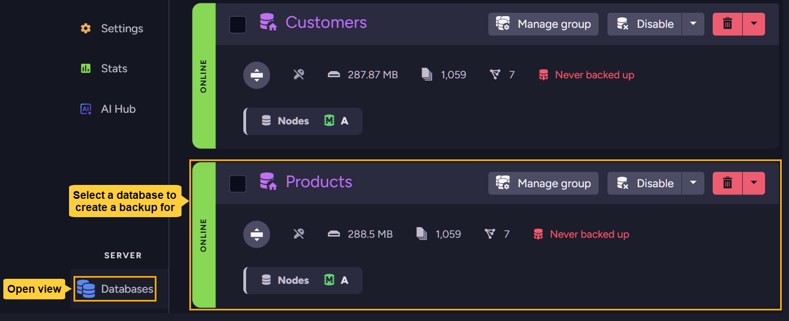

- Open: **Tasks** `>` **Backups** `>` **Manual Backup** `>` **Create a Backup**

  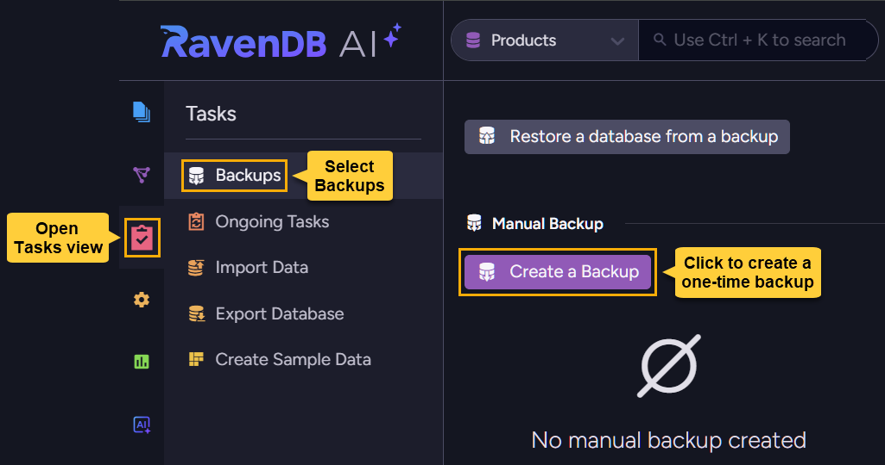

- Define and run the backup operation.

  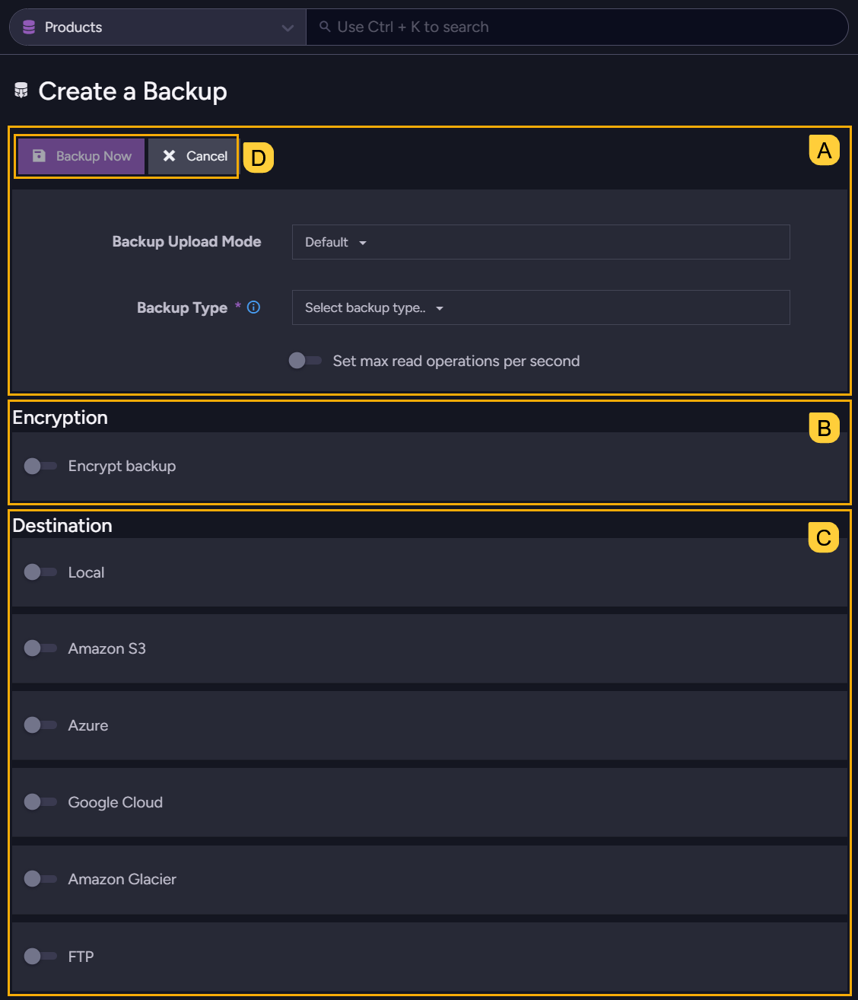
    
  `A`. [Define basic backup options](../../backup/create/one-time-backup#a-define-basic-backup-options)  
  `B`. [Set backup encryption options](../../backup/create/one-time-backup#b-set-backup-encryption-options)  
  `C`. [Choose where to store the backup](../../backup/create/one-time-backup#c-choose-where-to-store-the-backup)  
  `D`. [Run the backup operation](../../backup/create/one-time-backup#d-run-the-backup-operation)

---

<ContentFrame>

### A. Define basic backup options

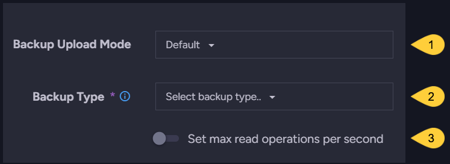

1. **Backup upload mode**  
   Select the preferred upload mode:
    - **Default** - store the backup locally before uploading it to any remote destination.  
      Storing the backup locally provides a safety measure in case the upload fails.  
    - **Direct upload** - upload the backup directly to its destinations without storing locally.  
      Direct upload can be used, for example, when the local storage space is limited.  

2. **Backup type**  
   Select the type of backup to create:
    - **Backup** - create a [logical backup](../../backup/overview#logical-backup).  
    - **Snapshot** - create a [snapshot image](../../backup/overview#snapshot-image).  

      When **snapshot** is selected, a few additional options are available:  
      - **Compression algorithm**  
        Defines the compression algorithm used for the snapshot image.  
        Available algorithms are `Zstd` and `Deflate`.
      - **Compression level**  
        Defines the level of compression applied to the snapshot image.  
        Options include:  
        `No Compression`: No compression applied  
        `Fastest`: Prioritizes speed, resulting a larger image file  
        `Optimal`: Balances compression efficiency and CPU usage  
        `Smallest size`: Achieves the smallest image size at the highest CPU cost.
      - **Exclude indexes**  
        Enable this option to exclude index data from the snapshot, reducing image size and transfer time.  
        Note that this will increase restore time, as indexes will need to be recreated from their definitions and rebuilt by indexing all documents relevant to each index.

3. **Set max read operations per second**  
     Enter the maximum number of read operations per second that the task is allowed to make during backup.  
     Setting a read operations limit can reduce the impact of backup operations on server performance.  
   
</ContentFrame>

<ContentFrame>

### B. Set backup encryption options

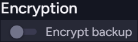

<Admonition type="note" title="">
Use this section to configure encryption options for a **logical backup** (when the selected backup type is **backup**).  

* These settings do not apply to a **snapshot** because a snapshot is an exact replica of the database and automatically reflects its encryption:  
  - If the database is **encrypted**, the snapshot will be encrypted as well, using the database encryption key.  
  - If the database is **not encrypted**, the snapshot will not be encrypted either.  

* A **logical backup**, on the other hand, can be encrypted or unencrypted **regardless** of the database encryption. You can:  
   - Create an **unencrypted** backup, even if the database is encrypted.
   - **Encrypt** the backup for an **encrypted database** using either the database encryption key or your own encryption key.  
   - **Encrypt** the backup for an **unencrypted database** using your own encryption key.  
</Admonition>

---

#### Create a non-encrypted logical backup:

* To create a non-encrypted backup, disable the `Encrypt backup` option.  

  

* If the database you want to back up is encrypted and you disable backup encryption, a confirmation button will appear so you can affirm your choice, as creating a non-encrypted backup for an encrypted database **may have security implications**.  

  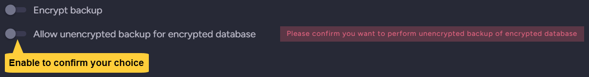

---

#### Create an encrypted logical backup:

* To create an encrypted backup, enable the `Encrypt backup` option.  

  

* If the [database is encrypted](../../studio/database/create-new-database/encrypted), you will be given the choice to use either the database encryption key or your own key.  
  
   - Use the database encryption key for simplicity, as you won't need to manage a separate encryption key for backups.

     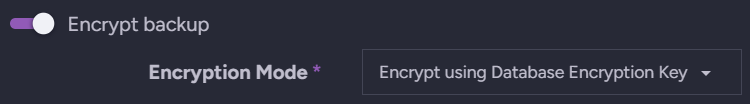

   - Or use your own encryption key for more control over backup encryption, e.g., to use a different key rotation policy for backups than for the database.  

     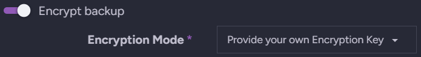

     You will be given access to a key generator to create a strong encryption key, either use it or provide your own Base64 key.  
     
     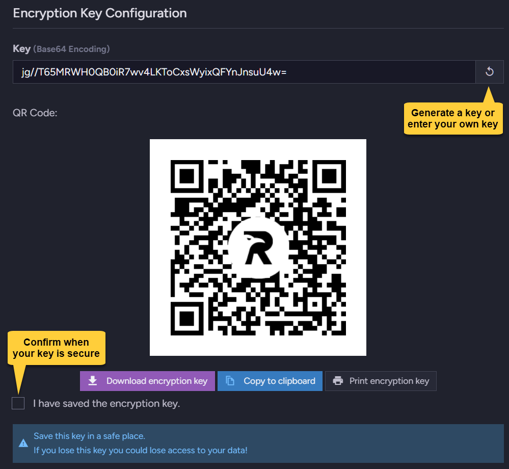

     <Admonition type="warning" title="">
     Be sure to secure your encryption key, as without it you will not be able to restore your backups!
     </Admonition>

* If the database is **not encrypted**, you can still generate or enter your own key to encrypt the backups.  

</ContentFrame>

<ContentFrame>

### C. Choose where to store the backup

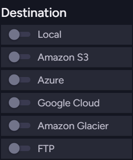

You can select one or more storage locations for the backup, both local and remote.  

* Each storage location has its own specific settings to configure.  
  e.g., **Backup directory** for local storage or **Bucket name** for Amazon S3.  
  Be sure to fill in the required settings for each selected storage location.  

  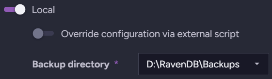

* The **Backup Upload Mode** setting defined [above](../../backup/create/one-time-backup#a-define-basic-backup-options) determines whether to store the backup locally before sending it to any remote destination.

</ContentFrame>

<ContentFrame>

### D. Run the backup operation


Click **Backup Now** to back up the database by your settings.  

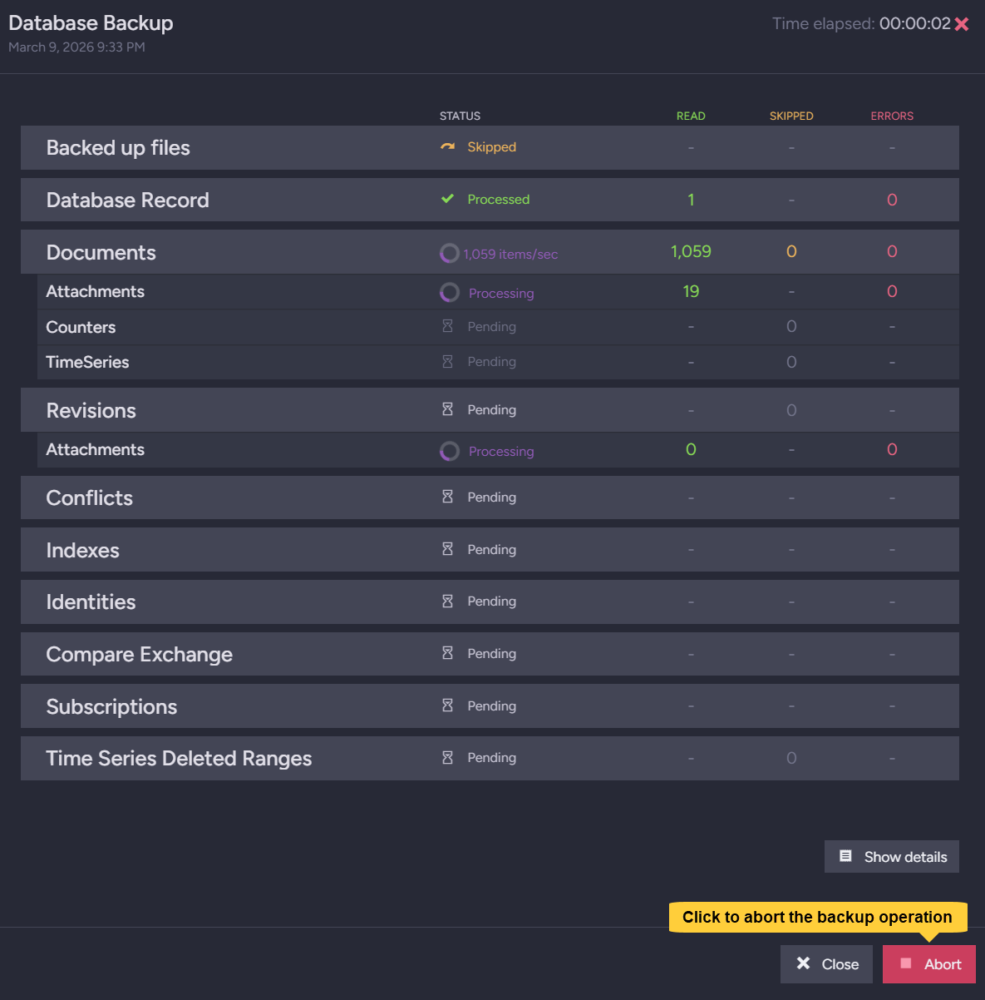

- While the backup is being created, you can follow its progress.  
- To abort the backup operation, e.g., if it takes longer than expected and you need to free up server resources, click the **Abort** button.  
  Note that aborting the operation may require manual cleanup of partial local files and/or remote uploads.

</ContentFrame>

<ContentFrame>

## Triggering a backup task to run a backup operation immediately

Each periodic backup task, including server-wide derived tasks, can be triggered to run a backup operation immediately, outside of its schedule.  

[Triggering a regular backup task to run a backup operation immediately](../../backup/create/periodic-tasks/database-backup#running-a-backup-operation-immediately)  

[Triggering a server-wide derived task to run a backup operation immediately](../../backup/create/periodic-tasks/server-wide-backup#triggering-an-immediate-backup-operation-1)  

</ContentFrame>

</Panel>
