import Admonition from '@theme/Admonition';
import Tabs from '@theme/Tabs';
import TabItem from '@theme/TabItem';
import CodeBlock from '@theme/CodeBlock';
import LanguageSwitcher from "@site/src/components/LanguageSwitcher";
import LanguageContent from "@site/src/components/LanguageContent";
import Panel from "@site/src/components/Panel";
import ContentFrame from "@site/src/components/ContentFrame";

# Periodic database backup tasks

<Admonition type="note" title="">

* A periodic backup task automatically creates backups at predefined time intervals, based on a user-defined configuration that specifies the task schedule, backup type, and other settings.

* You can create and manage periodic **backup tasks** using either the client API or Studio.  
  A backup task runs **backup operations** on its defined schedule. Once a backup operation is running, you can also delay or abort it.

* See the variety of backup configuration options and settings in:  
    [Backup overview](../../../backup/overview)  
    [Configuration syntax](../../../backup/create/periodic-tasks/database-backup#syntax)

* This article explains how to create periodic backup tasks for a **single database**.  
  [Learn to create server-wide periodic backup tasks.](../../../backup/create/periodic-tasks/server-wide-backup)

* In this article:  
  * [Creating and managing periodic backups using the client API](../../../backup/create/periodic-tasks/database-backup#creating-and-managing-periodic-backups-using-the-client-api)
     * [Creating a backup task](../../../backup/create/periodic-tasks/database-backup#creating-a-backup-task)
        * [Key configuration settings](../../../backup/create/periodic-tasks/database-backup#key-configuration-settings)
     * [Getting backup task status](../../../backup/create/periodic-tasks/database-backup#getting-backup-task-status)
     * [Updating a backup task](../../../backup/create/periodic-tasks/database-backup#updating-a-backup-task)
     * [Deleting a backup task](../../../backup/create/periodic-tasks/database-backup#deleting-a-backup-task)
     * [Managing backup operations](../../../backup/create/periodic-tasks/database-backup#managing-backup-operations)
        * [Triggering an immediate backup operation](../../../backup/create/periodic-tasks/database-backup#triggering-an-immediate-backup-operation)
        * [Delaying a running backup operation](../../../backup/create/periodic-tasks/database-backup#delaying-a-running-backup-operation)
        * [Aborting a running backup operation](../../../backup/create/periodic-tasks/database-backup#aborting-a-running-backup-operation)
     * [Syntax](../../../backup/create/periodic-tasks/database-backup#syntax)
        * [Methods](../../../backup/create/periodic-tasks/database-backup#methods)
        * [Classes](../../../backup/create/periodic-tasks/database-backup#classes)
  
  * [Creating and managing periodic backups via Studio](../../../backup/create/periodic-tasks/database-backup#creating-and-managing-periodic-backups-via-studio)
     * [Creating a backup task](../../../backup/create/periodic-tasks/database-backup#creating-a-backup-task-1)
         * [Defining basic task options](../../../backup/create/periodic-tasks/database-backup#a-defining-basic-task-options)
         * [Scheduling full and incremental backups](../../../backup/create/periodic-tasks/database-backup#b-scheduling-full-and-incremental-backups)
         * [Setting backups retention policy](../../../backup/create/periodic-tasks/database-backup#c-setting-backups-retention-policy)
         * [Setting backup encryption options](../../../backup/create/periodic-tasks/database-backup#d-setting-backup-encryption-options)
         * [Choosing where to store the backups](../../../backup/create/periodic-tasks/database-backup#e-choosing-where-to-store-the-backups)
         * [Saving and managing the task](../../../backup/create/periodic-tasks/database-backup#f-saving-and-managing-the-task)
      * [Running a backup operation immediately](../../../backup/create/periodic-tasks/database-backup#running-a-backup-operation-immediately)
      * [Delaying or aborting a running backup operation](../../../backup/create/periodic-tasks/database-backup#delaying-or-aborting-a-running-backup-operation)


</Admonition>

<Panel heading="Creating and managing periodic backups using the client API">

<ContentFrame>

## Creating a backup task

To create a periodic backup task:  
* Define a **backup configuration** using a `PeriodicBackupConfiguration` instance.  
  The configuration sets the [schedule](../../../backup/overview#periodic-backup-tasks) for backups creation and specifies other task settings, including:  
    - The [type](../../../backup/create/periodic-tasks/database-backup#setting-backup-type) of backups to create (logical backups or snapshot images).
    - Backups [scope and schedule](../../../backup/create/periodic-tasks/database-backup#setting-backups-scope-and-schedule) (schedule full and/or incremental backups).  
    - Where to [store](../../../backup/create/periodic-tasks/database-backup#setting-storage-destinations) backups (locally and/or remotely).  
    - Whether to use a [retention policy](../../../backup/create/periodic-tasks/database-backup#setting-retention-policy) to delete outdated backups.  
    - If and how to use [encryption](../../../backup/create/periodic-tasks/database-backup#setting-encryption).

* When the configuration is prepared, pass the instance to `UpdatePeriodicBackupOperation` to create the backup task on the server and schedule the backup routine for the database.  

* **Example**:  
  ```csharp
  var config = new PeriodicBackupConfiguration
  {
      // Task name 
      Name = "FullAndIncrementalBackup",

      // Create a logical backup
      BackupType = BackupType.Backup,

      // Run a full backup every 6 hours
      FullBackupFrequency = "0 */6 * * *",

      // Run an incremental backup every 20 minutes
      IncrementalBackupFrequency = "*/20 * * * *",

      // Keep backups locally
      LocalSettings = new LocalSettings
      {
          FolderPath = backupPath
      },

      // Also upload backups to Azure
      AzureSettings = new AzureSettings
      {
          // Use your Azure credentials here
      },

      // Keep backups for 7 days
      RetentionPolicy = new RetentionPolicy
      {
          Disabled = false,
          MinimumBackupAgeToKeep = TimeSpan.FromDays(7)
      },

      // Encrypt backups using the database key
      BackupEncryptionSettings = new BackupEncryptionSettings
      {
          EncryptionMode = EncryptionMode.UseDatabaseKey
      }
  };

  var operation = new UpdatePeriodicBackupOperation(config);
  var result = await store.Maintenance.SendAsync(operation);
  ```

</ContentFrame>

<ContentFrame>

### Key configuration settings

#### Setting backup type:

- Set the backup type using the backup configuration `BackupType` _enum_ property.  
  You can assign it with `BackupType.Backup` to create logical backups,  
  or with `BackupType.Snapshot` for snapshot images.  

  e.g.,  
  ```csharp
  var config = new PeriodicBackupConfiguration
  {
      BackupType = BackupType.Snapshot,
      // other configuration settings...
  };
  ```

- [See `BackupType` syntax](../../../backup/create/periodic-tasks/database-backup#classes-and-enums-used-in-the-backup-configuration)

---

#### Setting backups scope and schedule:

- Set backups scope (full and/or incremental) and schedule, using the backup configuration `FullBackupFrequency` and `IncrementalBackupFrequency` _string_ properties.  
  The schedule is set using a [cron expression](https://en.wikipedia.org/wiki/Cron).  

  e.g.,  
  ```csharp
  var config = new PeriodicBackupConfiguration
  {
      // ...
      // Create a full backup every 6 hours, at minute 0
      FullBackupFrequency = "0 */6 * * *",
      // Create an incremental backup every 20 minutes
      IncrementalBackupFrequency = "*/20 * * * *",
      // ...
  };
  ```

- [See `FullBackupFrequency` and `IncrementalBackupFrequency` syntax](../../../backup/create/periodic-tasks/database-backup#backup-configuration-classes)

---

#### Setting storage destinations:

- Set storage destinations using the backup configuration storage classes:  
   - Local path: `LocalSettings`  
   - Amazon S3: `S3Settings` and `AmazonSettings`  
   - Amazon Glacier: `GlacierSettings` and `AmazonSettings`  
   - Azure Blob Storage: `AzureSettings`  
   - FTP server: `FtpSettings`  
   - Google Cloud Storage: `GoogleCloudSettings`  

  e.g.,  
  ```csharp
  var config = new PeriodicBackupConfiguration
  {
      // ...
      LocalSettings = new LocalSettings
      {
          FolderPath = backupPath
      },
      AzureSettings = new AzureSettings
      {
          // Use your Azure credentials here
      },
      // ...
  };
  ```

- Optionally, you can set an [external script that provides the destination settings at runtime](../../../backup/overview#overriding-storage-settings-with-an-external-script).  
   - To enable an external script (per destination) and set its parameters, use the destination's `GetBackupConfigurationScript` property.  

     e.g., set an external script that applies to the local storage destination:  
     ```csharp
     LocalSettings = new LocalSettings
     {
         // Optional default; script output will override it.
         FolderPath = @"D:\RavenBackups",

         GetBackupConfigurationScript = new GetBackupConfigurationScript
         {
             Exec = "powershell",
             Arguments = "-NoProfile -NonInteractive -ExecutionPolicy Bypass -File \"D\\RavenDB\\Backups\\local-settings.ps1\"",
             TimeoutInMs = 10_000
         }
     }
     ```

- [See destinations-related syntax](../../../backup/create/periodic-tasks/database-backup#backup-destinations-classes)

---

#### Setting retention policy:

- Set backups retention policy using the backup configuration `RetentionPolicy` property (of type `RetentionPolicy`).  
   - Use `Disabled` to enable or disable the retention policy,  
     and `MinimumBackupAgeToKeep` to set a retention period.  
   - Backups older than the retention period will be deleted the next time the backup task runs.  

  e.g.,  
  ```csharp
  var config = new PeriodicBackupConfiguration
  {
      // ...
      RetentionPolicy = new RetentionPolicy
      {
          // Enable retention policy
          Disabled = false,
          // Set retention  period
          MinimumBackupAgeToKeep = TimeSpan.FromDays(7)
      },
      // ...
  };
  ```

- [See `RetentionPolicy` syntax](../../../backup/create/periodic-tasks/database-backup#classes-and-enums-used-in-the-backup-configuration)

---

#### Setting encryption:

Set backup encryption using the backup configuration `BackupEncryptionSettings` property (of type `BackupEncryptionSettings`).  

* [Snapshots](../../../backup/overview#snapshot-image-encryption) are exact images of the database, and as such are automatically encrypted when the database is encrypted (using the same encryption key as the database) or unencrypted when the database is not encrypted.  

* [Logical backups](../../../backup/overview#logical-backup-encryption) can be encrypted or not, regardless of the database encryption.  
   - Use `BackupEncryptionSettings.EncryptionMode` to select if and how backups should be encrypted.  
   Available options are:  
      - `EncryptionMode.None` - Do not encrypt backups
      - `EncryptionMode.UseDatabaseKey` - Encrypt the backup using the same encryption key as the database.  
        This option is relevant only when the database is encrypted.  
      - `EncryptionMode.UseProvidedKey` - Use a key provided by the user.  
        This option can be used both when the database is encrypted and when it isn't.  
        If you use your own key, provide it via `BackupEncryptionSettings.Key`.  

     e.g.,
     ```csharp
     var config = new PeriodicBackupConfiguration
     {
        // ...
        // Encrypt a logical backup using a user-provided key
        BackupEncryptionSettings = new BackupEncryptionSettings
        {
            // A Base64-encoded encryption key
            Key = "0eZ6g9f2k+GxH8c4Yv4xNwqzJ48m3o3x7lKQyqgQXct=",
            EncryptionMode = EncryptionMode.UseProvidedKey
        }
        // ...
     };
     ```

* [See `BackupEncryptionSettings` and `EncryptionMode` syntax](../../../backup/create/periodic-tasks/database-backup#classes-and-enums-used-in-the-backup-configuration)

</ContentFrame>

<ContentFrame>

## Getting backup task status

To retrieve the status of a backup task after its last run, use `GetPeriodicBackupStatusOperation` with the task ID.  
- If you don't have the task ID, you can get it using `GetOngoingTaskInfoOperation` with the task name.  
- The retrieved status reflects the **most recent completed backup run**, whether it was scheduled or [triggered manually](../../../backup/create/periodic-tasks/database-backup#triggering-an-immediate-backup-operation).
- The status includes the number of backups performed by the task, and details about the last backup such as the backup timestamp, duration, destination path, and error information (if any).  

[See GetPeriodicBackupStatusOperation syntax](../../../backup/create/periodic-tasks/database-backup#task-management)

#### Example:
```csharp
var operation = new UpdatePeriodicBackupOperation(config);
var result = await store.Maintenance.SendAsync(operation);

// Get the task ID
var backupTaskForStatus = await store.Maintenance.SendAsync(
    new GetOngoingTaskInfoOperation("FullAndIncrementalBackup",
        OngoingTaskType.Backup)) as OngoingTaskBackup;

long backupTaskId = backupTaskForStatus.TaskId;

// Get the backup status for this task
var statusResult = await store.Maintenance.SendAsync(
    new GetPeriodicBackupStatusOperation(backupTaskId));

var status = statusResult.Status;

// Status is null if no backup has run yet
if (status == null)
{
    // No backup has been executed yet for this task
    return;
}

// Check for errors in the last backup run
if (status.Error != null)
{
    // The last backup run failed
    string errorMessage = status.Error.Exception;
    DateTime errorTime = status.Error.At;
}

// Access last backup details
bool wasFull = status.IsFull;
long? lastEtag = status.LastEtag;
long? durationMs = status.DurationInMs;
DateTime? lastFullBackup = status.LastFullBackup;
DateTime? lastIncrementalBackup = status.LastIncrementalBackup;

// Access backup destination details
string? localBackupDir = status.LocalBackup?.BackupDirectory;
```
<br />
<Admonition type="note" title="">

#### For a Sharded database:
If your database is [sharded](../../../sharding/backup-and-restore/backup), use `GetShardedPeriodicBackupStatusOperation` instead.  
It returns a separate `PeriodicBackupStatus` for **each shard**, in a dictionary keyed by shard number.

* `GetPeriodicBackupStatusOperation` throws an `InvalidOperationException` if the database is **sharded**.
* `GetShardedPeriodicBackupStatusOperation` throws an `InvalidOperationException` if the database is **not sharded**.

```csharp
// Get backup status for a sharded database
var shardedResult = await store.Maintenance.SendAsync(
    new GetShardedPeriodicBackupStatusOperation(backupTaskId));

// Statuses is a Dictionary<int, PeriodicBackupStatus> keyed by shard number
Dictionary<int, PeriodicBackupStatus> statuses = shardedResult.Statuses;

// Iterate over each shard's backup status
foreach (var (shardNumber, shardStatus) in statuses)
{
    DateTime? lastFull = shardStatus.LastFullBackup;
    DateTime? lastIncremental = shardStatus.LastIncrementalBackup;
    string? error = shardStatus.Error?.Exception;

    // Each shard has its own backup destination details
    string? localDir = shardStatus.LocalBackup?.BackupDirectory;
}

```

</Admonition>

</ContentFrame>

<ContentFrame>

## Updating a backup task

To update an existing backup task:  
- If you don't know the ID of the task, retrieve the task by its name using `GetOngoingTaskInfoOperation` and extract `TaskId`.
- Create a new backup configuration that uses the same `TaskId`.  
  Include in the new configuration **all the settings you want to keep**, as omitted settings may be reset to defaults or disabled.
- Pass the updated configuration to `UpdatePeriodicBackupOperation`.

#### Example:
```csharp
// Retrieve the existing backup task by its name to get the TaskId
var ongoingTask = await store.Maintenance.SendAsync(
    new GetOngoingTaskInfoOperation("FullAndIncrementalBackup", 
        OngoingTaskType.Backup)) as OngoingTaskBackup;

// Ensure the task exists
Assert.NotNull(ongoingTask);

// Extract the task ID
var taskId = ongoingTask.TaskId;

// Create a new backup configuration with the same TaskId
var updatedConfig = new PeriodicBackupConfiguration
{
    TaskId = taskId,
    Name = "DailyBackup",
    BackupType = BackupType.Backup,
    FullBackupFrequency = "0 */24 * * *",
    LocalSettings = new LocalSettings
    {
        FolderPath = backupPath
    },
    BackupEncryptionSettings = new BackupEncryptionSettings
    {
        Key = "myEncryptionKey",
        EncryptionMode = EncryptionMode.UseProvidedKey
    }
};

// Update the backup task with the new configuration
var updateOp = new UpdatePeriodicBackupOperation(updatedConfig);
var updateResult = await store.Maintenance.SendAsync(updateOp);
```
</ContentFrame>

<ContentFrame>

### Deleting a backup task

To delete an existing backup task:  
 - If you don't know the ID of the task, retrieve the task by its name using `GetOngoingTaskInfoOperation` and extract `TaskId`.  
  - Pass the task ID to `DeletePeriodicBackupOperation` to delete the task from the server.  

#### Example:
```csharp
// Get the task info to retrieve the TaskId
var backupTask = await store.Maintenance.SendAsync(
    new GetOngoingTaskInfoOperation("FullAndIncrementalBackup", OngoingTaskType.Backup)) as OngoingTaskBackup;

// Ensure the task exists
if (backupTask == null)
    throw new InvalidOperationException("The periodic backup task was not found.");

// Delete the task using its TaskId
await store.Maintenance.SendAsync(
    new DeleteOngoingTaskOperation(backupTask.TaskId, OngoingTaskType.Backup));
```

</ContentFrame>


---

## Managing backup operations

After defining a database backup task, it starts executing **backup operations** as scheduled.  
You can:  
- Trigger the **immediate execution** of a backup operation, outside of its task schedule.  
- **Delay a backup operation** that the task has already started.  
- **Abort a backup operation** that the task has already started.  

<ContentFrame>

### Triggering an immediate backup operation

To trigger the immediate creation of a backup using an existing periodic backup task:  
- If you don't have the task ID, fetch it using `GetOngoingTaskInfoOperation`
- Create a backup immediately using `StartBackupOperation`, passing it the backup scope (full or incremental) and the ID of the periodic backup task to use.  

#### Example:  
```csharp
// Create a backup immediately using an existing periodic backup task
// Fetch task info to get its ID
var existingPeriodicBackupTask = await store.Maintenance.SendAsync(
    new GetOngoingTaskInfoOperation("DailyBackup",
        OngoingTaskType.Backup)) as OngoingTaskBackup;

// Fetch the task ID
long existingTaskId = existingPeriodicBackupTask.TaskId;

// Choose whether to run Full or Incremental backup
bool isFullBackup = true; // false => incremental

// Create backup immediately 
var backupOperationId = await store.Maintenance.SendAsync(new StartBackupOperation(isFullBackup, existingTaskId));
```

</ContentFrame>

<ContentFrame>

### Delaying a running backup operation

To delay the execution of a **currently running** backup operation:  
- Use `GetOngoingTaskInfoOperation` to fetch the backup task info.
- Ensure that the backup is currently running by checking the `OnGoingBackup` property.
  <Admonition type="note" title="">
  If `OnGoingBackup` is `null`, there is no running backup operation to delay.
  </Admonition>
- Take the operation ID from `OnGoingBackup.RunningBackupTaskId`.
- Pass the operation ID and the delay duration to `DelayBackupOperation`.

#### Example:
```csharp
// Fetch task info to get the ID of a currently running backup operation
var runningTask = await store.Maintenance.SendAsync(
    new GetOngoingTaskInfoOperation("DailyBackup",
        OngoingTaskType.Backup)) as OngoingTaskBackup;

// Ensure that the backup task exists and a backup is currently running

// If the backup task is not found
if (runningTask == null)
{
    throw new InvalidOperationException("The periodic backup task 'DailyBackup' is not found.");
}

// If there is no running backup operation
if (runningTask.OnGoingBackup == null)
{
    throw new InvalidOperationException("No running backup operation to delay.");
}

// Set delay duration to one hour
var delayDuration = TimeSpan.FromHours(1);

// Delay the backup using the operation ID and the delay duration
await store.Maintenance.SendAsync(new DelayBackupOperation(
    runningTask.OnGoingBackup.RunningBackupTaskId, delayDuration));
```

</ContentFrame>

<ContentFrame>

### Aborting a running backup operation

* To abort a periodic backup that was started by its task **as scheduled**:  
  - Fetch the running operation ID from the periodic task info.  
  - Kill the operation using the fetched ID.  
  
  **Example**:  
  ```csharp
  // abort a backup operation When it was started by the task as scheduled
  var runningOperationTask = await store.Maintenance.SendAsync(
      new GetOngoingTaskInfoOperation("DailyBackup",
          OngoingTaskType.Backup)) as OngoingTaskBackup;

  // Ensure that the backup task exists and a backup is currently running

  // If the backup task is not found
  if (runningOperationTask == null)
  {
      throw new InvalidOperationException("The periodic backup task 'DailyBackup' is not found.");
  }

  // If there is no running backup operation
  if (runningOperationTask.OnGoingBackup == null)
  {
      throw new InvalidOperationException("No running backup operation to delay.");
  }

  // Abort the backup using the operation ID
  long runningOperationId = runningOperationTask.OnGoingBackup.RunningBackupTaskId;
  await store.Commands().ExecuteAsync(new KillOperationCommand(runningOperationId));
  ```

* To abort a backup that was triggered [manually](../../../backup/create/periodic-tasks/database-backup#triggering-an-immediate-backup-operation) using `StartBackupOperation`:  
  - Extract the backup operation ID from the result returned by `StartBackupOperation`.  
   - Use the backup operation ID to abort the operation.  
   - Also extract and use the responsible node tag to ensure that the operation is aborted on the correct cluster node.  
  
  **Example:**  
  ```csharp
  // Create backup immediately 
  OperationIdResult<StartBackupOperationResult> startBackupOperation = await store.Maintenance.SendAsync<OperationIdResult<StartBackupOperationResult>>(new StartBackupOperation(isFullBackup, existingTaskId));

  // Extract the operation ID
  long backupOperationId = startBackupOperation.OperationId;

  // Extract responsible node tag
  string responsibleNodeTag = startBackupOperation.Result.ResponsibleNode;

  // kill the backup operation that was started manually
  await store.Commands().ExecuteAsync(new KillOperationCommand(backupOperationId, responsibleNodeTag));
  ```

---

<Admonition type="note" title="">

Note that after aborting the backup operation, you may need to **manually clean up**:  
* Partial **local** files, left while creating the backup.  
* Partial or temporary **remote** uploads.  
</Admonition>


</ContentFrame>

</Panel>

<Panel heading="Syntax">

## Methods

<ContentFrame>

### Task management

<Tabs groupId='task-methods'>
<TabItem value="UpdatePeriodicBackupOperation" label="UpdatePeriodicBackupOperation">

Creates or updates a periodic backup task.

```csharp
public UpdatePeriodicBackupOperation(PeriodicBackupConfiguration configuration)
```
<br />
Usage:

```csharp
UpdatePeriodicBackupOperationResult result = await store.Maintenance.SendAsync(
    new UpdatePeriodicBackupOperation(configuration));
```
<br />
| Parameter | Type | Description |
|-----------|------|-------------|
| **configuration** | `PeriodicBackupConfiguration` | The backup configuration to create or update.<br />To update an existing task, set `TaskId` to the ID of the task to modify. |

| Return value | |
|-----------|-------------|
| `UpdatePeriodicBackupOperationResult` | Contains `TaskId` (`long`) — the ID of the created or updated task. |

</TabItem>
<TabItem value="GetPeriodicBackupStatusOperation" label="GetPeriodicBackupStatusOperation">

Retrieves the status of the most recent backup run for a periodic backup task.

```csharp
public GetPeriodicBackupStatusOperation(long taskId)
```
<br />
Usage:

```csharp
GetPeriodicBackupStatusOperationResult result = await store.Maintenance.SendAsync(
    new GetPeriodicBackupStatusOperation(taskId));
```
<br />
| Parameter | Type | Description |
|-----------|------|-------------|
| **taskId** | `long` | The ID of the periodic backup task to retrieve status for. |

| Return value | |
|-----------|-------------|
| `GetPeriodicBackupStatusOperationResult` | Contains `Status` (`PeriodicBackupStatus`) — the status of the last backup run.<br />`null` if no backup has been executed yet. |

<br />
**`PeriodicBackupStatus` properties:**

| Property | Type | Description |
|----------|------|-------------|
| **TaskId** | `long` | The ID of the periodic backup task. |
| **BackupType** | `BackupType` | The backup type (`Backup` or `Snapshot`). |
| **IsFull** | `bool` | `true` if the last run was a full backup, `false` if incremental. |
| **NodeTag** | `string` | The tag of the cluster node that performed the backup. |
| **LastFullBackup** | `DateTime?` | Timestamp of the last full backup. |
| **LastIncrementalBackup** | `DateTime?` | Timestamp of the last incremental backup. |
| **LastEtag** | `long?` | The last document etag included in the backup. |
| **DurationInMs** | `long?` | Duration of the backup run, in milliseconds. |
| **FolderName** | `string` | The name of the backup folder created for this run. |
| **IsEncrypted** | `bool` | Whether the backup was encrypted. |
| **Error** | `Error` | Error details if the last backup run failed, `null` otherwise.<br />Contains `Exception` (`string`) and `At` (`DateTime`). |
| **LastOperationId** | `long?` | The operation ID of the last backup run. |
| **DelayUntil** | `DateTime?` | If the backup was [delayed](../../../backup/create/periodic-tasks/database-backup#delaying-a-running-backup-operation), the time at which it will resume. |
| **LocalBackup** | `LocalBackup` | Local backup details.<br />`BackupDirectory` (`string`) contains the local path if local storage was configured as a backup destination, or `null` if local storage was only used as a temporary staging area for remote uploads.<br />Also contains `FileName` (`string`) and `TempFolderUsed` (`bool`). |
| **UploadToS3** | `UploadToS3` | Amazon S3 upload status. `null` if S3 was not configured as a destination. |
| **UploadToGlacier** | `UploadToGlacier` | Amazon Glacier upload status. `null` if Glacier was not configured. |
| **UploadToAzure** | `UploadToAzure` | Azure Blob Storage upload status. `null` if Azure was not configured. |
| **UploadToGoogleCloud** | `UploadToGoogleCloud` | Google Cloud Storage upload status. `null` if Google Cloud was not configured. |
| **UploadToFtp** | `UploadToFtp` | FTP upload status. `null` if FTP was not configured. |
| **Version** | `long` | A counter that increments with each completed backup run for this task. |

<Admonition type="note" title="Remote destination status properties">

All remote destination status classes (`UploadToS3`, `UploadToGlacier`, `UploadToAzure`, `UploadToGoogleCloud`, `UploadToFtp`) share the same properties:

| Property | Type | Description |
|----------|------|-------------|
| **Skipped** | `bool` | Whether the upload to this destination was skipped. |
| **UploadProgress** | `UploadProgress` | Upload progress details, including `UploadState` (`PendingUpload`, `Uploading`, `PendingResponse`, `Done`), `UploadedInBytes`, `TotalInBytes`, `BytesPutsPerSec`, and `UploadTimeInMs`. |
| **LastFullBackup** | `DateTime?` | Timestamp of the last full backup uploaded to this destination. |
| **LastIncrementalBackup** | `DateTime?` | Timestamp of the last incremental backup uploaded to this destination. |
| **FullBackupDurationInMs** | `long?` | Duration of the last full backup upload, in milliseconds. |
| **IncrementalBackupDurationInMs** | `long?` | Duration of the last incremental backup upload, in milliseconds. |
| **Exception** | `string` | Error message if the upload to this destination failed. |

</Admonition>

</TabItem>
<TabItem value="DeleteOngoingTaskOperation" label="DeleteOngoingTaskOperation">

Deletes an ongoing task by its ID.

```csharp
public DeleteOngoingTaskOperation(long taskId, OngoingTaskType taskType)
```
<br />
Usage:

```csharp
ModifyOngoingTaskResult result = await store.Maintenance.SendAsync(
    new DeleteOngoingTaskOperation(taskId, OngoingTaskType.Backup));
```
<br />
| Parameter | Type | Description |
|-----------|------|-------------|
| **taskId** | `long` | The ID of the task to delete. |
| **taskType** | `OngoingTaskType` | The type of the ongoing task.<br />Use `OngoingTaskType.Backup` for backup tasks. |

| Return value | |
|-----------|-------------|
| `ModifyOngoingTaskResult` | Contains `TaskId` (`long`) and `ResponsibleNode` (`string`). |

</TabItem>
</Tabs>

<Tabs groupId='sharded-task-methods'>
<TabItem value="GetShardedPeriodicBackupStatusOperation" label="GetShardedPeriodicBackupStatusOperation">

Retrieves the per-shard status of the most recent backup run for a periodic backup task in a [sharded database](../../../sharding/backup-and-restore/backup).  
For non-sharded databases, use `GetPeriodicBackupStatusOperation` instead.

```csharp
public GetShardedPeriodicBackupStatusOperation(long taskId)

```
<br />
Usage:

```csharp
GetShardedPeriodicBackupStatusOperationResult result = await store.Maintenance.SendAsync(
    new GetShardedPeriodicBackupStatusOperation(taskId));

```
<br />
| Parameter | Type | Description |
|-----------|------|-------------|
| **taskId** | `long` | The ID of the periodic backup task to retrieve status for. |

| Return value | |
|-----------|-------------|
| `GetShardedPeriodicBackupStatusOperationResult` | Contains `Statuses` (`Dictionary<int, PeriodicBackupStatus>`) — a dictionary mapping each shard number to its backup status.<br />Each value is a `PeriodicBackupStatus` with the [same properties](../../../backup/create/periodic-tasks/database-backup#getting-backup-task-status) as the non-sharded result. |

<Admonition type="note" title="">

* `GetShardedPeriodicBackupStatusOperation` throws an `InvalidOperationException` if the database is **not sharded**.
* `GetPeriodicBackupStatusOperation` throws an `InvalidOperationException` if the database **is sharded**.

</Admonition>

</TabItem>
</Tabs>

---

### Operations

<Tabs groupId='operation-methods'>
<TabItem value="StartBackupOperation" label="StartBackupOperation">

Triggers the immediate execution of a backup using an existing periodic backup task.

```csharp
public StartBackupOperation(bool isFullBackup, long taskId)
```
<br />
Usage:

```csharp
OperationIdResult<StartBackupOperationResult> result =
    await store.Maintenance.SendAsync<OperationIdResult<StartBackupOperationResult>>(
        new StartBackupOperation(isFullBackup, taskId));
```
<br />
| Parameter | Type | Description |
|-----------|------|-------------|
| **isFullBackup** | `bool` | `true` — create a full backup.<br />`false` — create an incremental backup. |
| **taskId** | `long` | The ID of the periodic backup task to use. |

| Return value | |
|-----------|-------------|
| `OperationIdResult<StartBackupOperationResult>` | `OperationId` (`long`) — the ID of the running backup operation.<br />`Result.ResponsibleNode` (`string`) — the tag of the node executing the backup. |

</TabItem>
<TabItem value="DelayBackupOperation" label="DelayBackupOperation">

Delays a currently running backup operation by a specified duration.

```csharp
public DelayBackupOperation(long runningBackupTaskId, TimeSpan duration)
```
<br />
Usage:

```csharp
await store.Maintenance.SendAsync(
    new DelayBackupOperation(runningBackupTaskId, duration));
```
<br />
| Parameter | Type | Description |
|-----------|------|-------------|
| **runningBackupTaskId** | `long` | The ID of the running backup operation to delay.<br />Obtained from `OngoingTaskBackup.OnGoingBackup.RunningBackupTaskId`. |
| **duration** | `TimeSpan` | The duration to delay the backup operation. |

</TabItem>
<TabItem value="KillOperationCommand" label="KillOperationCommand">

Aborts a running backup operation.

```csharp
public KillOperationCommand(long id)
public KillOperationCommand(long id, string nodeTag)
```
<br />
Usage:

```csharp
// Abort a scheduled backup (no node tag needed):
await store.Commands().ExecuteAsync(
    new KillOperationCommand(operationId));

// Abort a manually started backup (specify the responsible node):
await store.Commands().ExecuteAsync(
    new KillOperationCommand(operationId, nodeTag));
```
<br />
| Parameter | Type | Description |
|-----------|------|-------------|
| **id** | `long` | The ID of the operation to abort. |
| **nodeTag** | `string` | _(Optional)_ The tag of the node running the operation.<br />Required when aborting a backup started via `StartBackupOperation`, to target the correct node. |

</TabItem>
</Tabs>

</ContentFrame>

---

## Classes

<ContentFrame>

### Backup configuration classes

<Tabs groupId='configuration'>
<TabItem value="PeriodicBackupConfiguration" label="PeriodicBackupConfiguration">

**Periodic backup configuration**
```csharp
class PeriodicBackupConfiguration : BackupConfiguration
{
    string Name
    long TaskId
    bool Disabled
    string MentorNode
    bool PinToMentorNode
    RetentionPolicy RetentionPolicy
    DateTime? CreatedAt
    string FullBackupFrequency
    string IncrementalBackupFrequency
}
```
<br />
| Property | Type | Description |
|------------------|-----------------|-------------|
| **Name** | `string` | The name of the periodic backup task.<br /><ul><li>If a name is not provided, the server will generate a descriptive name automatically.</li><li>Note that a `Server Wide Backup` prefix is automatically added to tasks created as part of a [server-wide backup configuration](../../../backup/create/periodic-tasks/server-wide-backup). An attempt to add this prefix manually will be rejected.</li></ul> |
| **TaskId** | `long` | The unique identifier for the backup task. |
| **Disabled** | `bool` | Indicates whether the backup task is disabled. |
| **MentorNode** | `string` | The mentor node responsible for executing the backup task. |
| **PinToMentorNode** | `bool` | Determines if the backup task should always run on the mentor node. |
| **RetentionPolicy** | `RetentionPolicy` | The retention policy associated with the backup task. |
| **CreatedAt** | `DateTime?` | The timestamp when the backup task was created. |
| **FullBackupFrequency** | `string` | Frequency of full backup jobs in [cron](https://en.wikipedia.org/wiki/Cron) format. |
| **IncrementalBackupFrequency** | `string` | Frequency of incremental backup jobs in [cron](https://en.wikipedia.org/wiki/Cron) format.<br />If set to `null`, incremental backup will be disabled. |

</TabItem>
<TabItem value="BackupConfiguration" label="BackupConfiguration">

**Backup configuration**
```csharp
class BackupConfiguration
{
    BackupType BackupType
    BackupUploadMode BackupUploadMode
    SnapshotSettings SnapshotSettings
    BackupEncryptionSettings BackupEncryptionSettings
    int? MaxReadOpsPerSecond
    LocalSettings LocalSettings
    S3Settings S3Settings
    GlacierSettings GlacierSettings
    AzureSettings AzureSettings
    FtpSettings FtpSettings
    GoogleCloudSettings GoogleCloudSettings
}
```
<br />
| Property                     | Type                     | Description |
|------------------------------|--------------------------|-----------------------------|
| **BackupType**               | `BackupType`            | Backup type (snapshot or logical backup) |
| **BackupUploadMode**         | `BackupUploadMode`      | Upload mode (via local storage or directly to destination) |
| **SnapshotSettings**         | `SnapshotSettings`      | Snapshot settings |
| **BackupEncryptionSettings** | `BackupEncryptionSettings` | Encryption settings |
| **MaxReadOpsPerSecond**      | `int?`                  | Maximum number of read operations per second allowed during backup. |
| **LocalSettings**            | `LocalSettings`         | Local storage settings |
| **S3Settings**               | `S3Settings`            | Amazon S3 backup settings |
| **GlacierSettings**          | `GlacierSettings`       | Amazon Glacier backup settings |
| **AzureSettings**            | `AzureSettings`         | Azure backup settings |
| **FtpSettings**              | `FtpSettings`           | FTP-based backup settings |
| **GoogleCloudSettings**      | `GoogleCloudSettings`   | Google Cloud backup settings |

</TabItem>
</Tabs>

---

### Classes and enums used in the backup configuration

<Tabs groupId='additional-classes'>
<TabItem value="RetentionPolicy" label="RetentionPolicy">

A backup configuration property that defines backups **retention policy**.
```csharp
class RetentionPolicy
{
    bool Disabled
    TimeSpan? MinimumBackupAgeToKeep
}
```
<br />
| Property | Type | Description |
|------------------|-----------------|-------------|
| **Disabled** | `bool` | Indicates whether the retention policy is disabled.<br />Default: `false` |
| **MinimumBackupAgeToKeep** | `TimeSpan?` | The retention threshold.<br />Backups older than this age will be deleted. |

</TabItem>
<TabItem value="BackupType" label="BackupType">

A backup configuration property that defines the **backup type**.
```csharp
enum BackupType
{
    Backup,
    Snapshot
}
```
<br />
| Property | Description |
|----------|-------------|
| **Backup** | Logical backup |
| **Snapshot** | Snapshot image |

</TabItem>
<TabItem value="BackupUploadMode" label="BackupUploadMode">

A backup configuration property that defines the backups **upload mode**.
```csharp
enum BackupUploadMode
{
    Default,
    DirectUpload
}
```
<br />
| Property | Description |
|----------|-------------|
| **Default** | Store backup in local path and then upload to the destination |
| **DirectUpload** | Upload backup directly to the destination without storing locally |


</TabItem>
<TabItem value="SnapshotSettings" label="SnapshotSettings">

A backup configuration property that defines **snapshot images settings**.
```csharp
class SnapshotSettings
{
    SnapshotBackupCompressionAlgorithm? CompressionAlgorithm
    CompressionLevel CompressionLevel
    bool ExcludeIndexes
}
```
<br />
| Property | Type | Description |
|----------|------|-------------|
| **CompressionAlgorithm** | `SnapshotBackupCompressionAlgorithm?` | The compression algorithm used for the snapshot image.<br />`Zstd` or `Deflate` |
| **CompressionLevel** | `CompressionLevel` | The level of compression applied to the snapshot image.<br /> `Optimal`, `Fastest`, `NoCompression`, or `SmallestSize`|
| **ExcludeIndexes** | `bool` | Indicates whether indexes should be excluded from the snapshot image. |

</TabItem>
</Tabs>

<Tabs groupId='encryption-settings'>
<TabItem value="BackupEncryptionSettings" label="BackupEncryptionSettings">

A backup configuration property that defines **backup encryption settings**.
```csharp
class BackupEncryptionSettings
{
    string Key
    EncryptionMode EncryptionMode
}
```
<br />
| Property | Type | Description |
|----------|------|-------------|
| **Key** | `string` | An encryption key provided by the user.<br />Used only if `EncryptionMode.UseProvidedKey` is selected.<br />If `EncryptionMode.UseDatabaseKey` is selected, the database encryption key is used and **Key** is ignored. |
| **EncryptionMode** | `EncryptionMode` | The mode of encryption applied to the backup.<br />`None` - No encryption.<br />`UseDatabaseKey` - Use the database key for encryption.<br />`UseProvidedKey` - Use a key provided by the user. |

</TabItem>
<TabItem value="EncryptionMode" label="EncryptionMode">

A `BackupEncryptionSettings` property that defines the **encryption mode**.
```csharp
public enum EncryptionMode
{
  None,
  UseDatabaseKey,
  UseProvidedKey
}
```
<br />
| Property | Description |
|----------|-------------|
| **None** | No encryption. |
| **UseDatabaseKey** | Use the database key for encryption. |
| **UseProvidedKey** | Use a key provided by the user. |

</TabItem>
</Tabs>

---

### Backup destinations classes

<Tabs groupId='storage-settings'>
<TabItem value="LocalSettings" label="LocalSettings">

A backup configuration property that defines **local storage settings**.
```csharp
class LocalSettings : BackupSettings
{
    string FolderPath
    int? ShardNumber
}
```
<br />
| Property | Type | Description |
|----------|------|-----------------------------------------------------------------------------|
| **FolderPath** | `string` | [Path to a local folder](../../../backup/overview#upload-mode). |
| **ShardNumber** | `int?` | An optional shard number, so the backup can be kept in the local path of a specific shard when a [sharded database](../../../sharding/backup-and-restore/backup) is used. |

</TabItem>

<TabItem value="AzureSettings" label="AzureSettings">

A backup configuration property that defines **Azure Blob Storage settings**.
```csharp
class AzureSettings : BackupSettings
{
    string StorageContainer
    string RemoteFolderName
    string AccountName
    string AccountKey
    string SasToken
}
```
<br />
| Property | Type | Description |
|----------|------|-------------|
| **StorageContainer** | `string` | The Azure Blob Storage container name. |
| **RemoteFolderName** | `string` | A logical "folder" (prefix) inside the container. |
| **AccountName** | `string` | The storage account name. |
| **AccountKey** | `string` | The storage account access key. |
| **SasToken** | `string` | A Shared Access Signature token used instead of the access key. |

</TabItem>
<TabItem value="FtpSettings" label="FtpSettings">

A backup configuration property that defines **FTP storage settings**.
```csharp
class FtpSettings : BackupSettings
{
    string Url
    string UserName
    string Password
    string CertificateAsBase64
}
```
<br />
| Property | Type | Description |
|----------|------|-------------|
| **Url** | `string` | URL for the FTP endpoint that backups are sent to. |
| **UserName** | `string` | The FTP username. |
| **Password** | `string` | The FTP password. |
| **CertificateAsBase64** | `string` | A base64-encoded certificate to authenticate with when using FTPS. |

</TabItem>
<TabItem value="GoogleCloudSettings" label="GoogleCloudSettings">

A backup configuration property that defines **Google Cloud Storage settings**.
```csharp
class GoogleCloudSettings
{
    string BucketName
    string RemoteFolderName
    string GoogleCredentialsJson
}
```
<br />
| Property | Type | Description |
|----------|------|-------------|
| **BucketName** | `string` | The name of the Google Cloud Storage bucket that backups are sent to. |
| **RemoteFolderName** | `string` | A logical "folder" (prefix) inside the bucket. |
| **GoogleCredentialsJson** | `string` | The service account credentials JSON (as a string) used to authenticate RavenDB to the Google Cloud Storage. |

</TabItem>
</Tabs>

<Tabs groupId='AWSSettings'>
<TabItem value="S3Settings" label="S3Settings">

A backup configuration property that defines **Amazon S3 storage settings**.
```csharp
class S3Settings : AmazonSettings
{
    string BucketName
    string CustomServerUrl
    bool ForcePathStyle
    S3StorageClass? StorageClass
}
```
<br />

| Property | Type | Description |
|----------|------|-------------|
| **BucketName** | `string` | S3 Bucket name. |
| **CustomServerUrl** | `string` | Custom S3 server URL.<br />Used when targeting a custom server. |
| **ForcePathStyle** | `bool` | Force path style in HTTP requests.<br />`false` - use **virtual host style**.<br />`true` - use **path style**. |
| **StorageClass** | `S3StorageClass?` | Optional AWS S3 storage class for uploaded backup files.<br />When `null` (not set), the default AWS storage class (`Standard`) is used. |

</TabItem>

<TabItem value="S3StorageClass" label="S3StorageClass">

An optional `S3Settings` property that defines an **AWS S3 storage class** for uploaded backup files.  

```csharp
enum S3StorageClass
{
    Standard,
    StandardInfrequentAccess,
    OneZoneInfrequentAccess,
    IntelligentTiering,
    ReducedRedundancy,
    Glacier,
    GlacierInstantRetrieval,
    DeepArchive,
    ExpressOneZone
}
```
<br />

| Enum value | Description |
|-------|-------------|
| **Standard** | Default storage class for S3. |
| **StandardInfrequentAccess** | For long-lived, infrequently accessed objects such as backups and older data. |
| **OneZoneInfrequentAccess** | For infrequently accessed objects.<br />Stores data within a single Availability Zone only. |
| **IntelligentTiering** | Automatically moves objects between storage classes based on access patterns to optimize cost. |
| **ReducedRedundancy** | Same availability as Standard but at lower durability.<br />Not recommended for new workloads. |
| **Glacier** | Archival storage for objects that are rarely accessed.<br />**When used, a retrieval request is required before restore.** |
| **GlacierInstantRetrieval** | Archival storage with millisecond retrieval. |
| **DeepArchive** | Long-term archival for data that rarely, if ever, needs to be accessed. Lowest-cost storage class.<br />**When used, a retrieval request is required before restore.** |
| **ExpressOneZone** | High-performance storage for latency-sensitive workloads. |

<br />
<Admonition type="warning" title="Restoring not immediately available for archival storage classes">

Backups stored using `Glacier` or `DeepArchive` **cannot be restored directly**.  
Files in these storage classes are not immediately accessible; AWS requires a **retrieval request** before the data can be read, which can take minutes to hours (`Glacier`) or up to 12 hours (`DeepArchive`).  

To restore from these storage classes, you must first manually initiate an AWS retrieval request and wait for the files to become available, then run the restore operation.

`GlacierInstantRetrieval` does **not** have this limitation, files are accessible immediately.

</Admonition>
<br />

</TabItem>

<TabItem value="GlacierSettings" label="GlacierSettings">

A backup configuration property that defines **Amazon Glacier storage settings**.
```csharp
class GlacierSettings : AmazonSettings
{
    string VaultName
}
```
<br />
| Property | Type | Description |
|----------|------|-------------|
| **VaultName** | `string` | Amazon Glacier Vault name. |

</TabItem>

<TabItem value="AmazonSettings" label="AmazonSettings">

A base class for **S3Settings** and **GlacierSettings**, providing additional AWS settings.
```csharp
class AmazonSettings : BackupSettings
{
public string AwsAccessKey
public string AwsSecretKey
public string AwsSessionToken
public string AwsRegionName
public string RemoteFolderName
}
```
<br />

| Property | Type | Description |
|----------|------|-------------|
| **AwsAccessKey** | `string` | The AWS access key (username part). |
| **AwsSecretKey** | `string` | The AWS secret key (password part). |
| **AwsSessionToken** | `string` | Optional session token. |
| **AwsRegionName** | `string` | AWS region identifier, e.g., `us-east-1`, used to route requests to the specified regional endpoint. |
| **RemoteFolderName** | `string` | A logical "folder" (prefix) inside the bucket or vault. |

</TabItem>

</Tabs>

<Tabs groupId='external-script'>
<TabItem value="BackupSettings" label="BackupSettings">

A base class for all backup destination settings classes.
```csharp
class BackupSettings
{
    bool Disabled
    GetBackupConfigurationScript GetBackupConfigurationScript
}
```
<br />
| Property | Type | Description |
|----------|------|-------------|
| **Disabled** | `bool` | Indicates whether this backup destination is disabled. |
| **GetBackupConfigurationScript** | `GetBackupConfigurationScript` | An optional script that provides storage settings at runtime, overriding task configuration storage settings (for a specific backup destination). |
</TabItem>

<TabItem value="GetBackupConfigurationScript" label="GetBackupConfigurationScript">

A class that defines an external script used to provide backup storage settings at runtime.
```csharp
public sealed class GetBackupConfigurationScript
{
    string Exec
    string Arguments
    int TimeoutInMs
}
```
<br />
| Property | Type | Description |
|----------|------|-------------|
| **Exec** | `string` | The script executor, e.g., `powershell`. |
| **Arguments** | `string` | Arguments to be used by the executor, including the path to the external script that provides storage settings (for a specific backup destination). |
| **TimeoutInMs** | `int` | Maximum time in milliseconds to wait for the script to return storage settings.<br />If the script does not the return storage settings within this time, the backup operation will be aborted. |
</TabItem>
</Tabs>

</ContentFrame>

</Panel>

<Panel heading="Creating and managing periodic backups via Studio">

## Creating a backup task

To create a periodic backup task, open **`Tasks` > `Backups` > `Create a periodic backup`**  

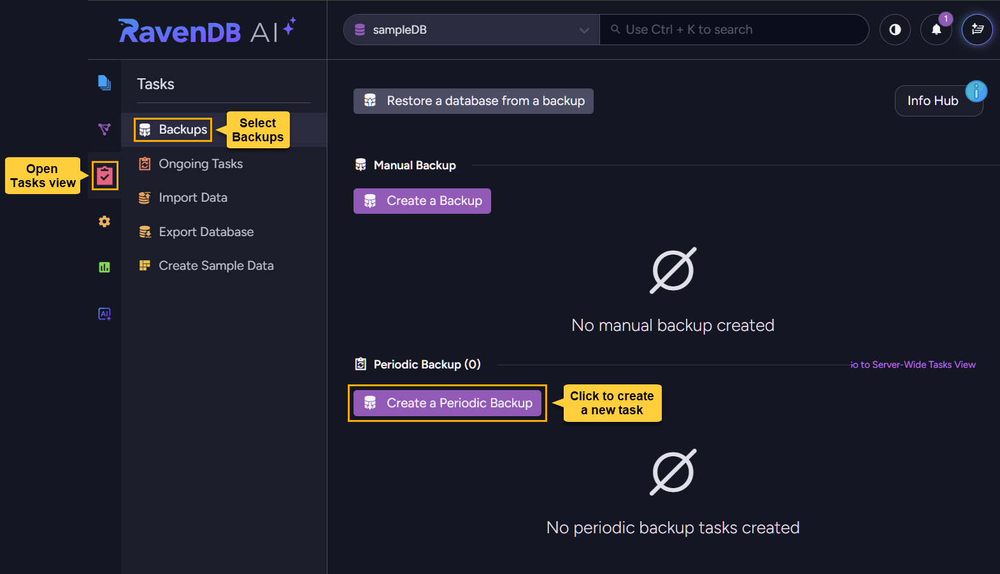

And then define and save the new task to start the backup schedule.

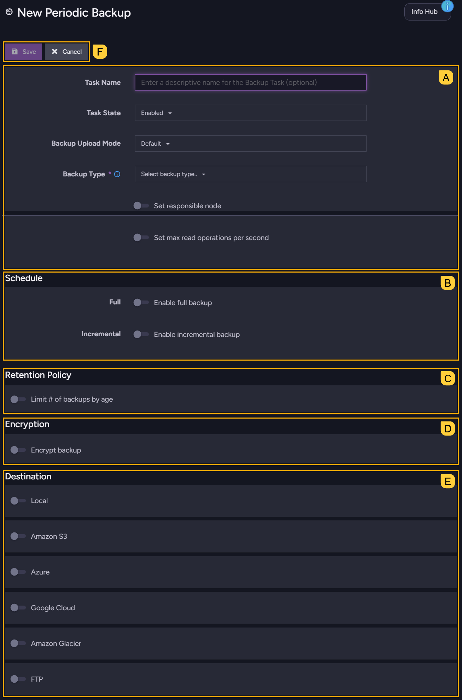
    
`A`. [Defining basic task options](../../../backup/create/periodic-tasks/database-backup#a-defining-basic-task-options)  
`B`. [Scheduling full and incremental backups](../../../backup/create/periodic-tasks/database-backup#b-scheduling-full-and-incremental-backups)  
`C`. [Setting backups retention policy](../../../backup/create/periodic-tasks/database-backup#c-setting-backups-retention-policy)  
`D`. [Setting backup encryption options](../../../backup/create/periodic-tasks/database-backup#d-setting-backup-encryption-options)  
`E`. [Choosing where to store the backups](../../../backup/create/periodic-tasks/database-backup#e-choosing-where-to-store-the-backups)  
`F`. [Saving and managing the task](../../../backup/create/periodic-tasks/database-backup#f-saving-and-managing-the-task)

---

<ContentFrame>

### A. Defining basic task options

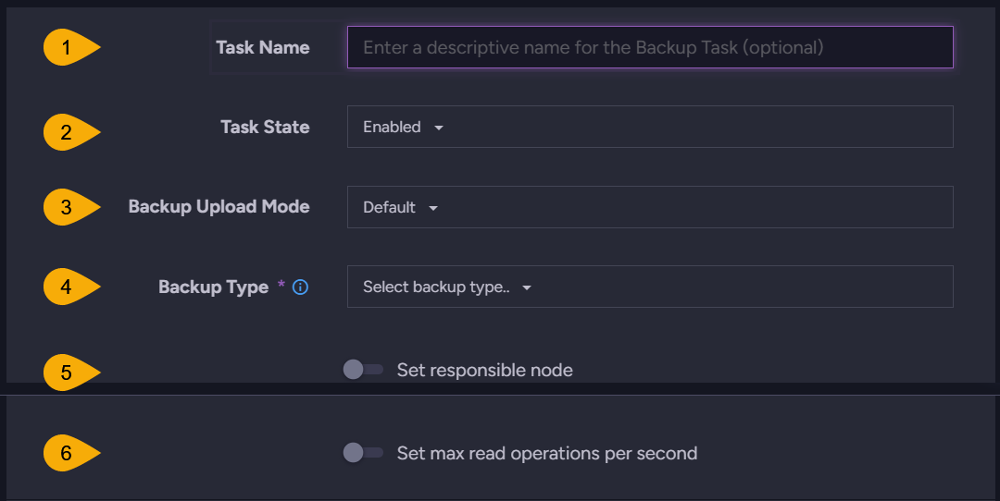

1. **Task name**  
   Enter a name for the task.  
   If no name is provided, RavenDB will automatically assemble a name from the backup type and destination, e.g., `Backup to Azure`.  

2. **Task state**  
   The task can be enabled or disabled at creation or later on.  
   e.g., you may want to disable the task when an upcoming maintenance operation is planned.

3. **Backup upload mode**  
   Select the preferred upload mode:
    - **Default** - store backups locally before uploading them to their destinations.  
      Storing backups locally provides a safety measure in case that uploading to the remote destination fails.  
    - **Direct upload** - upload backups directly to their destinations without storing locally.  
      Direct upload can be used, for example, when the local storage space is limited.  

4. **Backup type**  
   Select the type of backup to create:
    - **Backup** - create [logical backups](../../../backup/overview#logical-backup).  
    - **Snapshot** - create [snapshot images](../../../backup/overview#snapshot-image).  
      Note that though **full** backups can be in JSON (logical backups) or binary (snapshot images) format, subsequent **incremental** backups are always JSON-based.  

      When **snapshot** is selected, a few additional options are available:  
      - **Compression algorithm**  
        Defines the compression algorithm used for snapshot images.  
        Available algorithms are `Zstd` and `Deflate`.
      - **Compression level**  
        Defines the level of compression applied to snapshot images.  
        Options include:  
        `No Compression`: No compression applied  
        `Fastest`: Prioritizes speed, resulting in larger image files  
        `Optimal`: Balances compression efficiency and CPU usage  
        `Smallest size`: Achieves the smallest image size at the highest CPU cost.
      - **Exclude indexes**  
        Enable this option to exclude index data from snapshots, reducing image size and transfer time.  
        Note that this will increase restore time, as indexes will need to be recreated from their definitions and rebuilt by indexing all documents relevant to each index.

5. **Set responsible node**  
     Select the cluster node that will be responsible for this Backup Task  
     If no node is selected, the responsible node will be assigned by the cluster.

6. **Set max read operations per second**  
     Enter the maximum number of read operations per second that the task is allowed to make during backup.  
     Setting a read operations limit can reduce the impact of backup operations on server performance.  
   
</ContentFrame>

<ContentFrame>

### B. Scheduling full and incremental backups
   
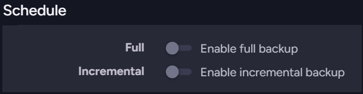   
   
* **Full**  
  Set the frequency for full backups creation.  
  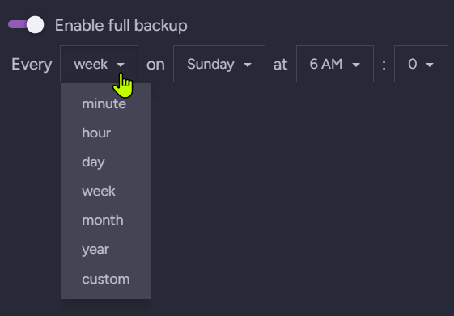
   - Select a time unit (`year`/`month`/`week`/`day`/`hour`/`minute`) to schedule backups by date, day of the week, daily hour, or minute.  
   - Select **custom** to schedule the backup using a [cron expression](https://en.wikipedia.org/wiki/Cron).  
     e.g., to generate a full backup every 6 hours, select `custom` and enter `0 */6 * * *`.
       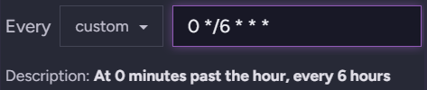
* **Incremental**  
  Set the frequency for incremental backups creation using time units or a custom [cron expression](https://en.wikipedia.org/wiki/Cron), as explained above for full backups.  
  <Admonition type="note" title="">
  Note that if your **full** and **incremental** backup schedules overlap, a full backup will be created at that time, and the incremental backup will be skipped.
  </Admonition>
   
</ContentFrame>

<ContentFrame>

### C. Setting backups retention policy

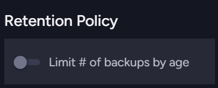

Enable `Limit # of backups by age` to set a retention policy, and set a retention period.  

* Backups whose age exceeds the set retention period will be **automatically deleted** on the next backup task run.  
* Note that the retention policy treats a **full backup** and its **incremental backups** as one unit, and will delete them all at the same time when the newest incremental backup in the group exceeds the retention period.

</ContentFrame>

<ContentFrame>

### D. Setting backup encryption options

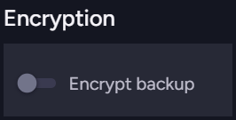

<Admonition type="note" title="">
Use this section to configure encryption options for **logical backups** (when the selected backup type is **backup**).  

* These settings do not apply to **snapshots** because snapshots are exact replicas of the database and automatically reflect its encryption:  
  - If the database is **encrypted**, snapshots are encrypted as well, using the database encryption key.  
  - If the database is **not encrypted**, snapshots are not encrypted either.  

* **Logical backups**, on the other hand, can be encrypted or unencrypted **regardless** of the database encryption. You can configure the backup task to:  
   - Create **unencrypted** backups, even if the database is encrypted.
   - **Encrypt** backups for an **encrypted database** using either the database encryption key or your own encryption key.  
   - **Encrypt** backups for an **unencrypted database** using your own encryption key.  
</Admonition>

---

#### Creating non-encrypted logical backups:

* To create non-encrypted backups, disable the `Encrypt backup` option.  

  

* If you disable backups encryption on an **encrypted database**, a confirmation button will appear so you can affirm your choice, as creating non-encrypted backups for an encrypted database **may have security implications**.  

  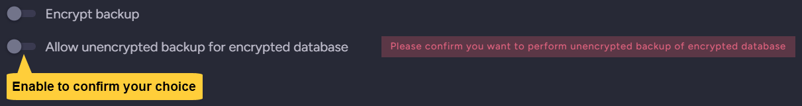

---

#### Creating encrypted logical backups:

* To create encrypted backups, enable the `Encrypt backup` option.  

  

* If the [database is encrypted](../../../studio/database/create-new-database/encrypted), you will be given the choice to use either the database encryption key or your own encryption key.  
  
   - Use the database encryption key for simplicity, as you won't need to manage a separate encryption key for backups.
     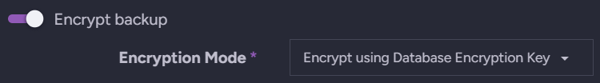

   - Or use your own encryption key for more control over backup encryption, e.g., to use a different key rotation policy for backups than for the database.  
     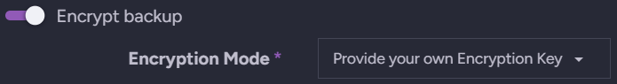

     You will be given access to a key generator to create a strong encryption key, either use it or provide your own Base64 key.  
     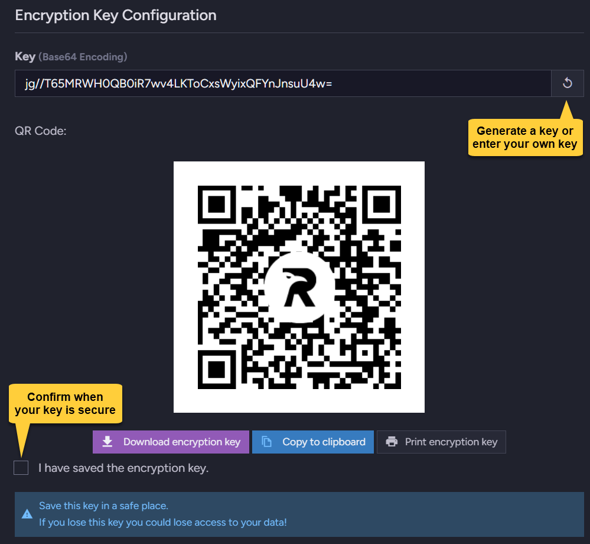

     <Admonition type="warning" title="">
     Be sure to secure your encryption key, as without it you will not be able to restore your backups!
     </Admonition>

* If the database is **not encrypted**, you can still generate or enter your own key to encrypt the backups.  

</ContentFrame>

<ContentFrame>

### E. Choosing where to store the backups

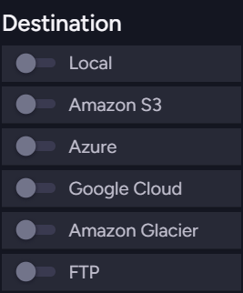

You can select one or more storage locations for your backups, both local and remote.  

* Each storage location has its own specific settings to configure.  
  e.g., **Backup directory** for local storage or **Bucket name** for Amazon S3.  
  Be sure to fill in the required settings for each selected storage location.  

  

* The **Backup Upload Mode** setting defined [above](../../../backup/create/periodic-tasks/database-backup#a-defining-basic-task-options) applies to all remote storage locations, determining whether to store backups locally before transferring them to their destinations.

---

#### Overriding storage settings with an external script:

An **Override configuration via external script** option is available for each storage type.   
Enabling this option allows you to apply an external script that overrides the storage settings at runtime.  
This can be useful, for example, if you want to change the storage credentials often as a security measure.  

[Find a full explanation in the overview.](../../../backup/overview#overriding-storage-settings-with-an-external-script)

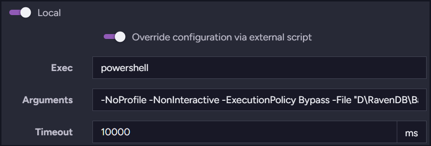
* **Exec** - The executor application that runs the external script.  
  e.g., `powershell`  
* **Arguments** - Flags or parameters required by the executor, including the path to the external script.  
  e.g.,  
  - Point the executor to a script kept in `D\RavenDB\Backups`:  
    ```
    -NoProfile -NonInteractive -ExecutionPolicy Bypass -File "D\RavenDB\Backups\local-settings.ps1"
    ```
  - Content of `local-settings.ps1`, which outputs the local storage path in JSON format:  
    ```powershell
    @{ FolderPath = "D:\RavenDB\Backups\fullBackups" } | ConvertTo-Json -Compress
    ```
* **Timeout** - The maximum time (in ms) that RavenDB will wait for the script execution to return the JSON output.  
  If the time limit is exceeded, the backup operation will **fail**.  
  e.g., `10000`

</ContentFrame>

<ContentFrame>

### F. Saving and managing the task


**Save** your task to create it on the server and start the backup schedule,  
or **Cancel** to discard your changes.  

After saving the task, it is listed at **Tasks** `>` **Backups**, where you can:  
 - View and expand task details.  
 - Open tasks for editing.  
 - Enable or disable tasks.  
 - Run a backup operation immediately outside of its task schedule.  
 - Delete tasks.  

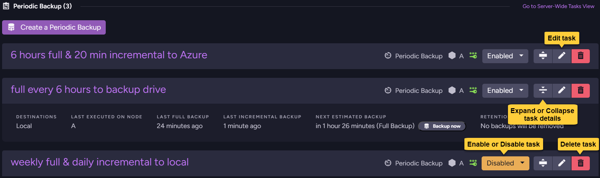

</ContentFrame>

---

## Running a backup operation immediately

<ContentFrame>

You can use a defined periodic backup task to create a backup immediately, outside of the tasks's defined schedule.  
To do this, locate the task in **Tasks** `>` **Backups**, expand its details bar, and click **Backup now**.

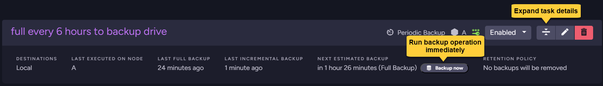

You will be given the option to create a full or an incremental backup immediately, based on the task configuration.


</ContentFrame>

---

## Delaying or aborting a running backup operation

<ContentFrame>

To delay or abort a running backup operation (e.g., when a backup takes longer than expected or you need to free up server resources), open the notifications center and find the notification added for the running backup operation.  

* To **abort** the operation, click the notification's **Abort** button.  
  

* To **delay** the operation:  
   - Click the notification's **Details** button.  
    
   - When the operation details view opens, click the **Delay backup** button at the bottom and select the delay duration. The backup operation will resume when the set period elapses.  
    

</ContentFrame>

</Panel>