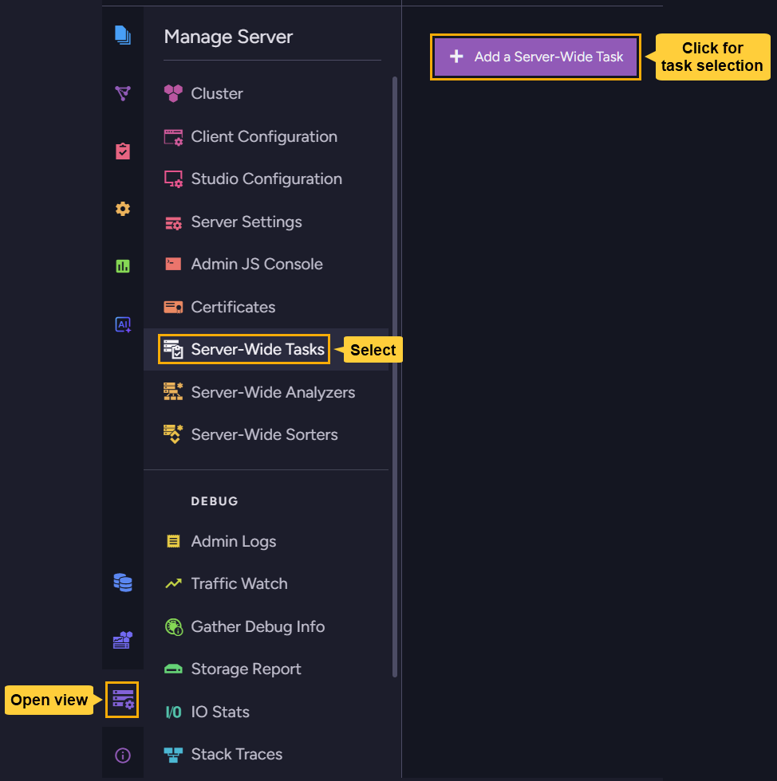
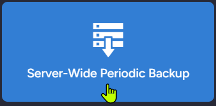
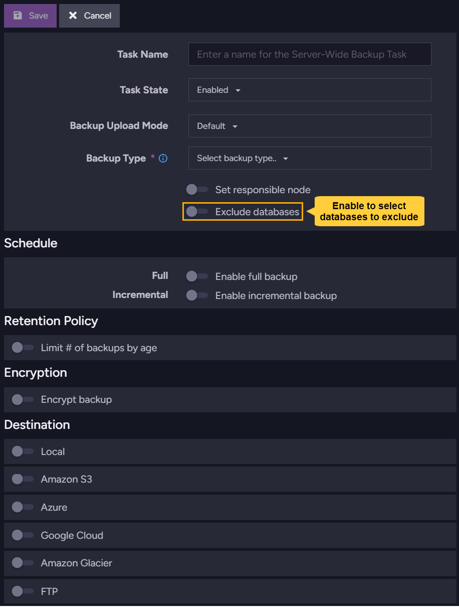
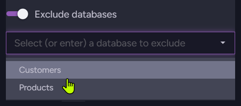
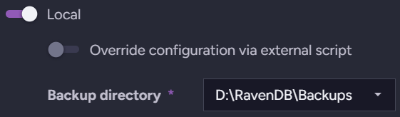
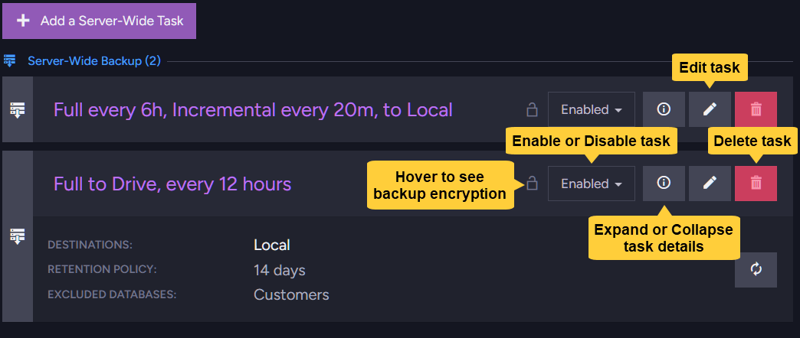
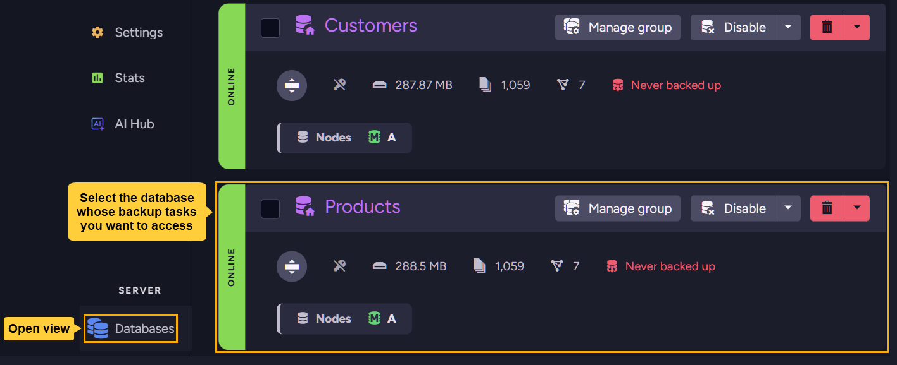
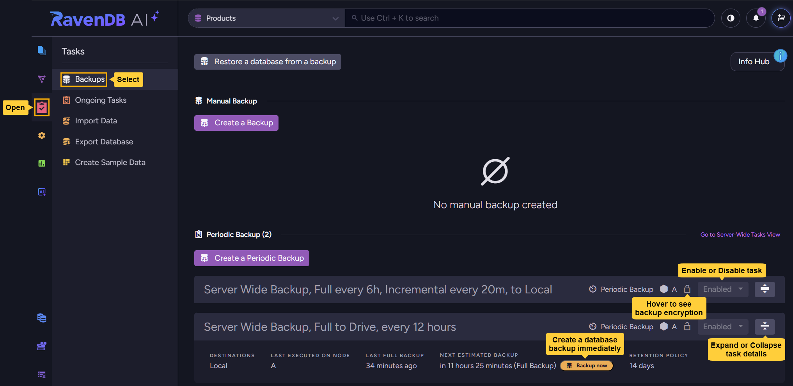
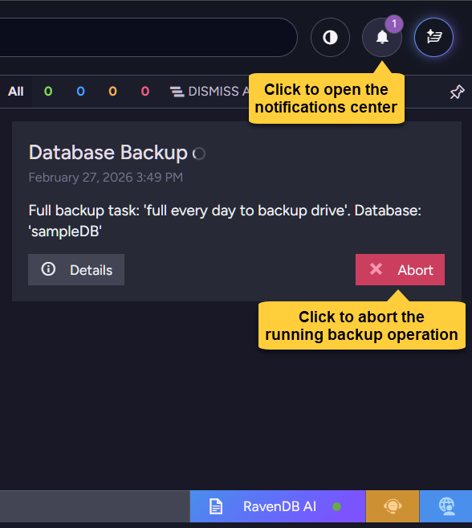
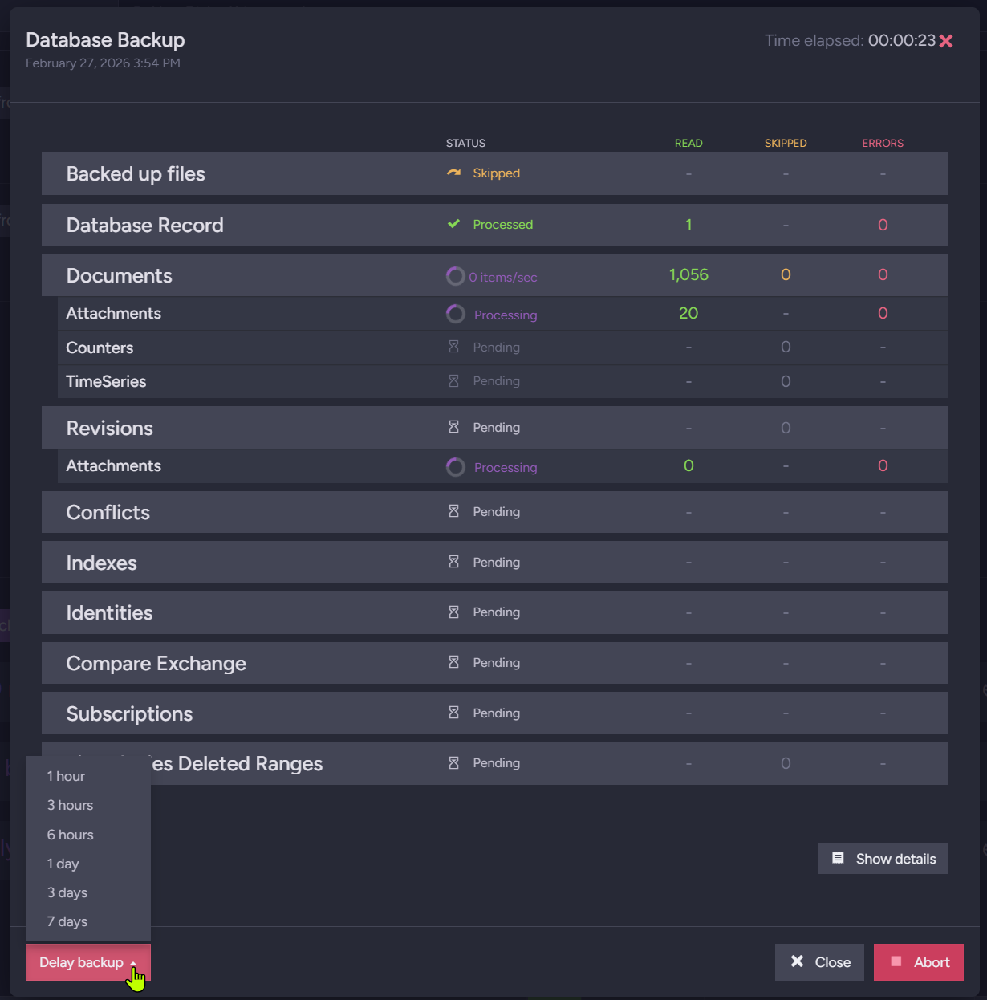

import Admonition from '@theme/Admonition';
import Tabs from '@theme/Tabs';
import TabItem from '@theme/TabItem';
import CodeBlock from '@theme/CodeBlock';
import LanguageSwitcher from "@site/src/components/LanguageSwitcher";
import LanguageContent from "@site/src/components/LanguageContent";
import Panel from "@site/src/components/Panel";
import ContentFrame from "@site/src/components/ContentFrame";

# Periodic server-wide backup tasks

<Admonition type="note" title="">

* A server-wide backup task is a **backup configuration template** that you can populate with your backup preferences.  
  - Once saved, the server applies your configuration by creating individual per-database backup tasks for **all databases on the server** except those **explicitly excluded** in the configuration.  
  - An individual database backup task will also be automatically added to any database created **after** defining a server-wide backup task.  
  <br />
  <Admonition type="tip" title="">
  Creating a server-wide backup task is useful when you want to define a backup configuration once and apply it to multiple databases, instead of manually creating an individual backup task for each database.
  </Admonition>

* This article explains how to create and manage a server-wide backup configuration and its derived database tasks.  
  For detailed guidance on backup configuration options (such as backup types, scope, scheduling, storage, retention policy, and encryption), see the [periodic database-backup task](../../../backup/create/periodic-tasks/database-backup) article.  

* Each derived database task acts as a regular periodic database-backup task. You can access each task to check its latest and next scheduled backups, or to trigger an immediate database backup.

* The derived database tasks continue to share the configuration defined by the server-wide template.  
   - Modifying the configuration or excluding databases from the backup can only be done through the parent server-wide task.  
   - Deleting the server-wide task will remove all derived database tasks.  

* In this article:  
  * [Creating and managing server-wide backup tasks using the client API](../../../backup/create/periodic-tasks/server-wide-backup#creating-and-managing-server-wide-backup-tasks-using-the-client-api)
     * [Creating a server-wide backup task](../../../backup/create/periodic-tasks/server-wide-backup#creating-a-server-wide-backup-task)
     * [Updating a server-wide backup task](../../../backup/create/periodic-tasks/server-wide-backup#updating-a-server-wide-backup-task)
     * [Deleting a server-wide backup task](../../../backup/create/periodic-tasks/server-wide-backup#deleting-a-server-wide-backup-task)
     * [Managing backup operations](../../../backup/create/periodic-tasks/server-wide-backup#managing-backup-operations)
        * [Triggering an immediate backup operation](../../../backup/create/periodic-tasks/server-wide-backup#triggering-an-immediate-backup-operation)
        * [Delaying a running backup operation](../../../backup/create/periodic-tasks/server-wide-backup#delaying-a-running-backup-operation)
        * [Aborting a running backup operation](../../../backup/create/periodic-tasks/server-wide-backup#aborting-a-running-backup-operation)
     * [Syntax](../../../backup/create/periodic-tasks/server-wide-backup#syntax)
        * [Backup configuration classes](../../../backup/create/periodic-tasks/server-wide-backup#backup-configuration-classes)
        * [Classes and enums used in the backup configuration](../../../backup/create/periodic-tasks/server-wide-backup#classes-and-enums-used-in-the-backup-configuration)
        * [Backup destinations classes](../../../backup/create/periodic-tasks/server-wide-backup#backup-destinations-classes)

  * [Creating and managing server-wide backup tasks via Studio](../../../backup/create/periodic-tasks/server-wide-backup#creating-and-managing-server-wide-backup-tasks-via-studio)
     * [Creating a server-wide backup task](../../../backup/create/periodic-tasks/server-wide-backup#creating-a-server-wide-backup-task)
     * [Managing server-wide tasks](../../../backup/create/periodic-tasks/server-wide-backup#managing-server-wide-tasks)
        - [Managing the parent server-wide task](../../../backup/create/periodic-tasks/server-wide-backup#managing-the-parent-server-wide-task)
        - [Managing derived database tasks](../../../backup/create/periodic-tasks/server-wide-backup#managing-derived-database-tasks)
            - [Triggering an immediate backup operation](../../../backup/create/periodic-tasks/server-wide-backup#triggering-an-immediate-backup-operation)
    - [Delaying or aborting a running backup operation](../../../backup/create/periodic-tasks/server-wide-backup#delaying-or-aborting-a-running-backup-operation)

</Admonition>

<Panel heading="Creating and managing server-wide backup tasks using the client API">

<ContentFrame>

## Creating a server-wide backup task

To create a server-wide backup task:  
* Define a **backup configuration** using a `ServerWideBackupConfiguration` instance.  
   - `ServerWideBackupConfiguration` inherits from [PeriodicBackupConfiguration](../../../backup/create/periodic-tasks/server-wide-backup#backup-configuration-classes), which defines all configuration options used by both server-wide and regular database backup tasks.  
     See the [periodic database backup task](../../../backup/create/periodic-tasks/database-backup) article for guidance about these options.  
   - `ServerWideBackupConfiguration` adds the following server-wide-specific property:  
     - `ExcludedDatabases` - A list of databases to [exclude](../../../backup/overview#excluding-databases-from-the-backup) from the server-wide backup.  
  
* Pass your populated instance to `PutServerWideBackupConfigurationOperation` to register the server-wide task, create the derived database tasks, and schedule the backup routine for each database.  

* **Example**:  
  ```csharp
  var serverWideBackupConfiguration = new ServerWideBackupConfiguration
  {
      // Task is enabled
      Disabled = false,

      // Task name 
      Name = "FullAndIncrementalBackup",

      // Create a logical backup
      BackupType = BackupType.Backup,

      // Run a full backup every 6 hours
      FullBackupFrequency = "0 */6 * * *",

      // Run an incremental backup every 20 minutes
      IncrementalBackupFrequency = "*/20 * * * *",

      // Keep backups locally
      LocalSettings = new LocalSettings
      {
          FolderPath = backupPath
      },

      // Also upload backups to Azure
      AzureSettings = new AzureSettings
      {
          // Use your Azure credentials here
      },

      // Keep backups for 7 days
      RetentionPolicy = new RetentionPolicy
      {
          Disabled = false,
          MinimumBackupAgeToKeep = TimeSpan.FromDays(7)
      },

      // Encrypt backups using a user-provided Base64 key
      BackupEncryptionSettings = new BackupEncryptionSettings
      {
          EncryptionMode = EncryptionMode.UseProvidedKey,
          Key = "OI7Vll7DroXdUORtc6Uo64wdAk1W0Db9ExXXgcg5IUs="
      },

      // Exclude the Customers database from the server-wide backup
      ExcludedDatabases = new[] 
      { 
          "Customers"
      }
  };

  // Create the server-wide task
  var result = await store.Maintenance.Server.SendAsync(
      new PutServerWideBackupConfigurationOperation(
          serverWideBackupConfiguration));
  ```

</ContentFrame>

<ContentFrame>

## Updating a server-wide backup task

To update an existing backup task:  
- Retrieve the server-wide task configuration that you want to update.  
   - Use `GetServerWideBackupConfigurationOperation` to retrieve a **single** configuration by name,  
   - Or use `GetServerWideBackupConfigurationsOperation` to retrieve **all** existing configurations and select the one you want by a property of your choice.
- Modify the configuration without changing the existing `TaskId`.  
- Use `PutServerWideBackupConfigurationOperation` to apply the modified configuration.  

#### Example:

<Tabs groupId='update-server-wide-backup'>
<TabItem value="Retrieve a single configuration" label="Retrieve a single configuration">

```csharp
// Retrieve existing configuration by name
var existing = await store.Maintenance.Server.SendAsync(
    new GetServerWideBackupConfigurationOperation("FullAndIncrementalBackup"));

// Ensure the task exists
Assert.NotNull(existing);

// Update by modifying the retrieved instance
existing.FullBackupFrequency = "0 */7 * * *";
existing.IncrementalBackupFrequency = "*/20 * * * *";

// Send update
await store.Maintenance.Server.SendAsync(
    new PutServerWideBackupConfigurationOperation(existing));
```
</TabItem>
<TabItem value="Retrieve all configurations and select one" label="Retrieve all configurations and select one">

```csharp
// Retrieve all server-wide backup configurations
var serverWideBackups = await store.Maintenance.Server.SendAsync(
new GetServerWideBackupConfigurationsOperation());

// Select a configuration by a property (FullBackupFrequency in this example)
var existing = serverWideBackups.FirstOrDefault(x => x.FullBackupFrequency == "0 */7 * * *");

Assert.NotNull(existing);

// Update by modifying the retrieved instance (keeping the TaskId unchanged)
existing.FullBackupFrequency = "0 */8 * * *";
existing.IncrementalBackupFrequency = "*/30 * * * *";

// Send update
await store.Maintenance.Server.SendAsync(
    new PutServerWideBackupConfigurationOperation(existing));
```
</TabItem>
</Tabs>

</ContentFrame>

<ContentFrame>

## Deleting a server-wide backup task

To delete a server-wide backup task:
- Use `DeleteServerWideTaskOperation` and pass the name of the server-wide backup task you want to delete.

#### Example:
```csharp
// Delete a server-wide backup task by name
await store.Maintenance.Server.SendAsync(
    new DeleteServerWideTaskOperation("FullAndIncrementalBackup", OngoingTaskType.Backup));
```

</ContentFrame>


---

## Managing backup operations

After defining a server-wide task, its derived database tasks start executing **backup operations** as scheduled.  
For any derived database task, you can:  
- Trigger the **immediate execution** of a backup operation, outside of its task schedule.  
- **Delay a backup operation** that the task has already started.  
- **Abort a backup operation** that the task has already started.  

<ContentFrame>

### Triggering an immediate backup operation

To back up a database immediately using a derived database task:  
- Pass `PutServerWideBackupConfigurationCommand.GetTaskName` the server-wide task name,  
  to get the derived task name.  
- Pass `GetOngoingTaskInfoOperation` the derived task name,  
  to get the derived task info.  
- Pass `StartBackupOperation` the derived task ID,  
  to trigger an immediate backup.

#### Example:  
```csharp
// Database name
var databaseName = "Products";

// Server-wide task name
var serverWideTaskName = "DailyBackup";

// Pass the server-wide task name to get the derived task name
var derivedTaskName = PutServerWideBackupConfigurationCommand.GetTaskName(serverWideTaskName);

// Pass the derived task name to get the derived task info
var derivedDatabaseTask = await store.Maintenance.ForDatabase(databaseName).SendAsync(
    new GetOngoingTaskInfoOperation(derivedTaskName, OngoingTaskType.Backup)) as OngoingTaskBackup;

// Ensure the derived task exists for the chosen database
if (derivedDatabaseTask == null)
{
    throw new InvalidOperationException($"The server-wide periodic backup task '{derivedTaskName}' " +
        $"is not found in database '{databaseName}'.");
}

// Get the TaskId of the derived task
long derivedDatabaseTaskId = derivedDatabaseTask.TaskId;

// Decide whether to run full or incremental backup
bool isFullBackup = true;

// Create backup immediately for the chosen database
Operation<StartBackupOperationResult> backupOperation = await store.Maintenance.ForDatabase(databaseName).SendAsync(
    new StartBackupOperation(isFullBackup, derivedDatabaseTaskId));
```
<br />
#### `StartBackupOperation`:  
```csharp
public StartBackupOperation(bool isFullBackup, long taskId)
```
<br />
| Parameter | Type | Description |
|-----------|------|-------------|
| **isFullBackup** | `bool` | `true` - create a full backup<br />`false` - create an incremental backup |
| **taskId** | `long` | The ID of the periodic backup task to use when creating the backup. |

</ContentFrame>

<ContentFrame>

### Delaying a running backup operation

To delay the execution of a **currently running** backup operation:  
- Pass `PutServerWideBackupConfigurationCommand.GetTaskName` the server-wide task name,  
  to get the derived task name.  
- Pass `GetOngoingTaskInfoOperation` the derived task name,  
  to get the derived task info.  
- Ensure that the derived task exists on the chosen database (not `null`),  
  and there is a running backup operation (`OnGoingBackup` is not `null`).  
- Pass `DelayBackupOperation` the operation ID and the delay duration to delay the backup operation.

#### Example:
```csharp
// The database name
var databaseName = "Products";

// Pass the server-wide task name to get the derived task name 
var derivedTaskName = PutServerWideBackupConfigurationCommand.GetTaskName(serverWideTaskName);

// Pass the derived task name to get the derived task info
var derivedTask = await store.Maintenance.ForDatabase(databaseName).SendAsync(
    new GetOngoingTaskInfoOperation(derivedTaskName, OngoingTaskType.Backup)) as OngoingTaskBackup;

// Ensure the derived task exists
if (derivedTask == null)
{
    throw new InvalidOperationException($"The server-wide periodic backup task '{derivedTaskName}' " +
        $"is not found in database '{databaseName}'.");
}

// Ensure there is a running backup operation
if (derivedTask.OnGoingBackup == null)
{
    throw new InvalidOperationException("No running backup operation to delay.");
}

// Delay duration
var delayDuration = TimeSpan.FromHours(1);

// Delay the running backup operation
await store.Maintenance.ForDatabase(databaseName).SendAsync(new DelayBackupOperation(
    derivedTask.OnGoingBackup.RunningBackupTaskId,
    delayDuration));
```

</ContentFrame>

<ContentFrame>

### Aborting a running backup operation

* To abort a periodic backup that was started by its derived task **as scheduled**:  
   - Pass `PutServerWideBackupConfigurationCommand.GetTaskName` the server-wide task name,  
     to get the derived task name.  
   - Pass `GetOngoingTaskInfoOperation` the derived task name,  
     to get the derived task info.  
   - Ensure that the derived task exists on the chosen database (not `null`),  
     and there is a running backup operation (`OnGoingBackup` is not `null`).  
   - Pass `KillOperationCommand` the operation ID to abort the backup operation.
  
  **Example**:  
  ```csharp
  var databaseName = "Products";

  // Pass the server-wide task name to get the derived task name
  var derivedTaskName = PutServerWideBackupConfigurationCommand.GetTaskName(serverWideTaskName);

  // Pass the derived task name to get the derived task info
  var derivedTask = await store.Maintenance.ForDatabase(databaseName).SendAsync(
      new GetOngoingTaskInfoOperation(derivedTaskName, OngoingTaskType.Backup)) as OngoingTaskBackup;

  // Ensure the derived task exists
  if (derivedTask == null)
  {
      throw new InvalidOperationException($"The server-wide periodic backup task '{derivedTaskName}' " +
          $"is not found in database '{databaseName}'.");
  }

  // Ensure there is a running backup operation
  if (derivedTask.OnGoingBackup == null)
  {
      throw new InvalidOperationException("No running backup operation to abort.");
  }

  // Abort the backup by killing the running operation 
  await store.Commands(databaseName).ExecuteAsync(
  new KillOperationCommand(derivedTask.OnGoingBackup.RunningBackupTaskId));
  ```

* To abort a backup that was triggered **manually** using `StartBackupOperation`:  
  - Extract the backup operation ID from the result returned by `StartBackupOperation`.  
   - Use the backup operation ID to abort the operation.  
   - Also extract and use the responsible node tag to ensure that the operation is aborted on the correct cluster node.  
  
  **Example:**  
  ```csharp
  // Database name
  var databaseName = "Products";

  // Server-wide task name
  var serverWideTaskName = "DailyBackup";

  // Pass the server-wide task name to get the derived task name
  var derivedTaskName = PutServerWideBackupConfigurationCommand.GetTaskName(serverWideTaskName);

  // Pass the derived task name to get the derived task info
  var derivedDatabaseTask = await store.Maintenance.ForDatabase(databaseName).SendAsync(
      new GetOngoingTaskInfoOperation(derivedTaskName, OngoingTaskType.Backup)) as OngoingTaskBackup;

  // Ensure the derived task exists for the chosen database
  if (derivedDatabaseTask == null)
  {
      throw new InvalidOperationException($"The server-wide periodic backup task '{derivedTaskName}' " +
          $"is not found in database '{databaseName}'.");
  }

  // Get the TaskId of the derived task
  long derivedDatabaseTaskId = derivedDatabaseTask.TaskId;

  // Decide whether to run full or incremental backup
  bool isFullBackup = true;

  // Create backup immediately for the chosen database
  Operation<StartBackupOperationResult> backupOperation = await store.Maintenance.ForDatabase(databaseName).SendAsync(
      new StartBackupOperation(isFullBackup, derivedDatabaseTaskId));

  // Kill the running operation by id, routed to the owning node
  long backupOperationId = backupOperation.Id;
  string nodeTag = backupOperation.NodeTag;

  await store.Commands(databaseName).ExecuteAsync(
      new KillOperationCommand(backupOperationId, nodeTag));
  ```

---

<Admonition type="note" title="">

Note that after aborting the backup operation, you may need to **manually clean up**:  
* Partial **local** files, left while creating the backup.  
* Partial or temporary **remote** uploads.  
</Admonition>


</ContentFrame>

---

## Syntax

<ContentFrame>

### Backup configuration classes

<Tabs groupId='configuration'>
<TabItem value="ServerWideBackupConfiguration" label="ServerWideBackupConfiguration">

**Server-wide backup configuration**
```csharp
class ServerWideBackupConfiguration : PeriodicBackupConfiguration, IServerWideTask
{
    string[] ExcludedDatabases
}
```
<br />
| Property | Type | Description |
|------------------|-----------------|-------------|
| **ExcludedDatabases** | `string[]` | The list of databases excluded from the server-wide backup. |

</TabItem>
<TabItem value="PeriodicBackupConfiguration" label="PeriodicBackupConfiguration">

**Periodic backup configuration**
```csharp
class PeriodicBackupConfiguration : BackupConfiguration
{
    string Name
    long TaskId
    bool Disabled
    string MentorNode
    bool PinToMentorNode
    RetentionPolicy RetentionPolicy
    DateTime? CreatedAt
    string FullBackupFrequency
    string IncrementalBackupFrequency
}
```
<br />
| Property | Type | Description |
|------------------|-----------------|-------------|
| **Name** | `string` | The name of the periodic backup task. |
| **TaskId** | `long` | The unique identifier for the backup task. |
| **Disabled** | `bool` | Indicates whether the backup task is disabled. |
| **MentorNode** | `string` | The mentor node responsible for executing the backup task. |
| **PinToMentorNode** | `bool` | Determines if the backup task should always run on the mentor node. |
| **RetentionPolicy** | `RetentionPolicy` | The retention policy associated with the backup task. |
| **CreatedAt** | `DateTime?` | The timestamp when the backup task was created. |
| **FullBackupFrequency** | `string` | Frequency of full backup jobs in [cron](https://en.wikipedia.org/wiki/Cron) format. |
| **IncrementalBackupFrequency** | `string` | Frequency of incremental backup jobs in [cron](https://en.wikipedia.org/wiki/Cron) format.<br />If set to `null`, incremental backup will be disabled. |

</TabItem>
<TabItem value="BackupConfiguration" label="BackupConfiguration">

**Backup configuration**
```csharp
class BackupConfiguration
{
    BackupType BackupType
    BackupUploadMode BackupUploadMode
    SnapshotSettings SnapshotSettings
    BackupEncryptionSettings BackupEncryptionSettings
    int? MaxReadOpsPerSecond
    LocalSettings LocalSettings
    S3Settings S3Settings
    GlacierSettings GlacierSettings
    AzureSettings AzureSettings
    FtpSettings FtpSettings
    GoogleCloudSettings GoogleCloudSettings
}
```
<br />
| Property                     | Type                     | Description |
|------------------------------|--------------------------|-----------------------------|
| **BackupType**               | `BackupType`            | Backup type (snapshot or logical backup) |
| **BackupUploadMode**         | `BackupUploadMode`      | Upload mode (via local storage or directly to destination) |
| **SnapshotSettings**         | `SnapshotSettings`      | Snapshot settings |
| **BackupEncryptionSettings** | `BackupEncryptionSettings` | Encryption settings |
| **MaxReadOpsPerSecond**      | `int?`                  | Maximum number of read operations per second allowed during backup. |
| **LocalSettings**            | `LocalSettings`         | Local storage settings |
| **S3Settings**               | `S3Settings`            | Amazon S3 backup settings |
| **GlacierSettings**          | `GlacierSettings`       | Amazon Glacier backup settings |
| **AzureSettings**            | `AzureSettings`         | Azure backup settings |
| **FtpSettings**              | `FtpSettings`           | FTP-based backup settings |
| **GoogleCloudSettings**      | `GoogleCloudSettings`   | Google Cloud backup settings |

</TabItem>
</Tabs>

---

### Classes and enums used in the backup configuration

<Tabs groupId='additional-classes'>
<TabItem value="RetentionPolicy" label="RetentionPolicy">

A backup configuration property that defines backups **retention policy**.
```csharp
class RetentionPolicy
{
    bool Disabled
    TimeSpan? MinimumBackupAgeToKeep
}
```
<br />
| Property | Type | Description |
|------------------|-----------------|-------------|
| **Disabled** | `bool` | Indicates whether the retention policy is disabled.<br />Default: `false` |
| **MinimumBackupAgeToKeep** | `TimeSpan?` | The retention threshold.<br />Backups older than this age will be deleted. |

</TabItem>
<TabItem value="BackupType" label="BackupType">

A backup configuration property that defines the **backup type**.
```csharp
enum BackupType
{
    Backup,
    Snapshot
}
```
<br />
| Property | Description |
|----------|-------------|
| **Backup** | Logical backup |
| **Snapshot** | Snapshot image |

</TabItem>
<TabItem value="BackupUploadMode" label="BackupUploadMode">

A backup configuration property that defines the backups **upload mode**.
```csharp
enum BackupUploadMode
{
    Default,
    DirectUpload
}
```
<br />
| Property | Description |
|----------|-------------|
| **Default** | Store backup in local path and then upload to the destination |
| **DirectUpload** | Upload backup directly to the destination without storing locally |


</TabItem>
<TabItem value="SnapshotSettings" label="SnapshotSettings">

A backup configuration property that defines **snapshot images settings**.
```csharp
class SnapshotSettings
{
    SnapshotBackupCompressionAlgorithm? CompressionAlgorithm
    CompressionLevel CompressionLevel
    bool ExcludeIndexes
}
```
<br />
| Property | Type | Description |
|----------|------|-------------|
| **CompressionAlgorithm** | `SnapshotBackupCompressionAlgorithm?` | The compression algorithm used for the snapshot image.<br />`Zstd` or `Deflate` |
| **CompressionLevel** | `CompressionLevel` | The level of compression applied to the snapshot image.<br /> `Optimal`, `Fastest`, `NoCompression`, or `SmallestSize`|
| **ExcludeIndexes** | `bool` | Indicates whether indexes should be excluded from the snapshot image. |

</TabItem>
</Tabs>

---

<Tabs groupId='encryption-settings'>
<TabItem value="BackupEncryptionSettings" label="BackupEncryptionSettings">

A backup configuration property that defines **backup encryption settings**.
```csharp
class BackupEncryptionSettings
{
    string Key
    EncryptionMode EncryptionMode
}
```
<br />
| Property | Type | Description |
|----------|------|-------------|
| **Key** | `string` | An encryption key provided by the user.<br />Used only if `EncryptionMode.UseProvidedKey` is selected.<br />If `EncryptionMode.UseDatabaseKey` is selected, the database encryption key is used and **Key** is ignored. |
| **EncryptionMode** | `EncryptionMode` | The mode of encryption applied to the backup.<br />`None` - No encryption.<br />`UseDatabaseKey` - Use the database key for encryption.<br />`UseProvidedKey` - Use a key provided by the user. |

</TabItem>
<TabItem value="EncryptionMode" label="EncryptionMode">

A `BackupEncryptionSettings` property that defines the **encryption mode**.
```csharp
public enum EncryptionMode
{
  None,
  UseDatabaseKey,
  UseProvidedKey
}
```
<br />
| Property | Description |
|----------|-------------|
| **None** | No encryption. |
| **UseDatabaseKey** | Use the database key for encryption. |
| **UseProvidedKey** | Use a key provided by the user. |

</TabItem>
</Tabs>

---

### Backup destinations classes

<Tabs groupId='storage-settings'>
<TabItem value="LocalSettings" label="LocalSettings">

A backup configuration property that defines **local storage settings**.
```csharp
class LocalSettings : BackupSettings
{
    string FolderPath
    int? ShardNumber
}
```
<br />
| Property | Type | Description |
|----------|------|-----------------------------------------------------------------------------|
| **FolderPath** | `string` | [Path to a local folder](../../../backup/overview#upload-mode). |
| **ShardNumber** | `int?` | An optional shard number, so the backup can be kept in the local path of a specific shard when a [sharded database](../../../sharding/backup-and-restore/backup) is used. |

</TabItem>

<TabItem value="AzureSettings" label="AzureSettings">

A backup configuration property that defines **Azure Blob Storage settings**.
```csharp
class AzureSettings : BackupSettings
{
    string StorageContainer
    string RemoteFolderName
    string AccountName
    string AccountKey
    string SasToken
}
```
<br />
| Property | Type | Description |
|----------|------|-------------|
| **StorageContainer** | `string` | The Azure Blob Storage container name. |
| **RemoteFolderName** | `string` | A logical "folder" (prefix) inside the container. |
| **AccountName** | `string` | The storage account name. |
| **AccountKey** | `string` | The storage account access key. |
| **SasToken** | `string` | A Shared Access Signature token used instead of the access key. |

</TabItem>
<TabItem value="FtpSettings" label="FtpSettings">

A backup configuration property that defines **FTP storage settings**.
```csharp
class FtpSettings : BackupSettings
{
    string Url
    string UserName
    string Password
    string CertificateAsBase64
}
```
<br />
| Property | Type | Description |
|----------|------|-------------|
| **Url** | `string` | URL for the FTP endpoint that backups are sent to. |
| **UserName** | `string` | The FTP username. |
| **Password** | `string` | The FTP password. |
| **CertificateAsBase64** | `string` | A base64-encoded certificate to authenticate with when using FTPS. |

</TabItem>
<TabItem value="GoogleCloudSettings" label="GoogleCloudSettings">

A backup configuration property that defines **Google Cloud Storage settings**.
```csharp
class GoogleCloudSettings
{
    string BucketName
    string RemoteFolderName
    string GoogleCredentialsJson
}
```
<br />
| Property | Type | Description |
|----------|------|-------------|
| **BucketName** | `string` | The name of the Google Cloud Storage bucket that backups are sent to. |
| **RemoteFolderName** | `string` | A logical "folder" (prefix) inside the bucket. |
| **GoogleCredentialsJson** | `string` | The service account credentials JSON (as a string) used to authenticate RavenDB to the Google Cloud Storage. |

</TabItem>
</Tabs>

<Tabs groupId='AWSSettings'>
<TabItem value="S3Settings" label="S3Settings">

A backup configuration property that defines **Amazon S3 storage settings**.
```csharp
class S3Settings : AmazonSettings
{
    string BucketName
    string CustomServerUrl
    bool ForcePathStyle
    S3StorageClass? StorageClass
}
```
<br />
| Property | Type | Description |
|----------|------|-------------|
| **BucketName** | `string` | S3 Bucket name. |
| **CustomServerUrl** | `string` | Custom S3 server URL.<br />Used when targeting a custom server. |
| **ForcePathStyle** | `bool` | Force path style in HTTP requests.<br />`false` - use **virtual host style**.<br />`true` - use **path style**. |
| **StorageClass** | `S3StorageClass?` | Optional AWS S3 storage class for uploaded objects. |

</TabItem>
<TabItem value="GlacierSettings" label="GlacierSettings">

A backup configuration property that defines **Amazon Glacier storage settings**.
```csharp
class GlacierSettings : AmazonSettings
{
    string VaultName
}
```
<br />
| Property | Type | Description |
|----------|------|-------------|
| **VaultName** | `string` | Amazon Glacier Vault name. |

</TabItem>

<TabItem value="AmazonSettings" label="AmazonSettings">

A base class for **S3Settings** and **GlacierSettings**, providing additional AWS settings.
```csharp
class AmazonSettings : BackupSettings
{
public string AwsAccessKey
public string AwsSecretKey
public string AwsSessionToken
public string AwsRegionName
public string RemoteFolderName
}
```
<br />
| Property | Type | Description |
|----------|------|-------------|
| **AwsAccessKey** | `string` | The AWS access key (username part). |
| **AwsSecretKey** | `string` | The AWS secret key (password part). |
| **AwsSessionToken** | `string` | Optional session token. |
| **AwsRegionName** | `string` | AWS region identifier, e.g., `us-east-1`, used to route requests to the specified regional endpoint. |
| **RemoteFolderName** | `string` | A logical "folder" (prefix) inside the bucket or vault. |

</TabItem>
</Tabs>

<Tabs groupId='external-script'>
<TabItem value="BackupSettings" label="BackupSettings">

A base class for all backup destination settings classes.
```csharp
class BackupSettings
{
    bool Disabled
    GetBackupConfigurationScript GetBackupConfigurationScript
}
```
<br />
| Property | Type | Description |
|----------|------|-------------|
| **Disabled** | `bool` | Indicates whether this backup destination is disabled. |
| **GetBackupConfigurationScript** | `GetBackupConfigurationScript` | An optional script that provides storage settings at runtime, overriding task configuration storage settings (for a specific backup destination). |
</TabItem>

<TabItem value="GetBackupConfigurationScript" label="GetBackupConfigurationScript">

A class that defines an external script used to provide backup storage settings at runtime.
```csharp
public sealed class GetBackupConfigurationScript
{
    string Exec
    string Arguments
    int TimeoutInMs
}
```
<br />
| Property | Type | Description |
|----------|------|-------------|
| **Exec** | `string` | The script executor, e.g., `powershell`. |
| **Arguments** | `string` | Arguments to be used by the executor, including the path to the external script that provides storage settings (for a specific backup destination). |
| **TimeoutInMs** | `int` | Maximum time in milliseconds to wait for the script to return storage settings.<br />If the script does not return the storage settings within this time, the backup operation will be aborted. |
</TabItem>
</Tabs>


</ContentFrame>

</Panel>

<Panel heading="Creating and managing server-wide backup tasks via Studio">

<ContentFrame>

## Creating a server-wide backup task

To create a periodic server-wide backup task:  

* Open: **`Manage server` > `Server-wide tasks` > `Add a server-wide task`**  

  

* Pick `Server-wide periodic backup` to create your task.  

  

* Define the backup configuration as explained in the [periodic database-backup task](../../../backup/create/periodic-tasks/database-backup#a-defining-basic-task-options) article  
  and **exclude** any database that you don't want to schedule backups for.

  

  * **Exclude databases**  

    

    By default, the server will create a derived database backup task and schedule a backup routine for **all databases on the server**.  
    To exclude databases from the backup, enable the **Exclude databases** option and select the databases you want to exclude.  

  * **Backups storage**  

    

    Define a root storage location for backups created by all derived database tasks.  
    Each database task will automatically store its backups in a [subfolder named after the database](../../../backup/overview#backups-storage), under the root storage location.  

    e.g.,  
     - for a local folder, define `D:\RavenBackups` as the root storage location.  
       Backups for a database named `Products` will be stored in `D:\RavenBackups\Products`.  
     - for an FTP destination, define `ftp://myserver.com/backups` as the root storage location.  
       Backups for a database named `Products` will be sent to `ftp://myserver.com/backups/Products`.  
     - For an `S3` destination, define `ravendb/backups` as the root storage location.  
       Backups for a database named `Products` will be sent to `ravendb/backups/Products`.

  * **Encryption settings**  
    
    * When the database is **unencrypted**:  
      * **Snapshots** are **always unencrypted**.  
      * **Logical backups** are handled according to the server-wide task encryption settings:  
         * **Disable** encryption to produce unencrypted backups.  
         * **Enable** encryption and **provide an encryption key** to encrypt the backups.  

    * When the database is **encrypted**:  
      **Snapshots** and **logical backups** are both **always encrypted using the database key**.  
      <Admonition type="note" title="">
      Note that **logical backups** behave differently in this respect when created by a server-wide task vs a regular database backup task.  
      [See the server-wide encryption section in the overview for additional details.](../../../backup/overview#server-wide-encryption-settings)
      </Admonition>

* Save the server-wide task.  

  

  **Save** to store the task and create the derived database tasks,  
  or **Cancel** to discard the server-wide configuration.  


</ContentFrame>

---

## Managing server-wide tasks

<ContentFrame>

### Managing the parent server-wide task

To manage a saved server-wide task, open the **Manage server** view and select **Server-wide tasks**.  



You can:  
- **Edit** tasks.  
- **Enable** or **disable** tasks and all their derived database tasks.  
- **Delete** tasks and all their derived database tasks.  
- **View** task details, including -  
   - Whether backups are **encrypted**.  
   - Where backups are **stored**.  
   - The **retention period** for stored backups.  
   - Which databases are **excluded** from the backup.  

</ContentFrame>

---

<ContentFrame>

## Managing derived database tasks

To manage a database backup task derived from a server-wide task:  
- Select a database from the **Databases** view.  
  
- Open the **Tasks** view and select **Backups**.  
  The names of backup tasks derived from a server-wide configuration are automatically given a **Server Wide Backup** prefix.  

  

  You can:  
   - **Enable** or **disable** the database task.
   - **Create a backup immediately** for this database.
   - **View task details**, including:
      - The node responsible for the backup task.
      - The node where the task was last executed.
      - Whether backups are **encrypted**.
      - Where backups are **stored**.
      - Last and next scheduled backups.
      - The **retention period** for stored backups.  

  <Admonition type="note" title="">
  **Editing** and **deleting** the task are available only from the [parent server-wide task](../../../backup/create/periodic-tasks/server-wide-backup#managing-the-parent-server-wide-task).  
  </Admonition>

---

### Triggering an immediate backup operation

You can trigger the immediate creation of a backup for the database, without waiting for the next scheduled backup.  
- Expand the task details bar as seen above, and click **Backup now**.  
- You will be given the option to create a full or an incremental backup immediately, based on the server-wide task configuration.
  

</ContentFrame>

---

## Delaying or aborting a running backup operation

<ContentFrame>

To delay or abort a running backup operation (e.g., when a backup takes longer than expected or you need to free up server resources), open the notifications center and find the notification added for the running backup operation.  

* To **abort** the operation, click the notification's **Abort** button.  
  

* To **delay** the operation:  
   - Click the notification's **Details** button.  
    
   - When the operation details view opens, click the **Delay backup** button at the bottom and select the delay duration. The backup operation will resume when the set period elapses.  
    

</ContentFrame>

</Panel>