import Admonition from '@theme/Admonition';
import Tabs from '@theme/Tabs';
import TabItem from '@theme/TabItem';
import CodeBlock from '@theme/CodeBlock';
import LanguageSwitcher from "@site/src/components/LanguageSwitcher";
import LanguageContent from "@site/src/components/LanguageContent";
import Panel from "@site/src/components/Panel";
import ContentFrame from "@site/src/components/ContentFrame";

# Restore from backup

<Admonition type="note" title="">

* Restore a database from backup using Studio's restore wizard or the client API.  

* The restore operation will create a **new database**, load backup files from the backup folder you provide it, and populate the database with the [backed up content](../backup/overview#backup-content).  

* If your backup consists of full and incremental backup files, you can restore the database up to a specific point in time by selecting the last incremental backup file to restore.  

* On a [sharded](../sharding/overview.mdx) database, restore is performed per shard, using the backups created by the shards.  
  [Learn to restore a sharded database.](../sharding/backup-and-restore/restore.mdx)  

* In this article:  
  * [Restoring from backup using the client API](../backup/restore#restoring-from-backup-using-the-client-api)
     * [Restoring a database from backup](../backup/restore#restoring-a-database-from-backup)
     * [Key configuration settings](../backup/restore#key-configuration-settings)
        * [Setting restore points](../backup/restore#lastfilenametorestore---setting-restore-points)
        * [Encryption settings](../backup/restore#encryptionkey--backupencryptionsettings---encryption-settings)
        * [Backup location settings](../backup/restore#restorebackupconfiguration---backup-location-settings)
     * [Syntax](../backup/restore#syntax)
  * [Restoring from backup using Studio](../backup/restore#restoring-from-backup-using-studio)
      * [Set restore options](../backup/restore#set-restore-options)
  * [Restoring a database to multiple cluster nodes](../backup/restore#restoring-a-database-to-multiple-cluster-nodes)
     * [Restoring to a single node and replicating to additional nodes](../backup/restore#restoring-to-a-single-node-and-replicating-to-additional-nodes)
     * [Restoring to multiple nodes simultaneously](../backup/restore#restoring-to-multiple-nodes-simultaneously)
  * [Restoring from server-wide backups](../backup/restore#restoring-from-server-wide-backups)

</Admonition>

---

<Panel heading="Restoring from backup using the client API">

<ContentFrame>

## Restoring a database from backup

To restore a database from backup:  
 - Populate a restore configuration class instance with the restore settings.  
   The configuration class you choose depends on your backup location,  
   e.g., `RestoreBackupConfiguration` to restore from a local path, or `RestoreFromAzureConfiguration` to restore from an Azure Blob Storage.  
 - Pass the configuration instance to `RestoreBackupOperation` to run the restore operation.  

**Example:**  
```csharp
string backupLocation = @"D:\RavenDB\Backups";
string databaseName = "RestoredDatabase";

// Destination database encryption (encrypt restored DB)
string destinationDatabaseEncryptionKeyBase64 = "PUT_DESTINATION_DB_KEY_BASE64_HERE";

var restoreConfig = new RestoreBackupConfiguration
{
    DatabaseName = databaseName,
    BackupLocation = backupLocation,

    // Disable ongoing tasks so they won't run after restoring
    DisableOngoingTasks = true,

    // Restore index data
    SkipIndexes = false,

    // Provide key to encrypt the restored database
    EncryptionKey = destinationDatabaseEncryptionKeyBase64
};

// Start restore operation
var operation = await store.Maintenance.Server.SendAsync(new RestoreBackupOperation(restoreConfig));

// Wait for the restore operation to complete (or fail)
await operation.WaitForCompletionAsync(TimeSpan.FromMinutes(30));
```

<Admonition type="note" title="">

Note that `WaitForCompletionAsync` tracks the operation on the client side only.  
The restore operation will continue running on the server until it completes or fails, regardless of the client.  
</Admonition>

</ContentFrame>

---

<ContentFrame>

## Key configuration settings

---

#### LastFileNameToRestore - Setting restore points:

A backup folder contains a single full backup and any incremental backups created after it.  
For example:  
* `Products` database backups folder:  
  `2026-03-10-17-38-00.ravendb-Products-A-backup`
* Folder content:  
  `2026-03-10-17-38-00.ravendb-encrypted-full-backup`  
  `2026-03-10-18-38-00.ravendb-encrypted-incremental-backup`  
  `2026-03-10-19-38-22.ravendb-encrypted-incremental-backup`  
  `2026-03-10-20-38-00.ravendb-encrypted-incremental-backup`  
  `2026-03-10-21-38-31.ravendb-encrypted-incremental-backup`  

While restoring the database, the incremental backups can function as restore points, allowing you to restore the database up to a specific point in time.  

- To restore up to a specific point in time, set the restore configuration `LastFileNameToRestore` property with the name of the last backup file to restore.
- To restore **all** backup files, leave `LastFileNameToRestore` unset.  

**Example:**  
Restore the database up to (including) the 19:38 incremental backup.  
The 20:38 and 21:38 backups will be skipped.  

```csharp
var restoreConfig = new RestoreBackupConfiguration
{
    DatabaseName = "Products_Restored",
    BackupLocation = @"D:\RavenDB\Backups\2026-03-10-17-38-00.ravendb-Products-A-backup",

    // Restore the full backup + incrementals up to (and including) this file, then stop.
    LastFileNameToRestore = "2026-03-10-19-38-22.ravendb-encrypted-incremental-backup",

    DisableOngoingTasks = true
};

await store.Maintenance.Server
    .SendAsync(new RestoreBackupOperation(restoreConfig));
```

---

#### EncryptionKey & BackupEncryptionSettings - Encryption settings:

* `EncryptionKey`  
  Use this property to encrypt the new database.  
   * If `null`, the restored database will be unencrypted.  
   * If **set**, the restored database will be encrypted using the provided key.
  
   Note that `EncryptionKey` will be used only if the database is restored from a **logical backup**.  
   If the database is restored from a **snapshot**, its encryption is inherited from the snapshot:  
    - If the snapshot is not encrypted, the restored database will not be encrypted either.  
    - If the snapshot is encrypted, the database will be encrypted as well, using the same key as the snapshot.

* `BackupEncryptionSettings`  
  Use this property to **decrypt an encrypted backup**.  
  [See details in the syntax section.](../backup/restore#additional-restore-classes)

**Example:**  

```csharp
var restoreConfig = new RestoreBackupConfiguration
{
    // Provide user key to decrypt backup files
    BackupEncryptionSettings = new BackupEncryptionSettings
    {
        EncryptionMode = EncryptionMode.UseProvidedKey,
        Key = backupEncryptionKeyBase64
    },

    // Provide key to encrypt the restored database
    EncryptionKey = destinationDatabaseEncryptionKeyBase64
};
```

---

#### RestoreBackupConfiguration - Backup location settings:

Choose where to restore the backup from by using a restore configuration that matches your backup location:  
* `RestoreBackupConfiguration` - To restore from a local path on the server machine.  
* `RestoreFromS3Configuration` - To restore from S3.  
* `RestoreFromAzureConfiguration` - To restore from Azure Blob Storage.  
* `RestoreFromGoogleCloudConfiguration` - To restore from Google Cloud Storage.

[See details in the syntax section.](../backup/restore#restore-configuration-classes)

**Example: Restore from S3**
```csharp
var restoreConfigS3 = new RestoreFromS3Configuration
{
    DatabaseName = "RestoredDatabase",
    Settings = new S3Settings
    {
        // S3 bucket
        BucketName = "my-backups-bucket",

        // Folder/prefix containing the backup
        RemoteFolderName = "backups/Products/2026-03-10-17-38-00.ravendb-Products-A-backup",

        // AWS region
        AwsRegionName = "us-east-1",

        // Credentials
        AwsAccessKey = "...",
        AwsSecretKey = "..."
    },
};

// Start restore operation
var operation = await store.Maintenance.Server.SendAsync(new RestoreBackupOperation(restoreConfigS3));
```

<br />

**Example: Restore from Azure**
```csharp
var restoreConfigAzure = new RestoreFromAzureConfiguration
{
    DatabaseName = "RestoredDatabase",
    Settings = new AzureSettings
    {
        // Azure Blob container name
        StorageContainer = "my-backups-container",

        // Folder/path (blob prefix) within the container 
        RemoteFolderName = "backups/Products/2026-03-10-17-38-00.ravendb-Products-A-backup",

        // Storage account name
        AccountName = "myaccount",

        // Authentication options
        // AccountKey = "...",
        // SasToken = "..."
    },
};

// Start restore operation
var operation = await store.Maintenance.Server.SendAsync(new RestoreBackupOperation(restoreConfigAzure));
```

</ContentFrame>

---

## Syntax

<ContentFrame>

### `RestoreBackupOperation`

`RestoreBackupOperation` is the client API operation used to restore a database from backup.

* `RestoreBackupOperation` overloads:  

  ```csharp
  public RestoreBackupOperation(RestoreBackupConfigurationBase restoreConfiguration)
  ```

  ```csharp
  public RestoreBackupOperation(RestoreBackupConfigurationBase restoreConfiguration, string nodeTag)
  ```
  <br />
  | Parameter | Type | Description |
  |-----------|------|-------------|
  | **restoreConfiguration** | `RestoreBackupConfigurationBase` | The configuration object containing the restore settings. |
  | **nodeTag** | `string` (optional) | The restore operation executor node. If not provided, the server will select the executor node. |


* Pass to `RestoreBackupOperation`:
   * A restore configuration class.
      - `RestoreBackupConfiguration` - To restore from a local path on the server machine.
      - `RestoreFromS3Configuration` - To restore from S3.
      - `RestoreFromAzureConfiguration` - To restore from Azure Blob Storage.
      - `RestoreFromGoogleCloudConfiguration` - To restore from Google Cloud Storage.

   * Optionally, a node tag.
      - Pass a node tag to select the executor node if, for example, only a specific node has access to the backup path, or you want to control resource usage.

* Return value: `OperationIdResult`  
  ```csharp
  public class OperationIdResult
  {
      // The operation ID 
      public long OperationId { get; set; }

      // The operation node tag 
      public string OperationNodeTag { get; set; }
  }
  ```
  <br />
  <Admonition type="note" title="">
  The restore operation may take a while, depending on the backup size and other factors.  
  You can use the operation ID returned by the operation to **wait for the operation to complete** using `operation.WaitForCompletionAsync`, **track its progress** using `operation.OnProgressChanged`, or **abort the operation** if needed.
  </Admonition>

</ContentFrame>

<ContentFrame>

### Restore configuration classes

<Tabs groupId='RestoreConfigurationClasses'>
<TabItem value="RestoreBackupConfigurationBase" label="RestoreBackupConfigurationBase">

**Restore configuration base class**
```csharp
class RestoreBackupConfigurationBase
{
    string DatabaseName
    string LastFileNameToRestore
    string DataDirectory
    string EncryptionKey
    bool DisableOngoingTasks
    bool SkipIndexes
    ShardedRestoreSettings ShardRestoreSettings
    BackupEncryptionSettings BackupEncryptionSettings
    int? MaxReadOpsPerSecond
}
```
<br />

| Property                     | Type                     | Description |
|------------------------------|--------------------------|-----------------------------|
| **DatabaseName** | `string` | Name of the database to create and restore data into. |
| **LastFileNameToRestore** | `string` | Optional file name marking the last file to be restored.<br />If `null` or empty, the server will restore all the backup files it finds.<br />If set, it must match one of the discovered backup files. The server will restore files **up to and including** the selected file and then stop. |
| **DataDirectory** | `string` | Optional destination directory for the restored database.<br />If `null`, RavenDB will choose the database location based on the server configuration.<br />If set, the database will be restored into this directory. |
| **EncryptionKey** | `string` | Controls the restored database encryption at rest, when restored from a logical backup.<br />If `null`, the database will be unencrypted.<br />If set, the database will be encrypted using the provided key. |
| **DisableOngoingTasks** | `bool` | If `true`, any ongoing task included in the backup will be disabled when the database is restored. |
| **SkipIndexes** | `bool` | If `true`, index data will **not be restored**. Indexes may be rebuilt after restore. |
| **ShardRestoreSettings** | `ShardedRestoreSettings` | Used only when restoring a **sharded** database.<br />Includes per-shard backup location, last backup file to restore, and node tag. |
| **BackupEncryptionSettings** | `BackupEncryptionSettings` | Contains the encryption settings needed to restore an encrypted backup. |
| **MaxReadOpsPerSecond** | `int?` | Limits the restore read rate (operations per second) to reduce the impact on the server's performance. |

</TabItem>

<TabItem value="RestoreBackupConfiguration" label="RestoreBackupConfiguration">

**Restore from local path configuration**
```csharp
class RestoreBackupConfiguration : RestoreBackupConfigurationBase
{
    string BackupLocation
}
```
<br />

| Property | Type | Description |
|---|---|---|
| **BackupLocation** | `string` | Local path accessible to the server that contains the backup files. |

</TabItem>

<TabItem value="RestoreFromS3Configuration" label="RestoreFromS3Configuration">

**Restore from S3 configuration**
```csharp
class RestoreFromS3Configuration : RestoreBackupConfigurationBase
{
    S3Settings Settings
}
```
<br />

| Property | Type | Description |
|---|---|---|
| **Settings** | `S3Settings` | S3 connection and location settings used by the server to locate and download the backup files. |

<br />

**S3 settings**
```csharp
class S3Settings : AmazonSettings, IS3Settings
{
    string BucketName
    string CustomServerUrl
    bool ForcePathStyle
    S3StorageClass? StorageClass
    string AwsAccessKey
    string AwsSecretKey
    string AwsSessionToken
    string AwsRegionName
    string RemoteFolderName
}
```
<br />

| Property | Type | Description |
|---|---|---|
| **BucketName** | `string` | Name of the S3 bucket that stores the backup files. |
| **CustomServerUrl** | `string` | Custom S3-compatible endpoint URL to use instead of AWS. |
| **ForcePathStyle** | `bool` | When `true`, forces path-style bucket addressing. Commonly required by S3-compatible endpoints. |
| **StorageClass** | `S3StorageClass?` | Optional S3 storage class for the backup files.<br />`null` defaults to `Standard` storage.<br />**Note:** When set, if `Glacier` or `DeepArchive` is used, an **AWS retrieval request** is needed before restore is possible. |
| **AwsAccessKey** | `string` | AWS Access Key ID. |
| **AwsSecretKey** | `string` | AWS Secret Access Key. |
| **AwsSessionToken** | `string` | AWS Session Token. |
| **AwsRegionName** | `string` | AWS Region name. |
| **RemoteFolderName** | `string` | Remote folder path. |

<br />

**S3 storage class**

```csharp
enum S3StorageClass
{
    Standard,
    StandardInfrequentAccess,
    OneZoneInfrequentAccess,
    IntelligentTiering,
    ReducedRedundancy,
    Glacier,
    GlacierInstantRetrieval,
    DeepArchive,
    ExpressOneZone
}
```
<br />
| Value | Description |
|-------|-------------|
| **Standard** | Default storage class for S3. |
| **StandardInfrequentAccess** | For long-lived, infrequently accessed objects such as backups and older data. |
| **OneZoneInfrequentAccess** | For infrequently accessed objects.<br />Stores data within a single Availability Zone only. |
| **IntelligentTiering** | Automatically moves objects between storage classes based on access patterns to optimize cost. |
| **ReducedRedundancy** | Same availability as Standard but at lower durability.<br />Not recommended for new workloads. |
| **Glacier** | Archival storage for objects that are rarely accessed.<br />**When used, a retrieval request is required before restore.** |
| **GlacierInstantRetrieval** | Archival storage with millisecond retrieval. |
| **DeepArchive** | Long-term archival for data that rarely, if ever, needs to be accessed. Lowest-cost storage class.<br />**When used, a retrieval request is required before restore.** |
| **ExpressOneZone** | High-performance storage for latency-sensitive workloads. |

<Admonition type="warning" title="Glacier and DeepArchive require prior retrieval">

If the backup was stored using the `Glacier` or `DeepArchive` storage classes, the backup files are **not immediately accessible**.  
Before restoring, you must initiate a **retrieval request in AWS S3** and wait for it to complete.  

RavenDB will throw an `InvalidOperationException` if:
- No retrieval job has been initiated.
- A retrieval is still in progress.

`GlacierInstantRetrieval` does not have this limitation.

</Admonition>

</TabItem>

</Tabs>

<Tabs groupId='AdditionalRestoreConfigurations'>

<TabItem value="RestoreFromAzureConfiguration" label="RestoreFromAzureConfiguration">

**Restore from Azure configuration**
```csharp
class RestoreFromAzureConfiguration : RestoreBackupConfigurationBase
{
    AzureSettings Settings
}
```
<br />

| Property | Type | Description |
|---|---|---|
| **Settings** | `AzureSettings` | Azure Blob Storage connection and location settings used by the server to locate and download the backup files. |

<br />

**Azure settings**
```csharp
class AzureSettings : BackupSettings, ICloudBackupSettings, IAzureSettings
{
    string StorageContainer
    string RemoteFolderName
    string AccountName
    string AccountKey
    string SasToken
}
```
<br />

| Property | Type | Description |
|---|---|---|
| **StorageContainer** | `string` | Name of the Azure Blob Storage container that stores the backup files. |
| **RemoteFolderName** | `string` | Path/prefix inside the container that identifies the remote “folder” to restore from. |
| **AccountName** | `string` | Azure Storage account name. |
| **AccountKey** | `string` | Azure Storage account key. |
| **SasToken** | `string` | SAS token, typically used instead of `AccountKey`. |

</TabItem>

<TabItem value="RestoreFromGoogleCloudConfiguration" label="RestoreFromGoogleCloudConfiguration">

**Restore from Google Cloud configuration**
```csharp
class RestoreFromGoogleCloudConfiguration : RestoreBackupConfigurationBase
{
    GoogleCloudSettings Settings
}
```
<br />

| Property | Type | Description |
|---|---|---|
| **Settings** | `GoogleCloudSettings` | Google Cloud Storage connection and location settings used by the server to locate and download the backup files. |

<br />

**Google Cloud settings**
```csharp
class GoogleCloudSettings : BackupSettings, ICloudBackupSettings
{
    string BucketName
    string RemoteFolderName
    string GoogleCredentialsJson
}
```
<br />

| Property | Type | Description |
|---|---|---|
| **BucketName** | `string` | Name of the Google Cloud Storage bucket that stores the backup files (must be globally unique). |
| **RemoteFolderName** | `string` | Path/prefix inside the bucket that identifies the remote “folder” (object prefix) to restore from. |
| **GoogleCredentialsJson** | `string` | Google Cloud credentials JSON used by the server to authenticate and access the bucket. |

</TabItem>
</Tabs>

</ContentFrame>

<ContentFrame>

### Additional restore classes

<Tabs groupId='EncryptionClasses'>

<TabItem value="BackupEncryptionSettings" label="BackupEncryptionSettings">

**Backup encryption settings**
```csharp
class BackupEncryptionSettings
{
    string Key
    EncryptionMode EncryptionMode
}
```
<br />

| Property | Type | Description |
|---|---|---|
| **Key** | `string` | Base64-encoded encryption key used when `EncryptionMode` is set to `UseProvidedKey`.<br />If `EncryptionMode` is `None` or `UseDatabaseKey`, this should be `null` or omitted. |
| **EncryptionMode** | `EncryptionMode` | Determines if the backup needs to be decrypted, and if so - what encryption key to use. |

<br />

**Encryption mode**
```csharp
EncryptionMode
{
    None,
    UseDatabaseKey,
    UseProvidedKey
}
```
<br />

| Value | Description |
|---|---|
| **None** | The backup is not encrypted. |
| **UseDatabaseKey** | The backup is encrypted using the database encryption key.<br />`BackupEncryptionSettings.Key` must **not** be provided. |
| **UseProvidedKey** | The backup is encrypted using a user-provided Base64 key.<br />Provide the key via `BackupEncryptionSettings.Key`. |

</TabItem>

<TabItem value="ShardedRestoreSettings" label="ShardedRestoreSettings">

**Sharded restore settings**
```csharp
class ShardedRestoreSettings
{
    Dictionary<int, SingleShardRestoreSetting> Shards
}
```
<br />

| Property                     | Type                     | Description |
|------------------------------|--------------------------|-----------------------------|
| **Shards** | `Dictionary<int, SingleShardRestoreSetting>` | A dictionary containing the restore settings for each shard, keyed by shard number. |

<br />

**Single shard restore setting**
```csharp
SingleShardRestoreSetting
{
    int ShardNumber
    string NodeTag
    string FolderName
    string LastFileNameToRestore
}
```
<br />

| Property                     | Type                     | Description |
|------------------------------|--------------------------|-----------------------------|
| **ShardNumber** | `int` | The shard number. |
| **NodeTag** | `string` | The node tag. |
| **FolderName** | `string` | Per-shard backup folder path/prefix. |
| **LastFileNameToRestore** | `string` | The name of the last file to restore. |

</TabItem>
</Tabs>

</ContentFrame>

</Panel>

<Panel heading="Restoring from backup using Studio">

To restore a database from backup using Studio:  
* **Run the restore wizard**.  
* Direct the wizard to the **backup location**, and provide all the details related to this location.  
  e.g., a local path, or a Google Cloud bucket name and credentials.  
* Set **restore options**.  
  e.g., the restore point to use, the backup encryption key, and whether to restore indexes.
* Choose the **new database's location** on the server machine.  

<Admonition type="note" title="">
The restore operation will conclude the process by creating a **new database** on the server and populating it with the [backup content](../backup/overview#backup-content).  
</Admonition>

<ContentFrame>

#### Run the restore wizard:

Open: **Tasks** `>` **Backups** `>` **Restore a database from backup**  

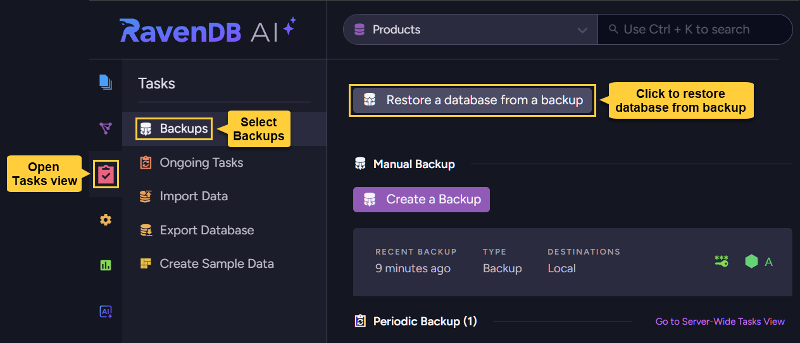

Or, if no databases exist yet so the database Tasks view is not displayed,  
open: **Databases** `>` **Restore one from backup**

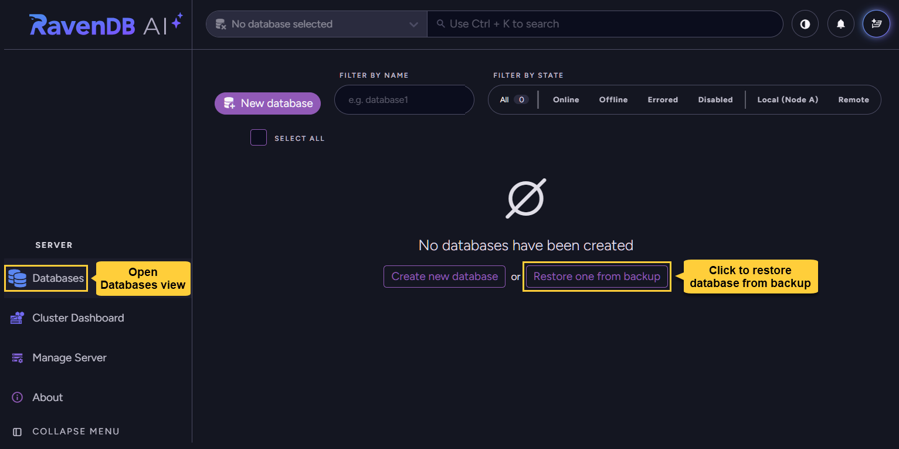

</ContentFrame>

---

<ContentFrame>

#### Set the new database name and type:

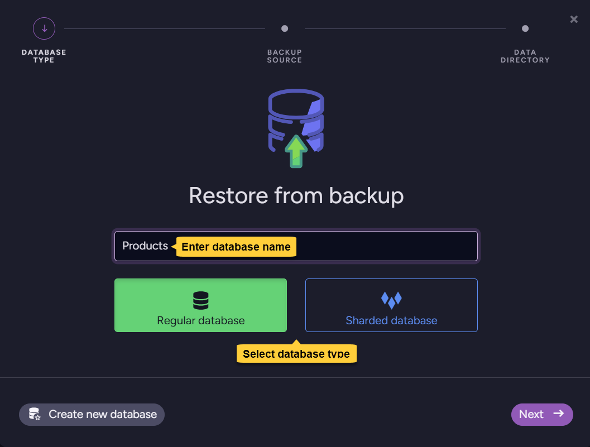

* Enter a name for the new database.  
  You can use the same name the database had when the backup was made,  
  or choose a new name.  
* Select whether to create a regular or a sharded database.  

</ContentFrame>

---

<ContentFrame>

#### Set restore options:

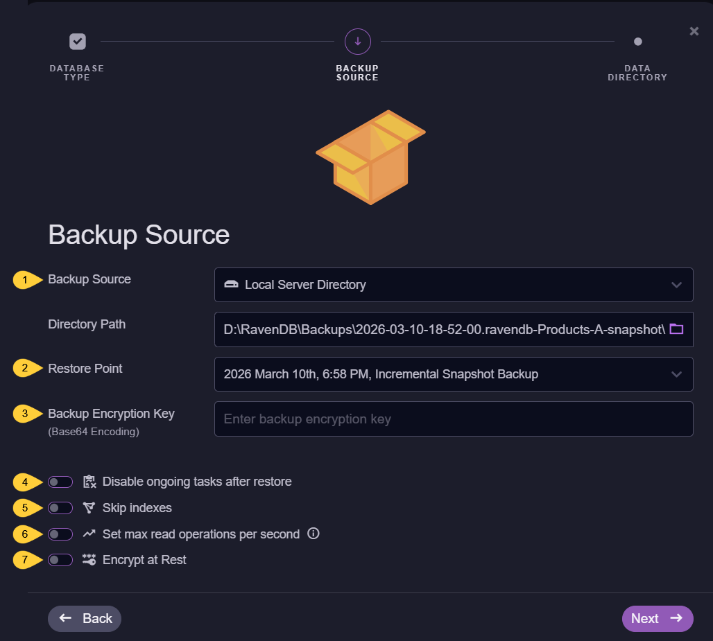

1. **Backup source**  
   Select your backup storage type.  
   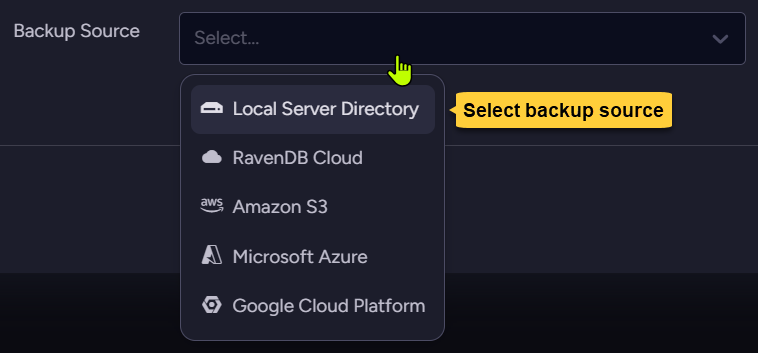
   Input boxes relevant to the selected source will be displayed,  
   e.g., **directory path** for a backup stored locally.

2. **Restore point**  
    If incremental backups have been created for the database, each of them is now considered a restore point and you can select up to which file, i.e. up to which point in time, you want to restore.  
    To restore **all** backup files in the folder, pick the latest restore point in the list.  
    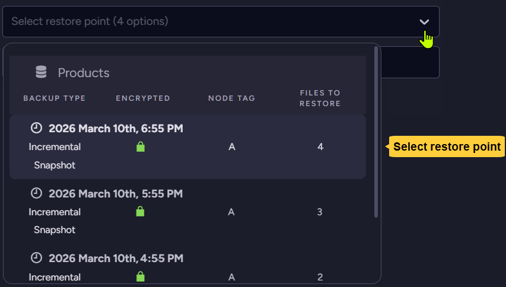

3. **Backup encryption key**  
    This option is available only when restoring from an **encrypted** backup.  
    Use it to provide the backup's encryption key.  

4. **Disable ongoing tasks after restore**  
    By default, if the backed up database included any ongoing tasks (including periodic backup tasks), they will be restored and **enabled** in the new database.  
    Select this option to **disable** any ongoing task after restore, and enable tasks manually later on.

5. **Skip indexes**  
    Snapshots may include index data. If you prefer not to restore indexes, enable this option.  

6. **Set max read operations per second**  
    Limit the number of read operations per second allowed during restore to reduce the operation's impact on server performance.  

7. **Encrypt at Rest**  
   This option determines whether to encrypt the restored database.  
    * The option is **unavailable** for **snapshots**.  
        - A database restored from a snapshot will be encrypted if the snapshot is encrypted, using the same encryption key as the snapshot.  
          If the snapshot is not encrypted, the database will not be encrypted either.  
    * If you restore from a **logical backup**:  
        - To create an unencrypted database, **disable** this option.  
        - To encrypt the new database, **enable** this option and provide an encryption key.  
          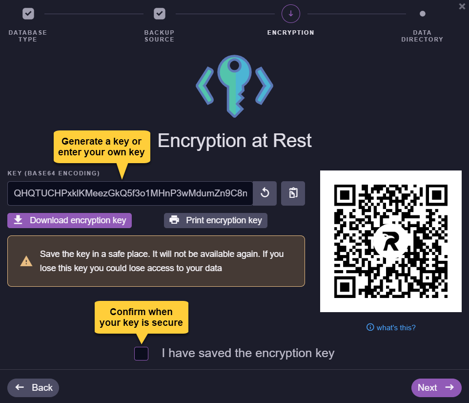

</ContentFrame>

---

<ContentFrame>

#### Set new database folder:

Choose a folder on the server machine for the new database.  

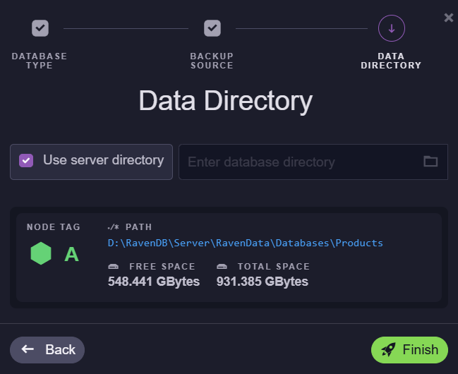

* Check **Use server directory** to store the new database under the RavenDB server data directory,  
  or uncheck this option to choose a different location manually.  

* Click **Finish** to start the restore operation.

</ContentFrame>

<ContentFrame>

#### After restoring:

The new database will be available in the Databases view with the restored [content](../backup/overview#backup-content).

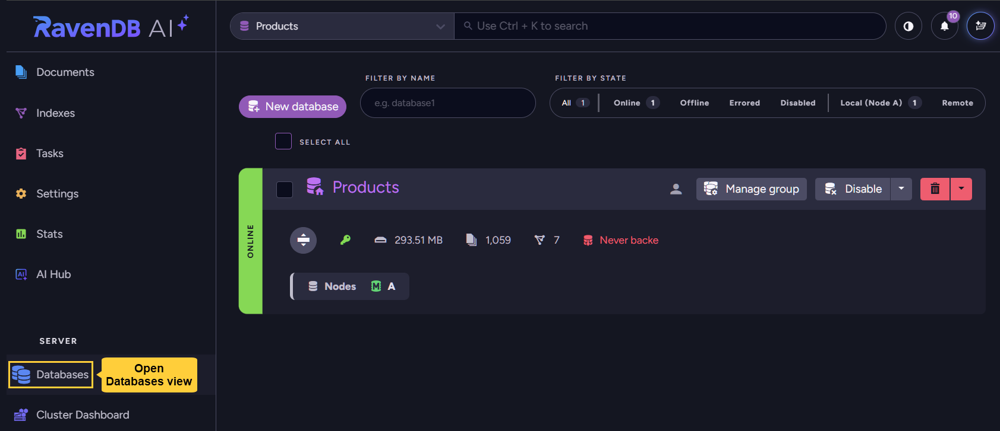

- If you disabled ongoing tasks while restoring the database, remember to go through them (at **Tasks** `>` **Ongoing tasks**) and enable the ones you want the database to run.  
- If index data wasn't included in the backup or was not restored, the indexes will now be automatically rebuilt according to their restored definitions.  
- If the database was restored from a logical backup, documents will receive new change-vectors according to the node they reside on.  


</ContentFrame>

</Panel>

<Panel heading="Restoring a database to multiple cluster nodes">

A database typically resides on multiple cluster nodes, enabling high availability and failover.  
However, when restored from backup, a database is always restored only to the single node on which the restore operation was performed.  

Use the following methods to extend the database to additional cluster nodes after restoration, if needed.

The instructions below assume you have a multiple node cluster.  
[Learn to add cluster nodes using the cluster API](../server/clustering/cluster-api)  
[Learn to add cluster nodes using Studio](../studio/cluster/cluster-view#cluster-view-operations)

<ContentFrame>

### Restoring to a single node and replicating to additional nodes  

After restoring the database, expand its database group to include additional nodes.  
The database will be replicated to the added nodes automatically.  

---

#### Using Studio:

Add a node to the database group from the database view.

* Open: **Database view** `>` **The restored database** `>` **Manage group**.
  
  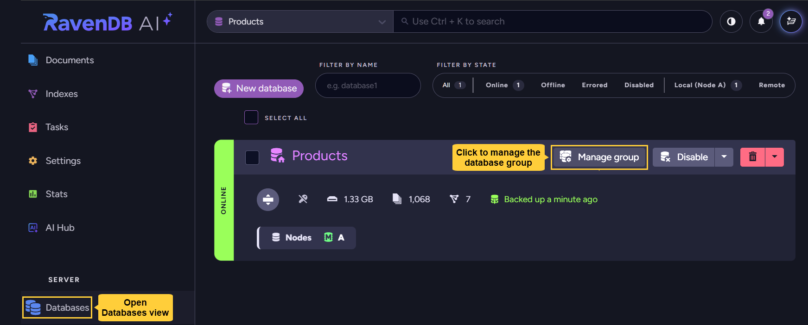

* Click **Add node** 

  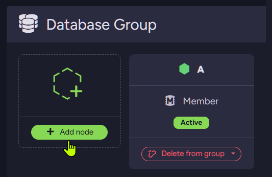

* Pick the cluster node you want the database to expand to

  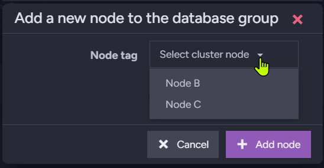

* And a replica of the database will be created on the selected node.  

  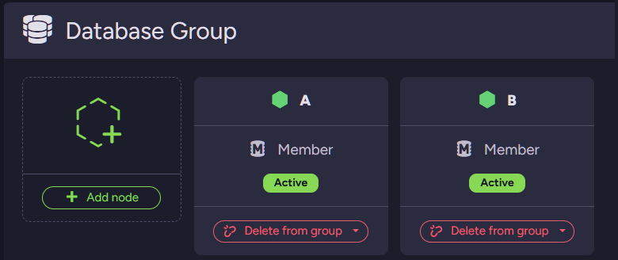

---

#### Using the client API:

Use [AddDatabaseNodeOperation](../client-api/operations/server-wide/add-database-node.mdx) to add a node to the database group.  
  
**Example:**  
```csharp
// Set restore configuration
var restoreConfig = new RestoreBackupConfiguration
{
    DatabaseName = "Products",
    BackupLocation = backupLocation,

    // Disable ongoing tasks so they won't run after restoring
    DisableOngoingTasks = true,

    // Restore index data
    SkipIndexes = false,

    // Provide user key to decrypt backup files
    BackupEncryptionSettings = new BackupEncryptionSettings
    {
        EncryptionMode = EncryptionMode.UseProvidedKey,
        Key = backupEncryptionKeyBase64
    },

    // Provide key to encrypt the restored database
    EncryptionKey = destinationDatabaseEncryptionKeyBase64
};

// Start restore operation
var operation = await store.Maintenance.Server.SendAsync(new RestoreBackupOperation(restoreConfig));

// Wait for the restore operation to complete (or fail)
await operation.WaitForCompletionAsync(TimeSpan.FromMinutes(30));

// Expand the restored database group: add node "B" as an additional member
await store.Maintenance.Server.SendAsync(
new AddDatabaseNodeOperation("Products", node: "B"));

// Verify that the database group was expanded
var record = await store.Maintenance.Server.SendAsync(new GetDatabaseRecordOperation("Products"));
Assert.Contains("A", record.Topology.Members);
Assert.Contains("B", record.Topology.Members);
```
</ContentFrame>

<ContentFrame>

### Restoring to multiple nodes simultaneously  

Replicating the restored database to additional nodes as described above can be costly in time and resources when a large database is restored or throughput is limited.  

To **avoid replication**, you can restore the database to multiple nodes simultaneously, as explained below.

<Admonition type="note" title="">
However, this method is **only feasible when the database is restored from a snapshot**. Here is why:  
- All databases restored from the same **snapshot** are exactly identical to the original database and to each other. A document restored to multiple databases will **retain its original change vector** in all of them.  
  If the databases are joined, copies of the same document across databases will be identified as identical, preventing unnecessary replication or conflicts.  
- A document restored into multiple databases from a **logical backup**, on the other hand, is re-inserted into each database with **a new change vector**.  
  If the databases are joined, copies of the same document across databases will **not** be identified as identical, replication will be triggered, and conflicts may arise.  
</Admonition>

To restore **from a snapshot** into multiple nodes simultaneously and join the databases in the same database group after restoring:

* Restore the snapshot to all relevant nodes.  
   - Give each restored database a different name.  
   - Ensure that one of the databases has the name you intend to keep.  
     The other names are temporary and will be removed later.  
* Wait for the restore operation to complete on all nodes.  
* **Soft-delete** the databases with the temporary names.  
  This will retain their data files on disk.  
   - From Studio:  
     While deleting a database from the **Databases** view, select **Delete and keep files**.  
   - Using the client API:  
     [Learn to delete a database.](../client-api/operations/server-wide/delete-database)  
     e.g., to soft-delete the database named "TemporaryDatabaseName1" from node `B`:  
     ```csharp
     // soft-delete a database from one node
     await store.Maintenance.Server.SendAsync(new DeleteDatabasesOperation(
           "TemporaryDatabaseName1", hardDelete: false, 
           fromNode: "B", timeToWaitForConfirmation: null));
     ```
* **Rename** the deleted database's folder on each respective node to match the name of the remaining database.  
* On the node you didn't delete the database from, expand the database group (as [shown above](../backup/restore#using-studio)) to include all the other nodes.  

</ContentFrame>

</Panel>

<Panel heading="Restoring from server-wide backups">

Restoring databases backed up by a server-wide backup task **is identical** to restoring databases backed up by regular [database backup tasks](../backup/create/periodic-tasks/database-backup).  
- Though a server-wide task creates backups for multiple databases, the backup for each database is restored separately into a new database.  
- Note that each backup is stored in the backup location within its own folder, named after the database it belongs to.  
  When restoring, make sure the correct backup folder is selected.

</Panel>